## Exercise - Registering a Device

In this exercise, you will configure the simulator and register a device.

### Configure the Simulator

1. Go to your Azure portal, select Resource Groups, and open the resource group you created when you deployed Connected Field Service.

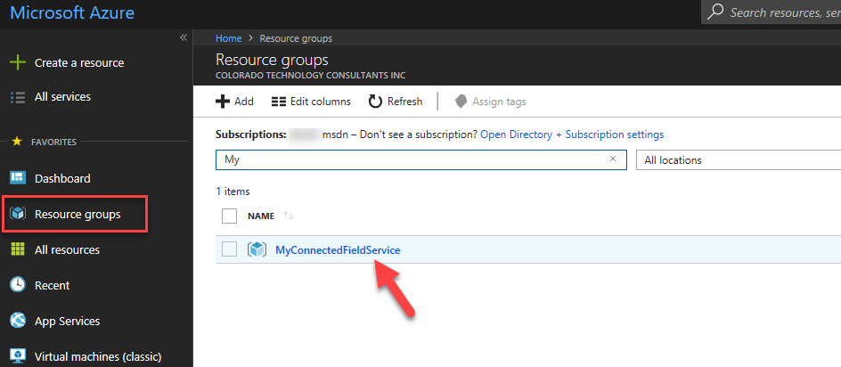

2. Locate and click on the Simulator App Service.

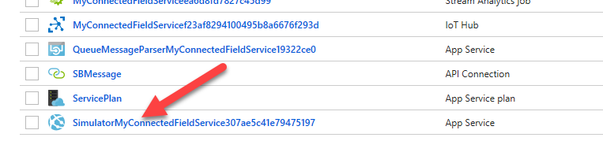

3. Click on the URL.

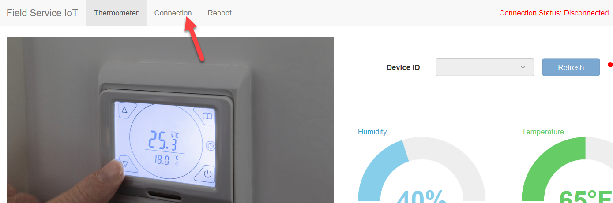

4. Select the Connect.

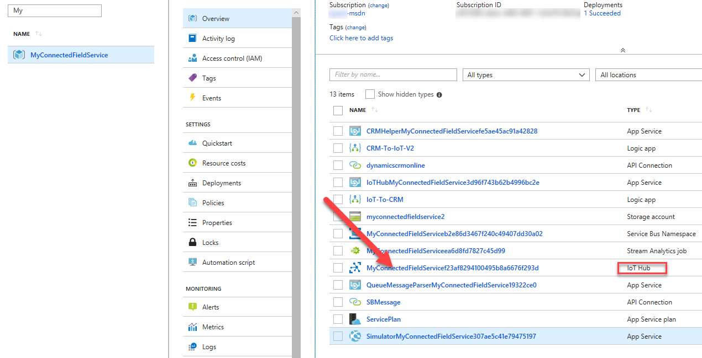

5. Go back to Azure, select the Resource Group you created and click on the IoT Hub.

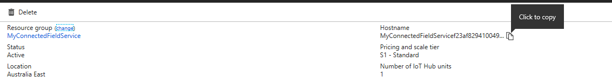

6. Copy the Host Name.

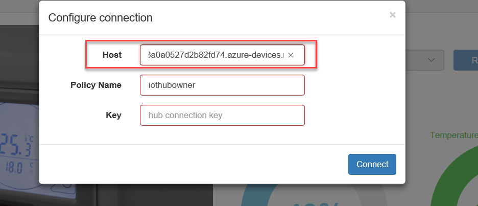

7. Go back to the simulator and paste the Host Name into the Host Field.

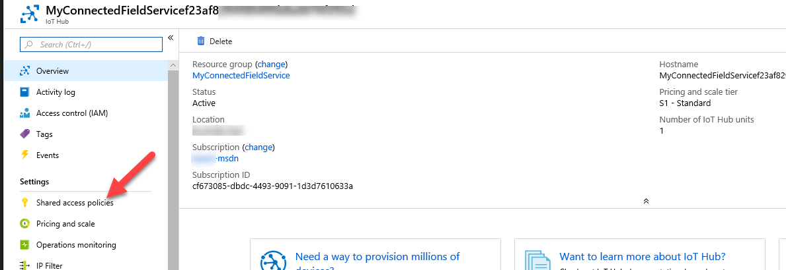

8. Go back to Azure and select Shared Access Policies.

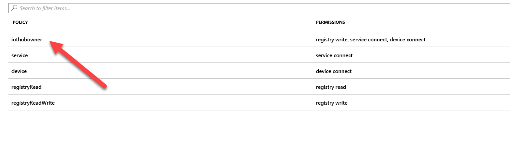

9. Click on the IoT Hub Owner.

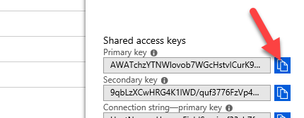

10. Copy the Primary Key.

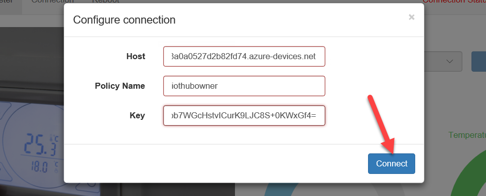

11. Go back to the simulator, paste the Primary in the Key field and click Connect.

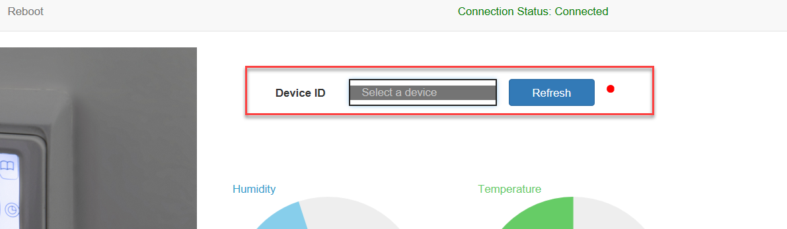

12. Click on the Devices dropdown. You will notice that we currently don’t have any devices, you will register a device in the next exercise.  **Do not close this browser window. **

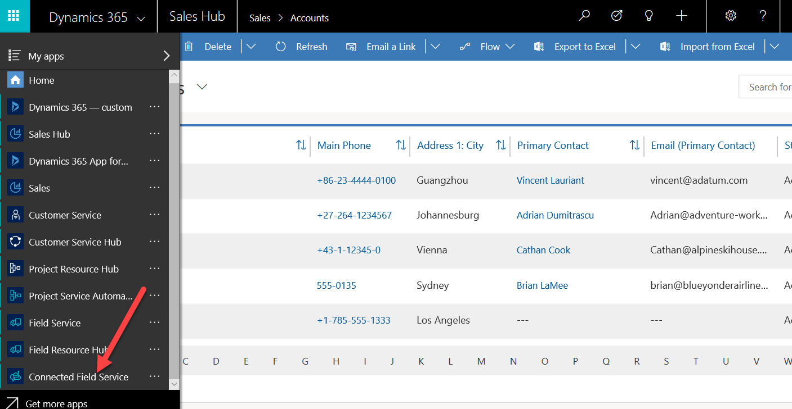

### Register a Device

In this exercise, you will be creating a customer asset, and then registering a device with Azure IoT Hub.  You will then manipulate the device to cause the creation of an IoT Alert into Dynamics 365.  By completing this you will have verified your deployment of Connected Field Service is working.

1. Start the Connected Field Service App.

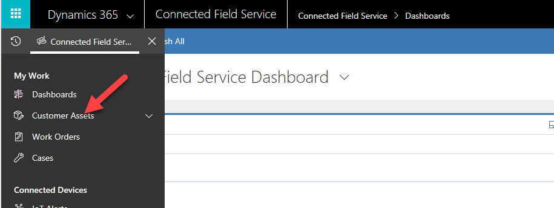

2. Click Site Map and select Customer Assets.

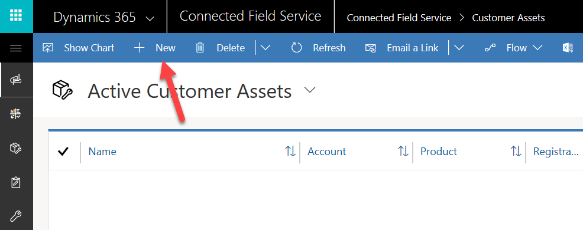

3. Click New.

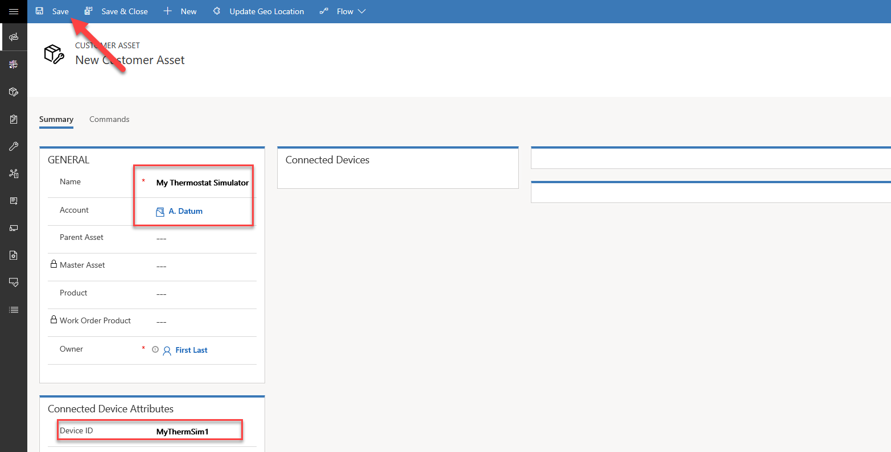

4. Enter My Thermostat Simulator for Name, select A. Datum for Account, scroll down and enter MyThermSim1 for Device ID, and click Save.

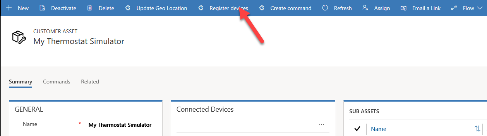

5. Click Register Devices.

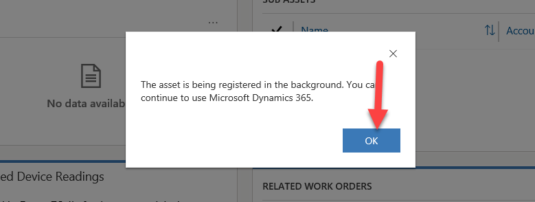

6. Click OK.

7. In the Connected Device section, click on the ellipse ... button and click Refresh.

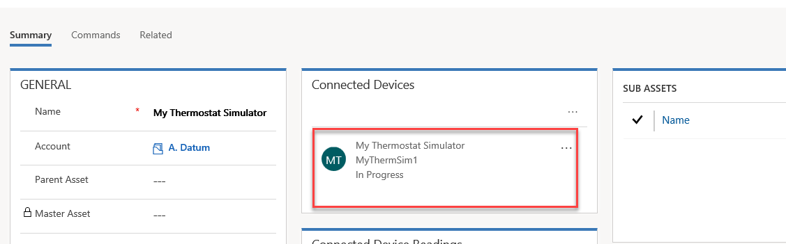

8. You should see the device registration progress.

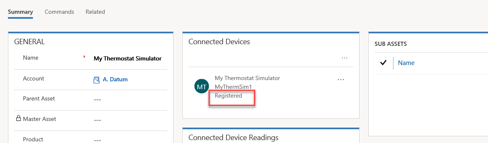

9. Refresh until the device is registered.

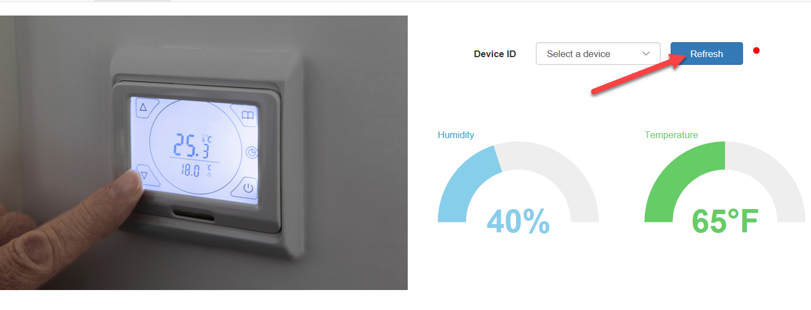

10. Go back to the simulator and click Refresh.

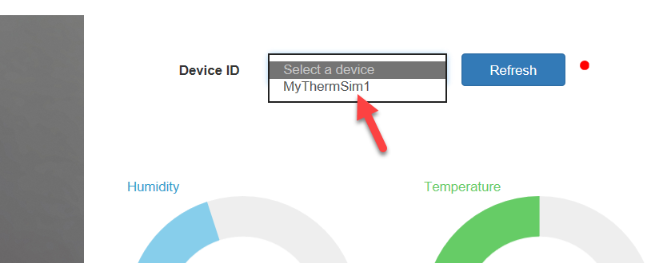

11. Click on the dropdown and select the device you registered.

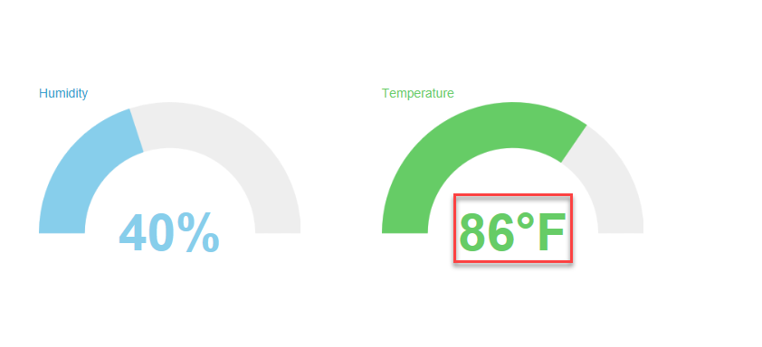

12. Change the temperature to 86.

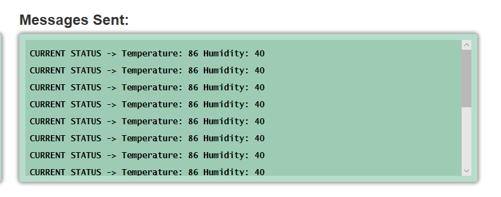

13. The Message Sent will contain the temperature and humidity.

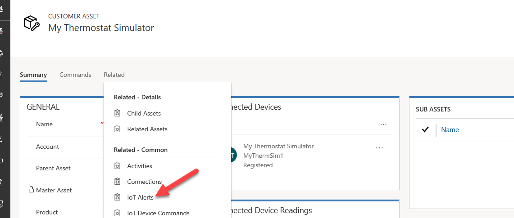

14. Go back to your Connected Field Service application and open the customer asset you created.

15. Click Related and select IoT Alerts.

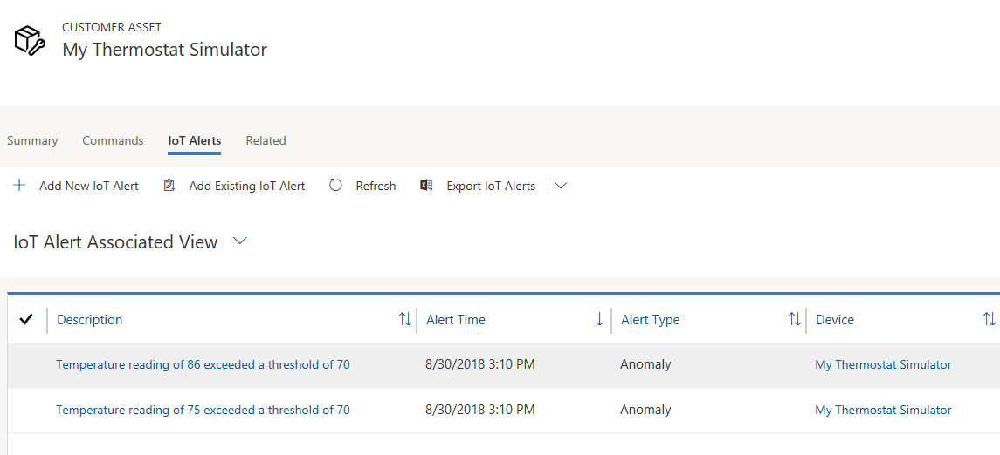

16. You should see the alerts generated by the simulator.

