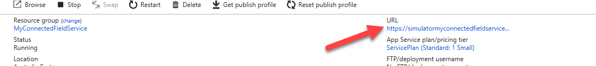
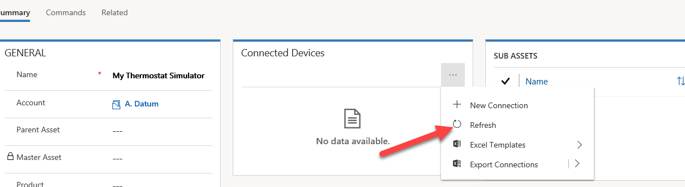

## Exercise – Registering a device

In this exercise, you'll set up the simulator and register a device.

### Set up the simulator

1. Open your Microsoft Azure portal, select **Resource groups**, and open the resource group that you created when you deployed Connected Field Service.

    

2. Find and select the simulator app service.

    

3. Select the URL.

    

4. Select **Connection**.

    

5. Go back to Azure, select the resource group that you created, and then select the Internet of Things (IoT) hub.

    

6. Copy the host name.

    

7. Go back to the simulator, and paste the host name into the **Host** field.

    

8. Go back to Azure, and select **Shared access policies**.

    

9. Select the IoT hub owner.

    

10. Copy the primary key.

    

11. Go back to the simulator, paste the primary key in the **Key** field, and then select **Connect**.

    

12. In the **Device ID** field, notice that no devices are currently listed. You'll register a device in the next exercise. **Don't close this browser window.**

    

### Register a device

You'll now create a customer asset and then register a device with Azure IoT Hub. You'll then manipulate the device so that an IoT Alert is created in Dynamics 365. By completing this procedure, you confirm that your deployment of Connected Field Service is working.

1. Start the Connected Field Service app.

    

2. Open the site map, and select **Customer Assets**.

    

3. Select **New**.

    

4. Enter *My Thermostat Simulator* as the name, select **A. Datum** as the account, scroll down and enter *MyThermSim1* as the device ID, and then select **Save**.

    

5. Select **Register devices**.

    

6. Select **OK**.
7. In the **Connected Devices** section, select the ellipse (**...**) button, and then select **Refresh**.

    

8. Repeat the previous step until the device is registered.

    

9. Go back to the simulator, and select **Refresh**.

    

10. In the **Device ID** field, select the device that you registered.

    

11. Change the temperature to *86*.

    

12. The **Messages Sent** section shows the temperature and humidity.

    

13. Go back to your Connected Field Service app, and open the customer asset that you created.
14. Select **Related**, and then select **IoT Alerts**.

    

    You should see the alerts that were generated by the simulator.

    
