## Exercise - Connect to a Device

 
### Exercise 1: Configuring Physical Device  

**Scenario **
In this exercise, you will be introduced to setting up the MXChip IoT DevKit. The MXChip IoT DevKit (a.k.a DevKit) is an all-in-one IoT Device Kit, you can use it to develop and prototype IoT solutions that take advantage of Microsoft Azure services.  

It includes an Arduino-compatible development board with rich peripherals and sensors, an open-source board package, and a growing projects catalog.  
To get started with purchasing an MXChip IoT DevKit, visit [http://aka.ms/iot-devkit/](http://aka.ms/iot-devkit/) and click on Get a Kit.  
 
After completing this exercise, you will be able to: 
- Install Firmware onto DevKit 
- Connect DevKit to Wi-Fi Network 
- Configure DevKit to Connect to IoT Hub 
 
  
#### Task 1: Create and Register the Device 
In this task, you will create a new customer asset and register it. 

1. Navigate to the Connected Field Service Hub. 

2. On the left navigation select Customer Assets. 
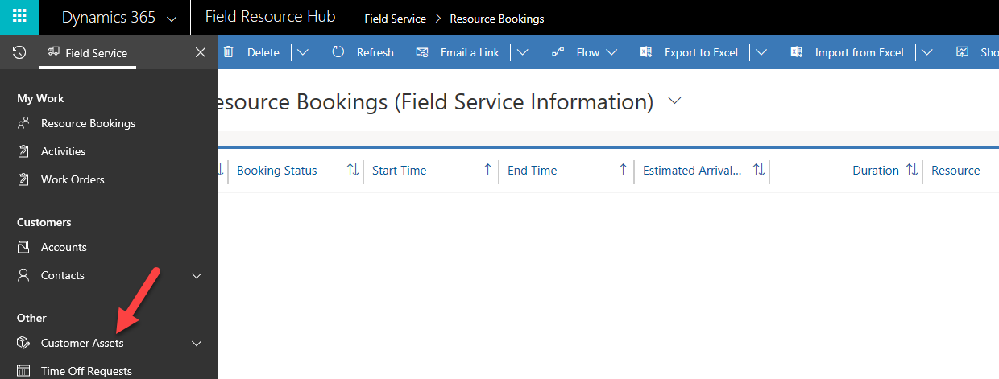
3. Click New. 
4. Enter MxChip IoT for Name, select Adventure Works for Account, enter MXChip for Device ID and click Save. 
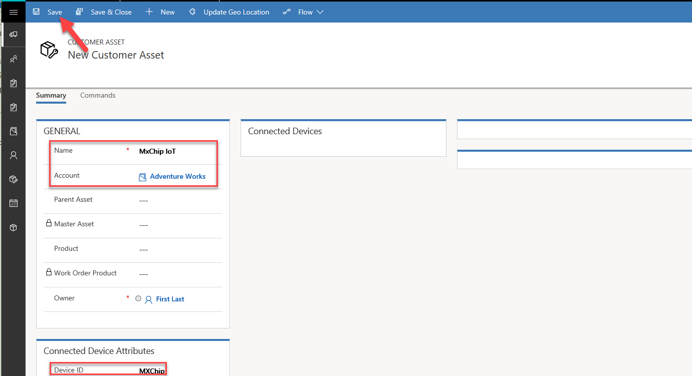
5. Click Register Devices. 
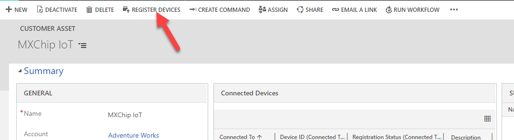
6. Click OK. 
 
#### Task 2: Flash Firmware 

1. Download the latest pre-built Microsoft IoT Central firmware for the MXChip from the releases page on GitHub. The current direct link is [https://github.com/Azure/iot-central-firmware/releases](https://github.com/Azure/iot-central-firmware/releases) 
1. Select AZ3166-IoT-Central-x.x.x.bin. 
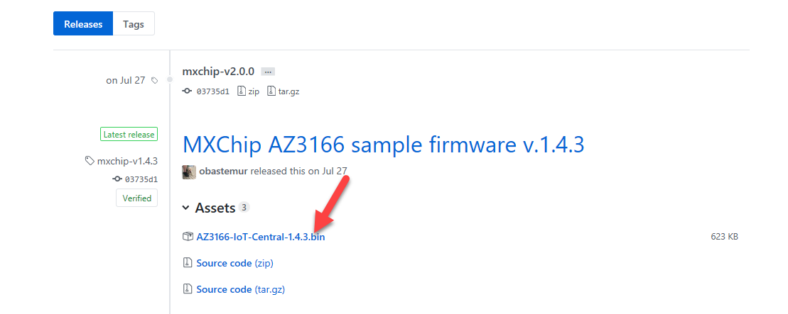
3. Save the file locally. 
4. Connect the DevKit device to your development machine using a USB cable. 
5. In Windows, a file explorer window opens on a drive mapped to the storage on the DevKit device. For example, the drive might be called AZ3166 (E:).  
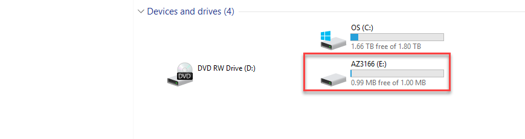
6. Drag the AZ3166-IoT-Central-X.X.X.bin file onto the drive window. 
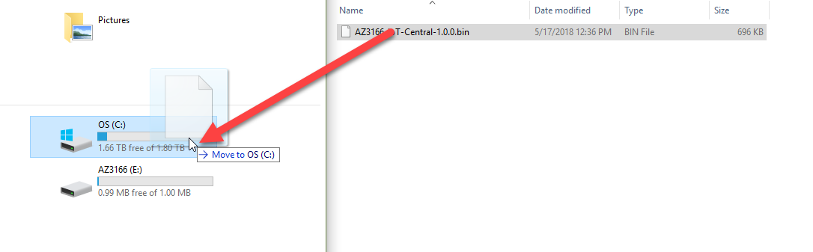
7. When the copying is complete, the device will reboot with the new firmware. 
 
#### Task 3: Configure Wi-Fi 
 
After the device reboots, you need to configure the Wi-Fi on the Device.  
 
1. Hold down button B. While still holding button B push and release the reset button. Then release button B.  

2. Your DevKit enters AP mode for configuring Wi-Fi. The screen displays the service set identifier(SSID) of the DevKit and the configuration portal IP address: 
  
If your Wi-Fi SSID starts with AZ and not AZ3166 after applying the firmware, you need to follow the following steps to make sure the firmware gets applied correctly. 
 
	 
	Bad – Firmware Not Applied Correctly 
	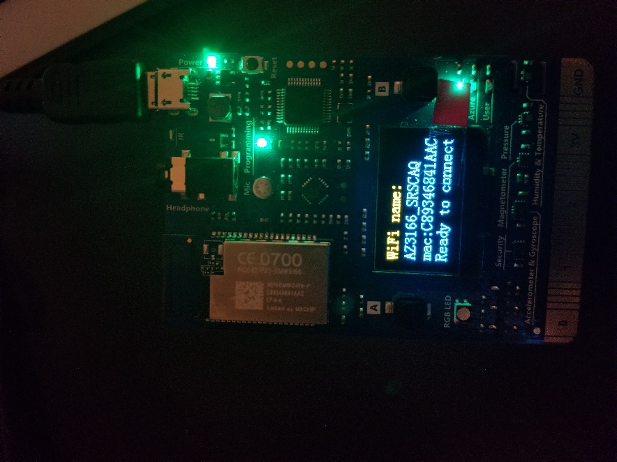
	Good – Firmware Applied Correctly 
 
		- Click Reset on the AZ3166 
		- Hold down A+B Button AZ3166 will hard reset 
		- Press Reset 
		- Remove from Power 
		- Place AZ3166 into AP Mode 
		- If the SSID is AZ3166_XXXXXX, the firmware is applied correctly.  
		- If the SSID still shows AZ-XXXXXXXXXX, please refer to:  [https://microsoft.github.io/azure-iot-developer-kit/docs/use-configuration-mode/](https://microsoft.github.io/azure-iot-developer-kit/docs/use-configuration-mode/)  and use SSH to update the IoT Hub Connection String. 

3. Go to your Azure portal, select All Resources and click to open the IoT Hub. 
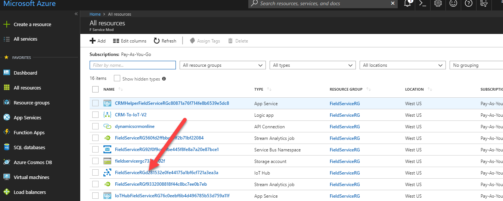
4. Select IoT Devices and open the device you registered. 
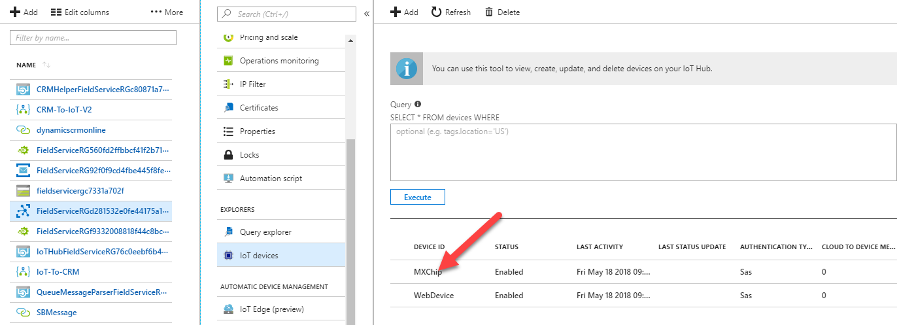
5. Copy the Connection String - Primary Key 
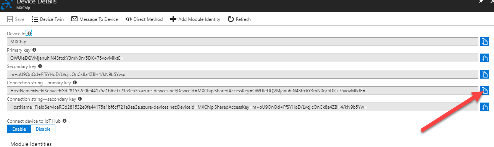
6. Use another Wi-Fi enabled device (computer or mobile phone) to connect to the DevKit SSID. Locate AZ3166 and click Connect. 
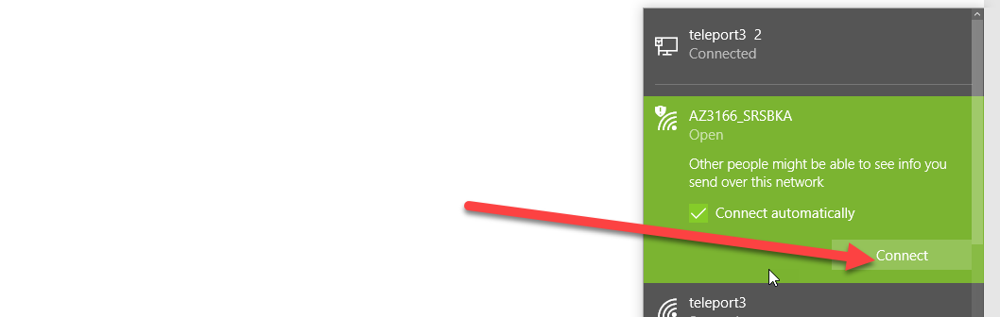
7. Wait for the device to connect. 
8. In your browser paste http://192.168.0.1/start and <enter> 
9. Select the Wi-Fi Network you want to join and enter your Wi-Fi password.
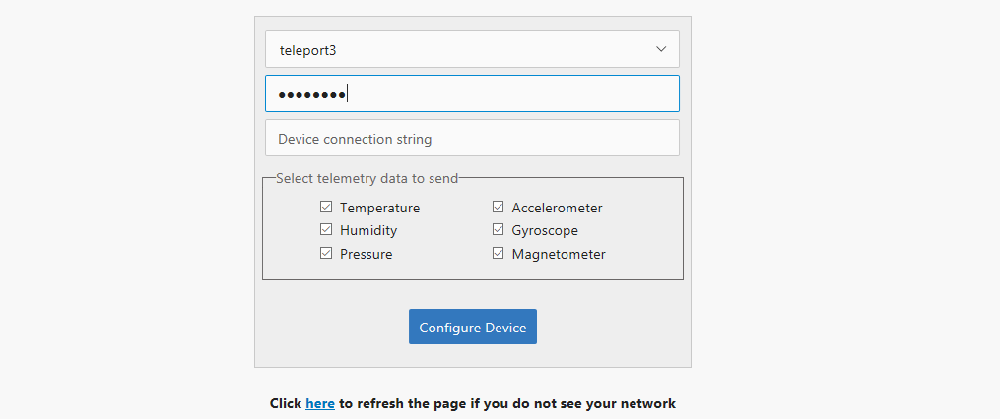
10. Paste the connection string you copied. 
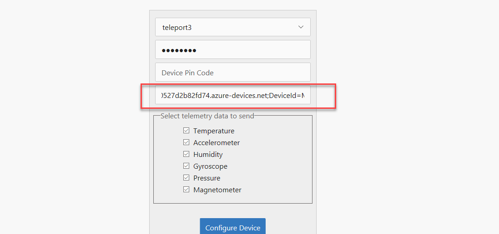
11. Get the Pin Code from the device and enter in the Device Pin Code field. 
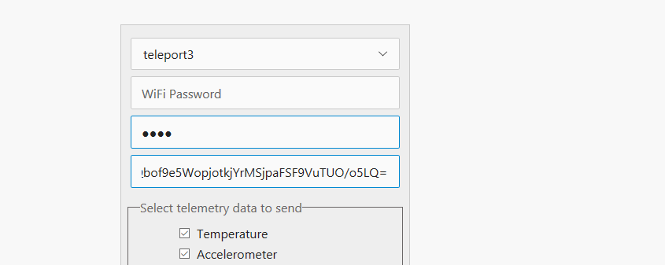
12. Select all of the telemetry options and click Configure Device. 
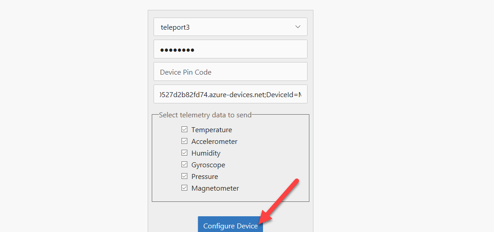
13. You will be asked to reset the device.
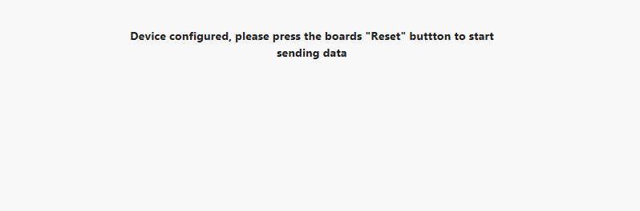 
14. Press the Reset Button on the device. 
15. The device will reset and connect. Wait until you see messages getting sent to the IoT Hub. 
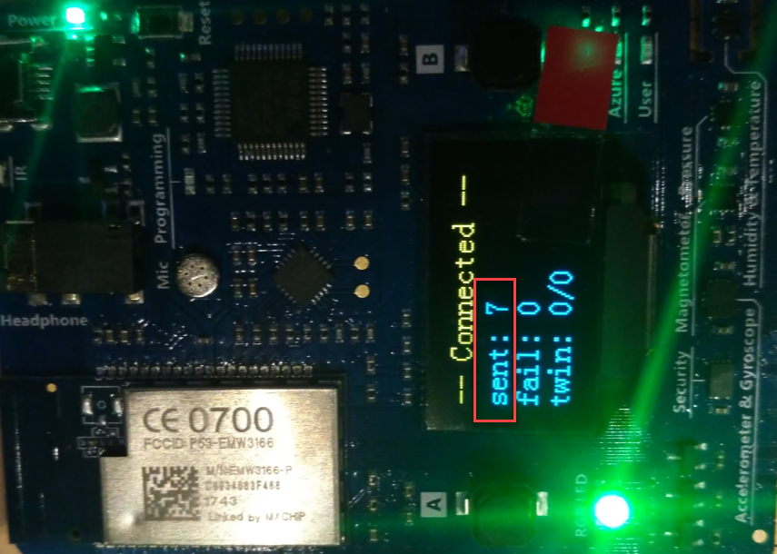
16. You have now configured your physical device to connect with Azure IoT Hub. 
 
### Exercise 2: Using Device Explorer    
 
#### Task 1: Download and Install Device Explorer 

1. Navigate to https://github.com/Azure/azure-iot-sdk-csharp/releases  
2. Scroll down to locate SetupDeviceExplorer.msi and click on it.
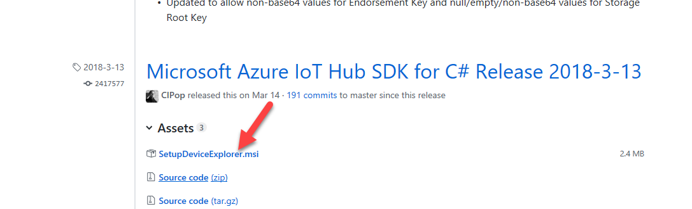 
3. Click Run. 
4. Click Next. 
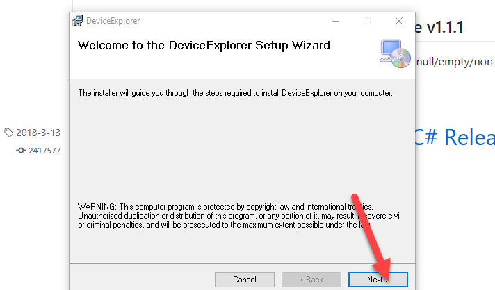
5. Complete the installation and click Close. 
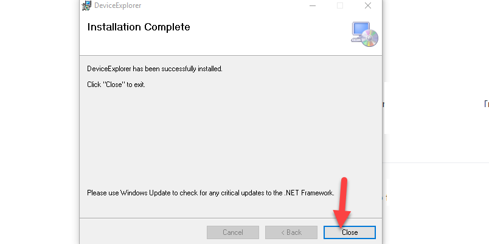
 
#### Task 2: Connect 

1. Go to your Azure Portal and open the IoT Hub again. 

2. Select Shared Access Policy and click on the iothubowner. 
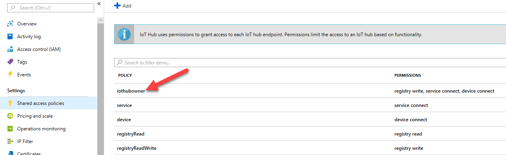
3. Copy the Connection String - Primary Key. 
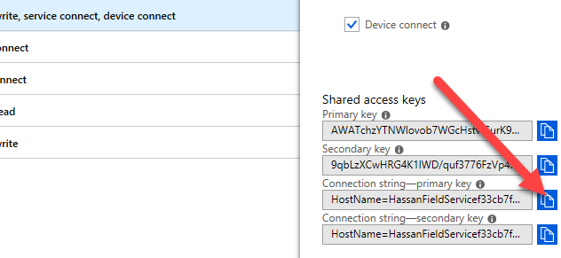
4. Start the Device Explorer you installed on your machine. 
5. Paste the Connection String and click Update. 
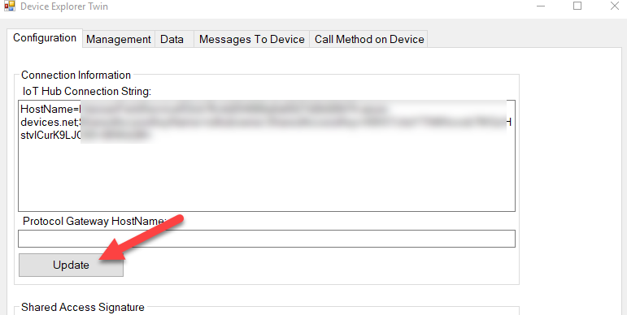
6. Click OK. 
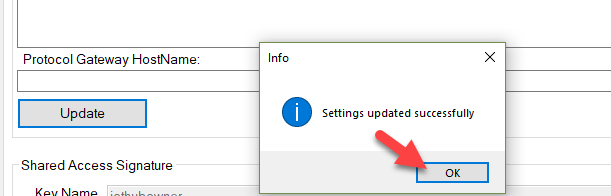
7. Select the Data tab and click Monitor.
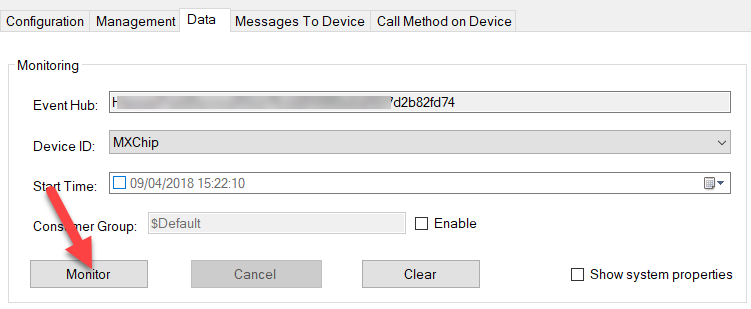 
8. You should sensor data from your device in JSON format. 
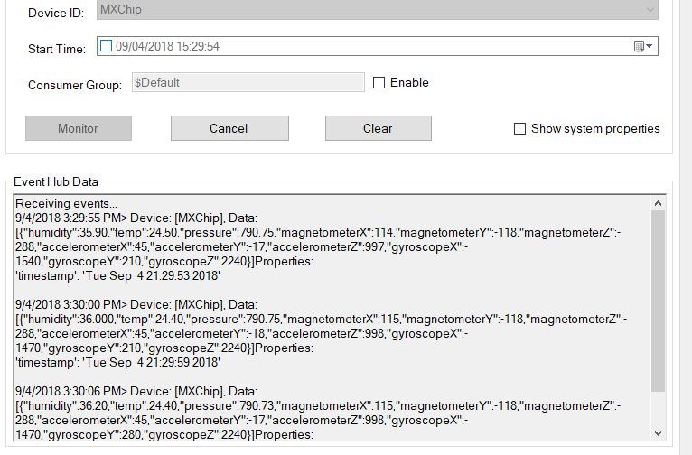
