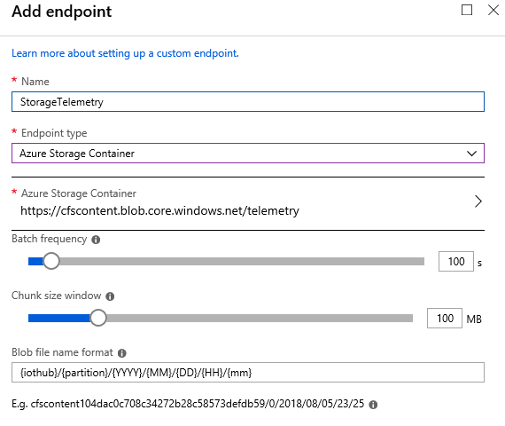
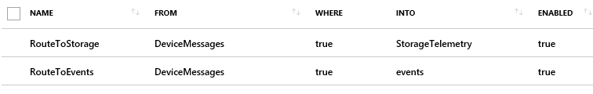

## Detail telemetry storage

Internet of Things (IoT) devices generate lots of data that's ingested in the Microsoft Azure IoT hub and available for processing. This flow of data is essential to generating immediate insights. The Connected Field Service add-on application template processes this data stream by using an Azure Stream Analytics job. By default, after the data is evaluated and alerts are raised, the data isn't kept.

During the deployment of the Connected Field Service add-on, you can turn on an option for Microsoft Power BI. This option causes a second Stream Analytics job to connect to the Azure IoT hub and get its own copy of the device data. This data is summarized into one-minute time windows and persisted in an Azure SQL database. It can then be fed into Power BI and shown by using the [Power BI Report Template for Connected Field Service](https://www.microsoft.com/en-us/download/details.aspx?id=54298). Although this approach allows for unlimited storage, it's tailored to the current template scenario. To support different device data, you must construct your own table format and reports.

An IoT hub has multiple endpoints. The primary endpoint receives detail device data (device-to-cloud messages) and is an endpoint that's compatible with Azure Event Hubs. Therefore, services like Stream Analytics can process the data stream. The device-to-cloud messages are limited to 256 kilobytes (KB). You can also define additional custom endpoints and let messages that meet filtering criteria be routed to them. These endpoints can be Azure Storage, Event Hubs, or Azure Service Bus Queues and Service Bus Topics endpoints. The following image shows an example where an Azure Storage endpoint is being added.

When you have additional endpoints, IoT Hub routes determine what messages go where. The events built-in endpoint only gets messages that aren't routed to other endpoints, unless you add an explicit rule. The route can be filtered by using an [SQL-like language](https://docs.microsoft.com/en-us/azure/iot-hub/iot-hub-devguide-query-language).

For example, if you want to save a copy of every message to Azure Storage, both endpoints must get every message from the device. The following image shows what the IoT Hub routes will look like.

To take the discussion up a level, let's look back at the overall flow of data through our IoT solution. As one of the categorizations that it does, the Azure IoT reference architecture considers data storage either "warm" or "cold." Warm storage must have access to data that's relatively recent, where there's low latency for accessing the data. Warm storage might keep only a day's, a week's, or a month's worth of data. Cold storage usually uses lower-cost technology, like Azure Storage, and might provide longer-term storage of the detail data. Cold storage might be used to train future machine learning models or just for detail device analysis in the future.

Earlier, we talked about using Power BI, but the template that does this uses a SQL database as storage. Another approach that's more consistent with the warm storage concept is to create another output from the Stream Analytic job that wrote directly to Power BI. That's one of the capabilities of Stream Analytics. This approach lets you have a real-time view of data in Power BI but is automatically limited by capacity. This approach has a limit of 200,000 records, and the records are kept in a first in, first out (FIFO) sequence.

Stream Analytics can also write to an Azure Cosmos DB. Therefore, you can also use this approach to store detail data. In this approach, the data is persisted in the Azure Cosmos DB from the Stream Analytics job. You can also augment that data with the Microsoft Dynamics 365 ID for the customer asset. In this way, you can use the Dynamics 365 Azure Cosmos DB Virtual Entity provider to surface the detail telemetry in the model-driven user experience. Therefore, the device detail data can be viewed in the context of the IoT Alert or Customer Asset records in Microsoft Dynamics 365 for Field Service.

As you seek to customize the Connected Field Service template application to fit your unique requirements, consider the storage and processing flow of the device detail data that's ingested. There are many extension points from IoT Hub to the Stream Analytics job. You can tap into these endpoints and store detail data that might be useful for analysis later or that can be surfaced immediately to help staff respond to IoT Alerts.
