## Exercise – Identify exceptions

### Exercise 1: Azure Cosmos DB
In this exercise, you'll create the Microsoft Azure Cosmos DB database that you'll use in the next exercise. This database will be used to store detail telemetry from the device.

**Scenario**

The data that comes in from our physical device is in a different format than the data from our simulated device. Therefore, you must change the Azure Stream Analytics job to work with the data from our physical device. You'll also adjust the Stream Analytics job so that it stores the data in an Azure Cosmos DB in addition to evaluating it for anomalies.

#### Task 1: Create the Azure Cosmos DB

1. Go to your Azure portal, and select **Create a resource**.

    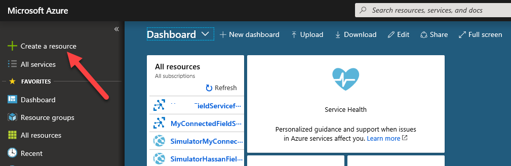

2. Search for *Azure Cosmos DB*, and select it in the search results.

    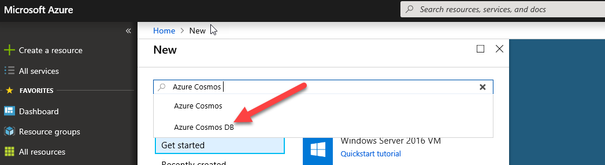

3. Select **Create**.

    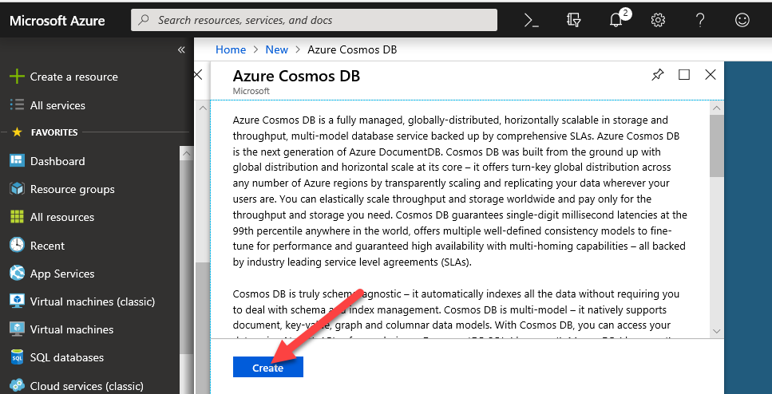

4. Enter a unique ID, select *SQL* as the application programming interface (API), select your subscription, resource group, and location, and then select **Create**.

    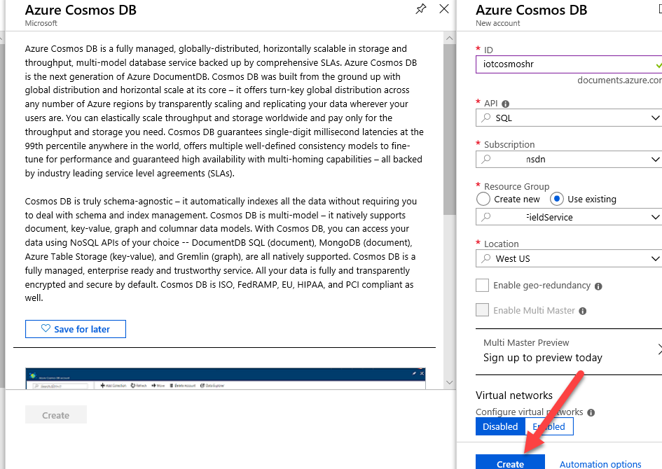

5. Wait for the Azure Cosmos DB to be created.
6. Open the Azure Cosmos DB that you just created, select **Data Explorer**, and then select **New Database**.

    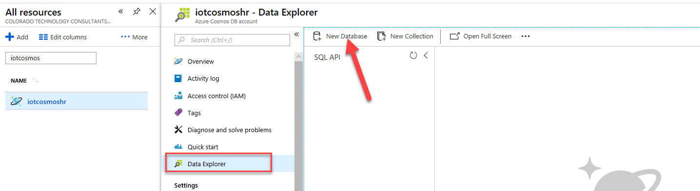

7. In the **Database id** field, enter *Telemetry*, and then select **OK**.

    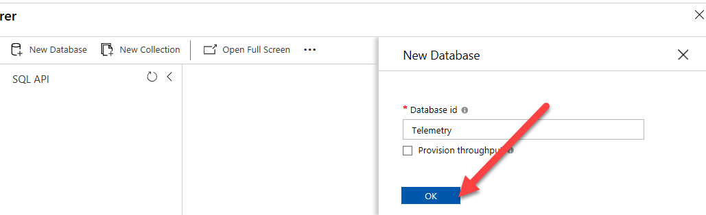

8. Select the ellipsis button (**…**) for the database that you created.

    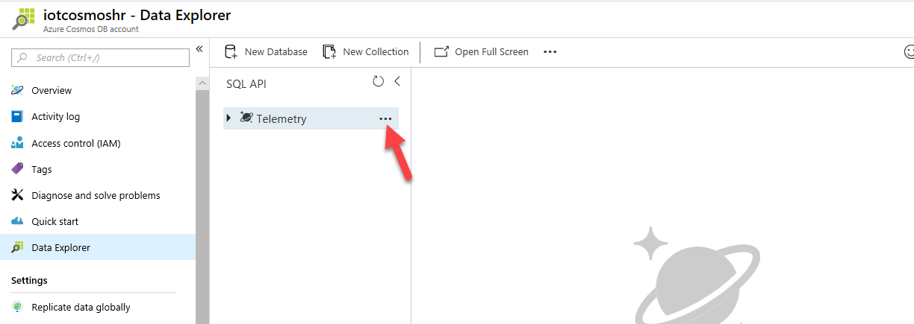

9. Select **New Collection**.

    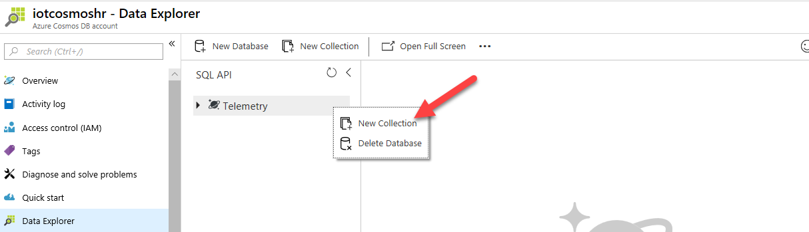

10. In the **Collection Id** field, enter *DeviceData*, change the **Throughput** value to *400*, and then select **OK**. We're changing the throughput to minimize cost.

    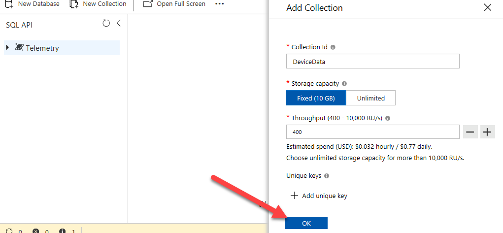
 
### Exercise 2: Adjust the Stream Analytics job
In this exercise, you'll change the Stream Analytics job to accommodate the different telemetry that's sent by your MXChip device.

#### Task 1: Add an Azure Cosmos DB as output

1. Select **Resource groups**, and open the resource group that you created.

    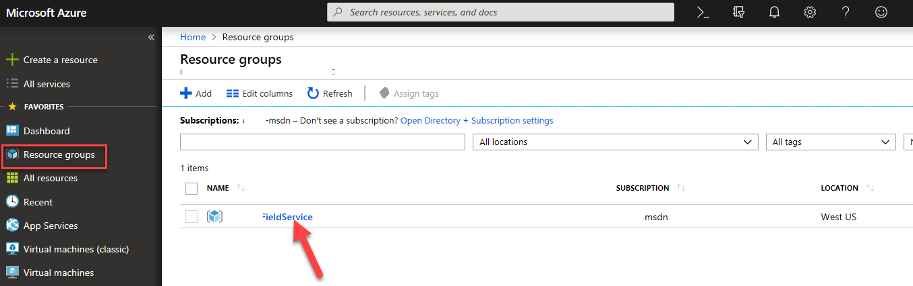

2. Find and open the Stream Analytics job.

    

3. The Stream Analytics job must be stopped before you can change its query and input/outputs. Select **Stop**.

    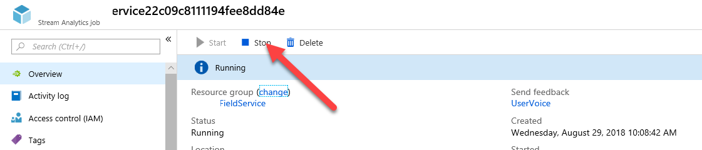

4. Select **Yes**.
5. After the job is stopped, select **Outputs**.

    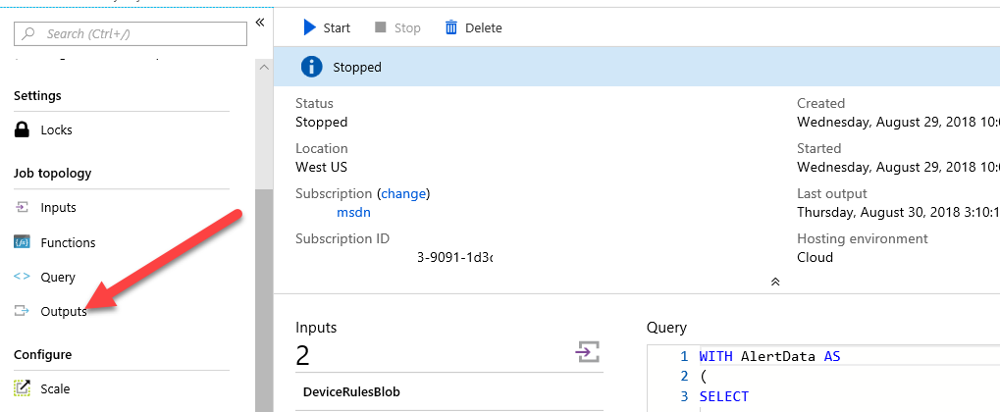

6. Select **Add**, and then select **Cosmos DB**.

    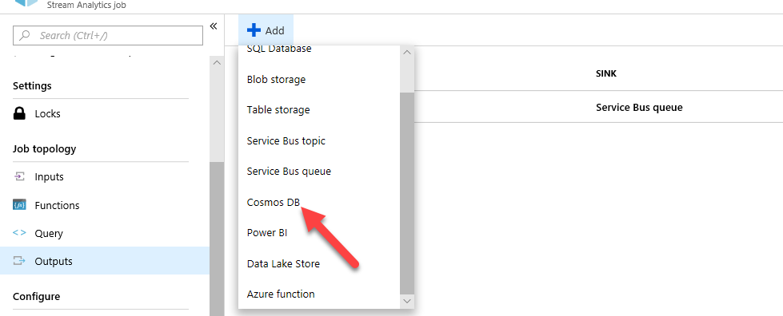

7. In the **Output alias** field, enter *CosmosDB*.
8. Select your subscription, select the Azure Cosmos DB that you created, and select the database that you created.
9. In the **Collection name pattern** field, enter *DeviceData*.
10. Select **Save**.

    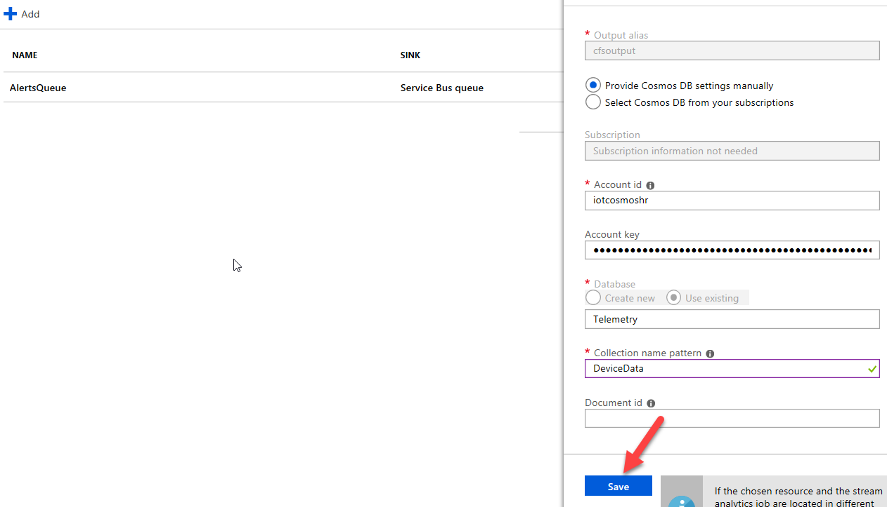

#### Task 2: Adjust the query for the device

1. Select **Query**.

    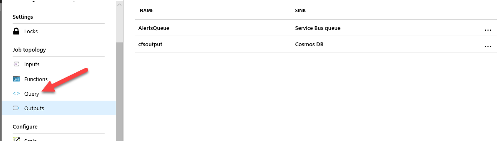

2. Put the cursor at the end of line 14, and press Enter.

    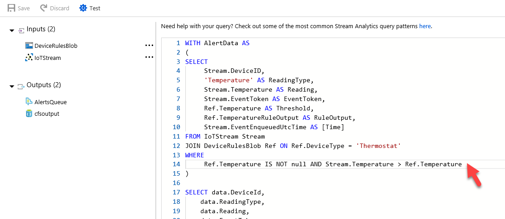

3. Paste the following query snippet. This code will let the query support both the real and simulated devices.

    ```json
    ...
    UNION 
    -- MX Chip 
    SELECT 
        GetMetadataPropertyValue(Stream, '[IoTHUB].[ConnectionDeviceId]') as DeviceID, 
        'Temperature' AS ReadingType, 
        (((Stream.temp *9) / 5)+32) AS Reading, 
        GetMetadataPropertyValue (Stream, 'EventId') as EventToken, 
        Ref.Temperature AS Threshold, 
        Ref.TemperatureRuleOutput AS RuleOutput, 
        Stream.EventEnqueuedUtcTime AS [time] 
    FROM IoTStream Stream
    JOIN DeviceRulesBlob Ref ON Ref.DeviceType = 'Thermostat' 
    WHERE 
        Stream.temp IS NOT NULL AND Stream.temp > Ref.Temperature 
    ...
    ```

    Notice that we're not only adjusting for field names but also converting the temperature from Celsius to Fahrenheit.

    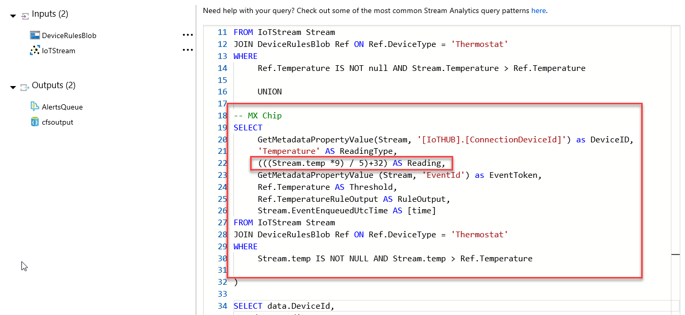

4. Select **Save**.

    

5. Select **Yes**.

#### Task 3: Add saved data to the Azure Cosmos DB

1. Add the following snippet to the end of the query. This code will save a copy of the ingested data.

    ```json
    SELECT
        *
    Into CosmosDB
    FROM IoTStream
    ```

    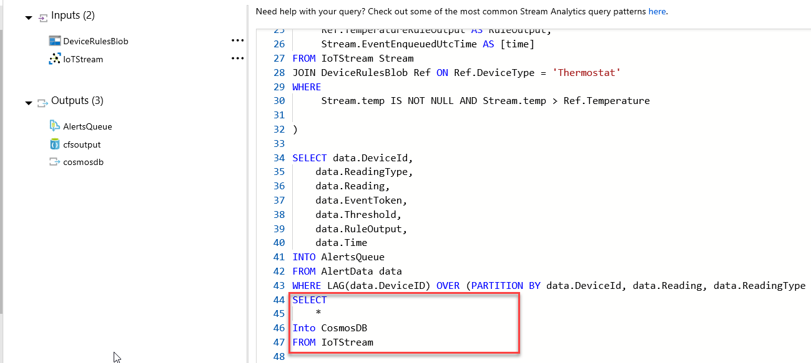

2. Select **Save** again.
3. Select **Yes**.
4. Select **Overview**, and then select **Start** to restart the job.

    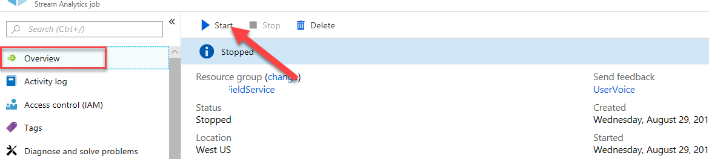

5. Wait for the Stream Analytics job to be started.
6. Select the resource group.

    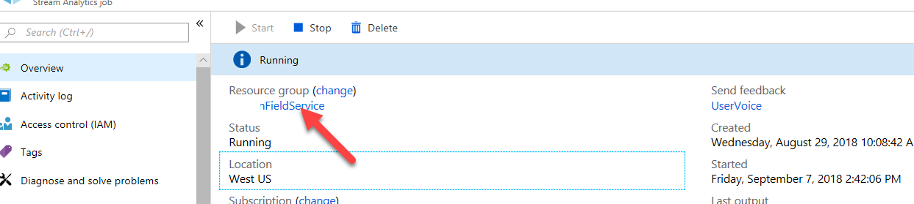

7. Open the Azure Cosmos DB that you created.

    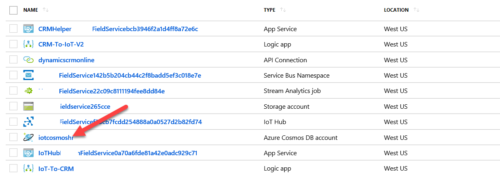

8. Select **Data Explorer**, expand **Telemetry**, expand **DeviceData**, and select **Documents**.

    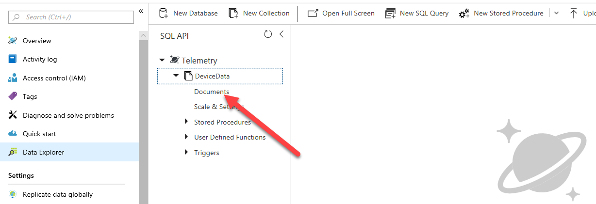

9. You should see a list of documents. Select one of the documents.

    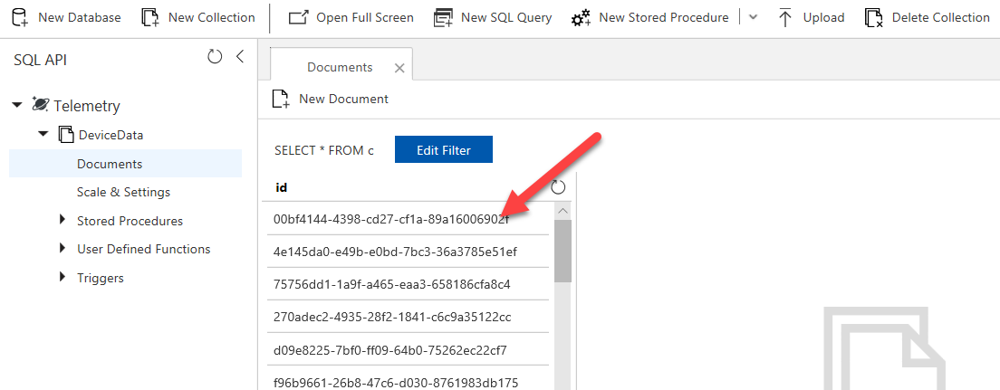

    You should now see sensor data from your device.
