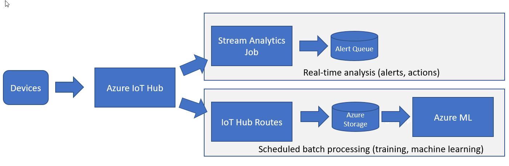
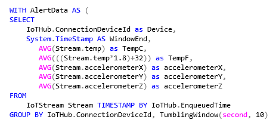
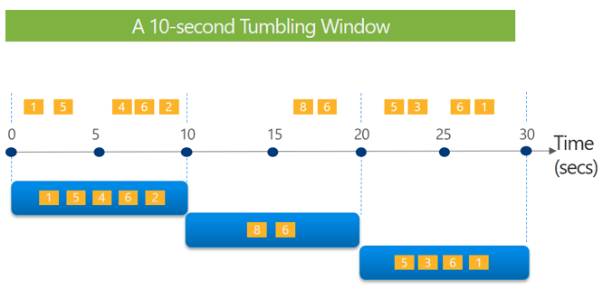

In the overview, we discussed how Connected Field Service handles anomaly detection by using the default template application. In this unit, we'll discuss options for tailoring how detection is done.

The first thing to consider is the type of rules or intelligence that you must handle to generate insights for your scenario. The simplest form is stateless and static. For example, if the controlled room temperature goes above 20 degrees Celsius or below 10 degrees Celsius, raise an alert. This type of evaluation doesn't require historical data to determine how much change has occurred since the last data point. It's just a point-in-time comparison. For this type of evaluation, you don't really need the Microsoft Azure Stream Analytics job. You might even consider replacing it with a simple Azure function.

As rules become more complex, they often become stateful and dynamic. These types of rules become more challenging to implement in simple code because the state must be maintained across the set of devices that you're monitoring. Stream Analytics helps by providing the concept of time-based windows that you can evaluate without having to code specifically for those scenarios.

One thing that the Azure Internet of Things (IoT) Reference Architecture highlights is the concept of breaking insight detection into a fast path and a slow path. The slow path isn't constrained by the limitations of real-time analysis. The following example builds on the example from the previous unit, where detail telemetry is stored in Azure Storage. Here, the architecture highlights the use of a fast path and a slow path, where the slow path can take the detail data from Azure Storage into Azure Machine Learning to generate more in-depth training or insights.



Because Stream Analytics is built into the template, there are a few ways that it can help analyze the data stream. We'll start by looking at the default `Where` clause that's used. This `Where` clause processes any records that are out of range of detection and helps guarantee that only one alert is generated unless more than a minute has passed.

```
WHERE LAG(data.DeviceID) OVER (PARTITION BY data.DeviceId, data.Reading, data.ReadingType LIMIT DURATION(minute, 1)) IS NULL
```

The `Where` clause does this by using the `LAG` analytic operator, which enables lookup of a previous event in the event stream. `OVER (PARTITION…` will return the previous reading for that specific device if that reading occurred in the last minute, as defined by the `DURATION`. This example shows the stateful nature of Stream Analytics and how it manages state for us.

Stream Analytics can also help analyze the data stream through its windowing capabilities. Stream Analytics has four types of windows to choose from: tumbling, hopping, sliding, and session. The output from the window will be a single event based on the aggregate function that's used. The following query produces averages across a 10-second tumbling window to help guarantee that there's no overlap, and that an event can't belong to more than one window.



The following image is a visualization of the tumbling window across 30 seconds.



When this approach is used, anomaly detection can be done on averages over a period instead of as a point-in-time observation. We can also take this approach to the next level by using the anomaly detection feature of Stream Analytics.

The anomaly detection feature is currently in preview, but it adds an `AnomalyDetection` operator to the query capabilities. Currently, the operator can detect three types of anomalies: bi-directional level change, slow positive trend, and slow negative trend. Take our example of a controlled room, where we previously checked whether the temperature reached defined range thresholds. This approach uses point-in-time observation and only detects when the outer limits are reached. By using the `AnomalyDetection` operator instead, we can be more proactive when a rise in temperature is detected over time, well before it reaches a panic level.

The operator uses an unsupervised learning approach to train the models. In general, two models are maintained in parallel: one is used for scoring, and the other is trained in the background. The training is done from data in the current stream instead of out-of-band data.

As you can see, there are many ways to identify exceptions and raise alerts. We've only scratched the surface on the potential of Stream Analytics, and the custom possibilities though Azure Functions or microservices are endless. In the next unit, you'll put the `AnomalyDetection` operator to work in a hands-on exercise.
