## Exercise - Anomaly Detection

### Building New Query  
In this exercise, you will be building a new query to replace the existing Azure Stream Analytics job query.  You will be building this new query incrementally, so you can see what the parts do.  This lab is designed to work with your physical device, if you don’t have a physical device you can alter the query to use fields from the simulated device. 

### Scenario 
In this hands-on exercise you will be modifying the logic used to generate an IoT Alert to be more dynamic by using the Anomaly Detection preview feature of Azure Stream Analytics.  Currently, the IoT Alert is generated when the temperature from the device reaches the hard-coded limit.  Using the anomaly detection capabilities, you will be modifying the stream job queries to detect both an upward and downward trend in the temperature.  This type of detection would be idea where you want early notification of a change from an expected state but not have a hard-coded value that indicates when it becomes a problem.
 
#### Add Anomaly Data Collection to Azure 
To save the detail scores generated from our anomaly detection we need to create another collection in the Azure Cosmos DB we used in the prior hands on unit.  We are doing this to make it easy to see the values generated from the anomaly detection operator.   

1. Go to your Azure portal, select Resource Groups and open the Resource Group you created when you deployed Connected Field Service.
 
2. Open the Azure Cosmo DB you created.
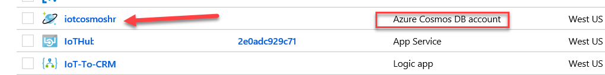 
3. Select Data Explorer, click on the … button of the Telemetry database and select New Collection. 
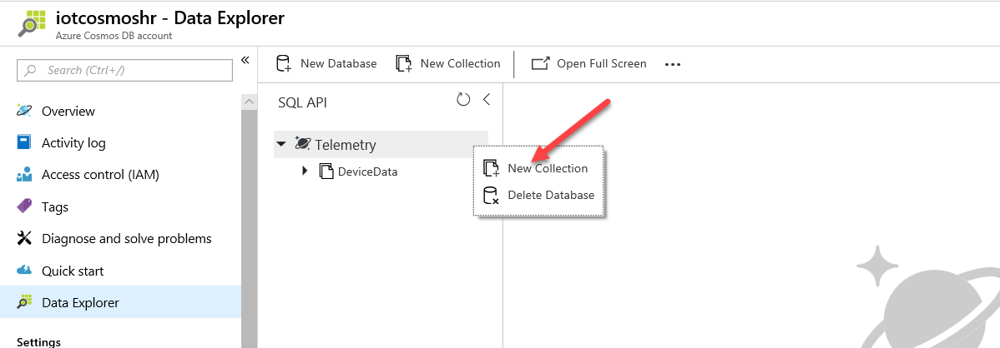 
4. Enter AnomalyData for Collection ID, change the Throughput to 400, and click OK. We are changing the throughput to minimize cost. 
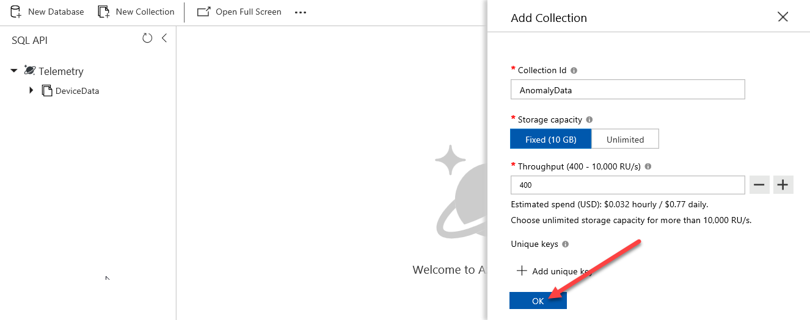 

 
#### Add New Output 
In this task, you will add a new Output for the AnomalyData collection 

1. Close the Azure Cosmos DB blade. 
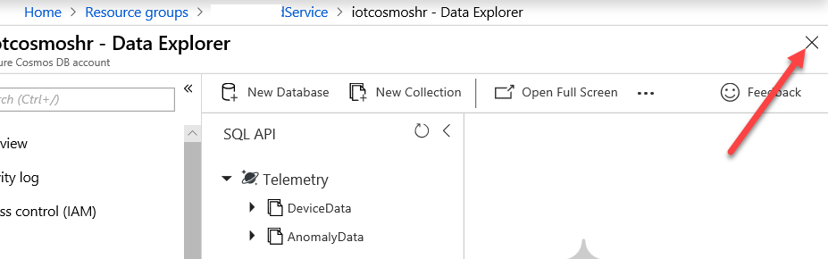 
2. Locate and open the Stream Analytics Job.
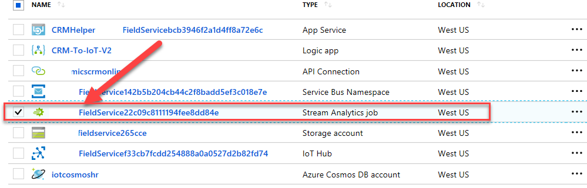 
3. Click Stop. The Stream Analytics Job must be stopped before you can change its query and input/outputs.
 
4. Click Yes.
5. After the Job stops, select Output, click Add, and select Cosmo DB.
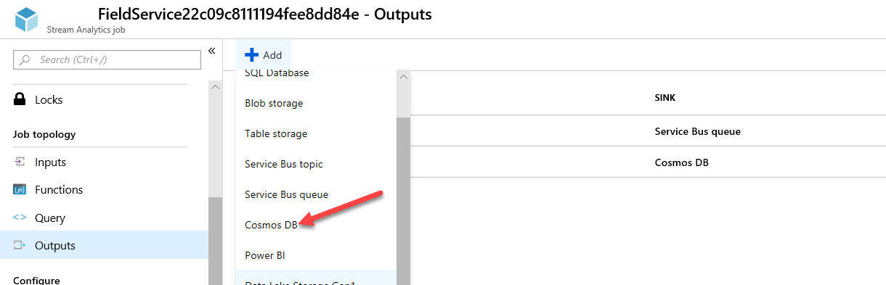 
6. Enter AnomalyDB for Output Alias, select your subscription, select the Cosmo DB you created, select the Database you created, enter AnomalyDB for Collection Name Pattern, and click Save 
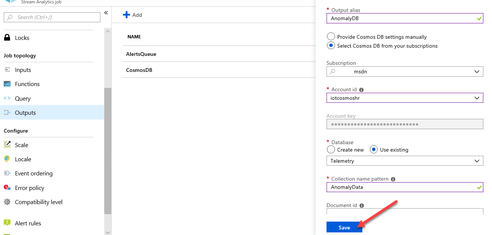 
 
#### Prepare and Build the New Query 

1. Select Query. 
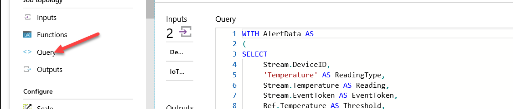 
2. Copy the existing query and save it in case you want to reference it later. 
3. Clear the existing query, we are going to build a new one step by step.
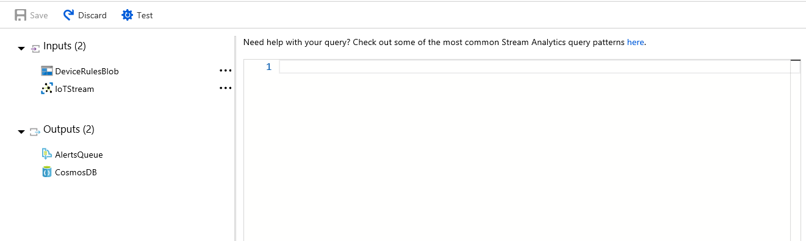 
4. Paste the below snippet in the Query editor. 

```json
...

WITH AlertData AS  
( 
SELECT 
    IoTHub.ConnectionDeviceId as Device, 
    System.Timestamp as tumblingWindowEnd, 
       AVG(Stream.temp) as TempC, 
       AVG(((Stream.temp*1.8)+32)) as TempF, 
       AVG(Stream.accelerometerX) as accelerometerX, 
       AVG(Stream.accelerometerY) as accelerometerY, 
       AVG(Stream.accelerometerZ) as accelerometerZ     
FROM 
    IoTStream Stream TIMESTAMP BY IoTHub.EnqueuedTime 
GROUP BY IoTHub.ConnectionDeviceId, TumblingWindow(second, 10) 
)

...
```

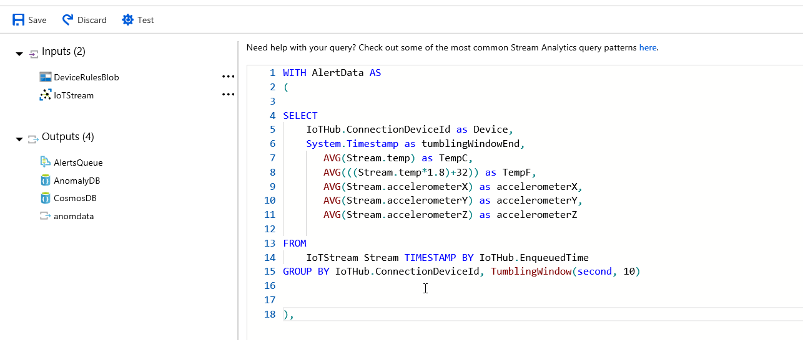 

*Note: This will process the raw data off the device and group into 10 second tumbling windows that will be evaluated for anomalies.  We choose to use averages for the data in the window, you could use whatever aggregation that made since for your scenario. *
 


5. Paste the following just after the prior query, this will use the data from the last query and further augment it. 

```json
...

FillInMissingValuesStep AS 
    ( 
          SELECT                 
                System.Timestamp AS hoppingWindowEnd, 
                TopOne() OVER (ORDER BY tumblingWindowEnd DESC) AS lastEvent 
         FROM AlertData 
         GROUP BY HOPPINGWINDOW(second, 300, 5) 
    )

...
``` 

*Note: To help ensure uniformity of data so we don't have any gaps, we've chosen to fill the gaps by taking the last event in every hop window.* 

6. Paste the following step to do the actual anomaly scoring.

```json
...

AnomalyDetectionStep AS ( 
SELECT 
     lastevent.Device as lastEventDevice, 
     hoppingWindowEnd, 
                lastEvent.tumblingWindowEnd as lastTumblingWindowEnd, 
                lastEvent.TempC as lastEventTempC, 
                lastEvent.TempF as lastEventTempF, 
                lastEvent.accelerometerY as lastEventaccelerometerY, 
                lastEvent.accelerometerX as lastEventaccelerometerX, 
                lastEvent.accelerometerZ as lastEventaccelerometerZ,                 
                system.timestamp as anomalyDetectionStepTimestamp, 
     ANOMALYDETECTION(lastEvent.TempC) OVER (PARTITION BY lastevent.Device LIMIT DURATION(mi, 2)) as  scores 
FROM FillInMissingValuesStep 
), 

...
```  

Note: This query uses the ANOMALYDETECTION operator on the TempC value.  It is done on each device and is measured over a 2 minute duration.  This causes training of the anomaly detection to be device specific and could accommodate for differences in baseline temperatures at each device location. The output from this results in scores being added to the output for evaluation in the next query 
 
7. Paste the following on to the query you are building. 

```json
...

AnomalyDetectionFilter AS ( 
SELECT lastEventDevice as DeviceId, 
    CAST(GetRecordPropertyValue(scores, 'BiLevelChangeScore') as float) as BiLevelChangeScore, 
    CAST(GetRecordPropertyValue(scores, 'SlowPosTrendScore') as float) as SlowPosTrendScore, 
    CAST(GetRecordPropertyValue(scores, 'SlowNegTrendScore') as float) as SlowNegTrendScore, 
    lastEventTempC as Reading, 
    'Tempature' as ReadingType, 
    'Trend Up ' as Threshold, 
    'EventToken' as EventToken, 
    lastTumblingWindowEnd as time 
FROM AnomalyDetectionStep  
WHERE  
       CAST(GetRecordPropertyValue(scores, 'SlowPosTrendScore') as float) >= 10       
union 
SELECT lastEventDevice as DeviceId, 
    CAST(GetRecordPropertyValue(scores, 'BiLevelChangeScore') as float) as BiLevelChangeScore, 
    CAST(GetRecordPropertyValue(scores, 'SlowPosTrendScore') as float) as SlowPosTrendScore, 
    CAST(GetRecordPropertyValue(scores, 'SlowNegTrendScore') as float) as SlowNegTrendScore, 
    lastEventTempC as Reading, 
    'Tempature' as ReadingType, 
    'Trend Down ' as Threshold, 
    'EventToken' as EventToken, 
    lastTumblingWindowEnd as time 
FROM AnomalyDetectionStep  
WHERE        
      CAST(GetRecordPropertyValue(scores, 'SlowNegTrendScore') as float) >= 10) 

...
``` 

Note: This does the evaluation of both the SlowPosTrendScore and SlowNegTrendScore.  The value you are checking is the sensitivity.  It could start being meaningful at 3.25, but we choose to wait till it was more significant at 10.  In the real world you would tune that to your particular scenario.  Note also we have fields selected for Reading, ReadingType,  Threshold and EventToken.  This is data that is expected by the Logic App for any message we output to the AlertsQueue which you will be doing in the next query.  IF you don't maintain these fields you need to modify that Logic App to not expect them. 

8. Paste the snippet after the last snippet. 


```json
...

SELECT * 
INTO AlertsQueue 
FROM AnomalyDetectionFilter data 
WHERE LAG(data.DeviceID) OVER (PARTITION BY data.DeviceId, CAST(data.Reading as bigint), data.ReadingType LIMIT DURATION(minute, 1)) IS NULL 

...
``` 
 
*Note: This does the actual insert into AlertsQueue which will be picked up by the Logic App to create the IoT Alert Record.  Note we are keeping the LAG operator in the where to limit how often we put messages into the Queue to only when the same device for a rounded temperature has new data within the minute. *

9. To insure we log the same detail data from the device add back the following query. 

```json
...

SELECT  
    * 
Into CosmosDB 
FROM IoTStream TIMESTAMP BY IoTHub.EnqueuedTime 

...
``` 

10. Add the following, this will save off the scores from the anomaly detection operator, so you can easily see the data via the Azure Cosmos DB Data Explorer. 

```json
...

SELECT  
    * 
Into AnomalyDB 
FROM AnomalyDetectionStep

...
``` 
 
11. Save the Query. 
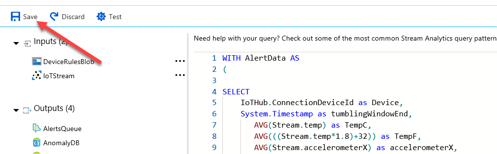 
12. Click Yes. 
13. Select the Overview tab and click Start. 
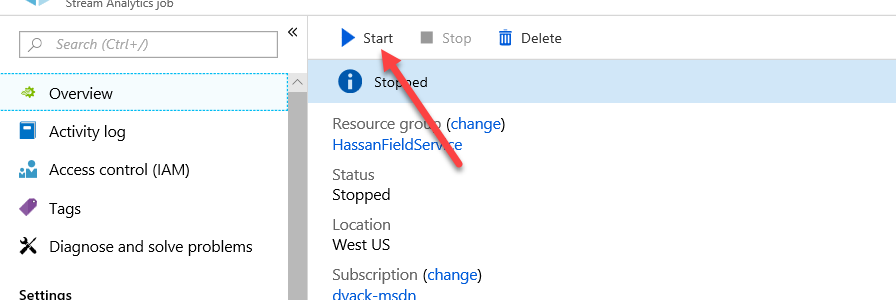 
14. Select Now and click Start again. 
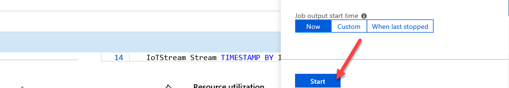 
 
Make sure the job stats successfully. 

### Testing the Query  
In this exercise, you will attempt to cause the temperature on your physical device to be changed to test the anomaly detection. 
Each exercise consists of a scenario and learning objectives, the scenario describes the purpose of the exercices, while the objectives are listed and have bullet points.  
 
#### Test the Query 
Now is the challenging part, you need something to slowly heat the temperature the device reads.  Ice packs work well, as do cans of compressed air.  Hair dryer or a hand warmer might work as well.  Just make sure to protect your device so you don't get it wet or otherwise damage it. 

1. Close the Stream Analytics blade. 
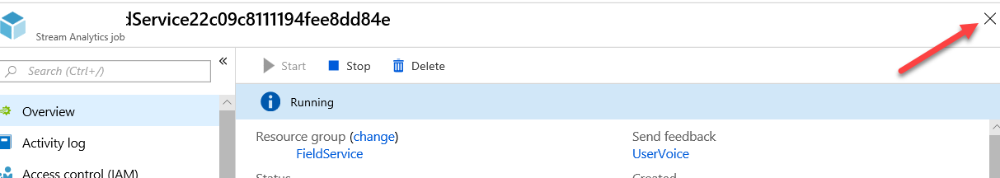 
2. Open the Azure Cosmos DB. 
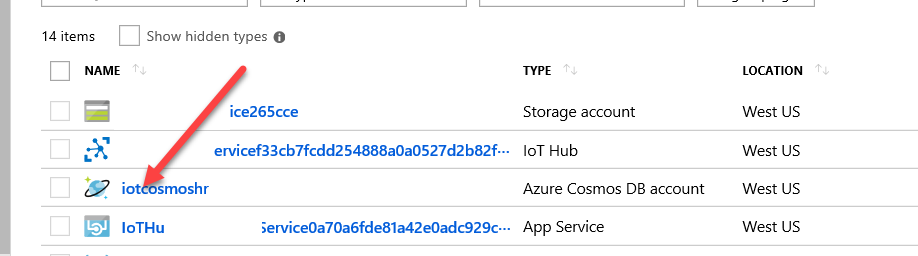 
3. Select Data Explorer, expand the AnomalyData collection, and select Documents. 
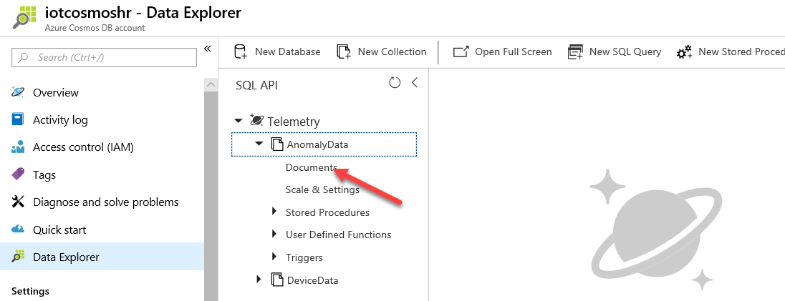 
4. You should get list of alerts. Click on one of the alerts.
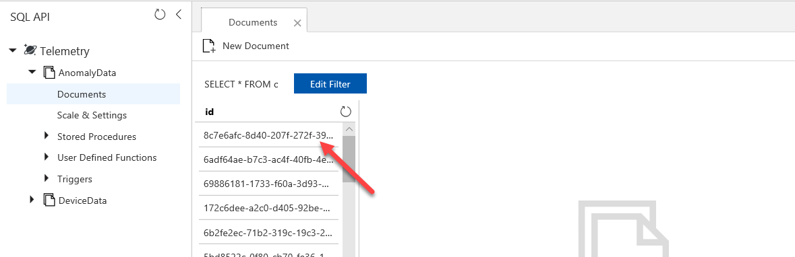 
5. You should see sensor information from your device. 
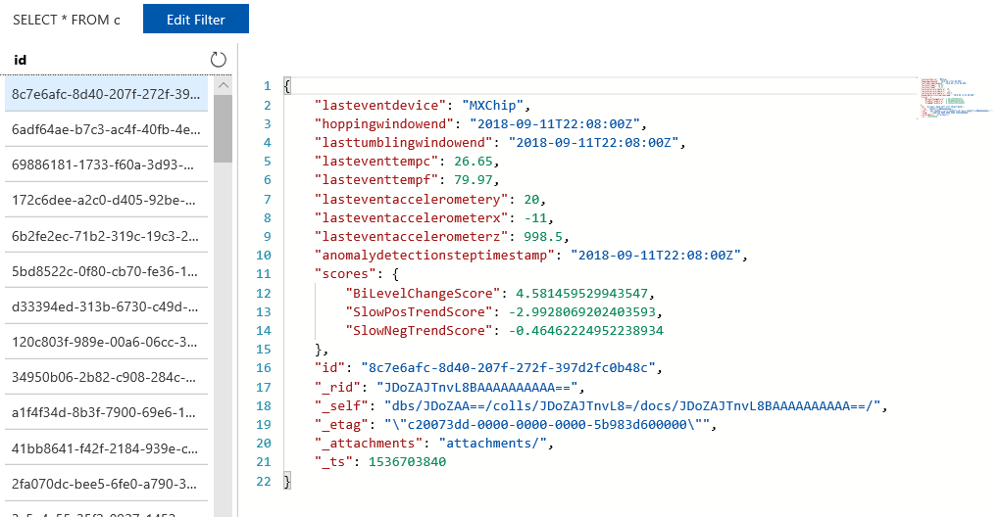 
6. Go to your Dynamics 365, click Switch to Another App, and select Connected Field Service. 
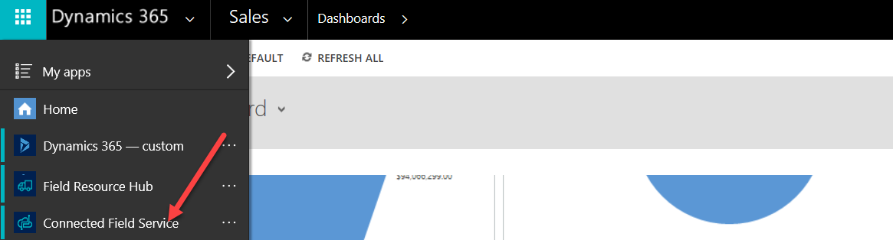 
7. Click Site Map and select IoT Alerts. 
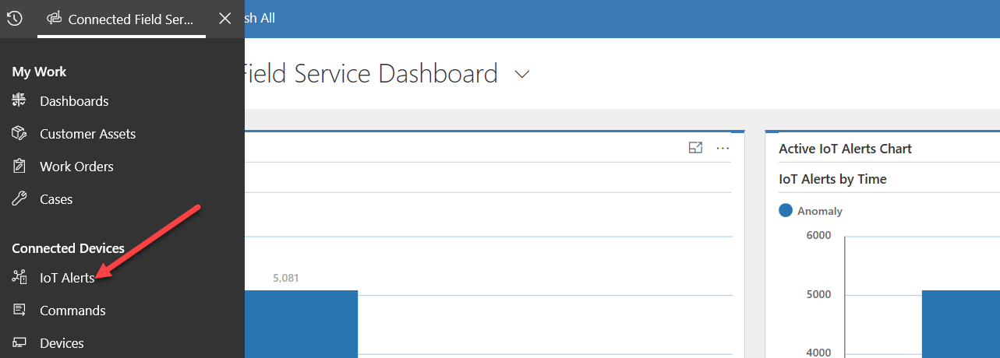
8. Open one of the alerts. 
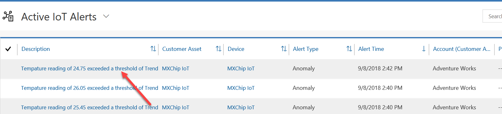
9. Go to the Alert Data section and you should see sensor information from your device. 
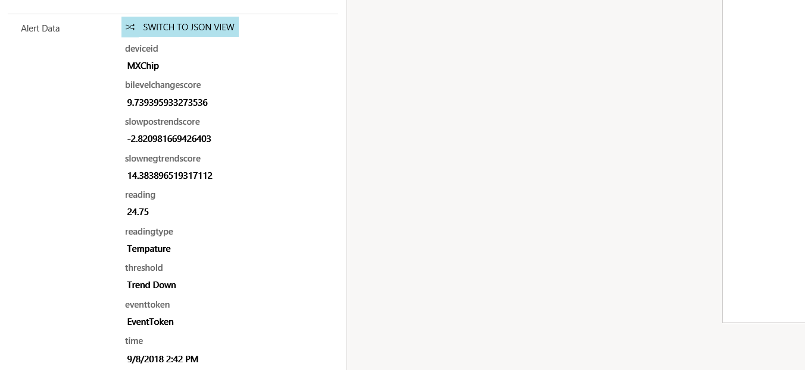

