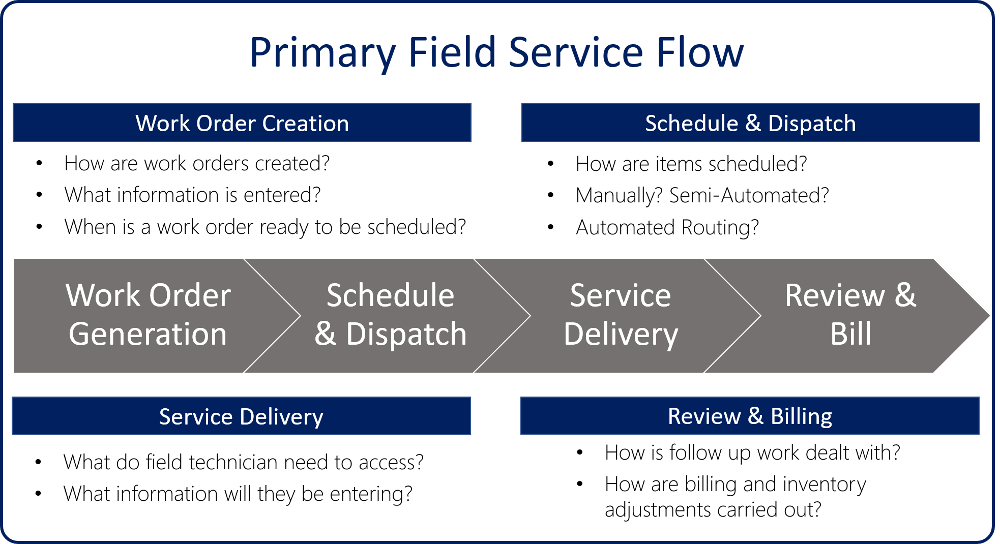

Set up your mobile workforce for success with Dynamics 365 for Field Service. Deliver onsite services to your customer locations with workflow automation, scheduling algorithms, and mobility.

A variety of organization types use Dynamics 365 for Field Service to deliver onsite services successfully.

- **Manufacturing:** A medical device manufacturer   manages onsite device maintenance at hospitals and clinics.
- **Utilities:** A fiber optic cable utility company   responds to outages by dispatching technicians to problem areas.
- **Healthcare:** An in-home healthcare service provider schedules and dispatches healthcare workers to administer medicine and other care to multiple patients.
- **Equipment maintenance:** A facilities manager delivers maintenance and repair services for heating and cooling equipment.

### Where to begin

To prepare for Dynamics 365 for Field Service deployment, you'll need to consider a few things.
A Dynamics 365 for Field Service deployment will more closely resemble an Enterprise Resource Planning (ERP) implementation than an implementation of Microsoft Dynamics 365 for Sales or Microsoft Dynamics 365 for Service. 
The deployment process generally consists of four parts:

#### Work Order Generation - How work orders will be generated, and what info is needed
   - Are they based on incoming calls or emails?
   - Are they automatically generated as part of a service agreement?
   - Can customers create them from a portal?
   - How do we know when it is ready to be scheduled?

#### Scheduling and Dispatching - The process for scheduling work items
   - What does a dispatcher who will be manually scheduling work items need?
   - What does a semi-automated solution look like?

#### Service Delivery - How field agents will complete the work onsite
   - What do they need to have on the ticket?
   - What info will they be entering?
   - Will they be primarily working online or offline?

#### Review and Billing -  How and when an item is billed after the work is completed
   - How is follow-up work dealt with?
   - How are billing and inventory adjustments carried out?

### Geocoding

Dynamics 365 for Field Service uses latitude and longitude to determine location info. Addresses in Dynamics 365 are geocoded, so they can be easily identified on maps, and be used to compare locations to
find the closest resource.

Field Service leverages Universal Resource Scheduling (URS) to schedule work orders in the application. Field Service configuration consists of both defining items in URS and configuring Field Service settings. The first thing you want to configure is mapping functionality. By default, mapping is not enabled. This can be modified from the Field Service mobile app. On the site map, select the ellipsis (...), and select **Resource Scheduling**. Under **Administration** > **Scheduling Parameters**, you will need to set the **Connect to Maps** field to *Yes*. Setting this field to *Yes* will ensure that the schedule board
and schedule assistant will use maps to schedule items. By default, Field Service uses Bing Maps, but different mapping providers can be used by inserting the mapping Application Programming Interface (API) key for the provider.

Additionally, a geocoded address can be defined for accounts, contacts, and users.

### Planning Configuration

Before configuring the application, your organization should take time to consider what needs to be captured and how the application should be configured to accomplish that. Dynamics 365 for Field Service provides a wide variety of settings that can be configured.

Consider the following:

#### Resource Scheduling Options

- What types of resources will we need?
- How will resources be scheduled?
- Are we just scheduling work orders, or do we need to consider other entities?
- What about dealing with time off?

   For more about URS, and for considerations, see [Universal Resource Scheduling for Field Service](https://docs.microsoft.com/dynamics365/customer-engagement/field-service/universal-resource-scheduling-for-field-service).

#### Entities

- What fields, view, and other necessary customizations may need to be done.

For more about customizing Dynamics 365, see these resources:

- For more about customizing Dynamics 365 entities, see [Create or edit entities (record types)](https://docs.microsoft.com/dynamics365/customer-engagement/customize/create-edit-entities).
- For more about customizing Dynamics 365 forms, see [Create and design forms](https://docs.microsoft.com/dynamics365/customer-engagement/customize/create-design-forms).
- For more about customizing Dynamics 365 views, see [Understand views (lists)](https://docs.microsoft.com/dynamics365/customer-engagement/customize/create-edit-views).

#### Product and Service Categories

- What types of products do we sell?
   - Are they tracked in inventory?
- What types of services do we sell?
   - How do we charge for them?

*Products and services will be discussed in more detail later.*

#### Skill Types
   - What skills do resources need to work on items?

> [!VIDEO https://www.microsoft.com/videoplayer/embed/RE2Kmlo]

Field Service has five types of configuration settings available:

- **General Settings:** Used to define settings like pay types, prefix numbers, service territories, and work order priorities.
- **Work Order Settings:** Used to define items specific to work orders such as work order types, substatuses, incident types, and service task types.
- **Scheduling Settings:** Used to configure scheduling settings used by Field Service such as defining resources, skills, and roles.
- **Service Delivery Settings:** Used to define agreement substatuses.
- **Inventory and Purchasing Settings:** Used to define items like warehouses, customer assets, and products and price lists.

#### Field Service Users and Security Roles

Field Service comes with security roles and field security profiles unique to the Field Service application.

By setting security roles for users, you control the types of data and entities a user can access and edit. By setting field security profiles, you control which fields a user sees for an entity. For example, a user might have permission to see accounts, but not to see specific fields for an account.

The security roles included with Field Service are:

- **Field Service – Administrator**: Designed for service managers and IT administrators. This role has access to all Field Service entities including work orders, scheduling, and inventory.
- **Field Service – App Access and Field Service – Resource:** Designed for field technicians who carry out work orders for customers primarily via the mobile application.
- **Field Service – Dispatcher:** Designed for schedulers who are responsible for managing and assigning a group of work orders to a group of resources.
- **Field Service – Inventory Purchase:** Designed for inventory managers who are responsible for managing truck stocks, purchasing and reordering inventory, and processing product returns. Field technicians are not able to edit fields on the mobile work order form until you complete this step.
