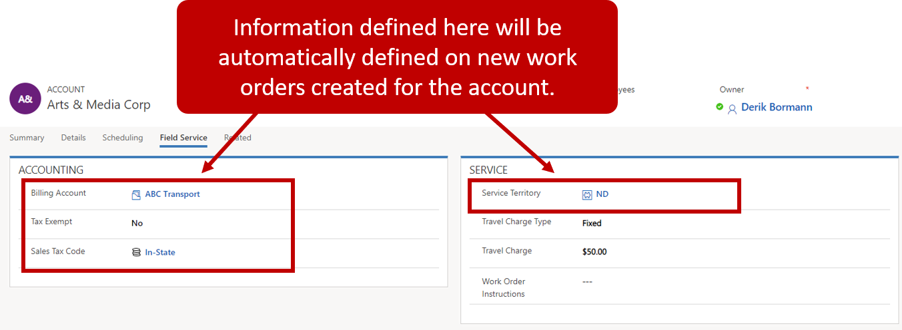

When you create a work order in Dynamics 365 Field Service, you'll specify a service account. A service account is the account record for the work that will be done. When you create the account, relevant info from it is automatically associated with the work order. For example, let's say that you have an account with an address of 1525 181st Avenue North, Bellevue, WA 98004, and the customer associated with the account prefers that only Randy or Joni work on their order. You can define that info on the account record, so it will automatically flow to any work order created for the account.

Because accounts play a critical role in a Field Service implementation, it is important to configure everything on account records correctly.

### Geocoded Addresses

Field Service uses geolocation to map addresses. The latitude and longitude values are based on the street address defined on the account. You can view the latitude and longitude for an account on the **Scheduling** tab on the account record. 

When you create a work order, the account address is automatically populated. Field Service compares the address with geolocation info for resources to find nearby technicians, populate estimated travel durations, and help with other location-related info.

View a geocoded address by selecting the **Geocode** button on the command bar. Latitude and longitude info will appear on the map. When address info changes, the latitude and longitude will change too.

### Field Service Info

When Field Service is installed, a **Field Service** tab is added to the account record. On this tab you'll enter account info that will be used in Field Service. Define the following:

- **Accounting Info:** Billing-related info

  - **Billing Account:** The account responsible paying the bill for the account's service activities
  - **Tax Exempt:** An organization's tax exempt status
  - **Tax Exempt number:** An organization's tax exempt number

- **Service**

  - **Service Territory:** An account's territory for service
  - **Travel Charge Type:** How travel charges should be billed to the customer. Options include:
    - Hourly
    - Mileage
    - Fixed
    - None
  - **Travel Charge:** The fee for each type of travel charge
  - **Work Order Instructions:** Specific, account-related instructions for work orders

### Resource Preferences

Customers often have resource preferences. They might request specific individuals to work or not work on their items. These preferences can be defined at the account level, and are automatically transferred to work orders when they are created.

When you define resource preferences, you can specify the following:

- **Bookable Resource:** The resource a preference applies to

- **Preference Type:** Whether this is a preferred or restricted resource
  - **Preferred:** A preferred resource to work on an order
  - **Restricted:** A resource not to be assigned to an order
  -**Expiration Date:** The date when the restriction for the resource can be 
removed.

For more info about defining account preference, refer to this video:

>[!VIDEO https://www.microsoft.com/en-us/videoplayer/embed/RE2Kewv]

### Additional Account Info

Each account will have additional items associated with it, all of which provide insight into an organization. These items include:

- **Customer Assets:** Specific, serviceable equipment that the customer has. These assets can have a work order opened for them.
- **Billed Accounts:** The accounts that this account is responsible for paying the bill for
- **Agreements:** Any support agreements associated with the customer that are used to generate work orders and bookings on a defined schedule
- **Work Orders:** A history of all open and closed work orders associated with an account
- **Billed Agreements:** Past agreement billings that were charged to an account
- **Billed Work Orders:** Past closed work orders that have been billed to the customer
