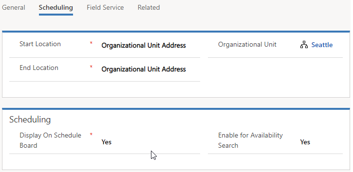
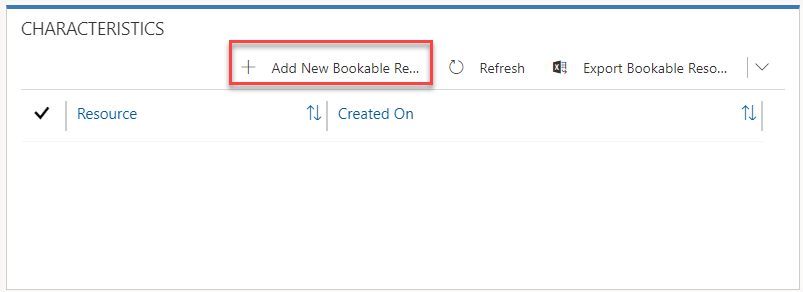
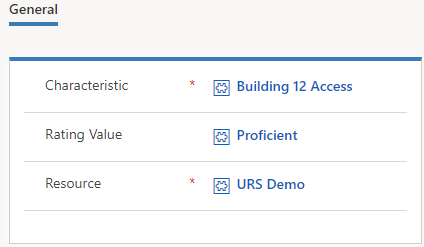
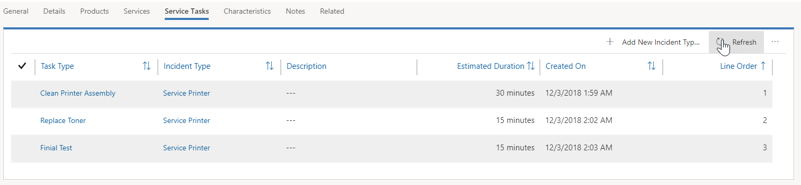

Dynamics 365 for Field Service helps organizations address customer needs that can vary by service model and other factors. To do so, Field Service must be correctly configured before an organization starts using the application.

This exercise will introduce you to Field Service configuration.

### Learning Objectives

After completing this exercise, you will be able to do the following:

- Create resource skills and characteristics
- Enable mapping
- Create resources
- Define incident types

The labs and exercises in this module work best when you have sample data to work with. If your environment does not include sample data, see the [Sample data installation for the Field Service application](https://docs.microsoft.com/dynamics365/customer-engagement/field-service/install-sample-data-8-x) page.

### Enable Bing Maps to use resource scheduling

To take full advantage of the scheduling and mapping capabilities available with Field Service, verify that it is configured to use a mapping provider. Bing Maps is the default map provider, but additional providers can be enabled.

1. In Dynamics 365, select the arrow next to the **Dynamics 365** text, and then select **Universal Resource Scheduling**.
2. Select the **Site Map** icon to expand the navigation. 
3. On the menu that appears, select **Administration**.
4. Select **Scheduling Parameters**.
5. Locate the **Connect to Maps** field, and set it to *Yes*.
6. Save and close the settings.

### Configure Field Service

In this exercise, you will modify and configure several Field Service settings that will be used throughout the application. This will include defining skills and certifications, territories, resources, and more.

### Define characteristics

1. In Dynamics 365, select the down arrow next to **Dynamics 365**, and then select **Field Service**.
2. Using the site map, select the ellipsis (...), and select **Field Service Settings**.
3. Under *Schedule Settings*, select **Characteristics**.
4. Select **New**.
5. Enter *MCSE* in the **Name** field, select **Certification** in the **Certification** **Type** field, and then select **Save**.
6. Select **New**.
7. Type *MCSA* in the **Name** field, select **Certification** in the **Types** field, and then select **Save and Close**.

### Define territories

1. Using the site map, under **General Settings**, select **Territories**.
2. Select **New**.
3. Enter *North* in the **Name** field, and select **Save and New**.
4. Enter *South* in the **Name** field, and select **Save and New**.
5. Create two more territories, and name them *East* and *West*.
6. Verify that you now have four additional territories.

### Define resource categories

1. Using the sitemap, under **Schedule Settings**, select **Resource Categories**.
2. Select **New**.
3. Enter *Pre Sales* for both the **Name** field and the **Description** field, and then select **Save**.

### Create a bookable resource for your user record

1. Using the sitemap, under **Schedule Settings**, select **Resources**.
2. Select **New** button to create a new bookable resource.
3. Configure the resource as follows:

- **Resource Type**: *User*
- **User**: *Your* *User* *Record*
- **Time Zone**: Leave the default value in this field

4. Select the **Scheduling** tab, and configure it as follows:

- **Organizational Unit**: *Seattle*
- **Start Location**: *Organizational* *Unit* *Address*
- **End Location**: *Organizational* *Unit* *Address*

    

5. Select the **Field Service** tab, and configure it as follows:
- **Hourly Rate**: *175*
6. Save the bookable resource record, and leave it open.
7. Locate the **Characteristics** subgrid, and select **Add New Bookable Resource Characteristic**.

    

8. Configure the **Characteristics** settings as follows:
- **Characteristic**: *Building* *12* *Access*
- **Rating Value**: *Proficient*

    

9. Save and close the characteristic record.
10. Save and close the bookable resource record. 

### Add a printer product

1. Using the sitemap, under **Inventory and Purchasing**, select **Products**.
2. Select **Add Product** to create a product.
3. Define the details of the product as follows:

- **Name**: *Monthly Printer Service*
- **Product ID**: *Print-Serv-1234*
- **Unit Group**: *Default Unit*
    - **Default Unit**: *Primary Unit*
    - **Decimals Supported**: *2*

4. Select the **Field Service** tab, set the **Field Service Product Type** to *Non-Inventory*.
5. Set the **Taxable** field to *No*.
6. Save the product, and then select **Publish**.

### Add a product to a price list

1. Using the site map, under **Inventory and Purchasing**, select **Price Lists**.  
2. Open the **Default Price List**.
3. In the **Price List Items**, select the **Add (+)** button to add a price list line item.
4. Enter the following info:

   - **Product**: *Monthly Printer Service*
   - **Unit**: *Primary Unit*
   - **Pricing Method**: *Currency Amount*
   - **Amount**: *750*

5. Select **Save and Close**.
6. Close the default price list.

### Create service task types to be used with incidents

1. Using the site map, under **Work Order Settings**, select **Service Task Types**.
2. Select **New**, and enter *Clean Printer Assembly* for the **Name** field.
3. Select **30 Minutes** in the **Estimated Duration** field.
4. Select **Save and Close.**
5. Repeat Steps 2 through 4 to add each of the following service task types:

    - **Replace Toner**: *Duration **15 Minutes***
    - **Finial Test**: *Duration **15 Minutes***

### Create an Incident Type called Service Printer

1. Using the sitemap, under **Work Order Settings**, select **Incident Types**.

2. Select **New**, and enter *Service Printer* for the Name field.
3. Select the **Details** tab, and configure it as follows:

    - **Copy Incident Items to Agreement**: *Yes*
    - **Default Work Order Type**: *Preventative Maintenance*

4. Select **Save** to save the Incident type and leave it open.
5. Select the **Service Task** tab, and select **Add New Incident Type Service Tasks**. (If pop-ups are blocked, you might need to unblock them)
6. Enter *Clean Printer Assembly* for the **Name** field, select **Clean Printer Assembly** as the task type, and then ensure *30 minutes* is set for **Estimated**
**Duration**.
7. Select **Save and Close.**
8. Repeat steps 5 through 7 to add the items listed below:

