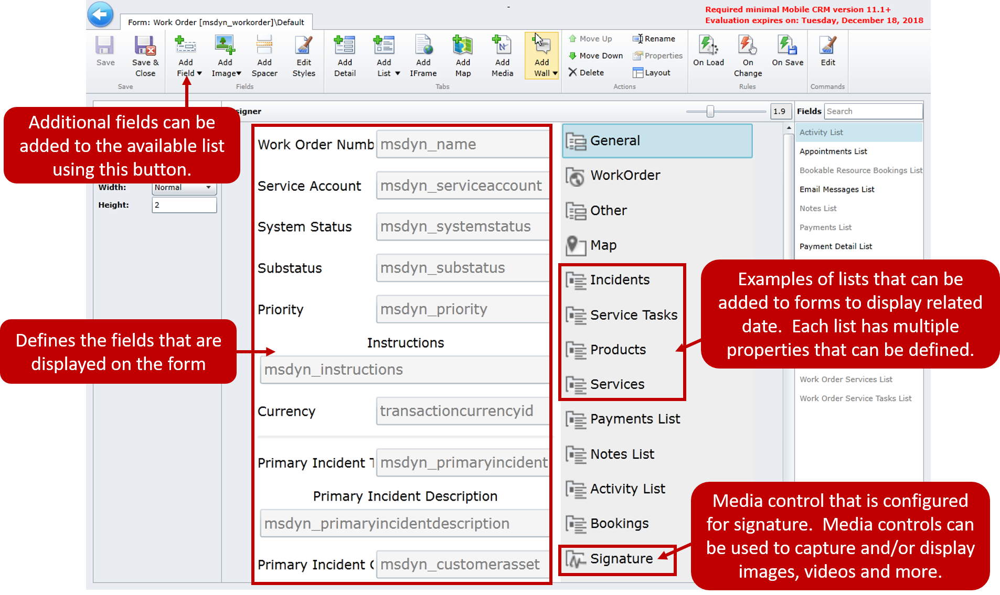
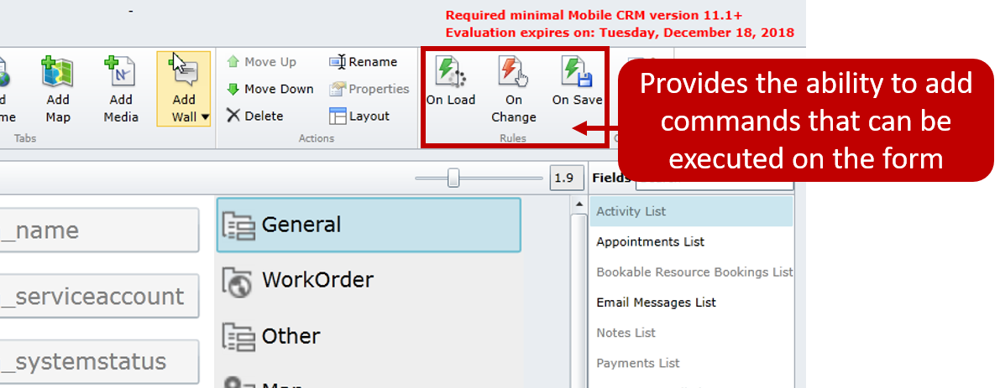

Forms can be created and edited as needed to ensure that technicians are seeing exactly what is needed to deliver functionality. The default work order from contains the following information:

-   **General**: Provides basic information about the work order such as the number, service account status, and type.
-   **Other**: Provides additional information such as the billing account and preference information.
-   **Map**: Provides GPS location information on a map for the work order.
-   **Incidents**: Displays a list of all related incidents associated with the work order.
-   **Service Tasks**: Displays a list of all the service tasks related to a work order.
-   **Products**: Displays a list of all the products added to the work order.
-   **Services**: Displays a list of all the services added to the work order.
-   **Payments List**: Displays any payments associated with the work order.
-   **Notes**: List Displays all notes associated with the work order.
-   **Activity list**: Displays all activities associated with the work order.
-   **Bookings**: Lets you see any bookings associated with the work order
-   **Signature**: Lets you capture a signature for the work order.

While the default forms available provide good starting points for an organization. Many times, additional customizations will be needed to assist in ease of use with the form. This might be as simple as just adding a new field to the form, or it might be a bit more complex depending on the requirement.

Many times, delivering that functionality will require multiple modifications to multiple items such as:

-   The Dynamics 365 entity itself
-   The entity in the Woodford solution
-   A view and/or form in the Woodford solution

For example, the service tasks sub-grid displayed on the work order form is associated with the Work Order Service Task Entity. The list is displaying the Service Task List view. The Service Task List view requires that each task must be opened to complete it by default. Many organizations want to provide an easier option for their users.

At a very high-level this could be done by:

-   Add an option field to the Work Order Service Task entity in Dynamics 365 called completed.
-   Enabling the completed field for the Work Order Service Task Entity in the Woodford solution.
-   Add the completed field as a text-edit field to the Work Order Service Task view that being displayed on the Work Order form.

While those are very high-level steps, it helps illustrate how changes might need to be layered on top of each other to deliver a complete
solution.

For more about working with forms, see [Multiple Views](https://www.resco.net/woodford-user-guide/#__RefHeading__5841_1627906509).

For more about form objects, see [IFrame](https://www.resco.net/woodford-user-guide/#__RefHeading__5849_1627906509).

For more about using the map frame, see [Map Frame](https://www.resco.net/woodford-user-guide/#__RefHeading__5853_1627906509).

### Form rules

Another way that forms can be enhanced are though Form Rules. Form Rules describe sequences of steps that are executed on form related events such as OnLoad, OnSave, or OnChange. Rules are bound to form and the main entity. Form rules are created by clicking on corresponding event button.

-   **OnLoad**: The rule is executed when the **Edit** form is opened.
-   **OnChange**: The rule is executed on opening of the **Edit** form, and also each time a value of the form's fields is changed.
-   **OnSave**: The rule is executed when the **Save** button is selected.

Form rules can be used in conjunction with Commands and custom commands to provide a custom experience for a user. For example, a product might contain a UPC field that is formatted to use the bar code scanner. When the UPC code is scanned and the value is filled into the form, a form rule could be used to locate the corresponding product white paper and
load it into the specific section on the form.

A complete set of documentation is available from Resco. For details on how to use form rules and scripting, see [Form Rules—On Load, On Change, On Save](https://www.resco.net/woodford-user-guide/#__RefHeading__5859_1627906509).
