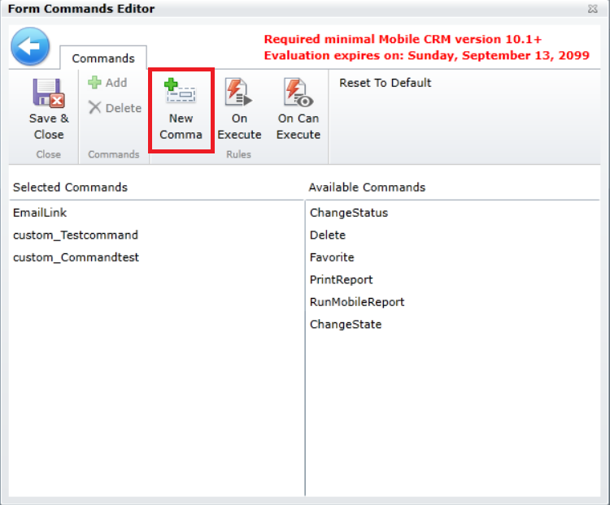
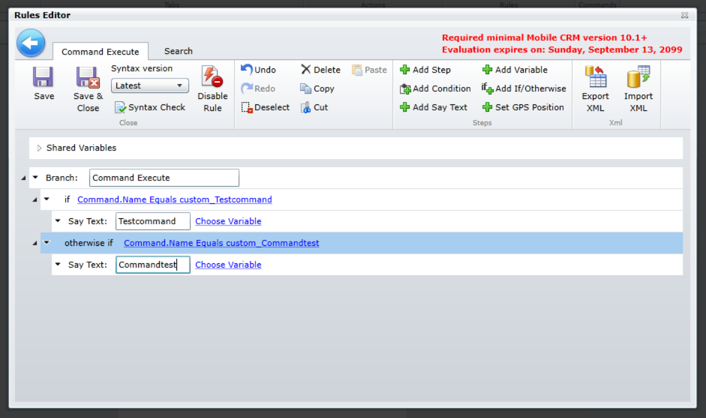
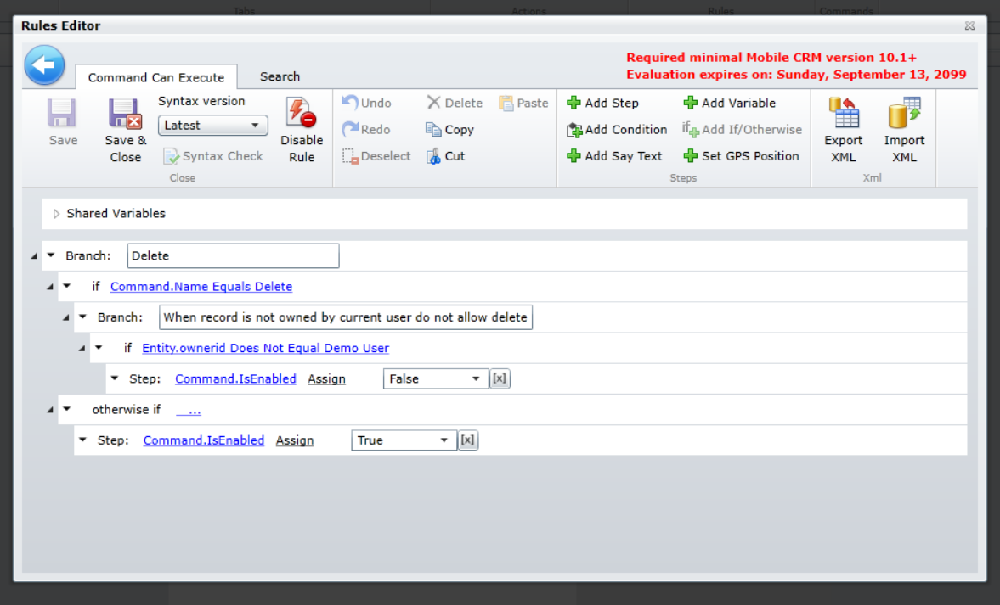

The Field Service mobile application provides technicians in the field with the ability to perform to easily manipulate or perform actions on records by using form rules, commands, and custom commands.

Some common examples of commands include:

-   **ChangeState**: Change state code of a record. You can also specify which state options will be available to users. Each state option will be displayed as a separate command.
-   **ChangeStatus**: Change status code of a record. You can also specify which status options will be available to users. Each state option will be displayed as separate command.
-   **Delete**: Deletes the record from the database. If it is performed in offline mode, after synchronization it is also deleted from the Dynamics 365 server.
-   **EmailLink**: Creates an email with links to the record, for Dynamics 365 server and for Field Service Mobile application.

Commands are attached to forms and provide additional flexibility and ease of use capabilities. When the application is being customized, it is possible to define which commands will be available to on which forms and which under which circumstances they will be available.

In addition to visible commands, there are also several different hidden commands available. These hidden commands can be very beneficial for technicians that are in the field because they typically provide and interact with GPS data.

The hidden commands available include:

-   **UpdateGPS**: Sets the current device's position to record's latitude and longitude fields.
-   **UpdateAddress**: Sets the current device position (latitude, longitude fields) and address (Street, City, Country).

For example, you may want to update a technician's current device's location after they change a work order to in progress. This would allow dispatchers to see where the technician is in relation to any potential work orders that my need to be scheduled for them.

### Custom commands

When you need additional flexibility such as defining under which conditions a command will be available and what to do when the command is used you can define custom command. 

For example, let's say that technicians should not be able to delete products on a work order by default. However, in specific instances (such as being a non-inventory item) you may want them to be able to delete those products.

When default or custom commands are being added to a form you need to define On Execute and On Can Execute rules:

-   **On Can Execute rule**: Specifies when users can see and use the command. The command will be hidden in situations where the action is not suitable.
-   **On Execute rule**: Defines the actions that the command performs. You can specify what will be performed by the command when a user initiates it.

A simple example using execute commands is the update GPS command on the Edit Form's Address Tab. Users should not change the GPS position of a record that already has the GPS position set so you can hide this command in such situation.

Another example is when you want to prevent users from deleting a record. You can disable deleting records by not putting the Delete command on Selected commands section. But what if you want them to delete commands in some situation? You can add the Delete command but hide it in specific situations. In this case we will not allow users to delete records that are owned by different users.

For more about working with custom commands, please refer to the [Resco Woodford customization documentation](https://www.resco.net/woodford-user-guide/#__RefHeading__5863_1627906509).
