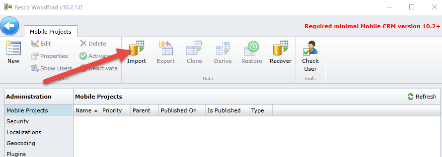
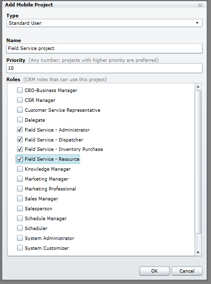
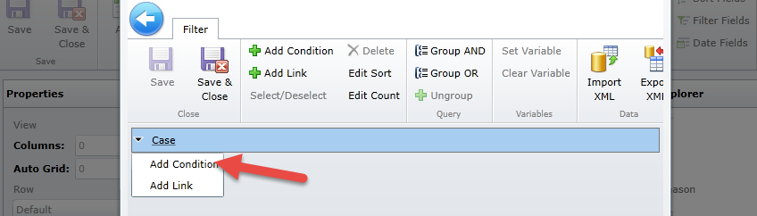
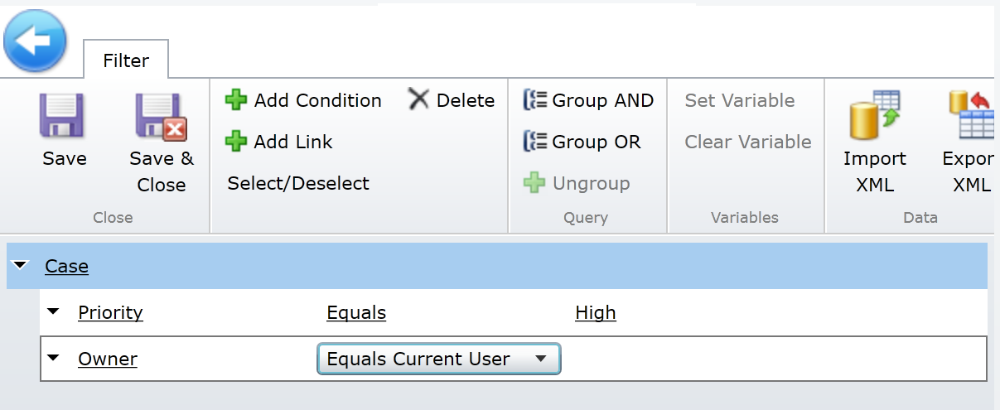
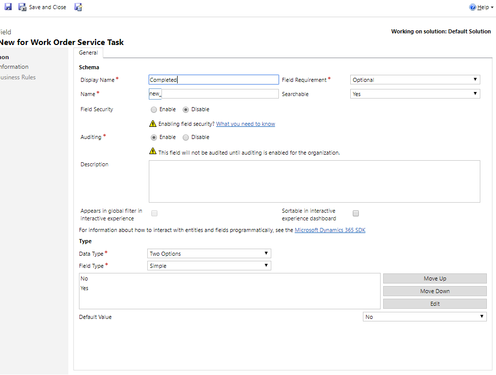
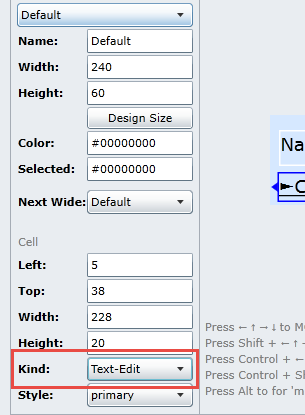

## Deploy and configure Field Service Mobile projects

### Before you begin

The labs and exercises in this module work best when you have some sample data to work with. Depending on if the environment you are working with, you may want to install some sample data to assist with exercises. Dynamics 365 does provide the ability to add sample data as needed. If the environment you are working in does not have any sample
data installed, follow the steps below to install the sample data into your environment.

The labs and exercises in this module work best when you have sample data to work with. If your environment does not include sample data, see the [Sample data installation for the Field Service application](https://docs.microsoft.com/dynamics365/customer-engagement/field-service/install-sample-data-8-x) page.

### Download and install the Mobile Field Service mobile solution

**Before you Begin:** You will need administrator permissions to install the Mobile Dynamics 365 Woodford mobile solution for field service capabilities in Dynamics 365. You also need to use Internet Explorer with Silverlight or Firefox.

1.  Navigate to the following URL, to download and save the Woodford mobile solution from the Resco site to your computer. <https://www.resco.net/mobilecrm/woodford.html> (You should download and install the solution that matches the version of the Field Service Mobile application you are running.)

    > [!NOTE] 
    > The Solution does contain, the editor that can be launched from the Dynamics 365 Solution. It is also recommended that you download the Standalone editor. It is a desktop editor that can be executed from your desktop and is not dependent on any other technology and Click the Install Button.

2.  Locate the Standalone Application section and click the Install button.
3.  Switch to your Dynamics 365 Instance where **Field Service** is installed.
4.  Navigate to **Settings** \> **Solutions**.
5.  From the **Solutions** area, click the **Import** button.
6.  Locate the Woodford Solution you downloaded earlier, click **Next**, finally, click the **Import** button.
7.  After the solution is imported, you should see the **Woodford** solution listed on the **Settings** menu. To verify this, go to **Settings**, and then click **Woodford**. **Important:** If you don't see **Woodford** under the **Settings** menu, refresh the page.
8.  Locate the Standalone Editor that you downloaded. If the Standalone application is not started. Launch the application. If prompted to Increase Quota, set the quota to **100MB**, and then click **OK.**
9.  In the **Update available** dialog box, when you\'re prompted about an available update, click **Later**. (IMPORTANT:** *Do not update even if one is available)*
10. If prompted to Install Silverlight, Right click on the app and click **Install**.
11. Provide your credentials again.
12. Provide your credentials and click **OK**.

### Import the Field Service Mobile project template into the Woodford Solution.

After the Woodford solution is installed, you'll need to download a template that will help you configure the mobile app. The template is required if you are using the Woodford solution. The template contains all customizations for the field service mobile app. You can use it to add, remove, and change fields, entities, views, and forms.

1.  Download and save the temple file.
    -   If you are on December 2016, update for Microsoft Dynamics 365 (online), use this [mobile project template](https://go.microsoft.com/fwlink/p/?linkid=836310).
    -   If you are on Microsoft Dynamics 365, use this [mobile project template](http://go.microsoft.com/fwlink/p/?LinkId=808250).
2.  Go into the editor, click **Import**, and then import the mobile project template file that you saved in Step 1.

	
1.  In the **Add Mobile Project** dialog box do this:
    -   For **Type**, select **Standard User**.
    -   Name the template.
    -   Set the **Priority** to *10*.

1.  For **Roles**, select the roles you want this mobile template to apply to, and then click **OK**. A user who signs in and has a role that matches the role you select here, will inherit this configuration on their mobile app.

	

2.  To publish the template file, on the **Mobile Project** tab, click **Edit**.
3.  Click **OK**.
4.  On the next screen, click **Publish All.**

### Customize Field Service Mobile 

Now that you have created your environment, it is time to start customizing the application. First, we will customize the Home screen:

1.  In the Woodford customization application, click on the **Home** button.
2.  Locate the **Case** entity from the available Item list on the right and drag it under Product on the Home section.
3.  Click **Save**.
4.  Navigate to **Color Theme** \> and click the **Title Background** next to the word Home item in the theme section.
5.  Select any color that you would like and then click **Done**.
6.  Click the Tab Background next to the General Icon in the lower right. Select any color that you would like and then click **Done**.
	
5.  Click **Save**.
6.  In the left side of the application locate the click on the Case entity.
7.  Expand the Case entity and select Fields. Select the following fields:
-   Entitlement
-   Parent Case
-   Serial Number
-   Service Level
8.  Click **Save**.
9.  On the **Case** entity, select **Views**, then click the **Clone** button.
10. Enter **High Priority Cases** for the name, and click **OK**
11. Click the **Edit Filter** button.
12. Expand the Case and choose **Add Condition**.
	
13. Set the Condition to **Priority** \> **Equals** \> **High**.
14. Click **Case** again and Add another Condition
15. Set the Condition to **Owner** \> **Equals Current user**.
16. You completed filter should look like the one below.
	
17. Click **Save and Close**.
18. Select the Customer Field under Case Title.
19. In the command bar, click the **Buttons** Icon.
20. Under **Available Commands**, click **Email**, the click **Add**.
21. Click **Save and Close**.
22. Click **Save and Close** to save the view.
23. Under **Case**, select **Forms**.
24. Click **Edit**.
25. Drag the **Serial Number** Field below **Status Reason**.
26. Click **Save and Close**.
27. Click **Validate**.
28. Click **Publish All**.
29. Open the Field Service Mobile application and Verify your Changes.

###  Customize the Work Order Service Tasks entity to support functionality

Many times, you will need to not only customize the mobile project, but
you may also need make some additional changes in the dynamics 365
application to support functionality. In the following task we will
customize the Work Order Service Tasks entity in Dynamics 365 and the
mobile project to allow us to use checkboxes to complete work order
service tasks.

1.  In your Dynamics 365 Organization, navigate to **Settings** 
    **Customizations** > **Customize** **the System**.
2.  In the Default Solution, expand entities, **Work Order Service Tasks**, and click **Fields**.
3.  Click **New** to create a new field.
4.  Configure the new field as follows:
    -   **Display Name**: Completed
    -   **Data Type**: Two Options
5.  Your completed field should resemble the image below:

	
1.  Click **Save** **and** **Close**.
1.  Select **Publish All Customizations**.

### Customize the Work Order Service Tasks entity in the Woodford solution

1.  If the Woodford customization tool is still open, you will need to close and restart the editor.
2.  Select the project you created earlier and click **Edit**.
3.  Expand **Work Order Service Task**, select **Fields**, check the **Completed** field.
4.  Click **Save**.
5.  Navigate to **Views**, and open the **ServiceTaskList** view.
6.  In the ribbon at the top, click the **Select Fields** button.
7.  Enable the **completed** field, and click **OK**.
8.  In the **Properties** section, change the view height to *60*.
9.  Drag the **Completed** below the Name field.
10. In the Properties section, send the **Kind** field to **Text-Edit**.

	

11. Click **Save and Close**.

### Use the updated view with the service task list

1.  Navigate to **Views**, and open the **ServiceTaskList** view.
2.  Under the **Associated** views, deselect **DetailedServiceTaskList**.
3.  Click **Save and Close**.
4.  Select **Publish**.

### Add colors to work order products

1.  In the Woodford customization application, open your **Field Service Mobile** Project.
2.  Navigate to **Work Order Products**, and open the
    **DetailedProductList** view.
3.  On the Ribbon, click **Select Fields**, select the **Line Status** field.
4.  Locate the **Description** field, double click the field, and change it to **Line Status**.
5.  On the **Ribbon**, click **Clone Row**.
6.  In the Colors Field select a color that works for you.
7.  Rename the Row to **Estimated**.
8.  Create another **Cloned Row**.
9.  In the **Colors** Field, select a different color.
10. Rename the Row to **Used**.
11. In the Ribbon, click the **Row Script** button.
12. Click the **Add** Condition button, and configure the condition as follows.
    -   *Entity–msdyn\_linestatus–equals–estimated*
13. Click **Add Step**.
    -   Configure the Step as follows: **TemplateIndex** -- **Assign** -- **Estimated**.
14. Click the **Add If/Otherwise** button, configure the rest of the Row Script as shown in the Image below:
15. Click **Save and Close**.
16. Navigate to the **Work Order** form, double-click the **Products** tab, and select the color-coded view you just did.
17. Click **Save and Close**.
18. **Publish** your project.
