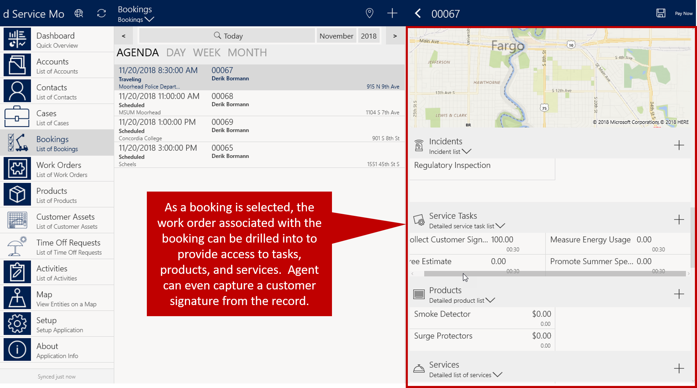

When you're working in the field, it is critical that to have all the information you need to complete the job at hand. In addition to a job summary, it's helpful to have:

- Scannable barcodes of items being serviced, or new items being installed.
- Links to product manuals of the items they are working in.
- Step-by-step directions.
- Barcode scanners for capturing item serial numbers.

Microsoft Dynamics 365 Field Service Mobile is designed with field agents in mind. You can easily view your schedule; browse customers, work orders, and bookings on a map; and use GPS information to get to customer locations.

You can use Field Service Mobile either offline or online. Your organization can determine which mode is available to which users, and when and how they can use each mode.

> [!VIDEO https://www.microsoft.com/videoplayer/embed/RE2Kewt]

### Navigating the Application

When you open Field Service Mobile, you'll see your home page. The home page provides access to everything you have permission to use, based on the mobile project's configuration.

Items displayed on the home page by default include

- **Dashboard:** Presents important information like active work orders, daily agenda, and time off requests
- **Accounts:** Displays a list of accounts that can be filtered for visibility offline
- **Contacts:** Displays a list of contacts that can be filtered for visibility offline
- **Bookings:** Displays an agenda view that shows your bookings. You can drill into the work order associated with each booking.
- **Work Orders:** Displays all active work orders and available data, and can be configured
- **Products:** Provides access to products from the product catalog
- **Customer Assets:** Displays a list of all customer assets
- **Time Off Requests:** Display the time off requests you've submitted. New time off requests can be created from here.
- **Activities:** Displays your active activities 
- **Map:**  Provides interactive access to accounts, booking, and work orders. The data can be filtered as needed.
- **Setup:** Provides access to configuration data for connecting to an environment and modifying application settings
- **About:** Provides information about the current version of the application

### Working with Bookings

When you select **Bookings**, an agenda view will display all of your active bookings. You'll see today's bookings by default, but you can use the arrows to go to bookings for other days. A filter provides the ability to work with different months and years if needed.

When you select a booking, you'll see details about the booking such as the current booking status, duration, and cost information. Items like miles traveled can be auto populated as you travel from one customer location to another.

You can drill into the work order associated with each booking. When you go to the work order, you'll have access to all the tasks, products, and services associated with the work order. You can create tasks and items as needed as you conduct the work order. Additional items, like capturing a customer signature, can be completed from the work order as well.

When you've completed the work, you can change the status of the booking and the work order will be updated to reflect the status. 

### Time Off Requests

Time off requests provide access to all the time off requests you've submitted. You can create new requests by clicking **New** in the upper right-hand corner.

### Map

When you select **Map**, you'll see your current location on an interactive map. By default, the map will display accounts, work orders, and bookings that are in the area where you're working. You can filter which items to display or search for a specific record.

These items represent the default configuration of the Field Service Mobile project template. Organizations can modify the mobile project to have those changes reflected in the mobile application.