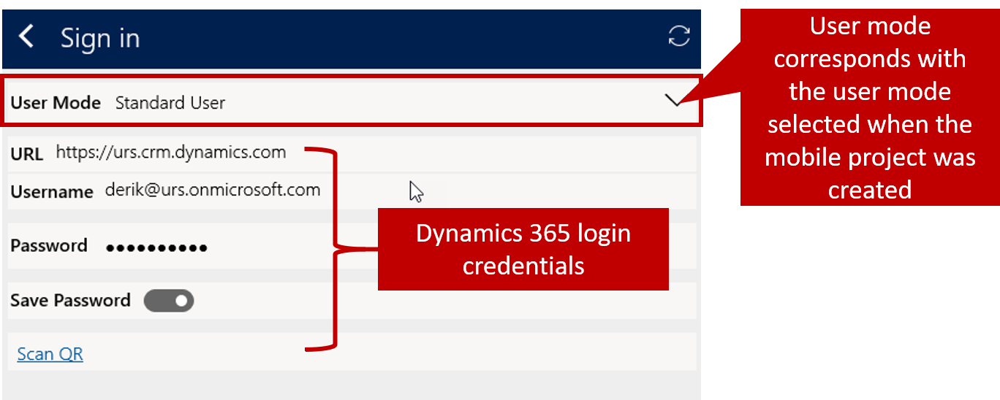

After installing the Resco Mobile CRM Woodford solution for Microsoft Dynamics 365 for Field Service, and publishing at least one Field Service Mobile project using the Mobile Project template, you can deploy Field Service Mobile to agents who will be using it in the field.

To deploy the mobile application to field agents, you must:

- Download it to devices used by field agents.
- Connect it to the Dynamics 365 instance where Field Service and the Woodford solution is installed.
- Provide login credentials for the agent who will be accessing the application.

### Finding the application

The Field Service mobile application is available for download from all major app stores, such as iTunes, Google Play, and Microsoft Store. When searching for the mobile application, be sure that you are getting the correct one. There are many different Dynamics and Field Service Mobile apps available, and it can be confusing which one to use.

Avoid these apps:

- **Resco Mobile CRM**
  - Field Service is not licensed to be used on the Resco Mobile CRM app.
- **Field Service Mobile (2016)**
  - This app was used with Dynamics 365 instances running Dynamics CRM 2016.
- **Field Service Mobile (2017)**
  - This app was used with Dynamics 365 instances prior to the December 2018 release.
- **FieldOne Sky**

Instead, download the **Field Service Mobile** app.

> [!VIDEO https://www.microsoft.com/videoplayer/embed/RE2KrsU]

### Configuring the mobile application

Before using Field Service Mobile, you will need to configure it to connect to the Field Service environment. You can modify item settings, such as network and appearance settings, in the setup area. Depending on how a mobile project is configured, settings might not be available for the user to configure. 

To connect Field Service Mobile to your organization's Dynamics 365 account, select the **Connect** icon next Dynamics 365. You will be prompted for the following information:

- **User Mode:** Enter the user mode selected when the mobile project was created. Most of the time it will be set to *Standard User*.
- **URL:** Enter the URL of the Field Service instance that you want to connect to. *The instance should have the Resco Woodford solution installed and deployed*.
- **Username:** Enter the username of the account to be used.
- **Password:** Enter your password.
- **Save Password:** Choose whether to save your password. *You might not be able to change this setting based on your configuration.*

After entering your credentials, select the **Reload** icon to connect and reload the application with your mobile project.

If you have previously connected the mobile application to a different organization, or if there are configuration changes on the server, you may be prompted to clear the local data stored on your device and replace it with updated data. To clear it, select **Delete Data**.