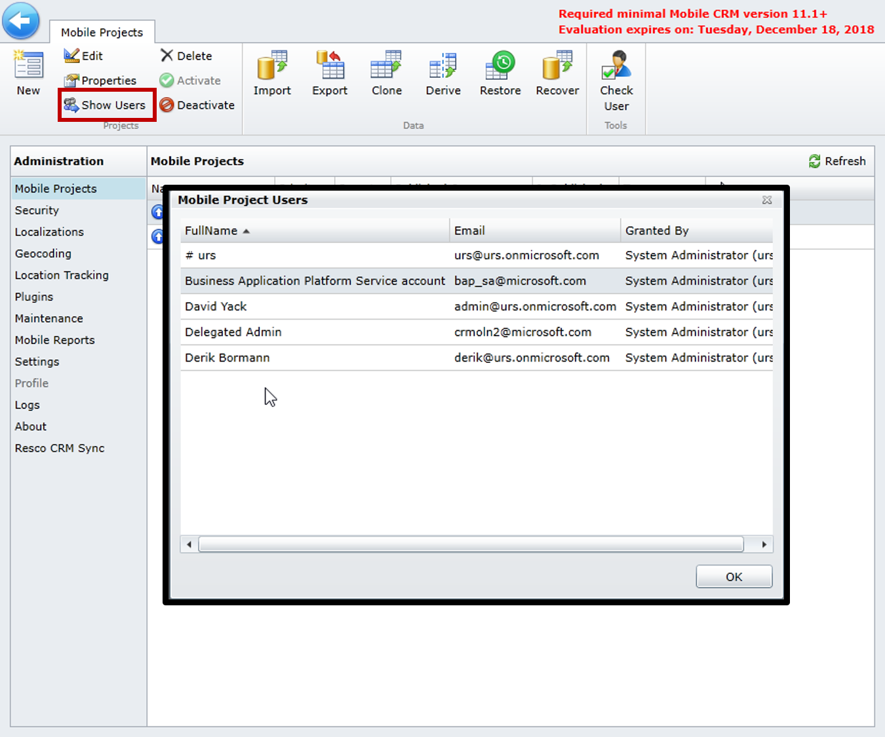

The Resco Woodford solution identifies a variety of use cases and treats them uniquely. For example, the solution may specify groups of technicians to have access to items, like customer assets or products. Or, it may limit specific groups of technicians from being able to accept work orders. Some technicians such as senior-level ones might have the ability to accept or decline the work orders they are assigned, while newer technicians might not be provided with that ability. By defining, creating, and deploying multiple mobile projects in Microsoft Dynamics 365 for Field Service, you can accommodate different use cases like these.

To get started creating mobile projects in Field Service, you'll use the [Mobile Project Template](https://docs.microsoft.com/dynamics365/customer-engagement/field-service/install-the-mobile-app). The template exposes the necessary entities that can be used in the application. 

After downloading a project, you'll import it as a mobile project. Select **Import**, and then select the **CentaurusStoreVersion.woodford** template that you previously downloaded.

When you import a project, you'll need to provide the following information:

- **Type:** Defines the type of user that will be accessing this project. Typically, you'll choose Standard, unless you have the need for external or anonymous users to have access.
- **Name:** Specifies the name of the project
- **Priority:** Defines a numeric priority for the project
- **Roles:** Defines the security roles that will have access to the project. The roles represent the Dynamics 365 security roles that exist in your organization.

> [!NOTE] 
> The first time you import a project into the application using the mobile project template, the project will automatically appear in the Mobile Projects list. It will be unpublished and will require publishing before agents can use it. If you import a second project using the same template, you'll be asked if you want to replace the existing project or create a new project. If you choose to create a new project, you'll define its type, name, priority, and roles. The new project will appear in the mobile project list, and, like the first project, it will need to be published before agents can use it.

If you forget to add a security role, or you want to change a mobile project name or priority after a project has been created, select the project, and then select **Properties**. This will open the same window that was used when the project was initially imported.

### Project Priority

Your organization can potentially have multiple projects defined in the application. However, each technician can have only one project loaded for their profile when they launch the application. To ensure that technicians are receiving the correct project, you can assign a priority number for each project. Projects with higher numbers are considered preferred projects and will be loaded over projects with lower numbers.

Let's say a field supervisor has two potential projects that could be loaded when they launch the mobile application.

- The first project is called Field Agents and it has a priority of 1.
- The second project is called Field Supervisors and second has a priority of 2.

Because the Field Supervisors project has a priority of 2, it will be loaded for the user when they launch the mobile application.

You should be aware of scenarios where an agent might have multiple projects assigned to them, and make sure that you assign priorities as needed.

> [!VIDEO https://www.microsoft.com/videoplayer/embed/RE2Kmlv]

### Security Roles

Each mobile project you create will need to have at least one Dynamics 365 security role associated with it. The security role identifies the level of access to the application. The security role is used with the priority level to load a specific project for a user.

To identify which users have access to a mobile project, select **Show Users**. A list of all users with access to the application and their security roles will appear.

### Editing Mobile Projects

You can make a variety of changes to Field Service Mobile based on the needs of your organization. These changes could range from simple changing of the application colors to reflect their organization branding, to more advanced scripting changes to automate specific pieces of functionality in the application.

To customize the application, select the mobile project you want to change, and then select **Edit**. This will open the Project Editor page. From here, you can make several customizations:

- **Home Page Modification:** By selecting the **Home** icon, you can change the specific elements that are presented to technicians on the Home page.
- **Dashboard:** You can edit the performance dashboard by adding  visual elements such as views and charts. You can also define the number of columns and rows on the dashboard.
- **Entity Modification:** You can control which Dynamics 365 entities are available in the application, and then modify their elements. These entities include:
  - **Entity Settings**: Define the permissions that users of the mobile application will have to the entity such as read, write, create and delete.
    - Define whether the entity can be used offline, online, or both
    - Define synchronization settings for an entity.
            
> [!IMPORTANT]
> Not all entities can be enabled for the mobile application. The field service licensing only allows the ability to use field service related entities and up to 10 custom entities. Sales-related entities such as leads and opportunities are not included in the license agreement.

For more about entity customizations, refer to the [Resco 4.2 Entity](https://www.resco.net/woodford-user-guide/#_Toc426143547) page.

- **Fields:** Define which dynamics 365 fields are available to be used in the mobile application. Additionally, each field has specific formatting options available.
    - For example, a text field that is going to store UPC codes or serial numbers could be formatted as a bar code to leverage a bar code scanner to populate the data in the field.
    - 
For more about field customizations, refer to the [Resco 3.8 Mobile Reports](https://www.resco.net/woodford-user-guide/#_Toc483815895) page.
- **Forms:** Create, edit, and delete specific forms that are available for the entity.
    - Forms can be customized to include items like images, signature lines, related items, and other visual elements.
    - Form scripting can be added to validate and automate elements

   For more about form creation and customization, refer to the [Resco 4.5 Form Creation](https://www.resco.net/woodford-user-guide/#__RefHeading__5837_1627906509) page.
    - **Views:** Create, edit, and delete views associated with the entity. This could include views that are used in related forms and entity views.
   For more about view customizations, refer to the [Resco 4.4 Views](https://www.resco.net/woodford-user-guide/#__RefHeading__5821_1627906509) page.
    - **Color theme:** Provides the ability to brand the application to fit the needs of the organization.

As you make changes to elements like the Home page, dashboards, and forms, you'll need to save your changes before you exit each element. For example, if you have added some fields to an entity in, you need to save your changes before you can add those fields to views and forms using the designer. The application will warn you if you for get to save your changes.

After you have defined the necessary customizations, you'll need to publish the application before it will be available for users to consume.

For more about customization capabilities, refer to the [Resco Support Guide for Woodford](https://www.resco.net/support/guides/woodford/).