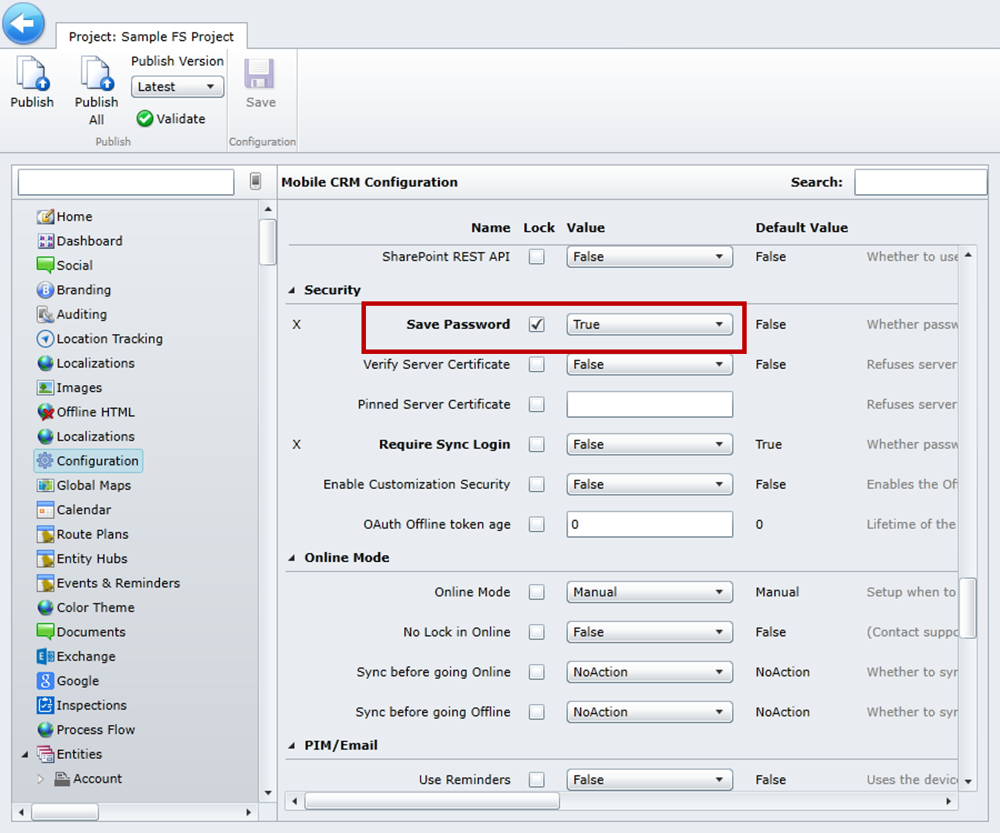

After making the necessary customizations to a project, you'll need to publish it before those changes are reflected in the mobile application.

### Project Settings Configuration

Before publishing a project, consider making configuration changes to the application. For example, you might want to change the default Save Password setting, which does not save a user's password information. This means that anytime a user navigates away from the app, they will be prompted for their password.

>[!VIDEO https://www.microsoft.com/videoplayer/embed/RE2Kmlu]

Options available for configuration include:

- **Configure the User Experience:** User experience settings, such as form presentation, map or dashboard display, and barcode settings
- **Data Settings:**  Data-related settings, such as maximum attachment upload size, image format, and database encryption
- **Synchronization Settings:** Data syncing settings, such as sync filters, max records, and auto sync
- **Security:** Security settings for the project, such as saving passwords
- **Online Mode:** Settings for working online and offline, including sync settings

> [!Note]
> By default, these settings are not configured in a mobile project, with the exception of Save Password, which is set to *False*. You can set it to *True* to automatically save a user's password, or you can choose not to configure it and provide the user with the ability to define the password settings on their device.

### Publishing a Project

Before you publish a project, verify that you are publishing to the same version of the solution that is deployed to your environment, as well as a compatible version for the version of mobile application that is being
used. To do so:

- **Locate the solution version in Dynamics 365:** In Dynamics 365, select **Settings** \> **Solutions** and view the version number of the Woodford solution.
- **Locate the mobile version number:** In the mobile application, select **About**, and then view the version number.

If you publish to a higher version than the version being used on the mobile app, you'll likely get a metadata error when you load the application.

> [!Note]
> If you don't see your changes applied in the mobile application, verify that the security role you are a member of has the appropriate permissions.
