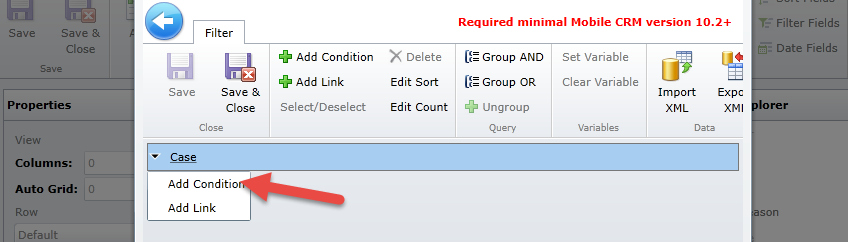
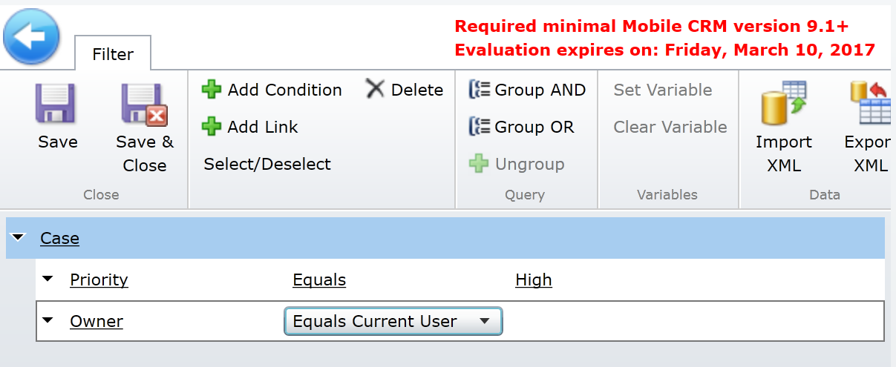

The labs and exercises in this module work best when you have sample data to work with. Microsoft Dynamics 365 provides the ability to add sample data as needed. If your working environment does not have sample data installed, follow the steps below to install a set.

The labs and exercises in this module work best when you have sample data to work with. If your environment does not include sample data, see the [Sample data installation for the Field Service application](https://docs.microsoft.com/en-us/dynamics365/customer-engagement/field-service/install-sample-data-8-x) page.

### Download and install the Mobile Field Service mobile solution

Before you begin,  you'll need administrator permissions to install the Resco Mobile CRM Woodford solution. You'll also need to use Internet Explorer with Silverlight or Firefox.

1.  Go to the [Resco Woodford page](https://www.resco.net/mobilecrm/woodford.html) and download the Woodford mobile solution from the Resco site to your computer. Make sure that you download and install the solution that works with the version of the Field Service Mobile application you are running.

> [!Note]
> The solution includes an editor that can be launched from Dynamics 365. It's recommended that you download the standalone desktop editor, which can be executed from your desktop and is not dependent on any other technology.

2. Locate the Standalone Application section, and select **Install**.
3. Switch to your Dynamics 365 instance where Field Service is installed.
4. Select **Settings** > **Solutions**.
5. In the **Solutions** area, select **Import**.
6. Locate and select the **Woodford** solution you downloaded earlier, select **Next**, and then select **Import**.
7. After the solution is imported, you should see the **Woodford** solution listed on the **Settings** menu. To verify this, go to **Settings**, and then select **Woodford**. If you don't see **Woodford** under the **Settings** menu, refresh the page.

8. Locate the standalone editor that you downloaded. If the standalone application is not started, launch the application.
9. If prompted to increase the quota, set the quota to 100MB, and then select **OK**.
10. In the **Update available** dialog box, when you're prompted about an available update, select **Later**. 

> [!IMPORTANT]
> Do not update even if one is available.

11. If prompted to install Silverlight, right-click the app, and select **Install**.
12. Provide your credentials and select **OK**.

### Import the Field Service mobile project template into the Woodford solution

After installing the Woodford solution, you'll need to download a template that will help you configure Field Service Mobile. You'll use it to add, remove, and change fields, entities, views, and forms.

1. Download and save the template file.
    - If you are on December 2016 update for Microsoft Dynamics 365 (online), use this [mobile project template](https://go.microsoft.com/fwlink/p/?linkid=836310).
    - If you are on Microsoft Dynamics 365, use this [mobile project template](http://go.microsoft.com/fwlink/p/?LinkId=808250).
2. Open the editor, select **Import**, and then import the mobile project template file.

3. In the Add Mobile Project dialog box:
    - For **Type**, select **Standard User**.
    - Name the template.
    - Set the **Priority** to *10*.

4. For **Roles**, select the roles you want this template to apply to, and then select **OK**. A user who signs in and has a role that matches the role you select here, will inherit this configuration on their mobile app.

5. To publish the template file, on the **Mobile Project** tab, select **Edit**, and then select **OK**.
6. On the next page, select **Publish All.**

### Customize Field Service Mobile

Now that you have created your environment, it's time to start customizing the application. First, you'll customize the Home page:

1. In the Woodford customization application, select the **Home** button.
2. Select and drag the **Case** entity from the available item list and place it under **Product** in the **Home** section.
3. Select **Save**.
4. Go to **Color Theme**, and select **Title Background** in the **Theme** section.
5. Select a color, and then select **Done**.
6. Select **TabBackground**, select a color, and then select **Done**.

7. Select **Save**.
8. On the left side of the application, locate the select the **Case** entity.
9. Expand the **Case** entity and select **Fields**.
10. Select the following fields:
   - Entitlement
   - Parent Case
   - Serial Number
   - Service Level
11. Select **Save**.
12. On the **Case** entity, select **Views**, then select **Clone**.
13. Enter High Priority Cases for the name, and select **OK**.
14. Select **Edit Filter**.
15. Expand the **Case** entity, and choose **Add Condition**.

16. Set the **Condition** to **Priority** > **Equals** > **High**.
17. Select **Case** again, and add another condition.
18. Set the **Condition** to **Owner** > **Equals Current User**.

19. Select **Save and Close**.
20. Select the **Customer** field under Case Title.
21. In the command bar, select the **Buttons** icon.
22. Under **Available Commands**, select **Email**, and then select **Add**.
23. Select **Save and Close** to save the view.
24. Under **Case**, select **Forms**.
26. Select **Edit**.
27. Drag the **Serial Number** field below **Status Reason**.
28. Select **Save and Close**.
29. Select **Validate**.
30. Select **Publish All**.
31. Open Field Service Mobile and verify that your changes have been applied.