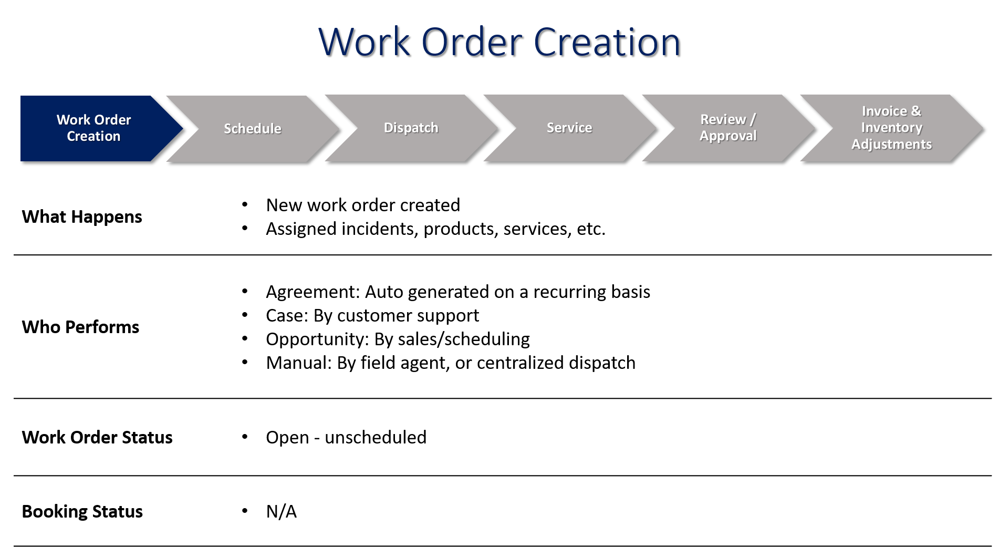
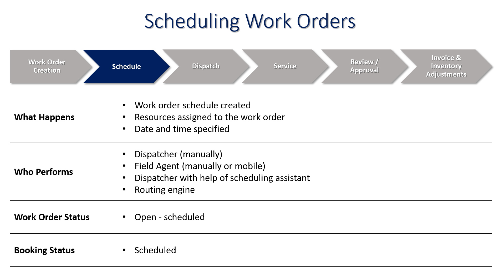
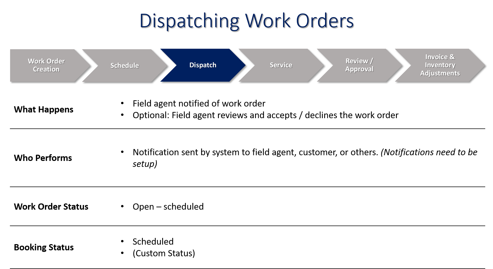
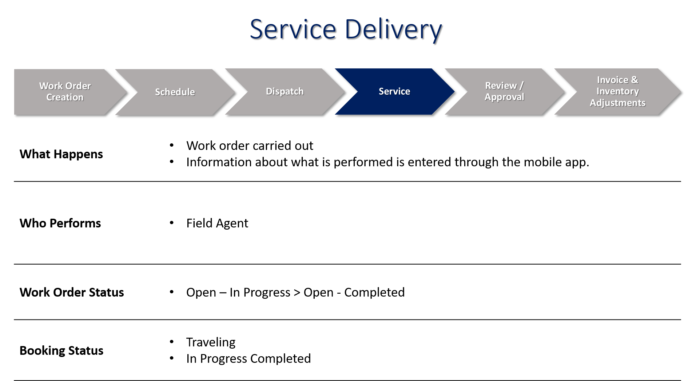
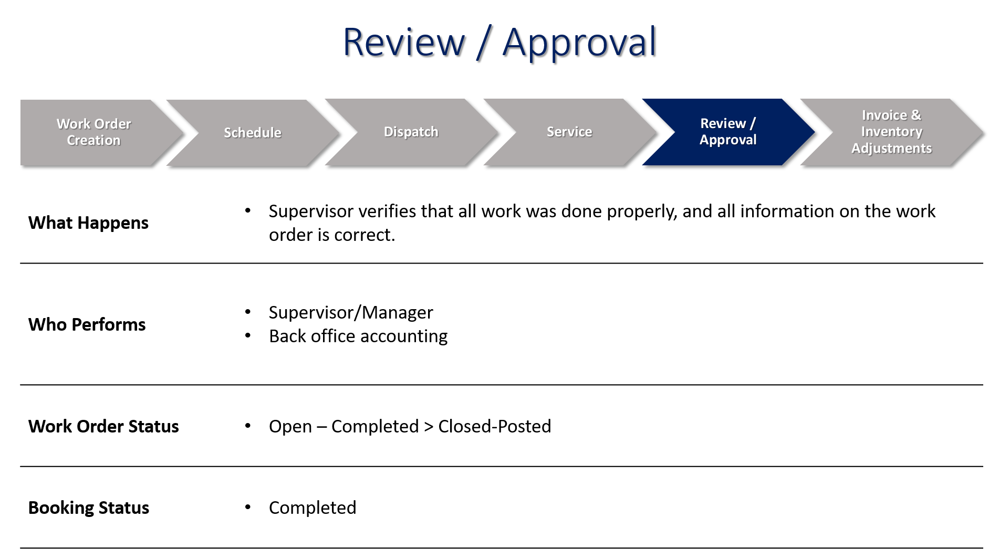
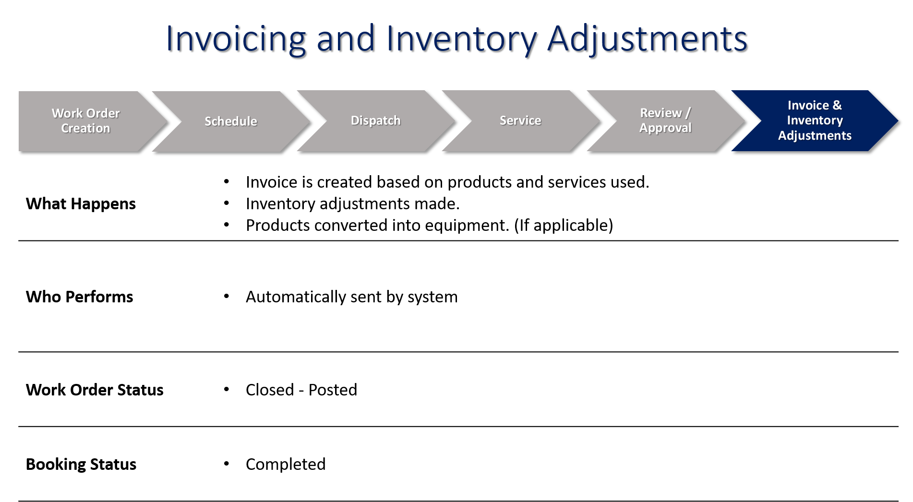

What is a work order? A work order is a task or a job that can be scheduled or assigned to someone. A typical work order may include information such as products and services, type of work, tasks to be executed, and other information specific to the incident.

Examples of work orders include:
- A furnace to be repaired.
- An internal request for a new piece of equipment to be installed.
- A follow up to an inspection or audit.
- The dispatch of a technician based on an alert generated by an Internet of Things (IoT) device.

In Microsoft Dynamics 365 for Field Service, a work order includes specific information on what work needs to be done. A typical Field Service work order includes:
- Location and billing information.
- The type of work to be completed, such as installation, repair, or preventive maintenance.
- The products and services included.
- Specific tasks for the field agent to execute.
- Date and time information.

Work orders can be created by converting an existing case or opportunity, or they can be autogenerated based on a schedule associated with a maintenance contract. Work orders have statuses associated with them that help define their current scheduling. As work orders are scheduled and addressed by technicians, statuses are updated accordingly.

Typically, a work order will go through six stages:

Let's examine each stage more closely.

**Work Order Creation**

**Work Order Scheduling**

**Work Order Dispatch**

**Service Delivery of Work Orders**

**Review and Approval of Work**

**Invoice and Inventory**
