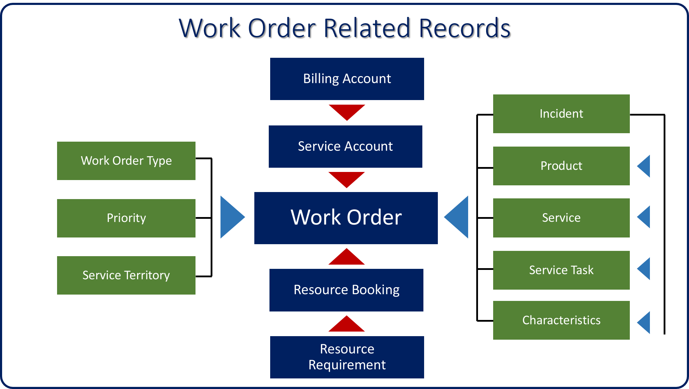
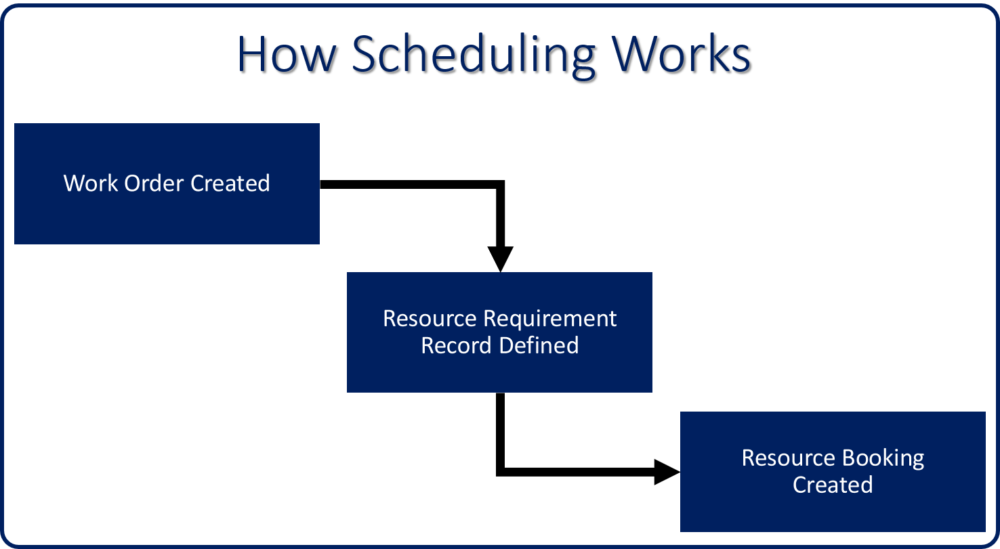
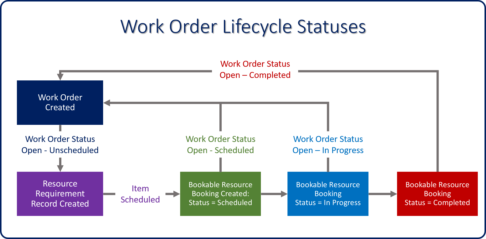

A work order in Microsoft Dynamics for Field Service has relationships with multiple records. This helps ensure that the work order is executed correctly, assists in its scheduling, and provides detailed information about the specific products and services involved. Typically, work order records are related in the following way:

### Account relationships

Work orders in Field Service are always associated with an account
record. When you create a work order, you'll need to define the account it's associated with.

There are two places where accounts are defined on the work order:

-   **Service Account**: Defines the account for which the  work is taking place
	-   Address information from the service account is added to the work order and is used to assist in scheduling the item. 
-   **Billing Account**: Defines the account record that is responsible for paying, and where the invoice will be sent
    -   The billing account for a work order will default to the service account unless a billing account has been defined on the account record for the service account.
    -   The billing account can be overwritten at any time.

### Work order types, priorities, and service territories

You can provide additional information to assist in reporting and scheduling. To do so, define items like the type of work, priority of the work order, and the service territory.

-   **Work Order Types**: Used to categorize work orders by type. You'll typically define work order types by kind of work performed for customers. Examples of work order types are: installs, repairs, preventative maintenance, and break fix.
-   **Priority**: Rates the importance of the work order. Organizations can define priority levels, which are used along with work order types to determine scheduling priority. For example, work orders with a type of *preventative maintenance* might have a priority of *1*, and a *break fix* type might have a priority of *5*.
-   **Service Territory**: Used to organize work orders and resources by geographical area. Accounts can be assigned to a service territory.
	-   When work orders are created for an account, the service territory will automatically be entered on the work order. Resources associated with a territory can then be scheduled to work on orders in that territory.

### Working with incidents

Incidents are templates that can be used to populate items like tasks, products, and service definitions on issues that are commonly worked on by field agents. When an incident is selected for a work order, it will automatically populate any products, services, and tasks that have been defined for it. For example, let's say that a company services MRI equipment, and technicians are regularly dispatched to conduct MRI inspections.

An inspection might contain the following:

-   Products
    -   One lithium battery
    -   Two gradient coils
-   Services
    -   MRI sanitation
-   Tasks
    -   Measure energy usage: 30 minutes
    -   Replace battery: 15 minutes
    -   Replace gradient coils: 30 minutes
    -   Collect customer signature: 15 minutes

If 90 percent of the MRI inspections in your organization contain this information, you might create an incident type called *MRI inspections*. This would simplify the process by automatically adding this set of items to a work order, so you don't have to manually add each item every time.

When you select **Define a primary incident type** for a work order, the following information is populated automatically:

-   **Default Work Order Type:** Specifies the type of work order to be executed, like *inspection*, *break fix*, *preventative maintenance*, etc.
-   **Skill / Characteristics:** Defines any skills or certifications required of a resource to work on this type of item.
  
-   **Tasks to be performed:** Provides the field agent with a list of tasks to perform for the work order, and the duration of each task. The total time for all tasks added is rolled-up to the work order and will populate the *Estimated Duration* field on the work order.

-   **Required Products:** Defines each product, including the quantity  needed for a work order.
-  **Required Services:** Defines each service that will be conducted as part of the work order.
   
Incidents are a great way of auto-populating the information listed above, but any of those items can be manually added at any time. Also, additional incidents can be added to existing work orders. When additional incidents are added, all the items defined for the incident are added as well.

### Service preferences

Service preferences can be defined for each work order. These provide guidance when an item is being scheduled manually, by using the schedule assistant, or through resource scheduling optimization. Some preferences can be auto-populated based on information stored in the service account. Others can be defined on the work order itself. Any preferences defined will be added to the resource requirement that is created for the work order. Preferences that can be defined include:

-   **Time for Promised / Time to Promised**: Defines the time window that a customer was promised a technician would arrive to resolve an incident. Time promised windows take higher priority over all other date-and-time preferences.
-   **Date Window Start / Date Window End**: Provides a date range that the customer would like someone to work on an incident
-   **Time Window Start / Time Window End**: Provides a time range that the customer would like someone to work on an incident
-   **Fulfillment Preference**: Provides additional scheduling options

As work orders are created, another record called a *resource requirement record* is created. The resource requirement record is used to assist in the scheduling process.

There are three record types that are used to schedule a work order: 
-   Work Order
-   Resource Requirement
-   Bookable Resource Booking

The image below provides a high-level overview of how scheduling works.

When a work order is created, it will typically include:

-   The work order type, priority, and location.
-   Tasks, products, services, and resource skills required.
-   Preferences for service delivery like time windows, preferred technician, etc.

After you create a work order, a resource requirement record is automatically generated. This record is used to schedule the work order in the system. It specifies everything required to schedule a resource for the work order.

A resource requirement for a work order includes:

-   The customer and duration pulled from the work order.
-   Any date and time windows, or resource preferences.
-   Additional relevant scheduling information like skills, and territories.

After a resource requirement is scheduled, a *bookable resource booking record* is created that provides the details about the resource responsible for completing the item. It also contains additional details like estimated and actual arrival times, and the status of the booking.

A bookable resource booking record for a resource requirement includes:

-   The name of the resource responsible for completing the work order.
-   The time and status information for both estimated and actual values.
-   Travel information like miles and duration.

The bookable resource booking record uses booking statuses to communicate the current state of the booking. For example, it might communicate that the field agent is traveling to the work order location, has arrived, and is now working on the order. As the booking statuses are updated by field agents, those statuses are reflected on the work order in the *Work Order Status* field.

### Work order status

Each work order will have a status that defines the current state of the work order. The status lets individuals know where the work order is at in its life cycle.

The available work order statuses are:

-   **Open—Unscheduled:** The work order has been created but has not yet been scheduled in the system.
-   **Open—Scheduled:** The work order has been scheduled, and a resource has been assigned responsibility for completing the work.
-   **Open—In Progress:** A field agent is actively working on the item.
-   **Open—Completed:** The work has been completed, and the work order might be waiting for final sign off to ensure that everything was done correctly.
-   **Closed—Posted:** The work order is closed, and billing can take place.
-   **Closed—Canceled:** The work on the item was not completed, and it was canceled.

As the work order is scheduled and a bookable resource booking created, changes to the booking's status will be reflected in the work order.

The image below illustrates this process:

For more info on work order related records, refer to this video:
	
> [!VIDEO https://www.microsoft.com/videoplayer/embed/RE2Kmly]
