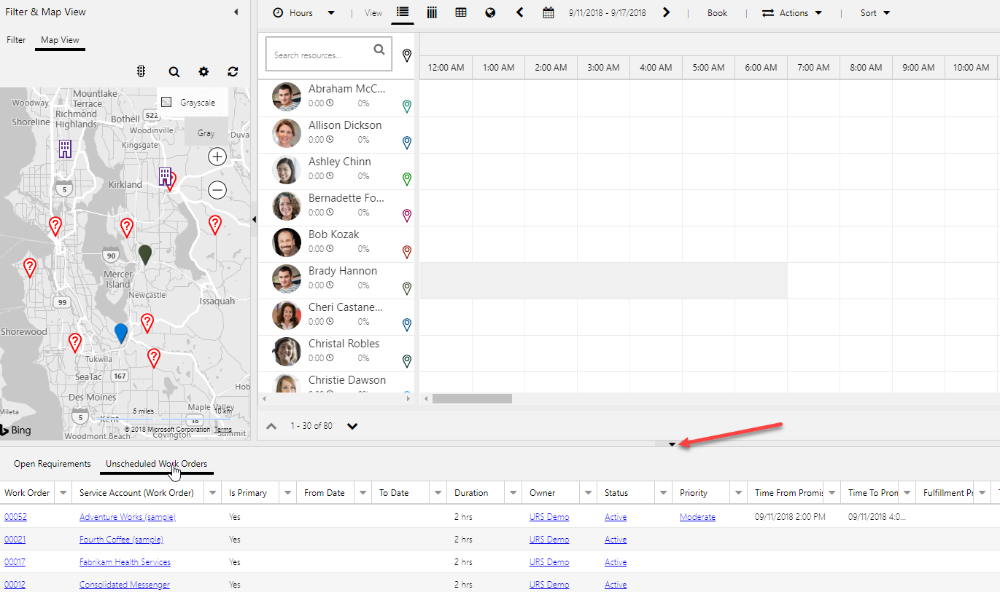
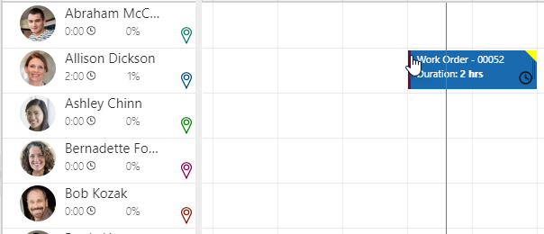
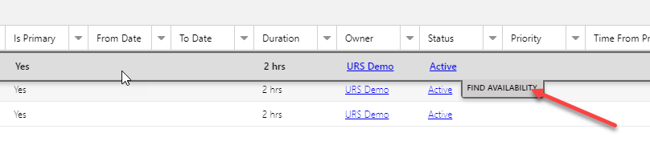
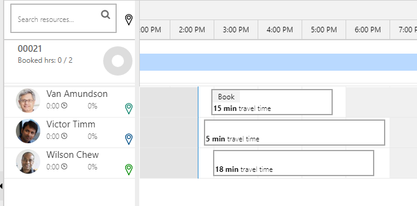
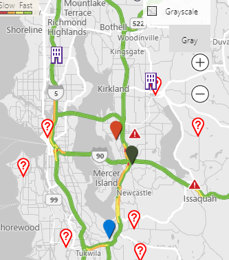

Microsoft Dynamics 365 for Field Service allows your organization to service its customers and adapt to their specific needs. But before you can use Field Service, you'll need to configure it.

The purpose of this hands-on lab is to introduce you to creating and scheduling work orders with Dynamics 365 Field Service.

### Learning objectives

At the end of these exercises, you'll be able to:
-   Create work orders
-   Schedule work orders

Estimated time to complete this lab: 30—45 minutes

The labs and exercises in this module work best when you have sample data to work with. Depending on your environment, you might want to install a set to assist with exercises. Dynamics 365 provides the ability to add sample data as needed. If the environment you are working in does not have a set installed, follow the steps below.

The labs and exercises in this module work best when you have sample data to work with. If your environment does not include sample data, see the [Sample data installation for the Field Service application](https://docs.microsoft.com/en-us/dynamics365/customer-engagement/field-service/install-sample-data-8-x) page.

### Create a work order using an incident type

Out of the box, Dynamics 365 for Field Service has the work order entity enabled for use with the resource scheduling feature. In this task, you'll create a new work order that you can schedule using the application.

1.  In **Dynamics 365**, select the arrow next to the **Dynamics 365** text, and then select **Field Service**.
2.  Select the **Site Map** icon to expand it. On the menu that appears select **work orders**.
3.  Select **New**.
4.  Configure the work order as follows:
    -   **Service Account:** *Adventure Works (Sample)*
    -   **Work Order Type:** *Inspection*
    -   **Taxable:** *No*
    -   **Primary Incident Type:** *MRI* *Inspection*

5.  Select the Settings tab, and configure settings as follows:
    -   **Priority:** *Moderate*
    -   **Service Territory:** *WA*
    -   **Time from Promised:** *Today @ 1:00 PM*
    -   **Time to Promised:** *Today @ 3:00 PM*
6.  Save and close the work order.

> [!NOTE] 
> The reason you select *MRI Inspection* for the incident type is because incident types are used in Field Service to assist in pre-population of data when a work order is created. The *MRI Inspection*  incident type was created previously and has several service tasks, products, services, and characteristics associated with it.

When a work order is created that uses the *MRI Inspection*  incident type, this information is auto-populated to the work order.

> [!Important]
> A Dynamics 365 workflow populates this information for you when the record is saved. It can take several minutes for this to populate.

1.  Locate and open the work order for **Woodgrove Medical Systems**.
2.  Select the **Product** tab. (Notice that several products have been added to the work order. These you have associated with the *MRI Inspection* incident type used with this work order.)
3.  Select the **Services** tab. (Notice the services that are added.)
4.  Select the **Service Tasks** tab. (Here you'll find tasks that a technician must accomplish when working on the work order.)

### Schedule the work order by using the Schedule Board

Field Service provides several items that can be used to assist in scheduling resources for specific items. The two primary components that are used are the Schedule Board and the Schedule Assistant. The Schedule Board provides the ability to manually schedule items, and the Schedule Assistant offers suggestions on resources based on location, skills, and availability. In this task you'll examine how to use the Schedule Board to schedule items at a high level.

1.  Select the **Site Map** icon to expand it. On the menu that appears, select **Schedule Board**.
2.  The Schedule Board provides several options that can be used to schedule items, like a filter, and a Map view.
3.  Expand the **Booking Requirements** pane.

4.  Select **Unscheduled work orders**.
5.  Locate  and select the work order for **Adventure Works (Sample)** that you created in a previous task, and drag it to Allison Dickson on the Schedule Board. Notice that it the text will appear red until you find a time that falls within the time window promised.

6.  Release the mouse button and the item will be placed on the schedule board.

7.  Locate and select the work order for **Fourth Coffee (Sample)** under **Unscheduled work orders.**  Select **Find Availability**.

- Dynamics 365 will analyze the requirements needed for this item and will factor in other items like any skills required, work order & resource locations, and resource availability to create a list of suggested resources that would be able to work on this item.

8.  As you hover over the available time block for **Van Amundson**, a Book icon will appear. Select the **Book** icon to schedule Van for this work order.
9. Select the **Exit Search** icon to return to the Schedule Board.

### Working with the Map view

Another way that items can be scheduled is by using the Map view on the Schedule Board. When you select the Map view, resources will be color coded. Any unscheduled items will appear on the map with a question mark. You can schedule these items by dragging them to the resource that you want to assign them to.

As you start assigning items to resources, the item will change to the color of the resource selected. Additionally, the map will begin to plot a route for the resource based on the location of the work orders assigned to them.

Additional items like traffic and road maps can be overlaid on the map to assist in scheduling.

1.  On the Schedule Board, select the **Map View**.

2.  To see Traffic, select **Show Traffic**.

3.  Locate an item on the map that is unscheduled. Drag the item to an open time slot on Allison Dickson's schedule right before the work order you scheduled for her previously.
