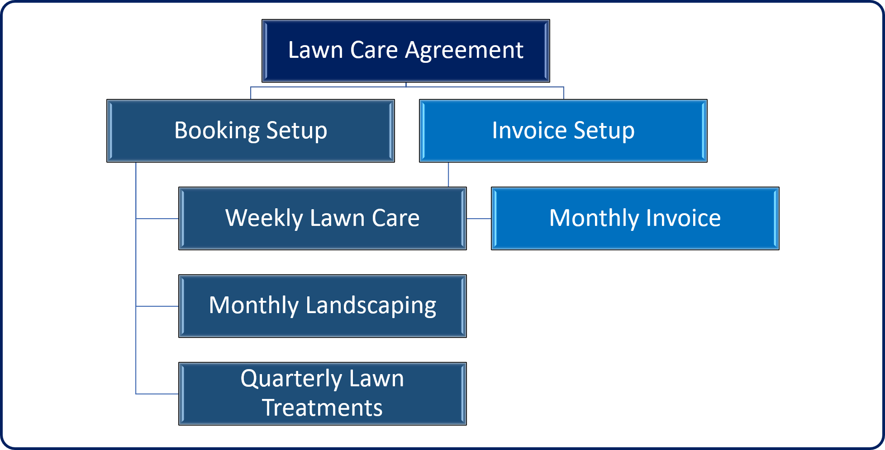
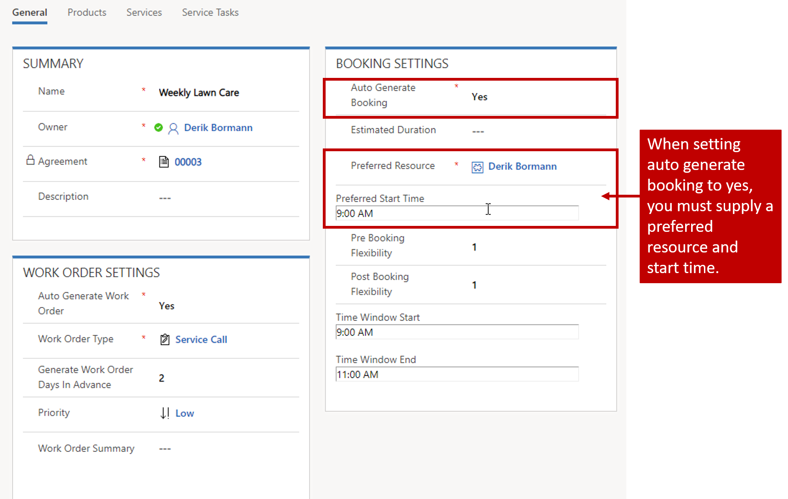
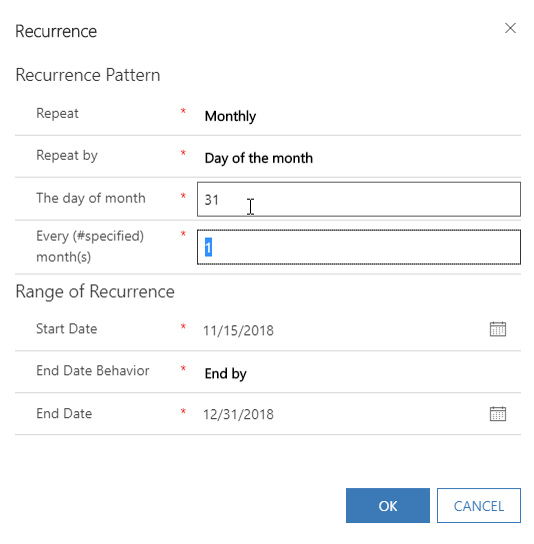

Many organizations enter into maintenance agreements with their customers. Generally, they provide customers with regularly scheduled service at predefined intervals. For example, a landscaping company might offer year-round services to their customers:

-   **Summer, summer, and fall**:
    -   Provide weekly lawn care like mowing grass and removing leaves and debris.
    -   Provide monthly landscaping like hedge pruning and tree trimming.
    -   Once every three months, provide lawn treatments, like spraying for pests and weeds.

-   **Winter**:
    -   Provide snow removal services as needed.

The landscaping company might charge their customer a flat fee for all services that are billed monthly. To ensure that they are meeting the expectations of their customers, they might want the work orders for those recurring items to be automatically created at service time. Because they can't know when a snow event is going to take place, they still want the flexibility to create those work orders as needed.

Dynamics 365 for Field Service allows organizations to deliver this type of service to their customer through what are called agreements. At its core, an agreement is a framework for automatically generating work orders and invoices at predefined intervals. A single agreement can have multiple booking and invoice setups defined that will generate work orders and invoices on a defined schedule.

Agreements are useful when you need to generate work orders, bookings, and invoices on a predictable and repeatable schedule like:

-   Monthly inspection for two years.
-   Quarterly maintenance for one year.
-   Invoice monthly on the 1st of the month for the next year.

Agreements are not an ideal solution when the schedule is not consistent
like:

-   Schedule every three months, skip a month, and then continue.
-   Invoice sometimes once a month, other times every other month.
-   You need more detailed tracking information on resources, equipment, tool, etc.

The image below illustrates an example:

### Defining agreements

Agreements can be defined in Field Service under service delivery. When an agreement is created, you'll need to define the following:
-   **Service and Billing Accounts**: Like work orders, these define the account the services will be provided for, and the account that is financially responsible for paying the bill.
-   **Start & End Date**: Defines the service period associated with the agreement, and when items will start being generated
-   **System Status**: Defines the status of the agreement. Agreements have the following statuses available:
    -   **Estimate**: Defines an agreement that is not currently being executed. All agreements will start in an estimate status. Work orders are not generated when an agreement is in estimate status.
    -   **Active**: Defines an agreement that is currently being executed and is actively generating work orders on the defined schedule.
    -   **Expired**: Defines that the agreement has reached its end date and work orders are no longer being generated.
    -   **Canceled**: Indicates that the agreement has been canceled.
-   **Sub-Status**: Provides additional information about the status of the agreement. For example, a sub-status of waiting for a customer signature could be added for agreements that have a status of estimate.
-   **Price List**: Defines the price list that is associated with the agreement. Work orders generated from the agreement will use this price list.
    -   It is important to add all products and services that will be used during the agreement to the agreement price list. Agreements usually contain a negotiated price for goods and services that are usually reflected in an entirely new price list.
-   **Service Territory**: Defines the service territory that is associated with the agreement
-   **Taxable**: Specifies whether work orders generated by this agreement are taxable

### Booking setups

Once you've saved an agreement for the first time, you can add booking setups that will define how and when specific work orders get generated. In the landscaping example, there would be three specific booking setups defined to generate work orders for each of the scenarios required. Booking setups are defined by selecting **Add Booking Setup** on the booking setup sub-grid on the agreement form.

You'll need to define a name for the booking. The name will be populated as the work order name for work orders created from the agreement. Additionally, you can define settings specific to the work order and bookings created by this setup item.

### Work order settings

One of the main advantages to defining agreements is the ability to auto-generate work orders. The work order settings section allows you to define specifics about the work orders that are generated like the following:

-   **Auto Generate Work Order**: Specify whether the booking setup should automatically generate a work order. 
    -   **Generate Work Order Days in Advance**: Specify how many days in advance to generate the work order. For example, if the work order is needed on the first day of the month, you might want to generate the work order three days in advance to ensure that a dispatcher can get it on the schedule.

> [!IMPORTANT] 
> Be careful not to overlap work orders. For example, if you are generating a weekly work order 5 days in advance, you could potentially overlap on the work orders.

-   **Work Order Type**: Define the type of work order that will be generated.

### Booking settings

The booking settings section allows you to create and schedule a booking when the work order is created. Generating the bookings automatically works well when a customer would prefer a specific resource at relatively the same time. If you won't be scheduling the same resource for each item, you should either have a dispatcher schedule it manually or use a resource scheduling optimization.

-   **Auto Generate Booking**: Specify whether you want the setup to automatically create and schedule a booking for a work order.

-   **Estimated Duration**: Define how long the booking is expected to take.
-   **Preferred Resource**: Specify the resource that should be scheduled for this booking. This is required if you choose to auto-generate the booking.
-   **Preferred Start Time**: Specifies the preferred time that this item should be scheduled for. This is required if you choose to auto-generate the booking.
-   **Pre and Post Booking Flexibility**: Allows you to define how many days before or after the target date is acceptable. 
-   **Time Window Start and End**: Allows you specify a time window that it should be targeted for on the day it is scheduled.

### Defining a recurrence pattern

Make sure to define the schedule for the booking setup, and how it should generate the items configured. Select **Booking Recurrence** on the command bar, and then define:

-   **Recurrence Pattern**: Define how often the item should be done. You can specify daily, weekly, monthly, or yearly. Depending on what is specified, different options will be presented.
-   **Range of Recurrence**: Specify the time frame for the pattern. It defaults to the dates specified on the agreement, but it can be set to any range you prefer.

The image below shows an example of a monthly recurrence pattern.

> [!Note] 
> For months that have less than 31 days, it will automatically trigger on the last day of that month.

### Adding incidents

Like other work orders in the system, items that are created by agreements will likely have incidents associated with them that will pre-populate work order products, services, and tasks. You can add multiple incidents  to an agreement. The additions will be a combination of all items defined. Incidents can be added from the Incidents sub-grid on the agreement.

### Defining invoices

Adding invoices to an agreement is very similar to defining booking setups. The primary difference is that you are defining the specific products you want to include on the invoice. Generating invoices with agreements is ideal when you want to bill for the same item on a predefined schedule. You can set up invoices using the Invoice Setup sub-grid. Each invoice requires a name.

After you save the invoice, you'll define the products to include on it. Add invoice products on the Invoice Products tab. When you specify invoice products, you can define the following:

-   **General**
    -   **Product**: Specify a product from the catalog you want to include on the invoice.

> [!IMPORTANT]
> You can only create invoice products for products with either an *inventory*  or *non-inventory* type.

    -   **Unit**: Specify the unit that will be used for product pricing.
    -   **Price List**: Specify the price list that will be used for the product. By default, it will use the agreement's price list.

-   **Quantity & Sale Amount**:
    -   **Quantity**: Define the number of items for each product to include.
    -   **Unit Amount**: Specify the price per unit.

Once all the products for the invoice have been defined, you can specify the recurrence pattern for the invoice just like you did for the booking setup.

### Activating the agreement

Once you have defined all the necessary booking setups and invoices, you'll change the system status to activate the agreement. Once the start date of the agreement has been reached, it will begin to generate the defined items using the scheduled defined for each.

For more info on working with agreements, refer to this video:

> [!VIDEO https://www.microsoft.com/en-us/videoplayer/embed/RE2KjKv]