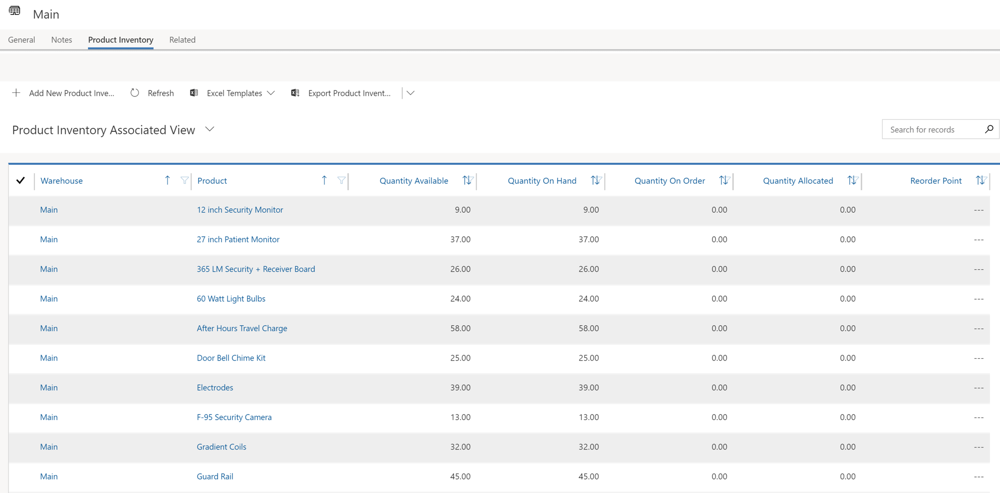
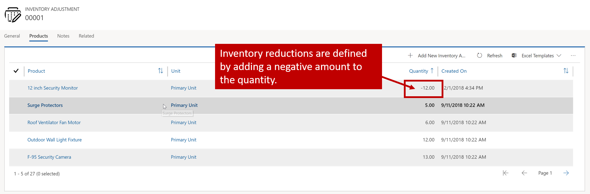
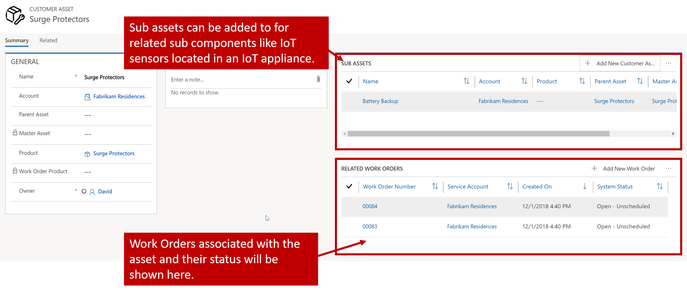

Managing and understand inventory levels is important when using Microsoft Dynamics 365 for Field Service. Being able to understand what you currently have on hand, on order, and committed to jobs, helps your organization better plan and ensure that field agents have the supplies they need.

### Working with warehouses

Dynamics 365 uses warehouses to manage what they have on hand to ensure that field agents have what they need. A *warehouse* represents a place where inventory is stored. Most people think of warehouses as buildings where organizations keep inventory before it's ready to be consumed, but warehouses can also represent items like trucks.

For example, let's say that you work for a heating and air conditioning company. You have multiple field agents whom are regularly dispatched to install customer equipment and service existing products. Your organization might have a central warehouse that holds all the new equipment before it's installed, as well as parts for servicing existing equipment. One of your existing fields agents regularly takes service truck 1 on his calls. By defining service truck 1 as a warehouse, inventory that John needs to complete his daily service calls can be transferred from the central warehouse to service truck 1.

By defining warehouses in this manner, organization always know where everything is. Managing and understanding inventory levels is important when using Field Service. Being able to understand what you have on hand, on order, and what is currently committed to jobs, helps organizations better plan and ensure that field agents have available what they need for specific jobs as they come up.

You can define warehouses in the Field Service app by selecting the ellipsis (...), and selecting **Field Service Settings**. Warehouses are located under **Inventory and Purchasing** settings. You just need to supply a name for the warehouse.

For more about warehouses, see [Create a warehouse to track inventory (Field Service)](https://docs.microsoft.com/dynamics365/customer-engagement/field-service/create-warehouse).

### Working with product inventory

You can monitor inventory levels for specific warehouses from within the warehouse record. To see inventory levels, select the **Related** tab, and select **Product Inventory**. The product inventory grid will show all items associated with that warehouse. Each inventory line will display:

-   The name of each product stored in the warehouse.

-   The available product quantity.

-   The amount of product on hand.

-   The amount of product on order.

-   The current amount of product that is allocated to items like work orders.

-   The reorder point for each product.

Additional products can be added manually by importing them, or through integration with external ERP systems.

For more on viewing product inventory, see [View product inventory at a warehouse (Field Service)](https://docs.microsoft.com/dynamics365/customer-engagement/field-service/view-product-inventory).

### Inventory adjustments and transfers

Items like purchase orders can affect inventory levels as items are received, since you can choose to receive those items into specific warehouses. Additionally, inventory levels for a warehouse can be adjusted in two ways.

-   **Inventory Adjustments**: Adding or subtracting inventory to or from a warehouse.

-   **Inventory Transfers**: Changing the warehouse location of product inventory.

An *inventory adjustment* allows inventory managers to adjust the quantity of products in a specific warehouse. Inventory adjustments might be used when you are bringing on a new warehouse and need to populate the inventory, or if a manual adjustment is needed for a specific reason.

Inventory adjustments are available in Field Service under **Inventory and Purchasing**. When you create an adjustment record, you need to define the warehouse it will apply to.

A single adjustment record can contain multiple individual product adjustments. For example, if you were setting initial levels for a new warehouse, an adjustment product would be created that defines the product and initial quantity for each one. An adjustment product record contains the following information:

-   **Product**: The product that is being adjusted.

-   **Unit**: The unit of measure that the product can be sold as.

-   **Quantity**: The quantity of product you want to add or remove from the warehouse. Negative quantities are indicated by entering a negative value.

For more on creating inventory adjustments, see [Add or subtract inventory from a warehouse (Field Service)](https://docs.microsoft.com/dynamics365/customer-engagement/field-service/create-inventory-adjustment).

An *inventory transfer* is when you are moving a specific amount of product from one warehouse to another. For example, if John has four work orders that require a specific type of compressor and he only has two on his truck, two compressors could be loaded on to John's truck from the central warehouse. An inventory transfer record would be created to indicate the move.

Inventory transfers are available in Field Service under **Inventory and Purchasing**. When you create a transfer record, you need to define both the warehouse the inventory is being taken from, and the warehouse it's being sent to.

Like adjustments, a single transfer record can contain multiple product transfers. For example, in addition to the two compressors that John needs, he might need three regulator switches. The transfer record would specify both the compressor and regulator products as individual line items. A transfer record contains the same information as an adjustment.

-   **Product**: The product that is being adjusted.

-   **Unit**: The unit of measure that the product can be sold as.

-   **Quantity**: The quantity of product you want to add or remove from the warehouse. Negative quantities are indicated by entering a negative value.

For more about inventory transfers, see [Change the warehouse location of inventory (Field Service)](https://docs.microsoft.com/dynamics365/customer-engagement/field-service/create-inventory-transfer).

### Customer assets

*Customer assets* represent specific pieces of equipment that a customer owns and can be associated with work orders. With customer assets you can:

-   Record specific information about an item.

-   Create an historic log of all the work orders that are related to an item.

Many times, a customer asset will start as a product that is stored in a warehouse. After the product has been delivered to the customer, it can be automatically converted into an asset. The ability to have a product automatically converted into a customer asset can be defined on the product record when it's created.

Microsoft Dynamics 365 Connected Field Service uses customer assets to represent IoT devices at a customer's location. These devices are registered with an IoT hub and can be accessed directly from Dynamics 365.

For more about customer assets, see [Configure and set up customer assets to maintain a list of serviceable items (Field Service)](https://docs.microsoft.com/dynamics365/customer-engagement/field-service/configure-set-up-customer-assets).

For more about using Connected Field Service to monitor and service equipment, see [Remotely Monitor and Service Customer Equipment with Connected Field Service for Dynamics 365 and Azure IoT](https://docs.microsoft.com/learn/modules/remotely-monitor-and-service-customer-equipment/0).

For more info on working with inventory and warehouses in Field Service:

> [!VIDEO https://www.microsoft.com/en-us/videoplayer/embed/RE2KjKu]