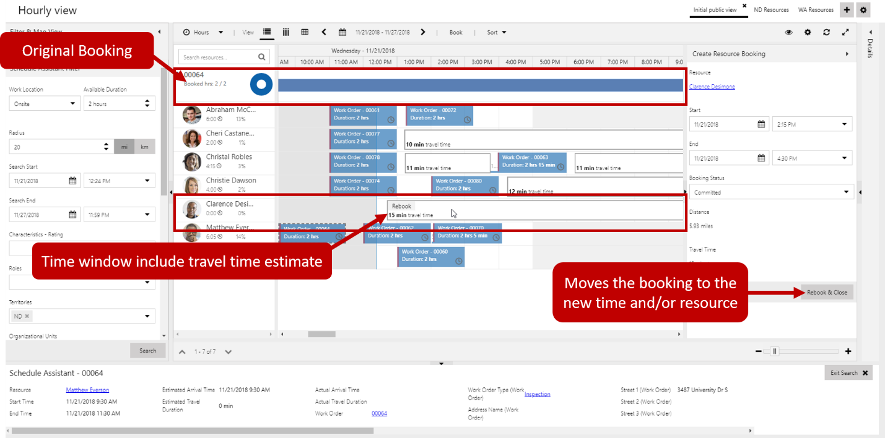
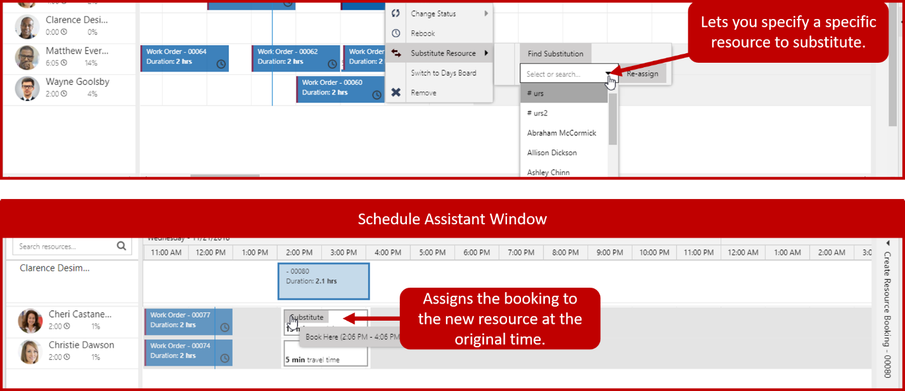

At some point something is going to happen that results in an item needing to be rescheduled, or a resource being substituted. This might happen if a customer has a sudden conflict, a technician calls in sick, or a tech is running behind due to items taking longer than normal.

The schedule board offers multiple ways that dispatchers can reschedule items or substitute different resources. Depending on what the specific need is, dispatchers can do the following:

-   **Rebook**
-   **Substitute resource**
-   **Move items to a different day**

### Rebooking Items

Rebooking provides the ability to move a booking to a different time or day, as well as assigning it to a different resource. An item can be rebooked by right-clicking on the booking you want to work with, and choosing rebook.

The original booking is displayed at the top of the schedule assistant windows. It can be expanded to view information about the original booking, such as the resource who is currently scheduled to work on the item and the time it is scheduled for. All available resources that meet the criteria needed for the booking will be suggested. You can even see the estimated travel time based on location of items they are scheduled to perform work in.

Once you have located the resource and the time that you want to reschedule for, you can click the time you want from the block and use the Create Resource Pane to complete the necessary information. Once you click rebook and close, the item will be rebooked to the resource and time specified.

### Substituting Resources

Substituting resources is different from rebooking because you are not moving the booking to a different time. You are simply replacing the original resource associated with the booking with a different resource. Once you have identified the resource booking that you want to find a substitution for, you can right-click the item and hover substitute resource.

When you substitute a resource, you will have two resource substitution options available:

-   **Substitute a specific resource:** If you know the specific resource that you want to substitute, you can select that resource and click substitute. The selected resource will be substituted for the original resource.
-   **Find a resource to substitute:** If you are not sure which resource to use, you can select find substitute and the schedule assistant will open to provide suggestions of resources that are available at that time. Once you have identified the resource that you want to substitute, you can select substitute, and the booking will be reassigned to the new resource.

### Moving bookings to a different day

Sometimes you may need to move multiple booking from one day to another. This might occur when the booking was created in advance, and due to schedule changes, you are no longer able to execute them on those days.
Moving booking is done by selecting move booking to a different day from the actions menu at the top of the schedule board. When you are moving  multiple bookings to a different day, you need to specify the following
information:

-   **Source Date:** Defines the date that the bookings are currently scheduled for.
-   **Destination Date:** Defines the date that you want to move the bookings to.
-   **Booking Statuses:** Specifies the booking status that will be used to determine which bookings to move. For example, you only want items that are scheduled to be moved. Items that are in progress, completed, or traveling should stay on the date they are at.

You need to define at least one booking status before you can move the item. Once you select OK, all bookings on that date with that booking status will be moved.

