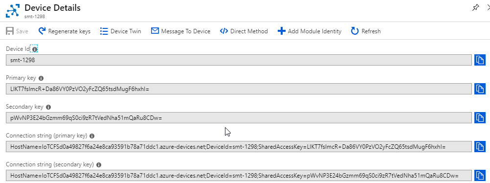
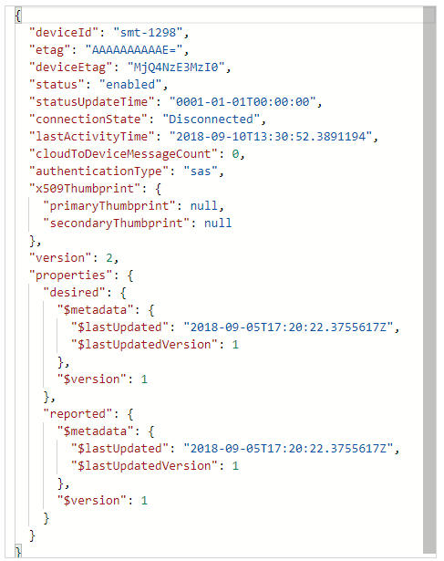
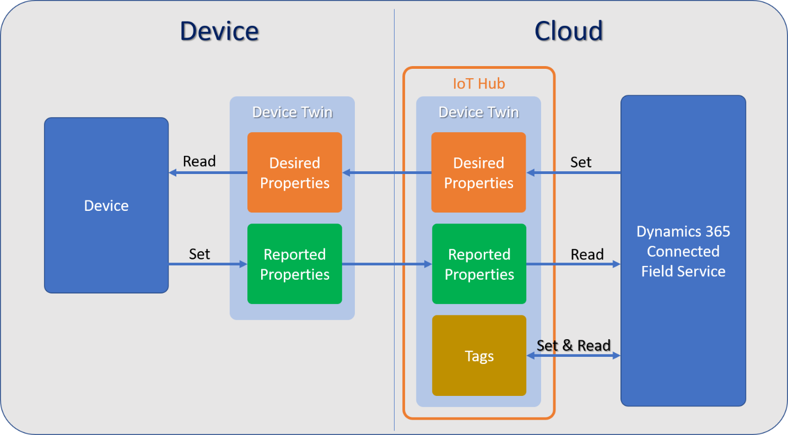
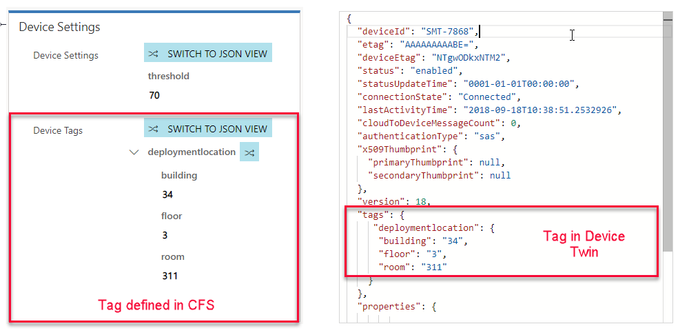
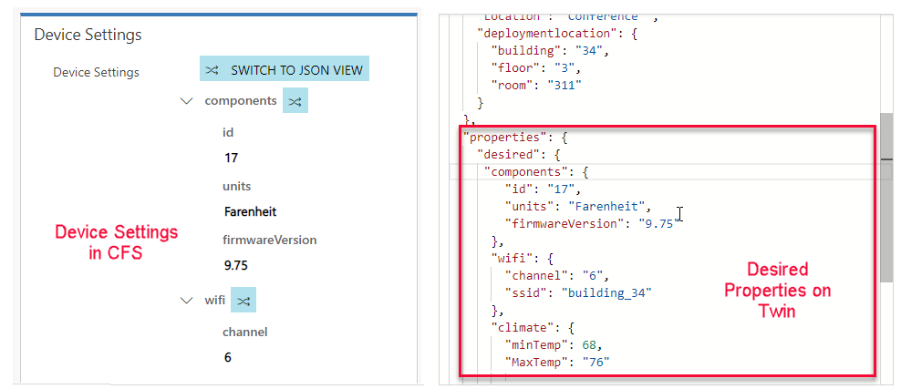
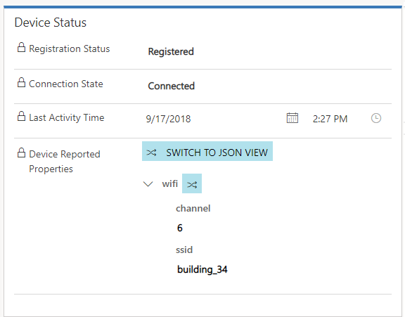
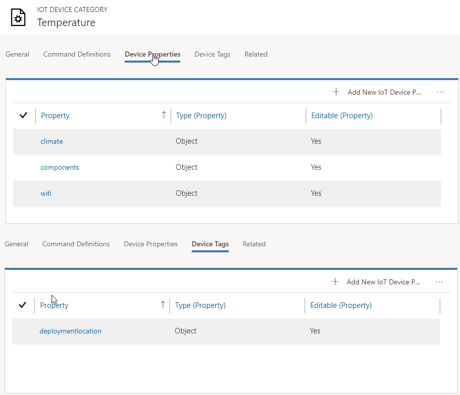
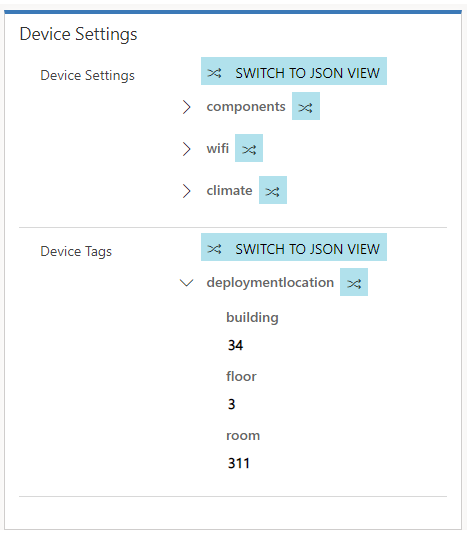

When you register a Customer Asset or an IoT Device from Connected Field Service (CFS) with an IoT Hub, a corresponding IoT device record is created in the IoT Hub.  The Device ID defined on the Customer Asset record will be passed to the IoT Device.  The IoT Device will also contain items like keys and connection strings that are used to connect a physical device to the IoT Device in the Hub.   

Additionally, in the IoT Hub there is a corresponding Device Twin.  A Device Twin is a JSON document associated with a specific device that is used to synchronize state information between the device and an IoT hub.  In the case of Connected Field Service, it might be a Customer Asset that was registered with the IoT Hub.  The device twin holds metadata and configuration data of the device, as well as a virtual cloud representation of physical devices.   

> [!VIDEO https://www.microsoft.com/en-us/videoplayer/embed/RE2DQPs]

Below you can see snippet of what a Device Twin JSON document looks like. 

From a Dynamics 365 standpoint, the Connected Field Service solution leverages device twins to store device-related in two primary ways: 
Synchronize Device Conditions and Properties: Report operating conditions such as a device state, heartbeat for connectivity speed, machine vibration, and so on.  Leverage this information to gain visibility into device conditions and properties on a graphical dashboard.  

> [!VIDEO https://www.microsoft.com/en-us/videoplayer/embed/RE2DQPq]
> 
For example: You might have a holding tank that stores excess waste from a filtering process before it is disposed of.  The capacity of a tank could be monitored through IoT Hub and then represented on dashboard in Dynamics 365.   Once the tank’s capacity reaches a specific threshold, an alert is sent to designated users for follow-up action. 

**Synchronize Device Tags:** Allows grouping of devices to make them easier to search and find. The tags are created in Connected Field Service and converted into JSON that is understood by a device. 

For example: Customer assets needing a similar repair can be grouped using a tag. 

A device twin JSON document contains three primary components that are used to not only capture relevant information to the device, but to assist in interaction with the device.   

Those three components are: 
- Tags 
- Desired Properties 
- Reported Properties 

The image below shows at a high level how these components are used. 

 
**Tags:** 
A tag does not communicate with the actual device, rather they can be set and read by a back-end application (in this case Connected Field Service) as a way of grouping or organizing devices together.  Device tags can be defined directly on the IoT Device record in Connected Field Service.   
Note:  Setting and defining Properties and Tags will be covered in more detail in the Property Definition Unit.     

For example:  You might use Tags to define the specific location of an IoT Device.  If the device is moved from one location to another, we can update the location in Connected Field Service, and the tag will be updated accordingly.   

 
**Desired Properties:**
Desired Properties work hand and hand with Reported Properties.  A desired property would be set by Connected Field Service and the device can read them as well as receive notifications of changes to them.  Like tags, Desired Properties can be defined directly on the IoT Device record in Connected Field Service.   

For example:  Since the device is in building 34 and on floor 3, we know that the device should be on the Building 34 network and transmitting on channel 6.
We can set those desired properties for that Device on the device’s record in Dynamics 365. 
  

 
**Reported Properties:** 
Reported Properties work hand and hand with Reported Properties.  A reported property would be set by the device and Connected Field Service can read and query them.  Unlike Tags and Desired Properties, Reported Properties are not defined in Connected Field Service.  They can be retrieved when Device Data is pulled down into the application.   

For example:  After the Wi-Fi network and transmitting channel properties are set on a device we can pull the device data (manually or on a schedule) and the current reported properties will be displayed in Connected Field Service.  This could be used to determine next steps in the application.   
 
The Connected field service solution make it easy to define Device Tags and Desired properties through Property Definitions and Device Categories.  

 
 
**Device Categories:**
Device Categories make it easier to group devices together based on commonalities.  You may create a Device Category to a specific type of device (Ex. Temperature)that is being deployed.  When a Device Category is created in Connected Field Service, you can define the specific Device Properties and Device Tags that are relevant to that device category.  

 
When an IoT Device that uses the category is created in Connected Field Service, the Properties and Tags will automatically be added to the device.  You can then set those items directly from the device in CFS.  

