##Registering IOT Devices - Hands-on Lab##

**Lab Environment**

Several paragraphs – or longer – describing an overview of the module including a description of why this content is important and a concise description of the main points of the module 

During this lab, you will work in a simulated environment with the following computers or virtual machines. 
 
Computers and Virtual Machines Used in This Lab

<table>

Item Name 
Description 
Dynamics 365 Online Non-Production Instance 
You should have a Dynamics 365 Online environment that you use for this lab, it should not be your production (live) instance. 
Dynamics 365 Field Service 
You should have Dynamics 365 for Field Service deployed. 
Connected Field Service 
You should have Connected Field Service deployed  
Azure IoT Hub 
You should have a Azure IoT Hub setup and deployed that Connected Field Service is talking to.  

</table>

**Lab Overview**
Several paragraphs – or longer – describing an overview of the lab including a description of the lab and why certain topics are covered. This is also called the ‘LAB ABSTRACT’ that will be used for hand-off to conferences as part of the content hand-off process 

**Abstract**
Dynamics 365’s Connected Field Service solution provides the ability to register both simulated and physical IoT devices with Azure IoT Hub or IoT Central and using device twin, communicate information back into the Connected Field Service solution.   
 
The purpose of this hands-on-lab is to introduce you to how simulated and physical devices can be registered with and Azure IoT Hub and associated with customer assets in Connected Field Service.   
 
**Learning Objectives**

At the end of this guided hands-on lab, students will be able to accomplish the following: 
- Register a simulated device with an Azure IoT Hub.     
- Identify and work with IoT devices in an Azure IoT Hub.  
- Work with and modify device rules in an Azure IoT Hub.  
- Register a physical device with the Connected Field Service solution and an Azure IoT Hub. (Optional) 

Estimated time to complete this lab: 45 to 60 minutes 
 
**Scenario**
You work for a company that sells and services smart home devices.  Since many of the devices that you service are smart devices, information from those devices can be captured remotely to aid in the servicing of that equipment.  Your organization has several defined scenarios that and processes that they use when servicing equipment.  These processes can vary depending on several factors including: 
- The type of device in need of service 
- The severity of the issue detected 
- The age of the device 
- The location of the device 
- The availability of resources to work on a specific device. 
The above items represent only a small portion of factors that your organization uses to determine the process for servicing equipment.   
 
The first critical component in your company moving to a connected IoT solution is to register devices with an Azure IoT hub (both simulated and physical) and relate them to a corresponding customer asset in Connected Field Service.   

**Lab Completion Requirements**
- After completing the exercises in this lab, you will be able to: 
- Register a simulated device with an Azure IoT Hub.     
- Identify and work with IoT devices in an Azure IoT Hub.  
- Work with and modify device rules in an Azure IoT Hub.  
- Register a physical device with the Connected Field Service solution and an Azure IoT Hub. (Optional) 
 
**Exercise 1: Register and work with a simulated device** 
 
**Task 1: Register a simulated device**

1. In Dynamics 365, select the down arrow next to the Dynamics 365 text and choose Connected Field Service.  

2. Select the Site Map Icon to expand navigation, select Customer Assets.  
3. Click the New button. 
4. Configure your Customer Asset as follows: 
- Name: Smart Thermostat 
- Account: Adventure Works (Sample) 
- Device ID: smt-9876 
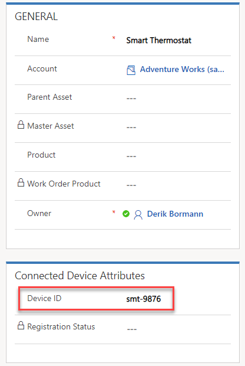
5. Save the Customer Asset and leave the record open 
6. One the Command bar, select Register Devices and click OK. 
7. In your web browser select a new tab and navigate to Https://8. Portal.Azure.com (Log into Azure if prompted. You need an Azure subscription associated with the account you are using) 
8. Select Resource Groups

9. Open the IoT Hub that you are using with your Connected Field Service installation. 
10. Click on IoT devices. All currently registered devices with the IoT hub will appear. 
11. Select the smt-9876 device to open it.  (Notice the Device ID, Primary & Secondary Keys, and the Primary and Secondary Connection strings. These can be beneficial when you are working with physical devices.) 
12. Click on Device Twin.  
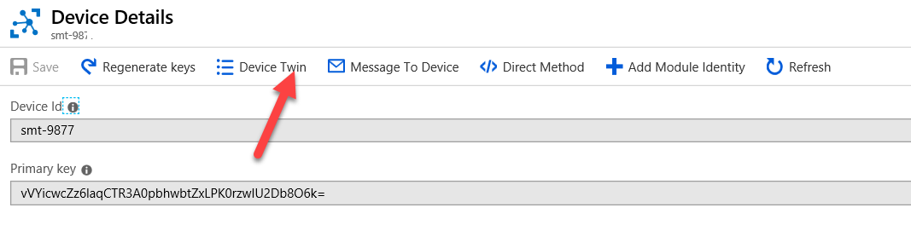
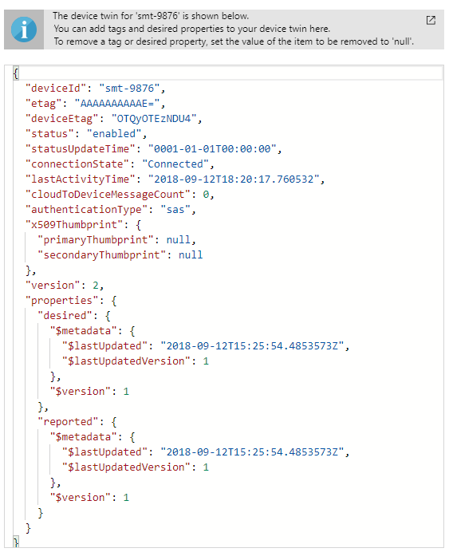
This will display the device twin JSON document for this device.
13. On your IoT Hub select and open the Simulator

14. Click the Simulator URL to open the Thermostat Simulator. (The simulator should open in a new tab)

15. On the simulator click Connection.

16. Switch back to your Azure subscription, close the simulator App Service screen.

17. Open the IoT Hub.

18. Highlight the IoT Hub name and Copy it. 

19. Switch back to your simulator screen and paste the IoT hub name into the Host field.

20. Switch back to your Azure subscription, select Shared Access Policies.

21. Open the iothubowner policy and copy the Primary key.

22. Switch back to your simulator screen and paste the Primary Key into the Key field. 

23. Click the Connect button. (Your simulator is now connected to your Azure IoT Hub) 
24. Click the Refresh button to ensure all registered devices are available.
25. From the Select a device dropdown, select the smt-9876 device. (A green dot should appear next to the refresh button, and after a few seconds it should start transmitting information.) 

26. On the Temperature Slider, set it to 75 Degrees and wait for the temperature status to register on in the Messages Sent window. 

27. Switch to the browser tab that has Dynamics 365 loaded. 
28. Select the Site Map Icon to expand navigation, select IoT Alerts. 
29. Verify that an alert was created.  (Example: Temperature of 75 exceeded a threshold of 70 Alert.) 

From here we could begin to interact with the device using commands.  We will examine this in greater detail in Unit 6.  

**Task 2: Modify device rules to change to Celsius**  

1. In your web browser, select the Tab that contains your Azure Portal.   
2. Select and Open the Storage Account.
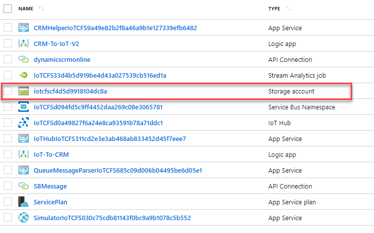
3. Under Blob Service, click Blobs.
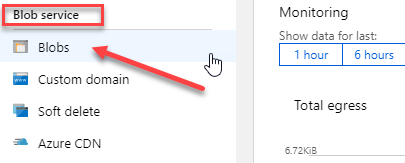
4. Select device rules and click on the 2016-05-30 folder. 
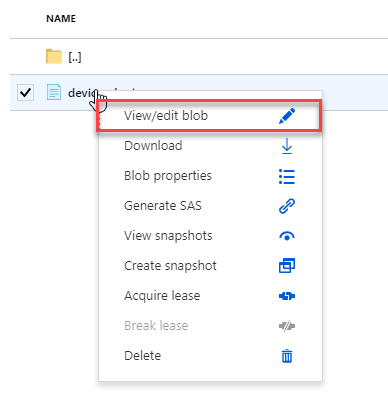
5. Open the 22-40 folder. 
6. Right Click on the devicerules.json file and select View/Edit blob.
7. Locate the Temperature property and change the value from 70 to 21.11111 (This is what 70 degrees would be in Celsius)
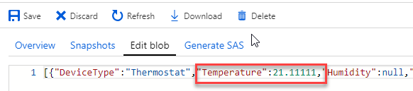
8. Click Save.   
9. Switch back to your Simulator and ensure the smt-9876 device is selected. 
10. Change the value to something over 21.11111 and wait for the reading to register.   
11. Switch back to Dynamics 365 Connected Field Service and verify that an Alert record was created.   

**Task 3: Modify device rules back to Fahrenheit.** 

> IMPORTANT:  Unit 6 in this module will be using a simulated device to interact with Connected Field Service.  The changes to make it Celsius will not work with this exercise.  It is important that in the Blob, you modify the Temperature the back to 70 to ensure that the simulator will register Fahrenheit and work accordingly.   
>  
**Exercise 2: Register a physical device (Optional)** 
 
Each exercise consists of a scenario and learning objectives, the scenario describes the purpose of the exercices, while the objectives are listed and have bullet points.  

**Scenario**
For this ooptional eexercise, you will need a physical device.  There are several available.  In this exercise you are introduced to setting up an MXChip IoT DevKit. The MXChip IoT DevKit (a.k.a DevKit) is an all-in-one IoT device kit.  You can use this chip to develop and prototype IoT (Internet of Things) solutions that take advantage of Microsoft Azure services.  

It includes an Arduino-compatible development board with rich peripherals and sensors, an open-source board package, and a growing projects catalog.  
If you do not have an MXChip IoT DevKit, you can visit http://aka.ms/iot-devkit/ and click on Get a Kit.   
 
**Task 1: Create and register a customer asset and an IoT device.** 

1. In Dynamics 365, select the down arrow next to the Dynamics 365 text and choose Connected Field Service. 

2. Select the Site Map Icon to expand navigation, select Customer Assets.
3. Click the New Button. 
4. Configure your Customer Asset as follows: 
- Name: MXChip 
- Account: Adventure Works (Sample) 
- Device ID: AZ3166 
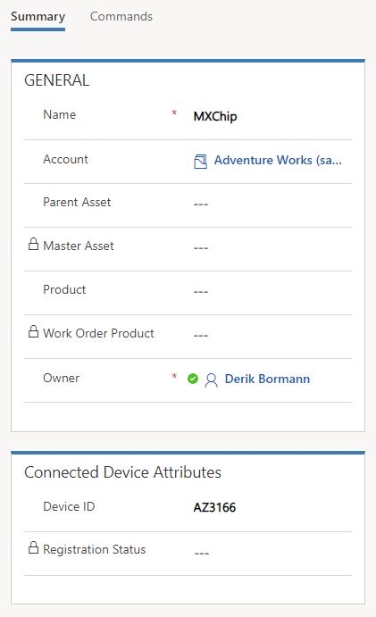
5. Save the Customer Asset and leave the record open 
6. One the Command bar, select Register Devices and click OK. 
7. In your web browser select a new tab and navigate to Https://Portal.Azure.com (Log into Azure if prompted. You need an Azure subscription associated with the account you are using) 
8. Select Resource Groups

9. Open the IoT Hub that you are using with your Connected Field Service installation. 
10. Click on IoT devices. All currently registered devices with the IoT hub will appear.   
11. Select the AZ3166 device to open it.   
12. Locate the device’s Connection String – (Primary Key) and copy it to an application like notepad.   (We will use it again later.) 
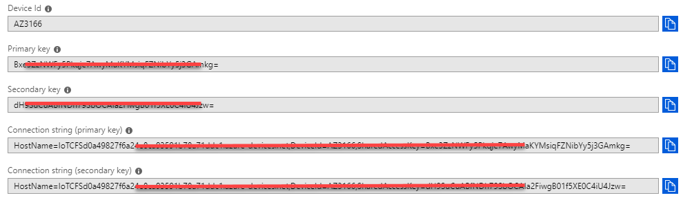

**Task 2: Register a Physical Device.** 

**Flash the Devices Firmware**

1. Download the latest pre-built Microsoft IoT Central firmware for the MXChip from the releases page on GitHub.  
The download filename on the releases page looks like AZ3166-IoT-Central-X.X.X.bin. 
 
2. Connect the DevKit device to your development machine using a USB cable. 
 
In Windows, a file explorer window opens on a drive mapped to the storage on the DevKit device.  For example, The drive might be called AZ3166 (D:).  
 
3. Drag the AZ3166-IoT-Central-X.X.X.bin file onto the drive window. When the copying is complete, the device will reboot with the new firmware. 
 
**Configure Wi-Fi**
After the device reboots, you need to configure the Wi-Fi on the device.  
 
4. Hold down button B, push and release the reset button, and then release button B.  
 
5. Your DevKit enters AP mode for configuring Wi-Fi. The screen displays the service set identifier(SSID) of the DevKit and the configuration portal IP address: 
  

If your Wi-Fi SSID starts with AZ and not AZ3166 after applying the firmware, you need to follow the following steps to make sure the firmware gets applied correctly. 
 

Bad – Firmware Not Applied Correctly

Good – Firmware Applied Correctly

> IMPORTANT: You only need to do the steps below, if your device screen looks like the Image on the Left.  If it looks like the image on the Right, your device is ready to configure Wi-Fi. 

- Click Reset on the AZ3166 
- Hold down A+B Button AZ3166 will hard reset 
- Press Reset 
- Remove from Power 
- Place AZ3166 into AP Mode 
- If the SSID is AZ3166_XXXXXX, the firmware is applied correctly.

If the SSID still shows AZ-XXXXXXXXXX, please refer to:  https://microsoft.github.io/azure-iot-developer-kit/docs/use-configuration-mode/ and use SSH to update the IoT Hub Connection String. 
 
6. On another Wi-Fi enabled device (like a computer or mobile phone) connect to the DevKit SSID (ex.AZ3166_SRSCAQ).  
- Leave the Password Empty.   
7. Open a web browser on connected device and put navigate to:  http://192.168.0.1/start 
8. Select the Wi-Fi network you want to join and enter the Wi-Fi credentials. 
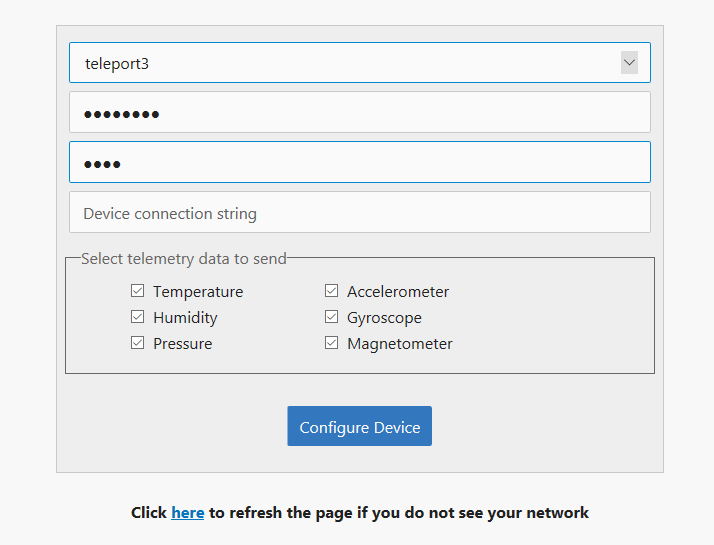
9. In the Device Connection String, paste the connection string, you copied to Notepad earlier.
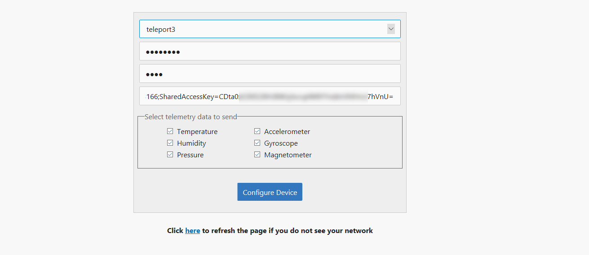
10. Select all the telemetry options. 
11. Click Configure Device 
12. Reset device using Reset Button 
13. Your physical device is now configured to connect with Azure IoT Hub. 
14. Navigate back to your Azure Management Portal, click on Resource Groups, select the Resource Group that contains all your Connected Field Service components.   
15. From within the Components Listing, sort on the Type column.  Click on it twice so that is sorts descending and that the Stream Analytics job is at the top. 
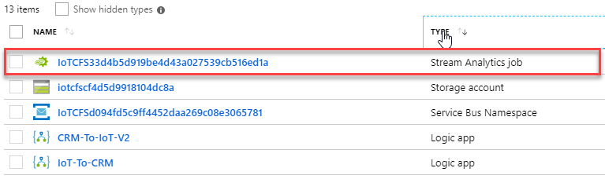  
16. Click the Stop Button to disable the job.  This allows us to modify the query.  It can take several minutes to stop. Once it is stopped, it will show under the Notifications area.
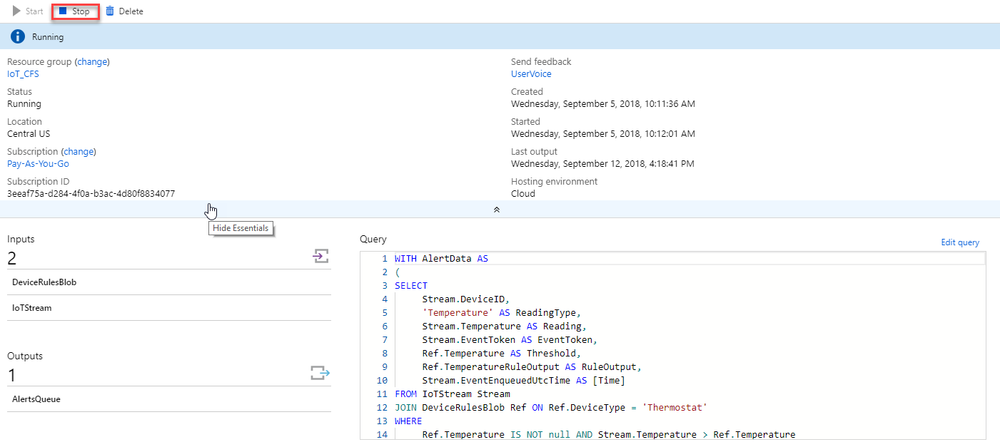  
17. On the query section, select Edit Query.  
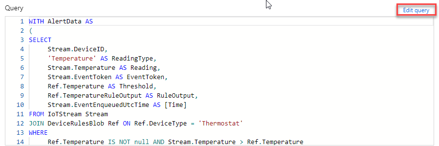 
18. This query does not include necessary information for the device we are working with, so we will replace it.  Highlight all information in the query window and delete it.  
19. Next, paste the code below into the window.

``WITH AlertData AS 
	(
	-- Web Simulator Devices
	SELECT
	     Stream.DeviceID,
	     'Temperature' AS ReadingType,
	     Stream.Temperature AS Reading,
	     Stream.EventToken AS EventToken,
	     Ref.Temperature AS Threshold,
	     Ref.TemperatureRuleOutput AS RuleOutput,
	     Stream.EventEnqueuedUtcTime AS [time]
	FROM IoTStream Stream
	JOIN DeviceRulesBlob Ref ON Ref.DeviceType = 'Thermostat'
	WHERE
	     Stream.EventToken IS NOT NULL AND Stream.Temperature > Ref.Temperature 
	
	UNION
	
	--MX Chip
	SELECT
	     GetMetadataPropertyValue(Stream, '[IoTHUB].[ConnectionDeviceId]') as DeviceID,
	     'Temperature' AS ReadingType,
	     Stream.temp AS Reading,
	     GetMetadataPropertyValue (Stream, 'EventId') as EventToken,
	     Ref.Temperature AS Threshold,
	     Ref.TemperatureRuleOutput AS RuleOutput,
	     Stream.EventEnqueuedUtcTime AS [time]
	FROM IoTStream Stream 
	JOIN DeviceRulesBlob Ref ON Ref.DeviceType = 'Thermostat'
	WHERE
	     Stream.temp IS NOT NULL AND Stream.temp > Ref.Temperature
	)
	-- Insert data into the "Alerts" Service Bus Queue 
	SELECT data.DeviceId,
	    data.ReadingType,
	    data.Reading,
	    data.EventToken,
	    data.Threshold,
	    data.RuleOutput,
	    data.Time
	INTO AlertsQueue
	FROM AlertData data
	WHERE LAG(data.DeviceID) OVER (PARTITION BY data.DeviceId, data.Reading, data.ReadingType LIMIT DURATION(minute, 1)) IS NULL	

20. Click the Save button within the query window. 
21. Close out the query window.  This will return you to the properties of the Stream Analytics job. 
22. Along the top click the Start button.  The job will take a minute or two to start.  Once it is started, it will show under the Notifications area. 

**Task 3: Modify Device Alert settings and Stream Analytics to use the Simulator.**
>  
> IMPORTANT:  Unit 6 in this module will be using a simulated device to interact with Connected Field Service.  The changes we made to the device alert settings and the Stream Analytics will not work with this exercise.  It is important that you modify those settings back to their original values.   
 
1. Navigate back to your Azure Management Portal, click on Resource Groups, select the Resource Group that contains all your Connected Field Service components.   
2. From within the Components Listing, sort on the Type column. Click on it twice so that is sorts descending and that the Stream Analytics job is at the top.  

3. Click the stop button to disable the job.  This allows us to modify the query. It can take several minutes to stop. Once it is stopped, it will show under the notifications area. 

4. On the Query Section, select Edit Query. 
 
5. Next, paste the code below into the window. 

	'''WITH AlertData AS 
(
-- Web Simulator Devices
SELECT
     Stream.DeviceID,
     'Temperature' AS ReadingType,
     Stream.Temperature AS Reading,
     Stream.EventToken AS EventToken,
     Ref.Temperature AS Threshold,
     Ref.TemperatureRuleOutput AS RuleOutput,
     Stream.EventEnqueuedUtcTime AS [time]
FROM IoTStream Stream
JOIN DeviceRulesBlob Ref ON Ref.DeviceType = 'Thermostat'
WHERE
     Ref.Temperature IS NOT NULL AND Stream.Temperature > Ref.Temperature 

)

SELECT data.DeviceId,
    data.ReadingType,
    data.Reading,
    data.EventToken,
    data.Threshold,
    data.RuleOutput,
    data.Time
INTO AlertsQueue
FROM AlertData data
WHERE LAG(data.DeviceID) OVER (PARTITION BY data.DeviceId, data.Reading, data.ReadingType LIMIT DURATION(minute, 1)) IS NULL
------
6. Click the Save button within the Query Window. 
7. Close out the Query window.  This will return you to the properties of the Stream Analytics job. 
8. Along the top click the Start button.  The job will take a minute or two to start.  Once it is started, it will show under the Notifications area.

----------

Several paragraphs – or longer – describing an overview of the lab including a description of the lab and why certain topics are covered. This is also called the ‘LAB ABSTRACT’ that will be used for hand-off to conferences as part of the content hand-off process.

