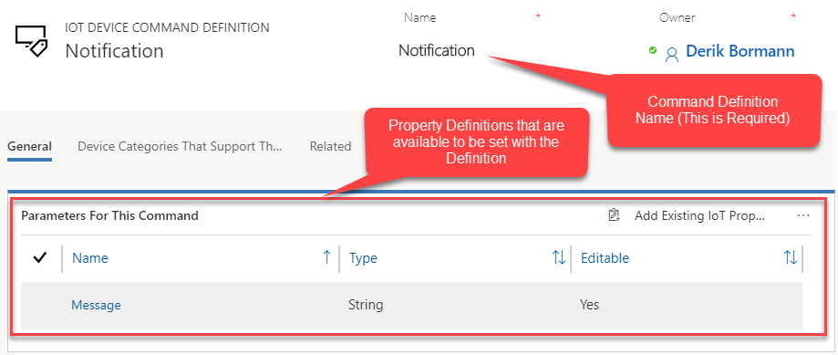
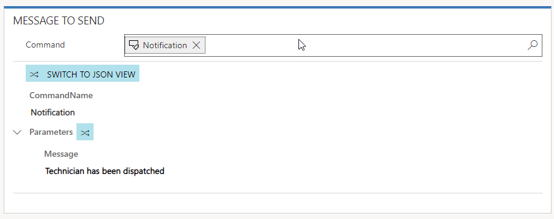
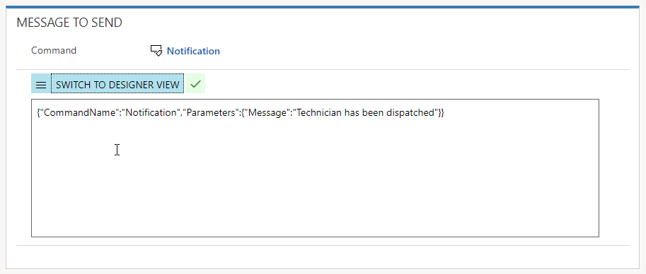

Many times, you will have several IoT devices that either do the same thing or have similar properties that are reported back and potentially need to be interacted with.  While an IoT Alert that is generated will be specific to a device, there may be many common properties between devices that need to be interacted with.  Each command that you create to send to a device will specify which of those different properties are being used for that specific device.  

> [!VIDEO https://www.microsoft.com/en-us/videoplayer/embed/RE2EbBw]  

For example, let’s say that we want to send a message back to a device that will display a message that lets the device (or the display on the device) know that we have dispatched a technician to resolve the issue.  Each time we wanted to communicate this to a device, we could create a command in Connected Field Service that includes the following JSON message: 

```json
...
{"CommandName":"Notification","Parameters":{"Message":"Technician has been dispatched"}}
...
```

*In the above example, there are three specific components that are being sent to the device as part of the message.*
  
**CommandName:** This represents the name of the command that is being set to the device.   
 
*(For example, in the above command, the Command Name is “Notification”)*
 
**Parameters:** Used to declare the specific properties that are being interacted with as part of the command.  These will include all the properties the command is interacting with.   
 
*(For example, in the above command everything that follows Parameters (In this case “Message” represent Properties that are being interacted with as part of this command)*

**Property:** The specific Property to be interacted with, and the value that should be pushed to the Property.  Properties are typically defined as Name / Value pairs.   
 
*(For example, “Message” represents the message property that can be used to send a message to the device.  “Technician has been dispatched” is the actual value that is being passed to the Message Property.)*   
  
While you do have the ability manually define the JSON to for each command you want to send using the format that is defined above.  The reality is that it can result in potentially having to define many different commands that are basically doing the same thing.  A Command Definition can assist with this process.  A Command Definition is basically a wrapper that pre-defines the “Command Name” and the “Parameters” you want to use in a command.  By pre-defining specific parameters that will be used in a specific Command, users and/or automation processes can modify only the property values that need to be modified base on what the command being sent is trying to do.   When a Command is created, the user/process simply select the Command Definition it wants to use.   

The image below represents a Command Definition called “Notification” that will generate the same JSON from our original example automatically.   



Each command definition that is defined, can be associated with one or more “Property Definitions”.  A property definition represents a specific parameter that is being used as part of a command.   Any parameters that are defined for a command definition will be auto-populated with default values that were defined for the specific property definition being used.  Those predefined values can either be used as they are or can be over written at the time the actual command is created.  To help with classification and deployment, a command definition can also be associated with multiple device categories.     

> [!Note]
> Property Definitions are out of scope for this unit and will be discussed in more detail in the next unit.  
 
The image below shows what a message in a command would look like if we used the **“Notification”** command definition shown above to define the message.  The message is displayed in a design window that tells us the **CommandName** is **“Notification”** and the parameters we are sending is the **“Message”** property (this is defined by a property definition), and the message is **“Technician has been dispatched”**. This is the default text defined in the Message Property Definition).  The message text value can be manipulated in the design window to represent any text that we would want to pass through in the message.   



The message design window also contains a toggle that allows us to switch between the message designer view and the actual JSON command that will be sent as part of the message.  If we look at the message below, we can see that the JSON matches “Notification” example that was shown at the beginning of this unit.    



Not only do command definitions make it easier to streamline the process of building commands to send to devices, but because of the property definitions, it is easier to use automation like work flows and Microsoft Flow to identify and manipulate specific values that you want to pass in a command.   

In the next unit we will examine property definitions in more detail and discuss the different options that are available when you create them to provide more flexibility when using them in commands and command definitions.