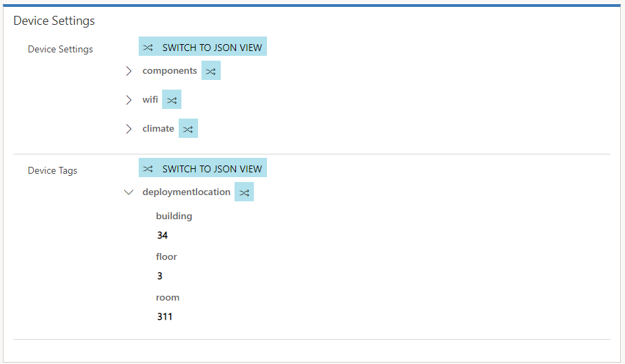
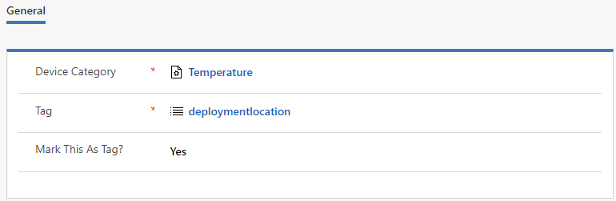
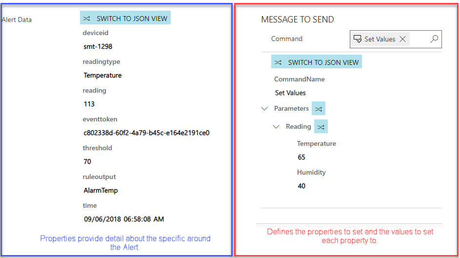
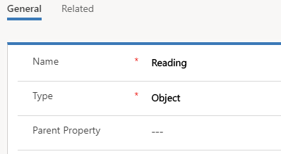
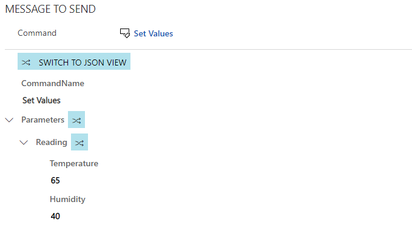
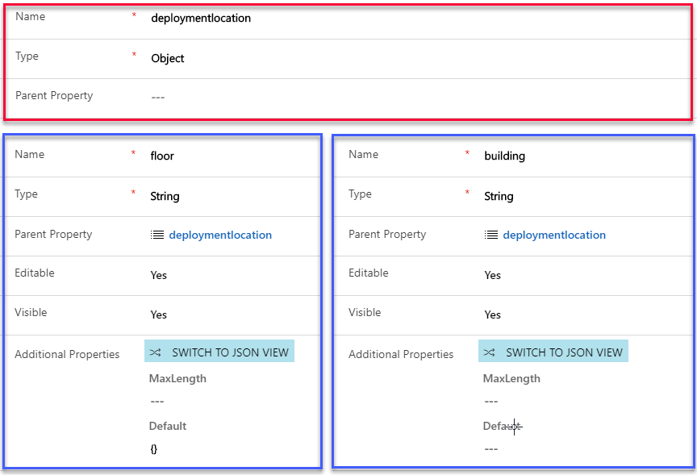

## Working with Device Properties and Definitions

Property Definitions make it easy to pre-define specific properties that are associated with IoT Devices.  

> [!VIDEO https://www.microsoft.com/en-us/videoplayer/embed/RE2EbBv]
> 
There are two primary areas where Property Definitions can be leveraged. 
 
- Assisting in syncing and communicating with Device Twins
- Streamlining population of properties in Command Definitions.  

**A Property Definition contains the following information:**

- **Name:** The name of the specific property.  In our above example, Message would be set as the name, since that is the Property we want to define.  

- **Type:** Defines the type of Property it is.  You have six different types to choose from.  

<table>
	<thread>
		<tr>
			<th>
				Type
			</th>
			<th>
				Description
			</th>
		</tr>
	</thread>
	<tbody>
		<tr>
			<td>String</td>
			<td>Used when the value you want to pass to a property is a text-based value.
				<br>**Additional Properties Include:** max lenght and default value. As an example, A message property would use the string type since the contents of the message will be text.    </br></td>
		</tr>
		<tr>			
			<td>Date and Time</td>
			<td>Used when the value to pass to a property is date and/or time based.  
				<br>**Additional Properties Include:** minimum and maximum values. </br>
			</td>
		</tr>
		<tr>
			<td>Boolean</td>
			<td>Used when you want to pass one of two possible values to a property.
				<br>**Additional Properties Include:** Display name for true, display name for false, and default value.  </br>
			</td>
		</tr>
		<tr>
			<td>Whole Number</td>
			<td>Used when you want to pass a whole number to the property.
				<br>**Additional Properties Include:** minimum, maximum, and default value.</br>
			</td>
		</tr>
		<tr>
			<td>Decimal Number</td>
			<td>Used when you want to pass a decimal number to the property. 
				<br>**Additional Properties Include:** minimum, maximum, and default value as well as decimal precision</br>
			</td>
		</tr>
		<tr>
			<td>Object</td>
			<td>Used when the Item you want to pass is an object.
				<br>**Example:**  A reading property might contain both a temperature and humidity property.  By setting the reading property to a Type of Object, you will be able to define specific sub-properties for it.  (More on this Later)  </br>
			</td>
		</tr>
	</tbody>
</table>


- **Parent Property:** Specifies that the property is a child property of another property.  
- **Editable:** Specifies if the property will be editable when used in a command definition.  
- **Visible:** Specifies if this is a hidden property that should not be shown in the command definition.
- **Additional Properties:**   Additional items that are specific to that property type than can be defined. For example: A default text string that will be used with a Message Property.  (Note: Additional Properties will vary depending on the Type chosen.) 

### Using Property Definitions with Device Twins. 
Let’s say that you want to use Device Tags to define the specific location of an IoT Device.  Typically, your devices are in a Building and on a Specific floor.  A Property Definition could be used to define the tag.  When that tag is added to a Device Category, it will be automatically populated on any device that belongs to that category.  



When you add the Property definition to a Device Category, you can choose to mark it as either a tag or not.  If you mark it as a Tag, it will appear as a Device Tag on the Device.  If you choose not to mark it as a tag it will appear as a Device Setting.  




Using Properties Definitions in Command Definitions:
When you look at the data being sent as part of an IoT Alert or are sending a remote command to a device, you will see several properties associated with the alert data or the message to be sent.  The properties represent a Name / Value pair that displays or provides relevant parameters related to the event.   

For example: 


- A temperature related IoT Device Alert might include the device ID, type of reading, the actual reading, reading, or the threshold that was exceeded.  
- A command you are sending back to an IoT Device might include the message to be sent, or a specific value that you want to set a property to.  

The image below shows how properties are displayed for both commands sent to a device (left image) and IoT Alerts (right image).



As mentioned in the previous unit, command definitions can be used to create pre-defined commands that have the specific parameters that you want to work with predefined.  This is done by creating property definitions and associating those property definitions with specific command definitions.  A Property Definition defines specific details about the property being passed to the command.  

Let’s look at the example command below:
```json
...
{"CommandName":"Notification","Parameters":{"Message":"Technician has been dispatched"}}
...
```

The parameters the specific properties that we want to include in the command.  The “Message” property tells us that we want to send a message to the device, and the text is the message that we want to include in the message.  The message property above is good example of where Property Definitions could be used.  

### Working with Parent Properties:
Many times, a property will have multiple sub-properties that make up the entire Property Definition.  In this case you can use Parent Properties to relate a Property to multiple Sub-Properties.  

Let’s look at the example below:    
```json
...
{"CommandName":"Set Values","Parameters":{"Reading":{"Temperature":"30","Humidity":"30"}}}
...
```

In this example reading would be considered the parent property for temperature and humidity.  We would set Readings Type to Object. This defines that the reading property should be considered an object, and it may contain other properties that make up the overall value.  



Both the “Temperature” & “Humidity” property definitions would have the “Reading” property definition set as the parent property.    When we create a command definition that needs to leverage the reading property, we only need to include a reference to the reading property definition.   Because reading has a Type of Object, and both temperature and humidity have reading as the parent property, this ensures that when the reading property is used, both the temperature and humidity properties will also be included.  
  
The Image below shows what a command message would look like when a command definition that includes the reading property definition is used.  



You can see that under parameters, it includes the reading property.  The reading property has both the temperature and humidity properties included with the initial values populated based on the defined default values.  Those individual values can be manipulated as needed when the command is created.  

This same thought process would apply if you were using the Property Definition to populate a Device Tag or Device Setting.  

Let’s look at a potential Device Tag example below:    
```json
...
{"deploymentlocation":{"building":"34","floor":"3"}}
...
```

Here, deploymentlocation would be considered the parent property for building and floor.  We would set deployment location’s Type to Object, and both “building” and “floor” would have deploymentlocation defined as the Parent.     




