Dynamics 365’s Connected Field Service solution provides the ability to remotely monitor IoT enabled devices to keep track of up time, device statistics, anomalies and more.  After an IoT device communicates an anomaly or exception, that information is sent to Connected Field Service as an alert.  Once the alert is captured, IoT devices can be remotely managed and interacted with using IoT device commands from within Dynamics 365.  To assist in flexibility, the data populated in these commands can be easily populated using command and property definitions.   
 
The purpose of this hands-on-lab is to introduce you to creating and defining command and property definitions in Connected Field Service.  Additionally, we will demonstrate how you can automate the process of sending commands using Dynamics 365 functionality.   
 
**Learning Objectives** 
- At the end of these exercises, you will be able to accomplish the following: 
- Create device categories in Connected Field Service. 
- Create and define command definitions.  
- Create and define command definitions and use them in command definitions.  
- Build workflows extract data and automate send a command. 
  
**Scenario**
You work for a plumbing and heating company that sells and services smart home devices.  Since many of the devices that you service are smart devices, information from those devices can be captured remotely to aid in the servicing of that equipment.  Your organization has several defined scenarios that and processes that they use when servicing equipment.  

These processes can vary depending on several factors including: 
- Type of device in need of service 
- Severity of the issue detected 
- Age of the device 
- Location of the device 
- Availability of resources to work on a specific device 
- The above items represent only a small portion of factors that your organization uses to determine the process for servicing equipment.   
 
Lately, you have been installing a lot of smart thermostat devices.  These devices have been very handy in being able to track temperature and humidity readings in areas when it is important to maintain a consistent temperature and humidity.  Because you have more information available it has forced you to create new process for handling and resolving issues reported by these devices.  The first area you would like to focus on is for automating the process used for temperature related issues. 
  
Your organization is looking to implement the following process: 
If a device detects a temperature reading of more than 70 degrees, an alert should be surfaced in your Connect Field Service environment.   
 
If the temperature reading is between 70 and 85 degrees, a command should be sent to remotely reset the device to see if the issue resolves itself.   
 
Your organization wants to make it as easy as possible for techs to create commands and modify parameters.  They would like to pre-define a few of the commands and properties that are common to these smart thermostat devices.   
 
The two commands they want to pre-define are: 
- Notification: {"CommandName":"Notification","Parameters":{"Message":"Technician has been dispatched"}} 
- Set Values: {"CommandName":"Set Values","Parameters":{"Reading":{"Temperature":"30","Humidity":"30"}}} 

### Exercise 1: Define command and property definitions  
 
#### Task 1: Create Device Categories  
1. In Dynamics 365, click switch to another app and choose Connected Field Service. 
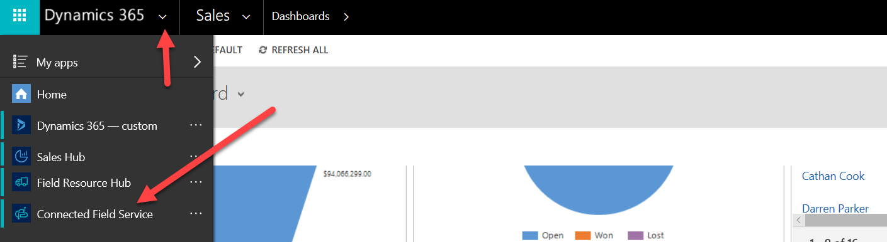
2.	Select the Site Map Icon to expand navigation, select Device Categories.
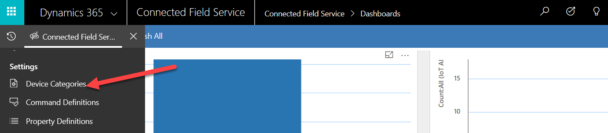
3.	Click the New button.

4.	Configure your device category as follows:
- Name: Temperature 
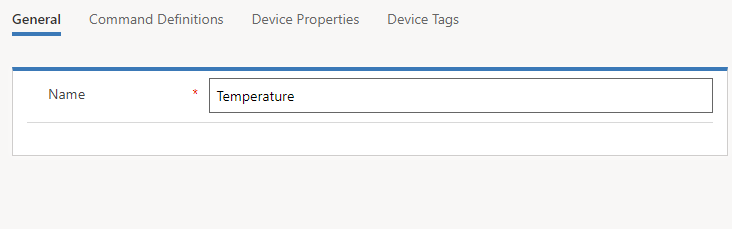
5.	Save and Close the Temperature device category.
6.	Click New again
7.	Configure your device category as follows:
    - Name: Humidity

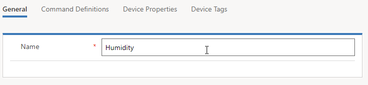

8.	Save and Close the Humidity device category.

#### Task 2: Create Property Definitions 
1.	Select the Site Map Icon to expand navigation, select Property Definitions.
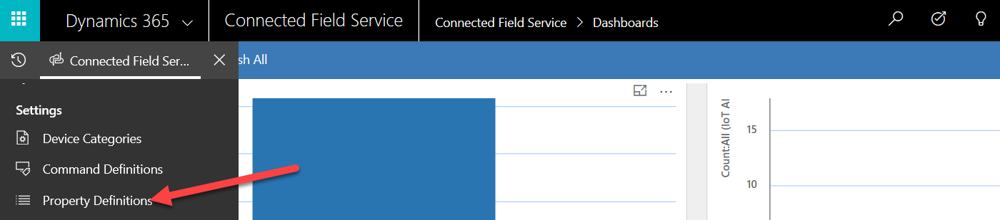
2.	Click the New button.
3.	Configure your property definition as follows:
    - Name: Message
    - Type: String
    - Editable: Yes
    - Visible: Yes
    - Additional Properties:
    - Default: A Technician has been dispatched.
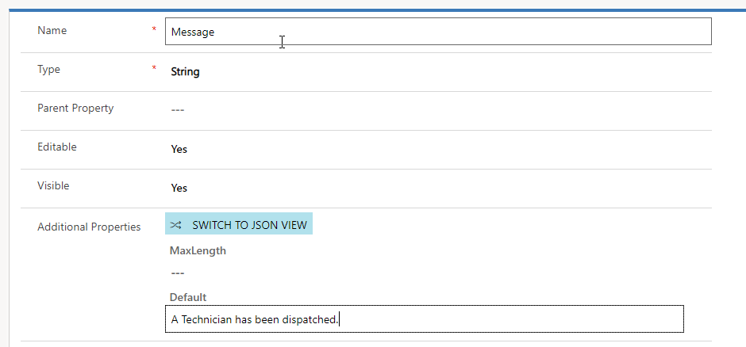
4.	Save and Close the Message property definition. 
5.	Click the New button.
6.	Configure your property definition as follows:
    - Name: Reading
    - Type: Object
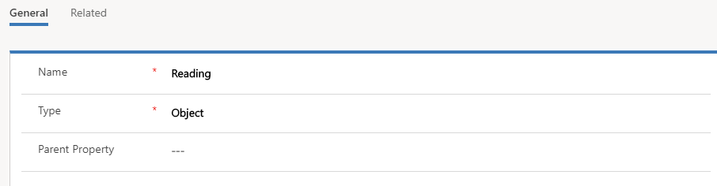
7.	Save and Close the reading property definition. 
8.	Click the New button.
9.	Configure your property definition as follows:
    - 	Name: Temperature
    - 	Type: Whole Number
    - 	Parent Property: Reading
    - 	Editable: Yes
    - 	Visible: Yes
    - 	Additional Properties:
    - 	MinValue: 1
    - 	MaxValue: 120
    - 	Default: 65

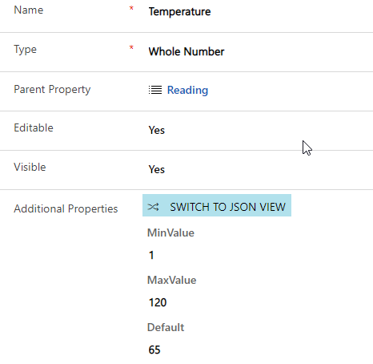

10.	Save and Close the Temperature property definition. 
11.	Configure your property definition as follows:
    - Name: Humidity
    - Type: Whole Number
    - Parent Property: Reading
    - Editable: Yes
    - Visible: Yes
    - Additional Properties:
    - MinValue: 1
    - MaxValue: 100
    - Default: 40

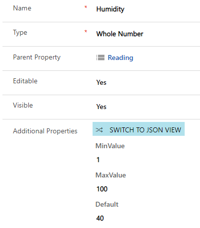

12.	Save and Close the Humidity property definition. 

13.	Your completed property definitions should resemble the image below:

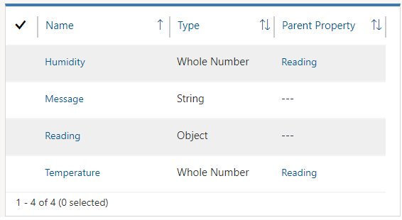

#### Task 3: Create Command Definitions
1.	Select the Site Map Icon to expand navigation, select Command Definitions.

2.	Click the New button.
3.	Configure your command definition as follows:
- Name: Notification 
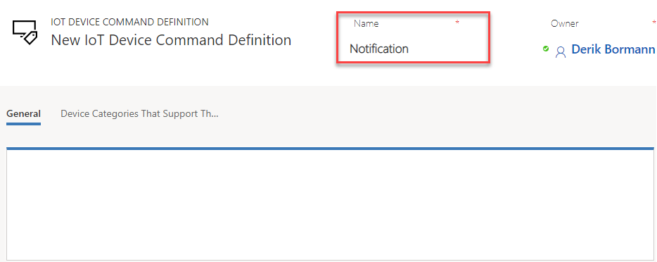
4.	Save the Notification command definition and leave it open. This will also enable the Property Definition sub-grid.
5.	Click the Device Categories that Support this Command tab.
6.	Click Add Existing IoT Device Category.
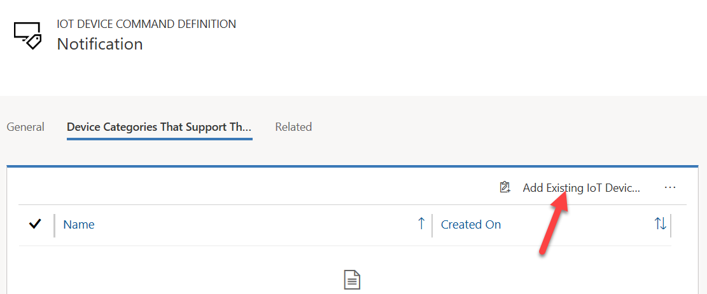
7.	In the lookup records, select both the temperature and humidity categories.  
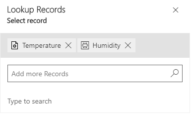
8.	Click Add
9.	Click the General tab. 
10.	In the Parameters for this Command sub-grid, select Add Existing IoT Property Definition.
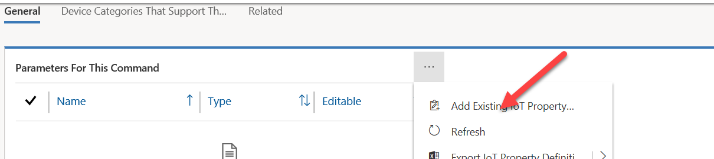
11.	Select Message, click Add.
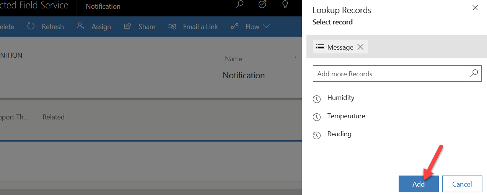
12.	Your completed Notification command definition should resemble the image below:
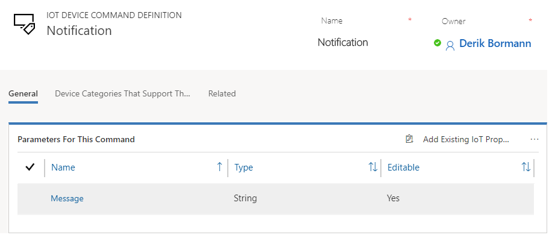
13.	From the Navigation bar at the top, select Command Definitions.
14.	Click the New button.
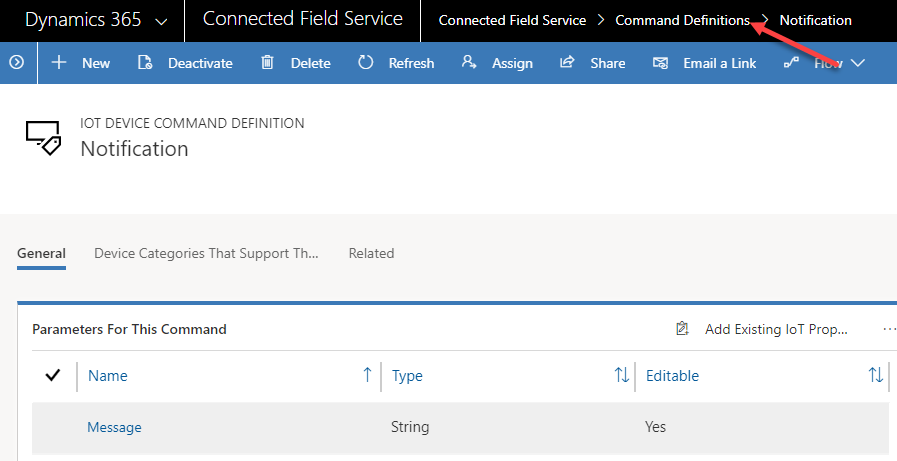
15.	Configure your command definition as follows:
- Name: Set Values 
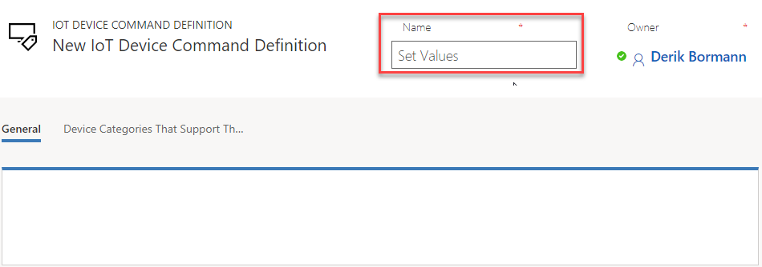
16.	Save the Set Values command definition and leave it open.
17.	Click the Device Categories that Support this Command tab.
18.	Click Add Existing IoT Device Category.
19.	In the lookup records, select both the Temperature and Humidity categories.  

20.	Click Add
21.	Click the General tab. 
22.	In the Parameters for this Command sub-grid, select Add Existing IoT Property Definition.
23.	Select Reading, click Add.
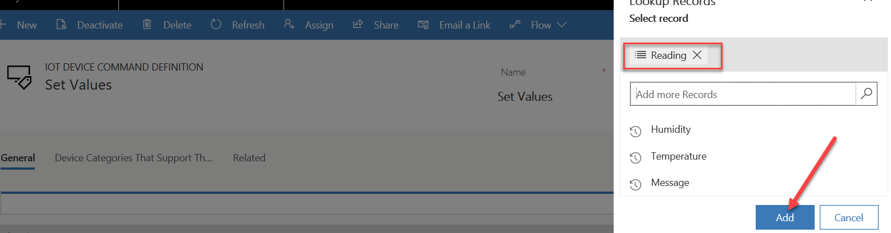
24.	Your completed Set Values command definition should resemble the image below:
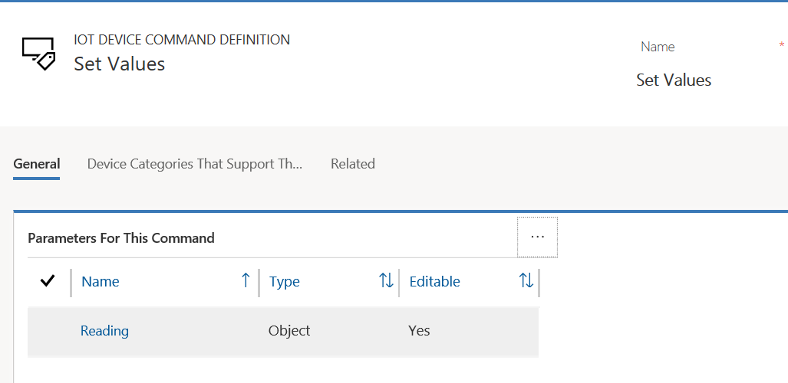

### Exercise 2: Using Definitions to Populate Commands 

#### Task 1: Attach to Simulator (Optional) 

Note: If you already have the simulator open from the Unit 3 exercise, you can skip straight to Task 2.  Otherwise follow the steps below to attach to the simulator.  

1.	In your web browser select a new tab and navigate to Https://Portal.Azure.com. Log into Azure if prompted. You need an Azure subscription associated with the account you are using.
2.	Select Resource Groups
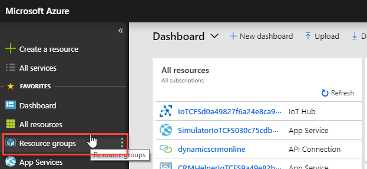
3.	Open the IoT Hub that you are using with Connected Field Service, and select the Simulator
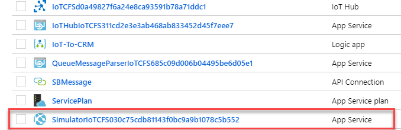
4. Click the Simulator URL to open the thermostat simulator. The simulator should open in a new tab.

5.	On the simulator click Connection.

6.	Switch back to your Azure subscription, close the simulator app service screen.

7.	Open the IoT Hub.
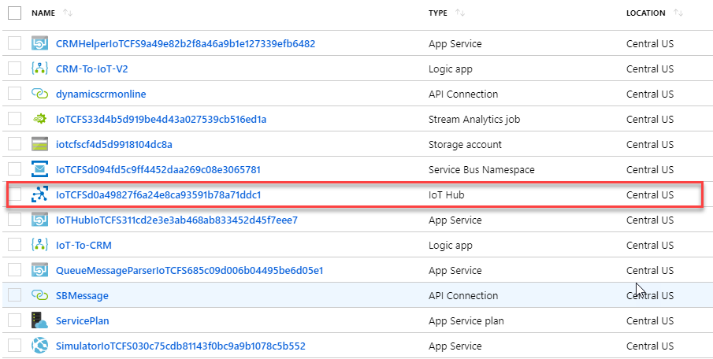
8.	Highlight the IoT Hub name and Copy it. 
 
9.	Switch back to your simulator screen and paste the IoT hub name into the Host field.
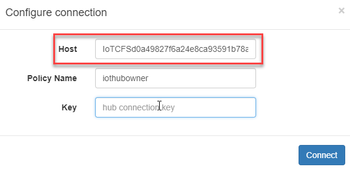
10.	Switch back to your Azure subscription, select Shared Access Policies.
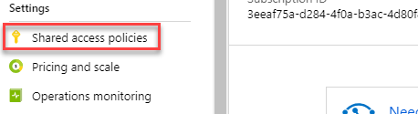
11.	Open the iothubowner policy and copy the Primary key.
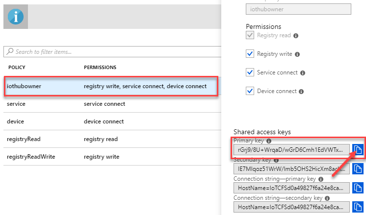
12.	Switch back to your simulator screen and paste the Primary Key into the Key field. 
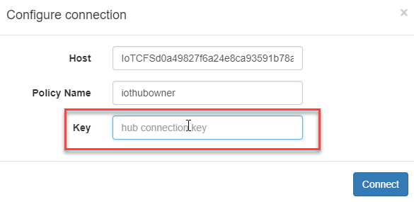
13.	Click the Connect button. Your Simulator is connected and ready to use.

## Task 2: Use Simulator to Generate and Interact with Alerts  

1.	With the simulator open, click the Refresh button to ensure all registered devices are available.
2.	From the Select a device drop down, select the smt-9876 device. A green dot should appear next to the refresh button, and after a few seconds it should start transmitting information.

3.	On the Temperature Slider, set it to 75 Degrees and wait for the temperature status to register on in the Messages Sent window.  
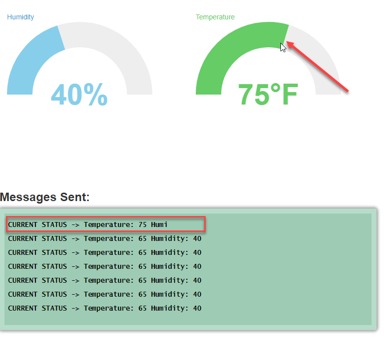
4. Switch to the browser tab that has Dynamics 365 loaded.
5. Select the Site Map Icon to expand navigation, select IoT Alerts.
6. Open the Temperature of 75 exceeded a threshold of 70 Alert.
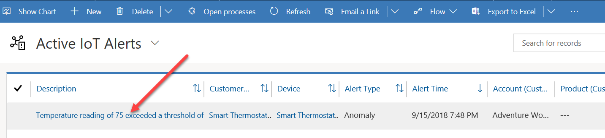
7. On the Command Bar, click Create command.
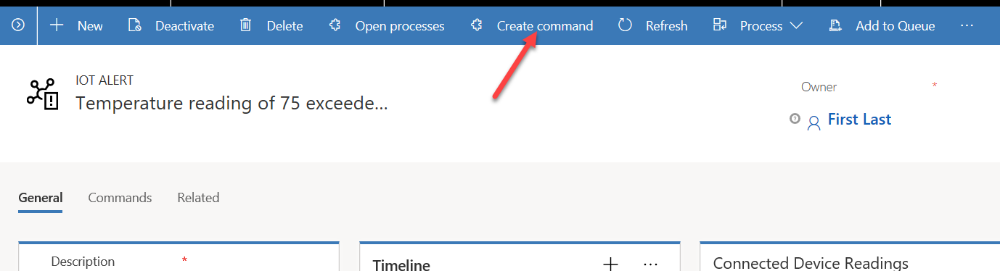
8. Configure the command as follows:
    - Name: Set Device Values
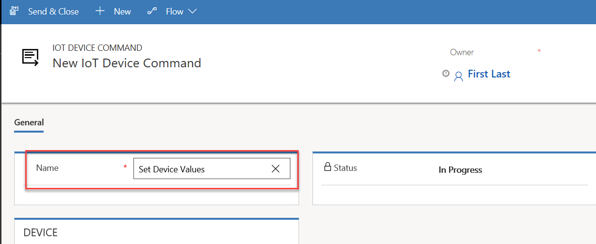
9. Under Message to Send, click in the lookup field next to Command, select the Set Values command.
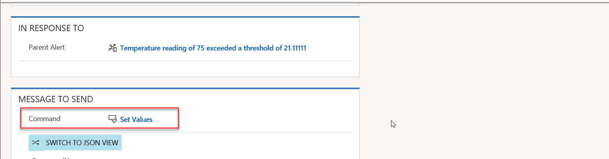
10.	The message should display with the Temperature and Humidity properties pre-defined.  
    - Change Temperature to 60
    - Change Humidity to 35
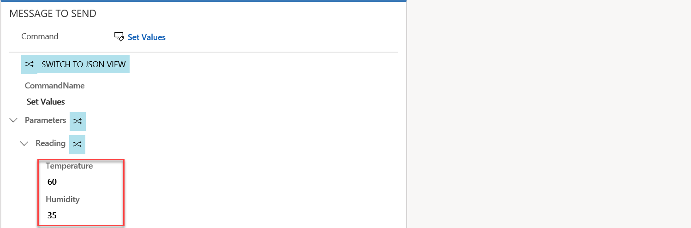
11.	The message should display with the Temperature and Humidity properties pre-defined.  
    a.	Change Temperature to 60
    b.	Change Humidity to 35

12.	On the Command bar, click the Send & Close button.  
13.	Switch back to your simulator, after a short while the device should have its values set to the values defined in the message.  Note: Depending on internet speeds, and other factors it can take several minutes for this to occur.
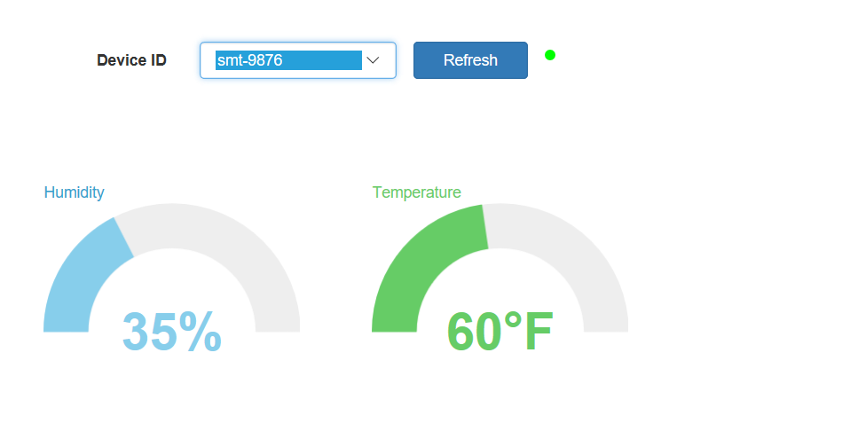
14.	Set the temperature on the device to 86 degrees and wait for it to register in the Messages Sent.
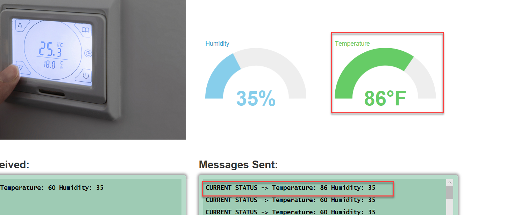
15.	Switch to the browser tab that has Dynamics 365 loaded.
16.	Select the Site Map Icon to expand navigation, select IoT Alerts.
17.	Open the Temperature of 86 exceeded a threshold of 70 alert.
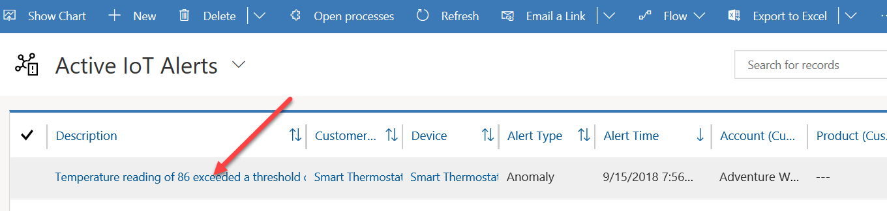
18.	On the Command Bar, click create command.
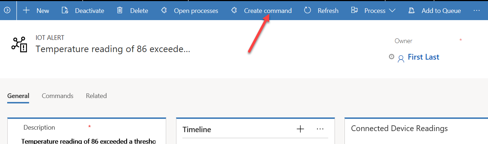
19.	Configure the command as follows:
    a.	Name: Dispatch Tech
20.	Under Message to Send, click in the lookup field next to Command, select the Set Values command.
21.	The message should display with the Message property pre-defined.  

22.	On the Command bar, click the Send & Close button.  
23.	Switch back to your simulator, after a short while a message should appear in the Messages Received that a Technician has been dispatched.  Note: Depending on internet speeds, and other factors it can take several minutes for this to occur.
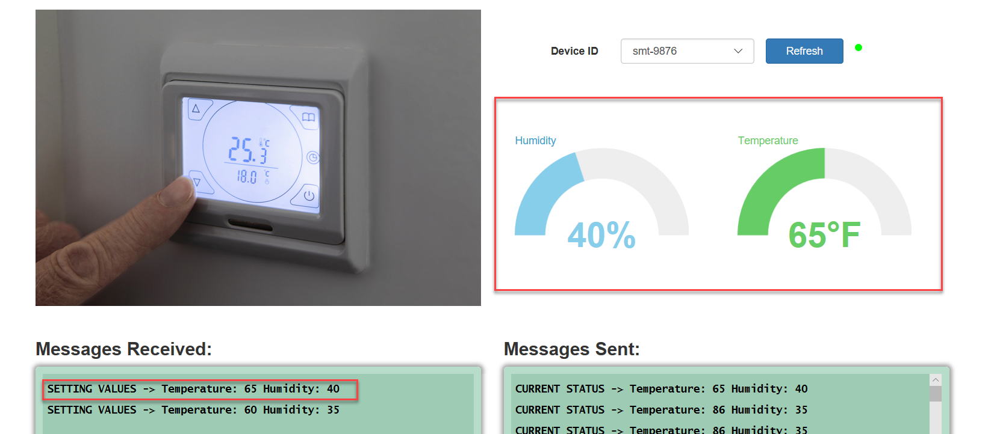

### Exercise 3: Automate sending of commands with Workflows

#### Task 1:  Create a new IoT Alert Process Solution

1.	In Dynamics 365 navigate to Settings > Solutions.
2.	Click the New button to add a new solution.
3.	Name the solution IoT Alert Processes.
4.	In the Publisher field, click the Lookup Icon, select Look up more records.
5.	Click New.
6.	Configure the Publisher as follows.
    - Display Name: Connected Field Service Course
    - Prefix: CFS
7.	Click Save and Close.
8.	Select the Connected Field Service Course publisher, click Add.
9.	In the Version field enter 1.0.0.0.
10.	Your solution should resemble the image below:

11.	Save the solution and leave it open.  
12.	Select Entities.
13.	Click Add Existing.
14.	Select the IoT Alert, entity.
15.	For each entity select Add All Assets.  Do not include required components

#### Task 2:  Customize the IoT Alert Entity 

1.	In the IoT Alert Process solution, expand Entities, expand the IoT Alert entity, and click fields.
2.	Click the New button, and configure the field as follows:
    - Display Name: Reading
    - Data Type: Whole Number
    - Minimum Value: 0
    - Maximum Value: 250
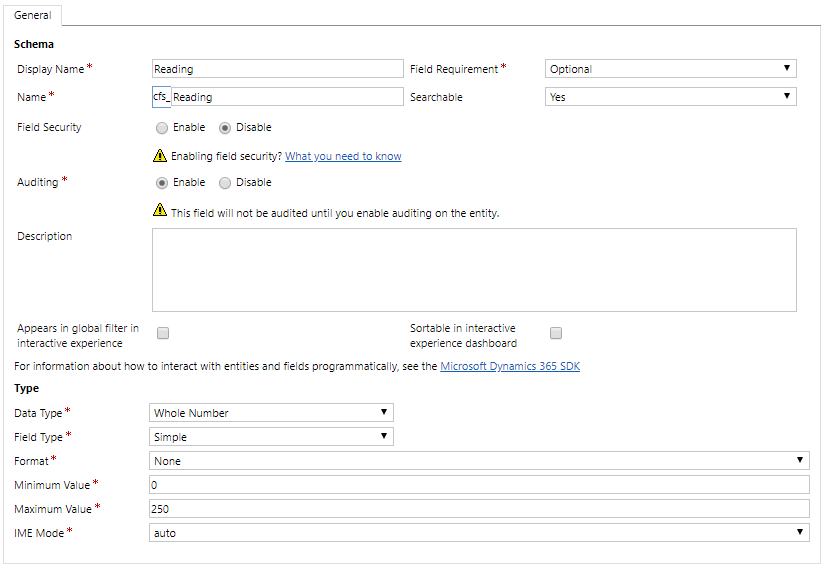
3.	Click the Save and New button
4.	Configure the new field as follows:
    - Display Name: Customer
    - Data Type: Lookup
    - Target Record Type: Account

5.	Click Save and Close.
6.	On the IoT Alert Processes solution, click Publish All Customizations.

#### Task 3: Create a Workflow to Populate Values to the Fields we created 

1.	In the IoT Alert Process solution, click Processes
2.	Click the New button
3.	Configure as follows:
    - Process Name: Populate Alert Fields
    - Category: Workflow
    - Entity: IoT Alert
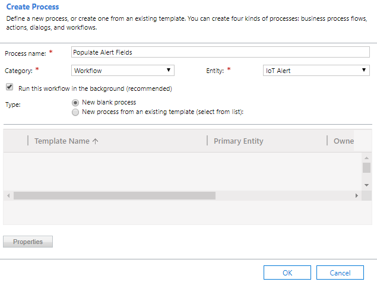
4.	Click OK
5.	Set the Workflow Scope to Organization
6.	Click the Add Step button and choose Perform Action. 
7.	Enter Get the Reading Value into the Description.
8.	Choose the JSON-Based Field Value – Get Number action, click Set Properties. 
9.	Set the Properties as follows:
    - Json: {Alert Data(IoT Alert)}
    - PropertyPath: reading
    - DefaultReturnValue: 70

10.	Click Save and Close
11.	Click the Add Step button again and choose Update Record.
12.	Enter Populate Values into the Description
13.	Make sure IoT Alert is selected, click Set Properties.  
14.	Configure as follows:
    - Customer: {Account(Device(IoT Device))}
    - Reading: {Value(Get the Reading Value)}
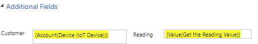
15.	Click Save and Close
16.	Your completed workflow should resemble the image below:
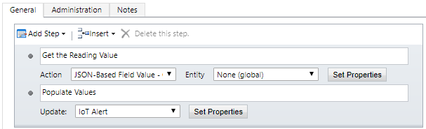
17.	Activate and Close the Populate Alert Fields Workflow.

#### Task 4: Create the Remote Set Values Workflow

1.	In the IoT Alert Process solution, select Processes.
2.	Click the New button
3.	Configure as follows:
    - Process Name: Auto Set Values
    - Category: Workflow
    - Entity: IoT Alert

4.	Click OK
5.	Set the Workflow Scope to Organization.
6.	Set it to Start When the Reading field Changes.

7.	Click the Add Step button, select Check Condition.
8.	Enter Temp between 71 & 85 into the Description
9.	Select the condition and configure as follows:
    - IoT Alert – Reading – Is Greater Than or Equal To – 71
    - IoT Alert – Reading – Is Less Than or Equal To - 85

10.	Click Save and Close
11.	Select the row beneath the condition and click the Add Step button.
12.	Select Create Record, enter Send Set Values Command in the description field, choose IoT Device Command, and select the Set Properties button.
13.	Configure the command as follows:
    - Name: {IoT Alert(IoT Alert)} Set Device Values
    - Customer Asset: {Customer Asset(IoT Alert)}
    - Device: {Device (IoT Alert)}
    - Device ID: {Device ID(Device (IoT Device))}
    - Parent Alert: {IoT Alert(IoT Alert)}
    - Command: Set Values
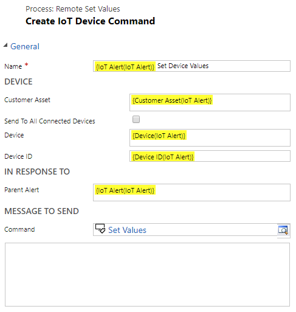
14.	Save and Close the Command record.
15.	Select the Send Set Values Command row, click the Add Step button, and select Change Status.
16.	Enter Deactivate IoT Alert into the Description field, set the IoT Alert record status to Inactive.

17.	Select the IoT Alert Reading condition, click the Add Step Button, and select Default Action.
18.	Select the new Row, click the Add Step button, and choose Stop Workflow.
19.	Your completed workflow should resemble the image below:
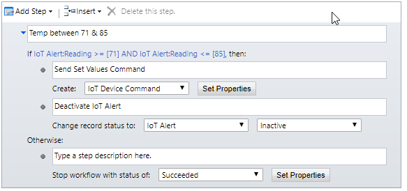
20.	Activate and Close the Remote Set Values workflow.
21.	Switch back to the web browser tab that contains your simulator. 
22.	Set the temperature to 80 Degrees and wait for it to register in the Messages Sent window.
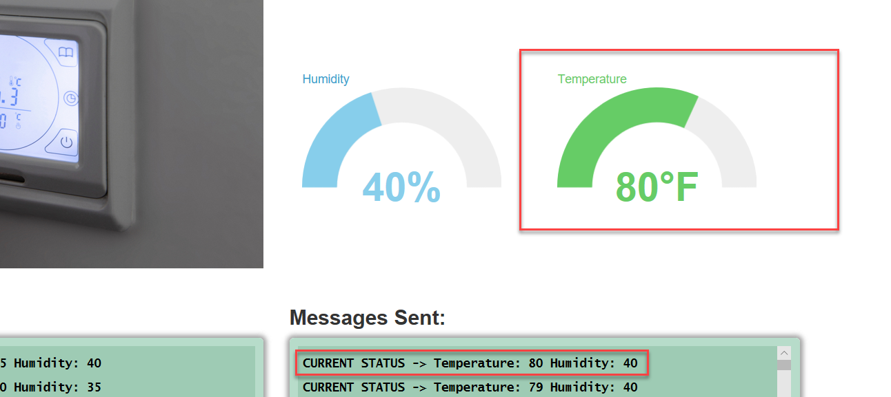
Because the temperature was between 71 and 85 degrees, a command will be sent to the device to set the values on the device.  Note: it can take several minutes for the Reboot command to be sent to the device.

23.	Switch to the browser tab that has Dynamics 365 loaded.
24.	Select the Site Map Icon to expand navigation, select IoT Alerts.
25.	Switch the view to Inactive IoT Alerts.
26.	Open the Temperature of 80 exceeded a threshold of 70 Alert.
27.	Select the Commands tab. You should see a Command that was sent to the device.
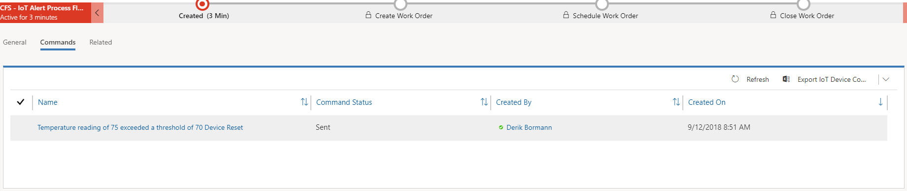
