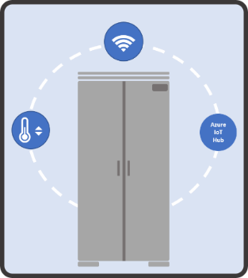
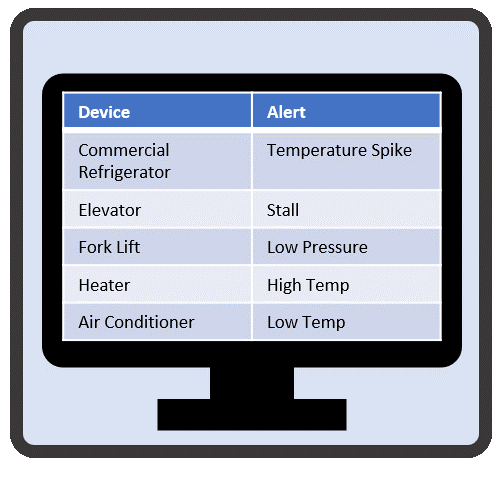
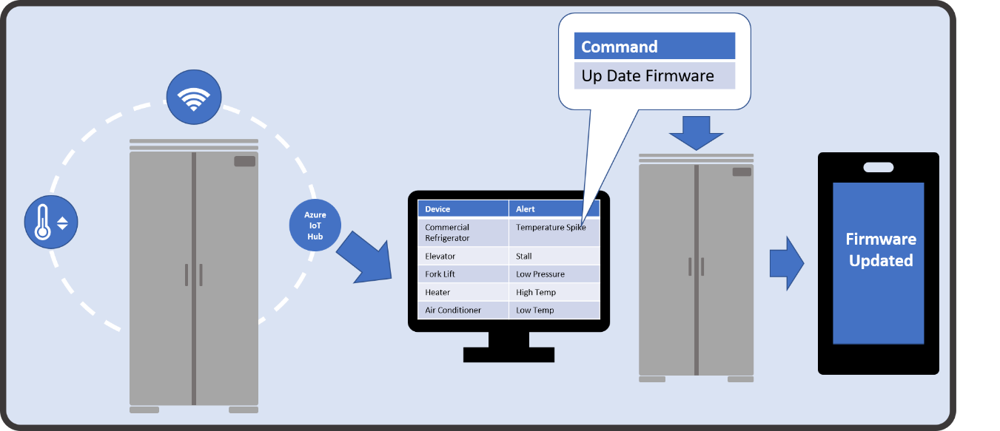

## Remotely Monitor and Service Customer Equipment Overview

With more and more devices being connected, a large amount of telemetry is available for organizations to capture, analyze, and act on.  Microsoft’s Connected Field Service Solution for Dynamics 365 combines monitoring and preventative maintenance with the Internet of Things (IoT) to replace your traditional break-fix service model with a more proactive never-fail model. Your organization can capture all the information that is being transmitted from your IoT-enabled devices and turn that information into actionable items that can be executed directly from a Dynamics 365 instance.  

  

Customer assets such as appliances, equipment, sensors, or any IoT-enabled device can be registered with an Azure IoT Hub or in IoT Central directly from within Dynamics 365 or the Field Service mobile application. Assets that contain multiple sensors can be grouped and registered at one time to simplify deployment. For example, a refrigerator might be equipped with multiple sensors. It might contain a temperature sensor that monitors the overall temperature of the unit, but it might also contain multiple moisture sensors that monitor specific moisture levels of specific zones. It might even contain a motion sensor that monitors how often the door of the unit is opened.       

Once an asset (such as the above-mentioned refrigerator) that is equipped with a sensor is registered as an IoT device and connected to the internet, it will begin sending information such as temperature readings to either an Azure IoT Hub or to IoT Central. When a spike or drop in temperature is detected, an alert is surfaced for the device in Dynamics 365. Based on the conditions defined in the alert (type, severity, and so on), it can trigger an automated process that will assist in handling and resolving of the alert. For example, if a compressor unit on a device fails, your organization might elect to dispatch a technician as soon as possible. A work order can be automatically created, and the specific compressor needed to resolve the issue can be added to the work order as a necessary part.    

 

Sometimes when an alert is triggered it might not require on-site assistance. You might interact with the device remotely by sending commands directly to the device from within Dynamics 365. For example, if an increase in temperature is detected, it might get routed to a specific queue where a technician might remotely send a command to the device to perform a firmware update.  

     
 
Devices can be grouped into categories to make it easier to define specific properties that are unique to those types of devices. Each alert that is triggered or remote command that is sent to a device is stored directly in Dynamics 365, so you can easily view the history of what has occurred and what actions have been taken on those devices. Because the records are stored in Dynamics 365, you can easily create business process flows that can be used to assist in troubleshooting procedures, assist with remotely sending commands, route items to queues, or even create work orders. All the information captured can be made available to technicians from within the mobile app when they are dispatched, so they have a complete history available to them when they arrive at a customer location.      

As we work through the remainder of this module, we will examine each of the steps involved in more detail.  

<!--note from editor: The URL is visible - is that what you want?--> 

Reference Link: Use Connected Field Service to remotely monitor and service customer equipment.  
[https://www.youtube.com/watch?v=Kb5LSac2Dy4&feature=youtu.be&spfreload=1](https://www.youtube.com/watch?v=Kb5LSac2Dy4&feature=youtu.be&spfreload=1")
