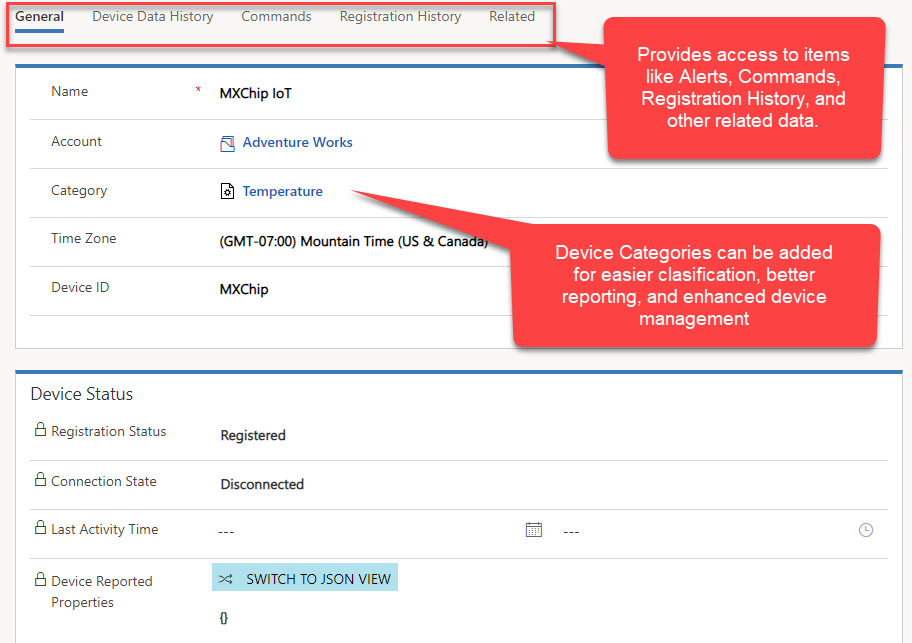
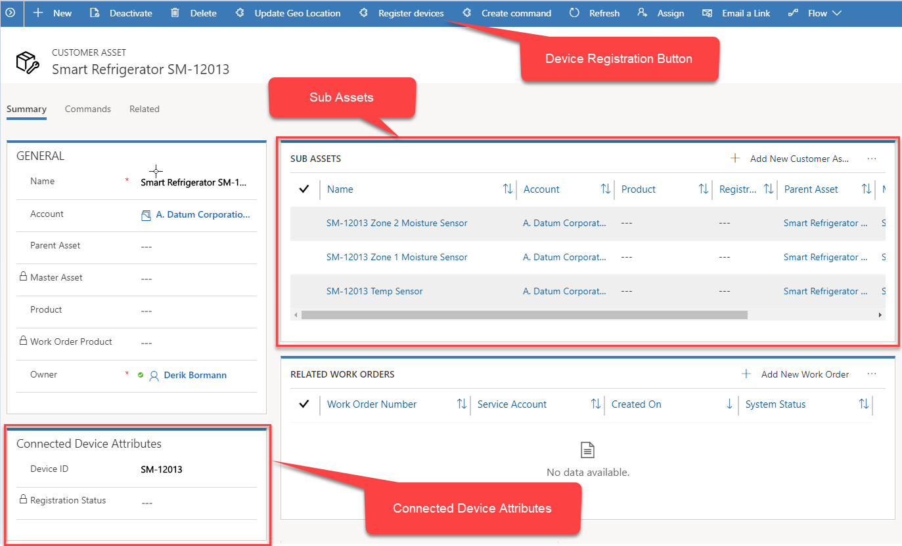
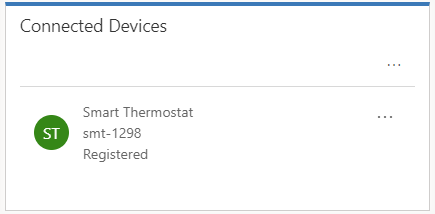
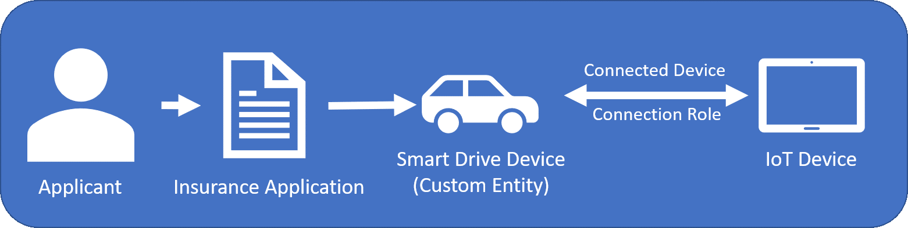

Before device and telemetry data can be consumed by Dynamics 365 Connected Field Service, the device must first be registered with either Azure IoT Hub or IoT Central as an IoT device. When Connected Field Service is installed, a new entity is added in your Dynamics 365 organization called IoT Device. Once a device is registered with Azure IoT Hub or IoT central (either directly in Azure, from Dynamics 365, or another means), a corresponding IoT Device record is created automatically in Dynamics 365.   

   

From within the device’s record you can see any relevant information for the device. This includes alerts, registration and connection status, registration history, and more. 

When you want to track a specific piece of customer equipment at a customer location in Field Service, you create a Customer Asset record. Since many customer assets will often be IoT-enabled devices, customer assets can also be registered as IoT devices. When a Customer Asset is created in Dynamics 365, the asset record contains a Connected Device Attributes section. This section stores the Device ID and the Registration Status of the connected device. A customer asset can be registered as a device directly from the Customer Asset record in Dynamics 365. The exception to this is when working with the mobile application. 
 
> [!IMPORTANT] 
> You cannot associate an asset with a device using the Field Service mobile app.   

   

As mentioned in the previous unit, there are many instances when an IoT-enabled customer asset might have multiple IoT sensors associated with it. In these instances, each of these IoT sensors could have a customer asset created for them that is attached to the Master Asset record.   

Connected Field Service uses Dynamics 365’s Connections and Connection Roles functionality to link Customer Asset records with IoT Device records. There is a connection role called **IoT Connected Device**. When a customer asset is registered as an IoT device, the connection is automatically created using this role.     

  

Not only does this make it easier to manage IoT-enabled devices, but it also means that from an extensibility standpoint, you can use the same IoT Connected Device connection role to associate and manage other entities as IoT devices from within Dynamics 365. For example, a company that sells insurance policies might want to measure driver patterns (such as speed, average miles driven, acceleration and deceleration rates) before issuing policies to truly ensure that the rate quoted matches their driving style. When a client applies for a new policy and is given a device, the device can be registered and associated with the potential customer’s insurance application.
  
   

At times, a device might not register. A registration error might occur for many reasons. The most common reason is when Dynamics 365 is not connected to Azure or if Azure is offline. When this happens, there will be an error in the Registration Status field of the asset record. For assets with multiple devices, the device status will show the error message for each device.

In the next unit we will explore how to use Connected Field Service to interact with devices.

