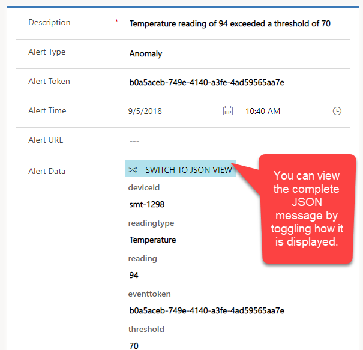
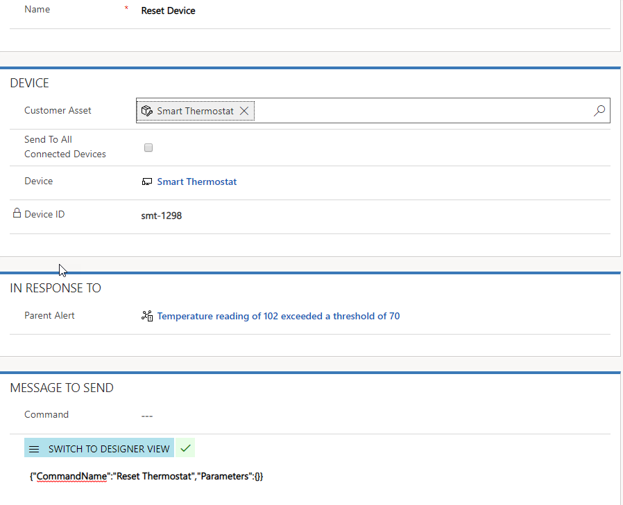

Once your IoT enabled Customer Assets are registered with either an Azure IoT Hub or IoT Central, readings from the device will be captured based on the configuration.  From within Azure IoT Hub or IoT Central, you can define how and when you want to trigger an alert that can be sent back into Dynamics 365.  For example, let’s say that you have an IoT enabled thermostat.  The device will constantly send temperature readings back to the IoT Hub.  As soon as a temperature reading that is outside of your specified threshold is discovered, it will generate an IoT alert record in Dynamics 365. 

Dynamics 365 Connected Field Service solution contains several record types that can be used to assist in sending commands back to the device. 
 
The table below defines some of the key record types that are used.  

| **Record Type** | **Use** |
| :--- | :--- |
| **Device Category** | Allows for grouping of IoT devices by a specific category.  Device categories can be used in conjunction with Command Definitions for easier device management |
| **Command** | Used to remotely interact with a connected IoT device by passing JSON commands the device. |
| **Command Definition** | Used to predefine commands to streamline sending them to devices.  When creating a Command, a Command Definition can be selected, and any defined properties will be populated. |
| **Property Definition** | Used to define specific properties that can be passed as part of a Command Definition. |

When you install and configure the Connected Field Service solution, you have the option to setup a Power BI chart.  This requires that you add a SQL database to your IoT Hub, and then connect it to a Power BI template that will assist in publishing device readings to a chart in Dynamics 365.   If you chose to configure Power BI, once the device is registered, you will be able to view readings sent by the device directly on the Customer Asset record.  By default, you can see the last 20 readings, but you can change the default settings in the report by using Power BI desktop. 
 
Once an alert is received, it will contain all the relevant information about the device alert.  The alert data will take the JSON data generated by the alert and display it in the application.  This information can be leveraged when determining the next action to take.  

   

Many times, you may be able to resolve the issue remotely by simply resetting or sending a command back to the device.  A command can be executed from a customer asset record, an alert, or automated using workflows.  

   

A command consists of JSON that is sent back to the device.  The command has parameters that it passes through to the device.  To assist in passing commands back to devices, command definitions and property definitions can be used to make command creation easier and more flexible.    Command and property definitions are discussed in more detail in another course.  