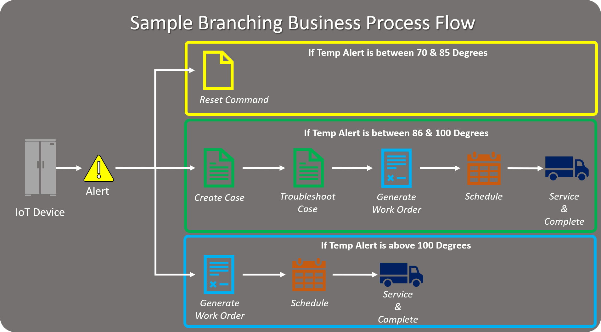
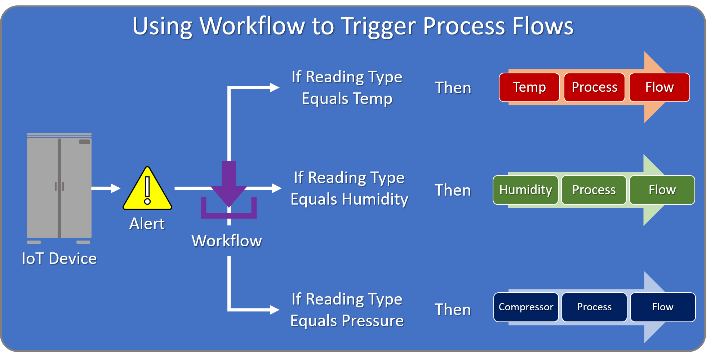

## Designing Processes for Connected Field Service

<!--note from editor: The last part of the first sentence is unclear: "provide guidance for uses as then work with these devices." Please revise.-->

Now that you have officially started to collect data, detect anomalies, and extract the relevant data for our IoT devices, the final step is to decide what to do with it and provide guidance for uses as then work with these devices. Before you start to define processes, it is important to understand what the desired outcome is that you are trying to achieve and determine what is needed to get to that point.  

The following image shows an example of a business process flow that branches based on the reading value provided on a temperature alert.  

   

The business process flow is associated with the IoT alert entity and leverages the value in the Device Reading field.  

**Based on this value, we can:**

- *Send a reset command directly to the device if the temp reading is between 70 and 85 degrees.*
- *Branch into our standard resolution process that first creates the case, then generates a work order, dispatches the work order, and finally has the technician servicing the work order when the temp reading is between 86 and 100 Degrees.*
- *Skip the case stages completely and go directly to the Work Order creation stage if the temp reading is above 100 Degrees.* 

By leveraging workflow automation in conjunction with business process flows, this concept could be taken one step further, and instead it could execute a different business process flow based on the alert.   
   
For example: Let’s say you have created the following business process flows for the IoT alert entity.
  
- Temperature Alert Process Flow
- Humidity Alert Process Flow
- Compressor Alert Process Flow

When an alert is generated, we could execute a workflow that uses the JSON-Based Field Value – Get String action to capture the “readingtype” property from the JSON passed into the Alert Data field. The workflow could then populate a custom field called Reading Type on the alert record.  

Since we have the ability to interact with business process flows using workflow, it would be possible to design a workflow that would execute the appropriate business process flow based on the value in the Reading Type field.

<!--note from editor: Is it correct that "If reading type equals humidity" appears twice in the following image?--> 

   

Additionally, you can execute workflows when you enter or exit a specific stage of a business process flow. This could be handy when you are thinking about sending commands or device registration based on items that you have captured in records you are working with. Out of the box, Connected Field Service ships with the following actions: 

| **Display Name** | **Description** |
| :-------------- | :--- |
| **IoT - Register Customer Entity** | Registers any custom entity that may or may not already have connected IoT devices. This action invokes the IoT – register device action. |
| **IoT - Register Device** | Publishes the registration for an IoT device. |
| **IoT – Debounce IoT Alerts** | Links potential redundant alerts to an existing parent alert.  |

<!--note from editor: In the last sentence of this paragraph, is BFP supposed to be business process flow?-->

By creating workflows that call those actions, you could then associate those workflows with either the entry or exit of a specific stage in your business process flow. For example, you might have a business process flow that is associated with a custom entity that is also going to be leveraged as an IoT device. By creating a workflow that calls the IoT - Register Customer Entity action and setting it to run on exit of a specific stage, you could then evaluate specific items on the record and have the BFP register the device automatically if specific conditions are met.  

Regardless of how you plan to automate and guide users through specific processes, it is important to remember that each process you design should:

- Have a specific beginning. *(Example: Alert being triggered)*
- Have a specific end. *(Example: A work order being closed)*
- Have a repeatable procedure with specific stages and steps. *(Example: Alert – Case – Work Order -Service Delivery)*
- Take into consideration variables that might affect the process flow. *(Example: An outage versus a warning)*

  
