### Lab Environment
In this lab, you will work in a simulated environment with the following computers or virtual machines.

***Computers and virtual machines used in this lab***

| **Item Name** | **Description** |
| :-------------- | :--- |
| Dynamics 365 Online Non-Production Instance | You should have a Dynamics 365 Online environment that you use for this lab; it should not be your production (live) instance. |
| Dynamics 365 Field Service | You should have Dynamics 365 for Field Service deployed to the Online Trial that you use for this lab. |
| Connected Field Service | You should have Connected Field Service deployed to the Online Trial that you use for this lab. |
| Azure IoT Hub | You should have a Azure IoT Hub set up and deployed that Connected Field Service is talking to.  |

### Lab Overview

The Dynamics 365 Connected Field Service solution provides the ability to remotely monitor IoT-enabled devices to keep track of uptime, device statistics, anomalies, and more. After an IoT device communicates an anomaly or exception, that information is sent to Connected Field Service as an alert. Once the alert is captured, you can leverage the ability of Dynamics 365 to create automation and business processes to develop automated processes for acting on, routing, and fixing the issues.  

The purpose of this hands-on lab is to introduce you to building and automating Connected Field Service processes, as well as to demonstrate how these actions can be leveraged as part of an overall IoT solution.  

***Learning objectives***

At the end of these exercises, you will be able to accomplish the following:

- Leverage Connected Field Service’s actions to extract relevant data from the generated alert.  
- Customize Dynamics 365 entities to store necessary alert data. 
- Build workflows to automate capturing alert data and populating it to Dynamics 365 entities. 
- Build workflows to automate the creation of IoT device commands for interacting with devices.
- Create Field Service-related business process flows that offer branching options. 

#### Scenario

You work for a plumbing and heating company that sells and services smart home devices. Since many of the devices that you service are smart devices, information from those devices can be captured remotely to aid in the servicing of that equipment. Your organization has several defined scenarios and processes that they use when servicing equipment. These processes can vary depending on several factors, including:

- Type of device in need of service
- Severity of the issue detected
- Age of the device
- Location of the device
- Availability of resources to work on a specific device.

The items listed here represent only a small portion of factors that your organization uses to determine the process for servicing equipment.  

Lately, you have been installing a lot of smart thermostat devices. These devices have been very handy in being able to track temperature and humidity readings in areas when it is important to maintain a consistent temperature and humidity. Now, because you have more information available, it has forced you to create new processes for handling and resolving issues reported by these devices. The first area you would like to automate is the process used for temperature-related issues.  

Your organization is looking to implement the following process:

- If a device detects a temperature reading of more than 70 degrees, an alert should be surfaced in your Connected Field Service environment.  

- If the temperature reading is between 70 and 85 degrees, a command should be sent to remotely reset the device to see if the issue resolves itself.  

- If the temperature reading is between 86 and 100 degrees, a service agent should be able to create a case to attempt to resolve the issue.  
	- If the issue cannot be resolved by the service agent, a work order should be created, and an on-site technician should be scheduled for the item.  

- If the temperature reading is more than 100 degrees, it is considered a potentially catastrophic event, and a work order should be created, and an on-site technician should be scheduled for the item.  

### Lab Completion Requirements

After completing the tasks in this exercise, you will be able to:

- Customize Connected Field Service entities to needed data for resolving issues. 
- Trigger Dynamics 365 actions that will extract relevant data from triggered alerts.
- Create automations that place the extracted data into the appropriate Dynamics 365 fields.
- Design automations that automatically interact with devices based on specific criteria.
- Design business process flows that provide alternate resolution paths based on specific data. 

### Exercise: Automate and Customize 

**Before you begin:** This exercise assumes that you already have a working Connected Field Service deployment that is connected with either an Azure IoT hub or an IoT Central instance. If you do not have a Connected Field Service environment available, it is recommended that you take the *Introduction to Connected Field Service* module. This will help you to set up and configure a Connected Field Service environment.  

#### Task 1: Create a new IoT alert process solution

In this task, you will be creating a Dynamics 365 solution that you can use for storing all of the customizations and processes that you will be creating. Not only will this make it easier to potentially transport these customizations later, but it will also assist in cleaning up your environments after you have completed the course.  

1. In **Dynamics 365**, navigate to **Settings** > **Solutions**.
1. Select **New** to add a new solution.
1. Name the solution **IoT Alert Processes**.
1. In the **Publisher** field, select the **Lookup** icon and then select **Look up more records**.
1. Select **New**.
1. Configure the **Publisher** as follows:
	- **Display Name:** *Connected Field Service Course*
	- **Prefix:** *cfs*
1. Select **Save and Close**.

	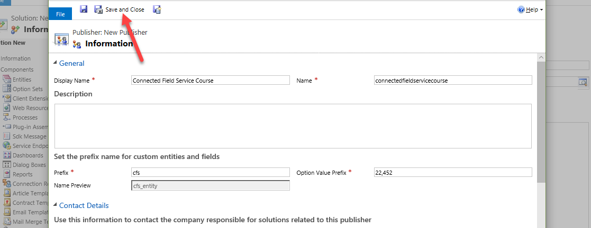 

1. Select the **Connected Field Service Course** publisher and then select **Add**.

	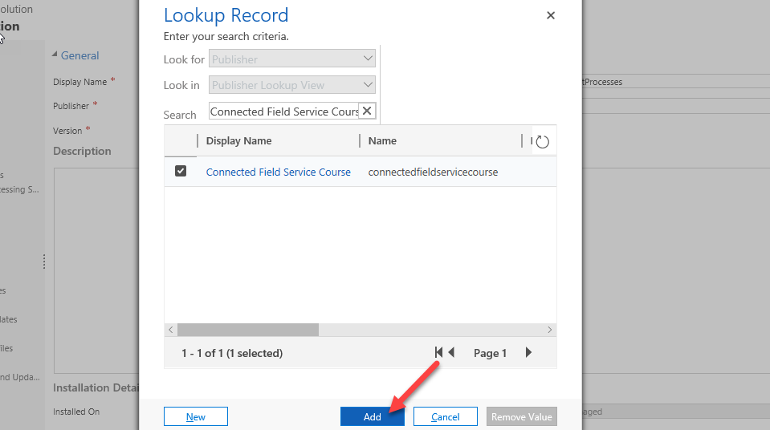 

1. In the **Version** field, enter **1.0.0.0**.
1. Your solution should resemble the following:

	

1.	Save the solution and leave it open.  
1.	Select **Entities** and then select **Add Existing**.

	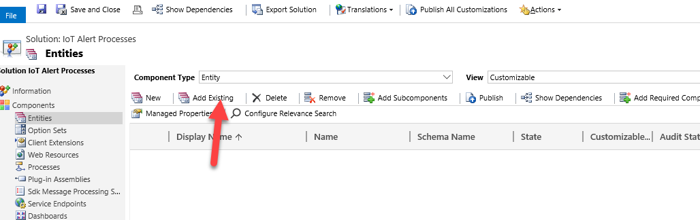

1.	Select the **Case**, **IoT Alert**, and **Work Order** entities.
1.	For each entity, select **Add All Assets**. Do not include required components.

	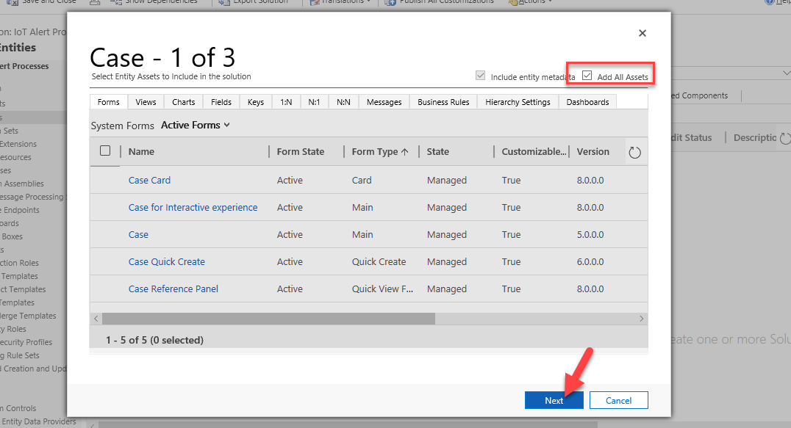

#### Task 2:  Customize the IoT alert entity
 
To assist in automating items and actions based on IoT alerts, you will need to be able to extract specific information for generated IoT alerts. You can query it and trigger items based on that data. Since the alert data contains only a JSON string that contains all the data, you will need to create some additional fields on the IoT alert entity that you can use to send specific data into and build queries off those fields.  

1. In the **IoT Alert Process** solution, expand **Entities**, expand the **IoT Alert entity**, and select **Fields**.
1. Click **New** and configure the field as follows:
	- **Display Name:** *Reading*
	- **Data Type:** *Whole Number*
	- **Minimum Value:** *0*
	- **Maximum Value:** *250*
	
	  

1. Select **Save and New**.
1. Repeat the process to add the fields defined below:
	1. **Threshold**
		- **Display Name:** *Threshold*
		- **Data Type:** *Whole Number*
		- **Minimum Value:** *0*
		- **Maximum Value:** *250*
	1. **Reading Type**
		- **Display Name:** *Reading Type*
		- **Data Type:** *Two Options*
		- Change the **No** value to **Temperature**
		- Change the **Yes** value to **Humidity**
		- **Default Value:** *Temperature*
	1. **Rule Output**
		- **Display Name:** *Rule Output*
		- **Data Type:** *Single Line of Text*
1. Select **Save and New**.
1. Configure the new field as follows:
	1. **Display Name:** *Customer*
	1. **Data Type:** *Lookup*
	1. **Target Record Type:** *Account*
	
	  

1.	Select **Save and Close**.
1.	Select **1:N** Relationships and then select **New**.

	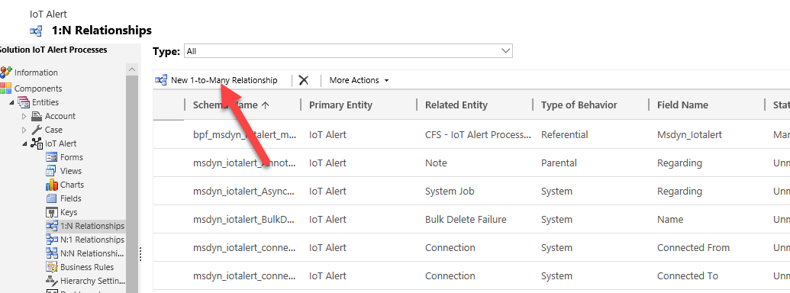

1.	Configure the relationship as follows:
	- **Primary Entity:** *IoT Alert*
	- **Related Entity:** *Case*
	- **Display Name:** *IoT Alert*
	
	  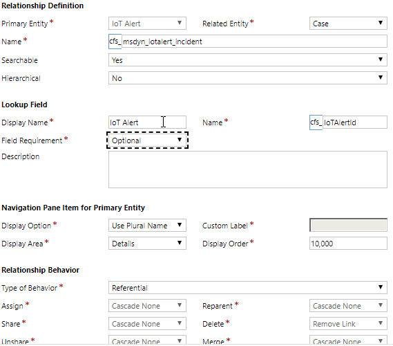

1.	Select **Save** to save the relationship and leave the record open.
1.	Under Common, select **Mappings** and select **New**.

	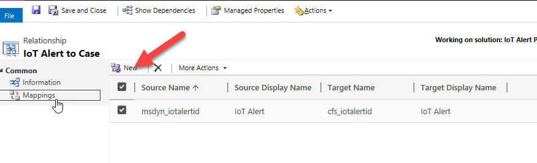

1.	Configure the mapping as follows and then select **OK**.
	1. **Source Entity Field:** *cfs_customer*
	2. **Target Entity Field:** *customerid*
	
	  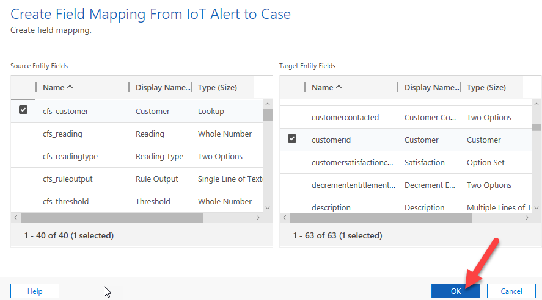

1.	Click **Save and Close**.

#### Task 3: Create a workflow to populate values

Now that you have the fields available in which to store the data that you need, you will populate those fields with the correct data. To do this, you will leverage some of the JSON–based field value actions that are included in the Connected Field Service solution. You will create a workflow that executes a JSON–based field value action to extract a specific piece of data from the alert data field, and then populate that data to one of the fields created in the previous task.

1.	In the **IoT Alert Process** solution, select **Processes** and then select **New**.

	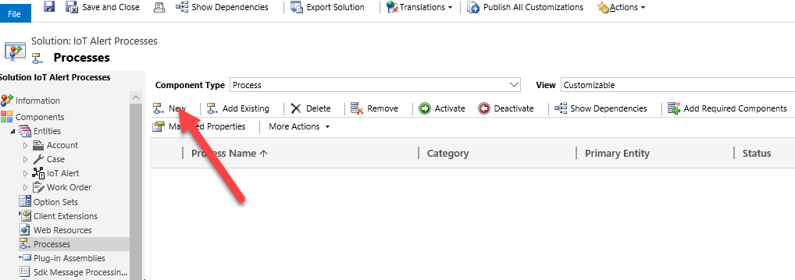

1.	Configure as follows:
	- **Process Name:** *Populate Alert Fields*
	- **Category:** *Workflow*
	- **Entity:** *IoT Alert*
	
	  

1.	Select **OK**.
1.	Set the **Workflow Scope** to **Organization**.
1.	Select **Add Step** and choose **Perform Action**.

	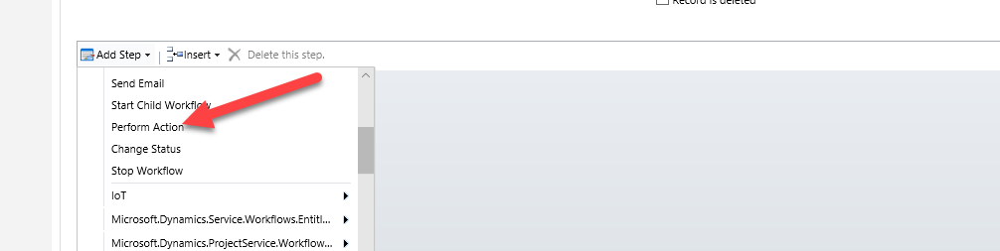

1.	Enter **Get the Reading Value** into **Description**.
1.	Choose the **JSON-Based Field Value – Get Number** action and then select **Set Properties**.

	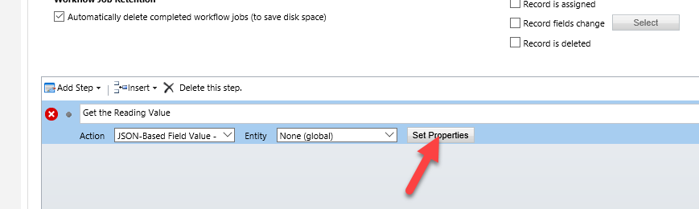

1.	Set the Properties as follows:
	- **Json:** *{Alert Data(IoT Alert)}*
	- **PropertyPath:** *reading*
	- **DefaultReturnValue:** *70*
	
	  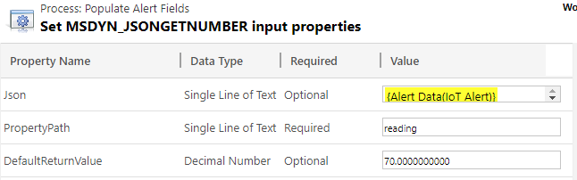

1.	Select **Save and Close**.
1.	Select **Add Step** again and choose **Perform Action**. 
1.	Enter **Get the Threshold Value** into **Description**.
1.	Choose the **JSON-Based Field Value – Get Number** action and then select **Set Properties**. 
1.	Set the properties as follows:
	- **Json:** *{Alert Data(IoT Alert)}*
	- **PropertyPath:** *threshold*
	- **DefaultReturnValue:** *70*
	
	  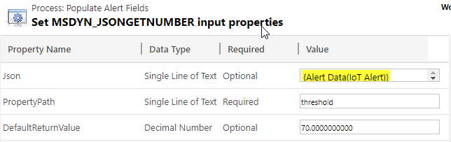

1.	Select **Save and Close**.
1.	Select **Add Step** again and choose **Perform Action**. 
1.	Enter **Get the Reading Type Value** into **Description**.
1.	Choose the **JSON-Based Field Value – Get Boolean** action and then select **Set Properties**. 
1.	Set the properties as follows:
	- **Json:** *{Alert Data(IoT Alert)}*
	- **PropertyPath:** *readingtype*
	- **DefaultReturnValue:** *false*
	
	  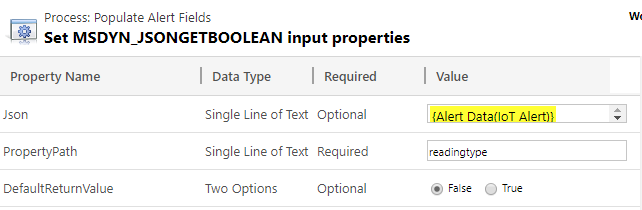

1.	Select **Save and Close**.
1.	Select **Add Step** again and choose **Perform Action**. 
1.	Enter **Get the Rule Output Value** into **Description**.
1.	Choose the **JSON-Based Field Value – Get String** action and then select **Set Properties**. 
1.	Set the properties as follows:
	- **Json:** *{Alert Data(IoT Alert)}*
	- **PropertyPath:** *ruleoutput*
	- **DefaultReturnValue:** *Alarm*
	
	  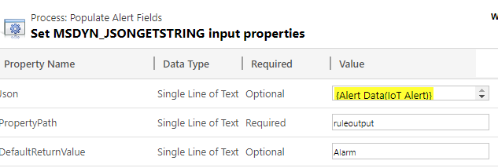

1.	Select **Save and Close**.
1.	Select **Add Step** again and choose **Update Record**.
1.	Enter **Populate Values** into **Description**.
1.	Make sure **IoT Alert** is selected and then select **Set Properties**.  
1.	Configure as follows:
	- **Customer:** *{Account(Device(IoT Device))}*
	- **Reading:** *{Value(Get the Reading Value)}*
	- **Reading Type:** *{Value(Get the Reading Type Value)}*
	- **Rule Output:** *{Value(Get the Rule Output Value)}*
	- **Threshold:** *{Value(Get the Threshold Value)}*
	
	  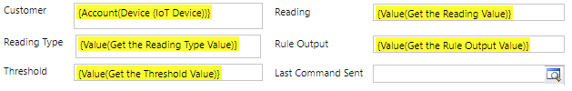

1.	Select **Save and Close**.
1.	Your completed workflow should resemble the following:

	

1.	**Activate and Close** the **Populate Alert Fields** workflow.

#### Task 4: Create the remote reset workflow

Now that you have extracted the correct data and placed it in the correct fields, you need to create a workflow that will determine the temperature value in the reading field. If the temperature ranges between 71 and 85 degrees, an IoT device command should be automatically created and sent to the device that will perform a device reset.  
 
1.	In the **IoT Alert Process** solution, select **Processes**.
1.	Select **New**.
1.	Configure as follows:
	- **Process Name:** *Auto Remote Reset*
	- **Category:** *Workflow*
	- **Entity:** *IoT Alert*
	
	  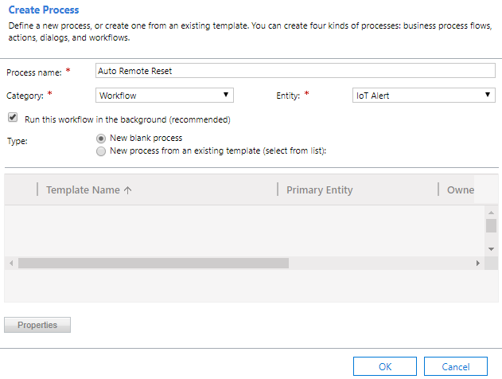

1.	Select **OK**.
1.	Set the **Workflow Scope** to **Organization**.
1.	Clear **Start when Record is Created**, select **Record Fields Change**, and then select **Select**.

	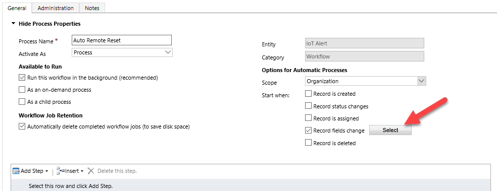

1.	Select the **Reading** field and then select **OK**.

	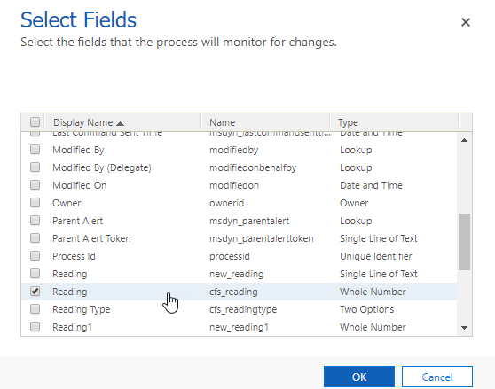

1.	Select **Add Step** and then select **Check Condition**.
1.	Enter **Temp between 71 & 85** into the description.
1.	Select the condition and then configure as follows:
	1. **IoT Alert – Reading – Is Greater Than or Equal To – 71**
	1. **IoT Alert – Reading – Is Less Than or Equal To - 85**
	
	  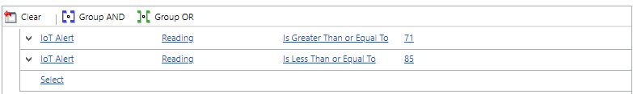

1.	Select **Save and Close**.
1.	Select the row beneath the condition and then select **Add Step**.
1.	Select **Create Record**, enter **Send Reset Command** in the description field, choose **IoT Device Command**, and then select **Set Properties**.

	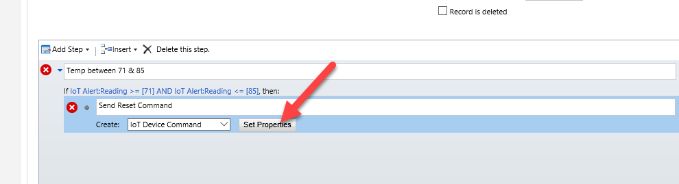

1.	Configure the command as follows:
	1. **Name:** *{IoT Alert(IoT Alert)} Device Reset*
	1. **Customer Asset:** *{Customer Asset(IoT Alert)}*
	1. **Device:** *{Device (IoT Alert)}*
	1. **Device ID:** *{Device ID(Device (IoT Device))}*
	1. **Parent Alert:** *{IoT Alert(IoT Alert)}*
	1. **Message:** *{"CommandName":"Reset Thermostat","Parameters":{}}*
	
	  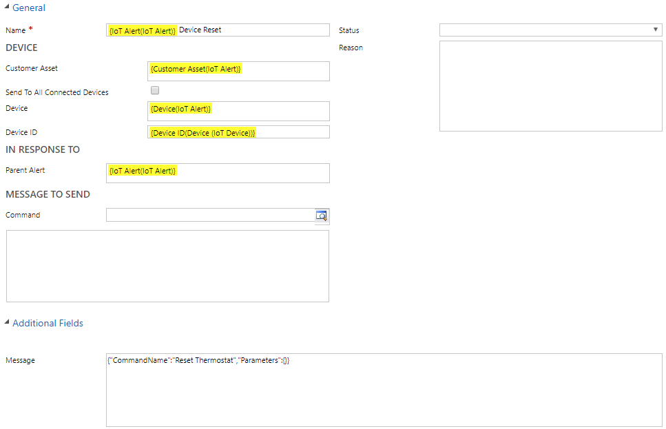

1.	**Save and Close** the **Command** record.
1.	Select the **Send Reset Command** row, select **Add Step**, and then select **Change Status**.
1.	Enter **Deactivate IoT Alert** into the **Description** field and then set the **IoT Alert** record status to **Inactive**.

	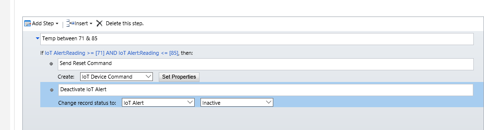

1.	Select the **IoT Alert Reading** condition, select **Add Step**, and then select **Default Action**.
1.	Select the new **Row**, select **Add Step**, and then choose **Stop Workflow**.
1.	Your completed workflow should resemble the following:

	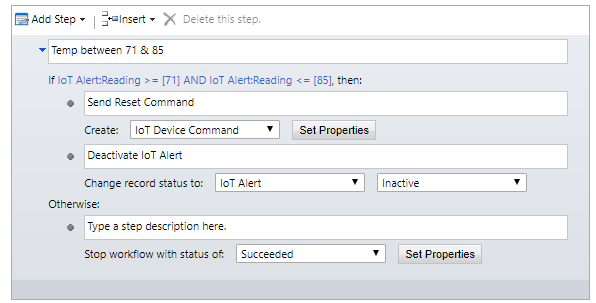

1.	**Activate and Close** the **Auto Remote Reset** workflow.

#### Task 5: Modify the CFS – IoT alert process flow

Currently you are using a business process flow called *CFS – IoT Alert Process Flow* to guide users in resolving an alert when it is triggered. When a temperature reading is between 86 and 100 degrees, you should create a case record in the business process and then a work order if the case cannot be resolved. If the temperature reading is above 100 degrees, the business process should skip the case stage all together and go straight to a work order. In this task, you will modify the CFS – IoT Alert Process Flow to reflect these specific needs.   
 
1.	In the **IoT Alert Process** solution, select **Processes** and then select **Add Existing**. 

	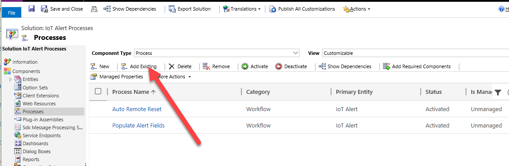

1.	Select **CFS – IoT Alert Process Flow** and then select **OK**.

	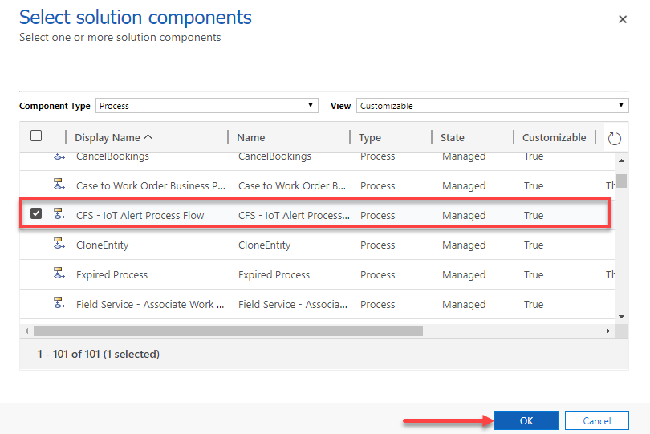

1.	Select **Yes, Include required components** and then select **OK**. 
1.	Open **CFS – IoT Alert Process Flow**.
1.	Select **Deactivate** to deactivate the process.

	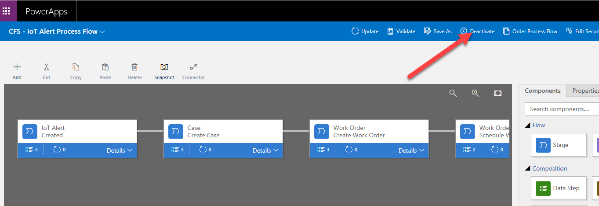

1.	Expand **Details** on the **IoT Alert Created** stage.  

	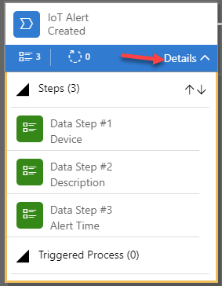

1.	Under **Components**, drag **Data Step** below the **Alert Time** step.

	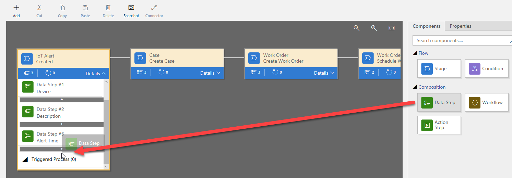

1.	Configure Data Step as follows:
	- **Step Name:** *Reading*
	- **Data Field:** *Reading*
	
	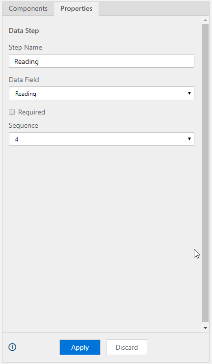

1.	Select **Apply** to save your changes.  
1.	Repeat steps 7–9 to add the following **Data Steps** to the **IoT Alert Created** stage:
	- **Threshold**
	- **Reading Type**
	- **Rule Output**
1.	Select the **Components** tab and then drag the **Condition** component to the right of the **IoT Alert Created** stage.

	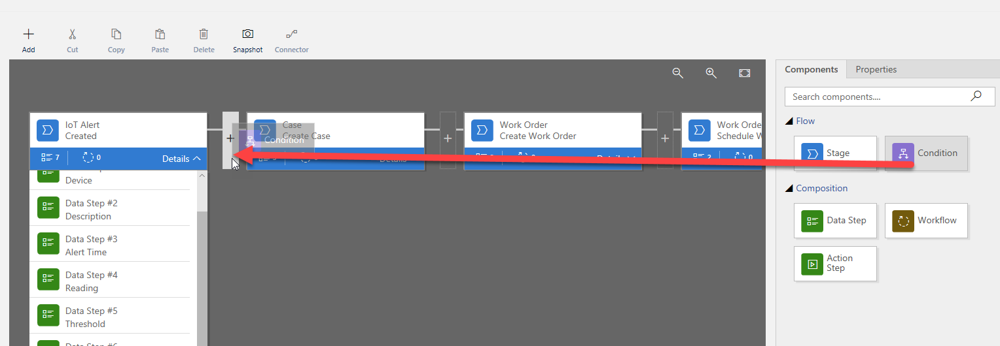

1.	In the **Condition Display Name**, enter **Temperature Condition**. 
1.	Configure Rule 1 as follows:
	- **Field:** *Reading*
	- **Operator:** *Is greater than or equal to*
	- **Type:** *Value*
	- **Value:** *86*
	
	  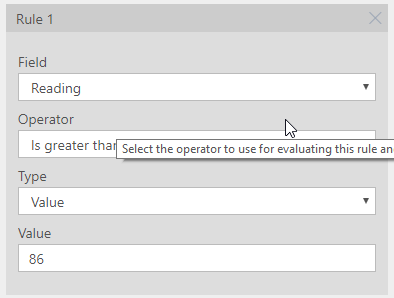
	  
1.	Select **+ New** to add another rule.

	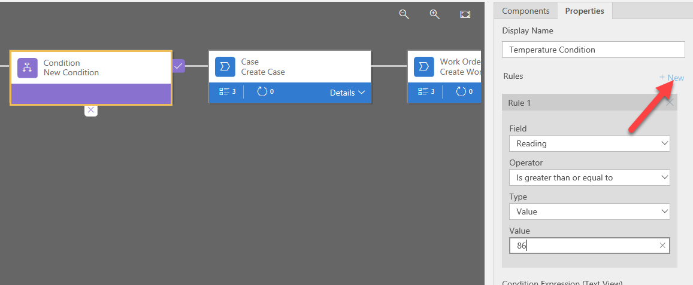

1.	Configure Rule 2 as follows:
	- **Field:** *Reading*
	- **Operator:** *Is less than or equal to*
	- **Type:** *Value*
	- **Value:** *100*
	
	  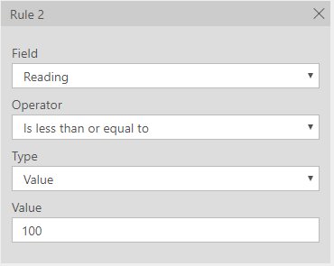

1.	Ensure **Rule Logic** is set to **And**.

	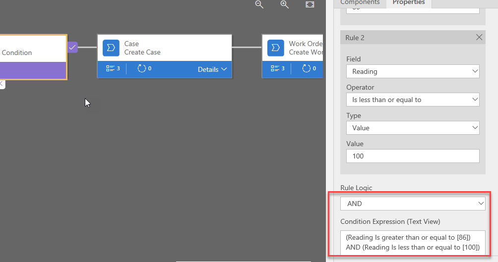

1.	Select **Apply**.
1.	Select the **Components** tab and then drag the **Stage** component below **Temperature Condition**.  

	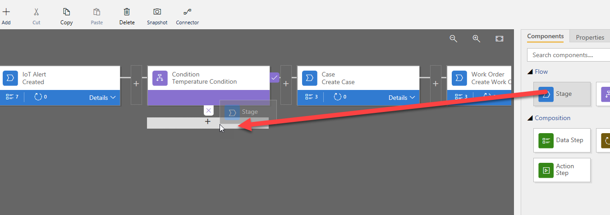

1.	Configure the stage as follows:
	- **Display Name:** *Reading*
	- **Entity:** *Work Order*
	- **Relationship:** *IoT Alert*
	
	  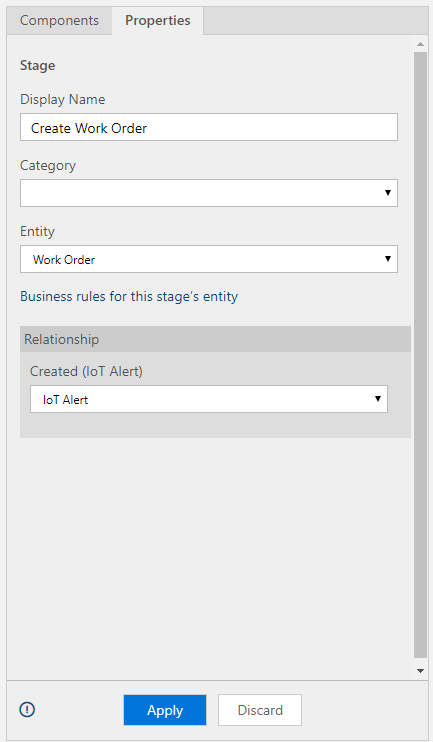

1.	Select **Apply**.
1.	Expand the **Details** of the Create Work Order stage and then select **Data Step #1**.
1.	Configure Data Step as follows:
	- **Step Name:** *Service Account*
	- **Data Field:** *Service Account*
	
	  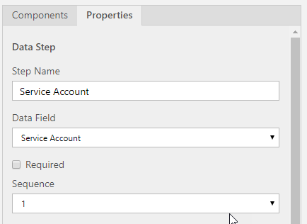

1.	Select **Apply**.
1.	Select the **Components** tab and then drag **Data Step** below **Data Step #1 Service Account**.
1.	Configure Data Step as follows:
	- **Step Name:** *Priority*
	- **Data Field:** *Priority*
	
	  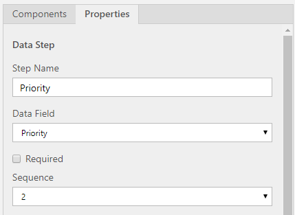

1.	Select **Apply**.
1.	Select the **Components** tab and then drag **Data Step** below **Data Step #2 Priority**.
1.	Configure Data Step as follows:
	- **Step Name:** *Work Order Type*
	- **Data Field:** *Work Order Type*
	
	  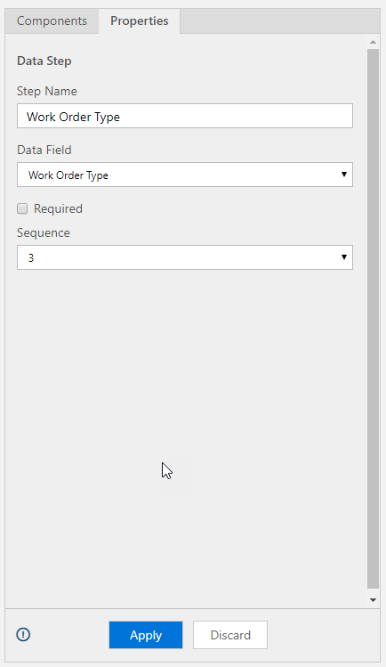

1.	Select **Apply**.
1.	Select the **Reading** stage, select the **Connector** icon, and in the menu that appears, select **Reconnect**. 

	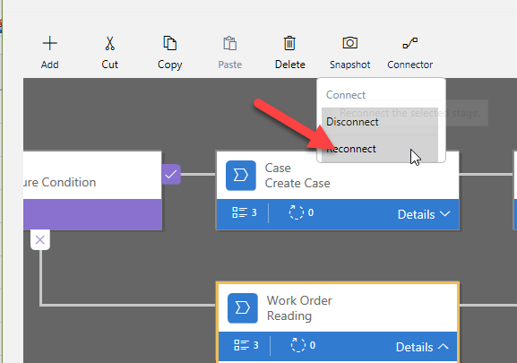

1.	Select the **Schedule Work Order** stage as the **2nd Point**.  

	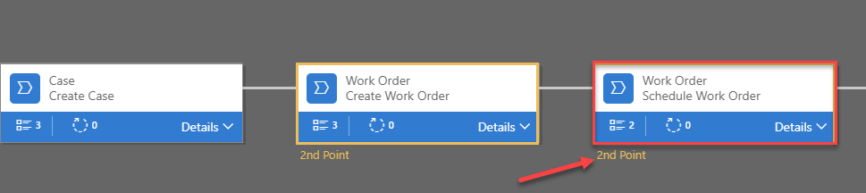

1.	Your business process flow should now resemble the following:

	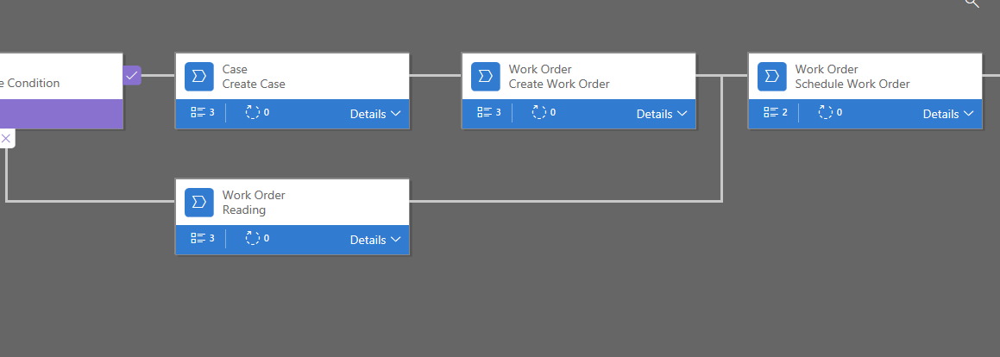

1.	Select **Create Case Stage**.
1.	Set the **Relationship** to **IoT Alert** and then select **Apply**.

	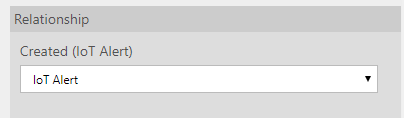

1.	Select **Validate** to test for errors and resolve any errors it finds. 
1.	**Save** and **Activate** the **CFS – IoT Alert Process Flow**.
1.	On your **IoT Alert Processes** solution, select **Publish All Customizations**.

#### Task 6: Test your newly created automation 

Now that you have created the necessary customizations, workflows, and business process flows, you will use a simulator to test that everything is performing the desired functionality.  

1.	In **Dynamics 365**, select the down arrow next to the **Dynamics 365** text and choose **Connected Field Service**. 

	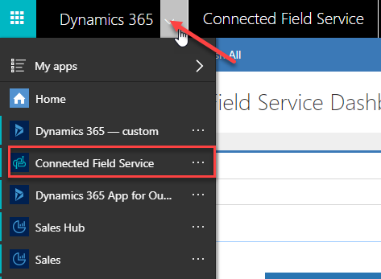

1.	Select the **Site Map** icon to expand navigation and then select **Customer Assets**. 
1.	Select **New**.
1.	Configure your customer asset as follows:
	- **Name:** *Smart Thermostat*
	- **Account:** *Adventure Works (Sample)*
	- **Device ID:** *smt-9876*
	
	  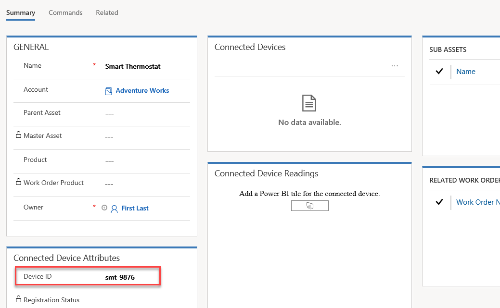

1.	Save **Customer Asset** and leave the record open.
1.	On the **Command bar**, select **Register Devices** and then select **OK**.
1.	In your web browser, select a new tab and navigate to https://portal.azure.com . (Log in to Azure if prompted. You need an Azure subscription associated with the account you are using.)
1.	Select **Resource Groups** and open your resource group.

	

1.	Open the IoT hub that you are using with Connected Field Service, and select **Simulator**.

	

1.	Select the **Simulator URL** to open the Thermostat Simulator. (The simulator should open in a new tab.)

	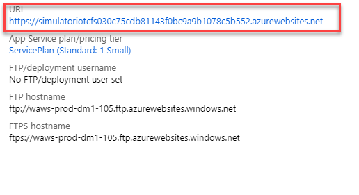

1.	On the simulator, select **Connection**. 

	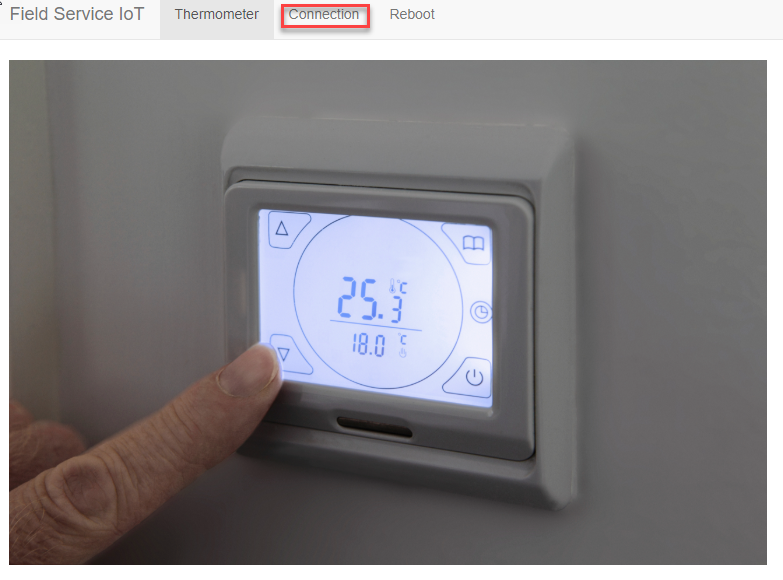

1.	Switch back to your **Azure** subscription and close the simulator App Service screen.

	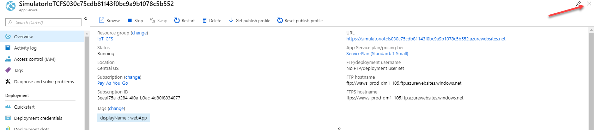

1.	Open the IoT hub.

	

1.	Highlight the **IoT Hub name** and copy it.  

	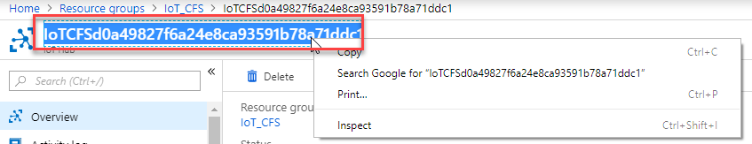

1.	Switch back to your simulator screen and paste the IoT hub name into the **Host** field.

	

1.	Switch back to your Azure subscription and select **Shared Access Policies**.

	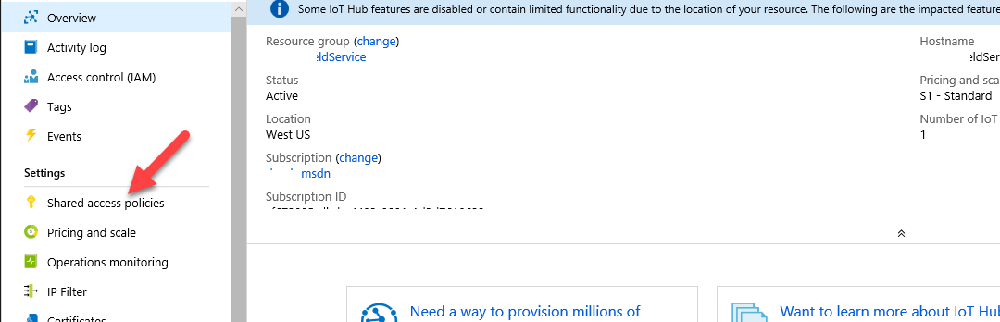

1.	Open the **iothubowner policy** and copy the **Primary key**.

	

1.	Switch back to your simulator screen and paste the primary key into the **Key** field. 

	

1.	Select **Connect**.
1.	Select **Refresh** to ensure all registered devices are available.
1.	From the **Select a device** drop-down menu, select **smt-9876**. *(A green dot should appear next to the Refresh button, and after a few seconds it should start transmitting information.)*

	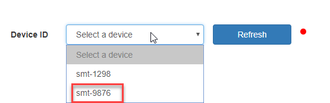

1.	On **Temperature Slider**, set it to **75 Degrees** and wait for the temperature status to register in the **Messages Sent** window.  

	

	Because the temperature was between 71 and 85 degrees, a command will be sent to the device to restart it. *(**Note:** It can take several minutes for the restart command to be sent to the device.)*

	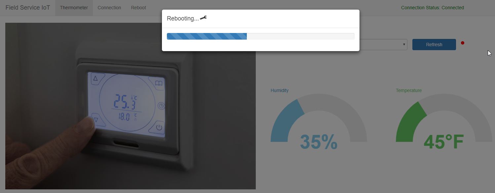

1.	Switch to the browser tab that has **Dynamics 365** loaded.
1.	Select the **Site Map** icon to expand navigation and then select **IoT Alerts**.
1.	Switch the view to **Inactive IoT Alerts**.
1.	Open **Temperature of 75 exceeded a threshold of 70 Alert**.
1.	Select the **Commands** tab. *(You should see a command that was sent to the device.)*

	

1.	Switch back to the web browser tab that contains your **Simulator**. 
1.	Set **Temperature** to **65 Degrees** and wait for it to register in the **Messages Sent** window.

	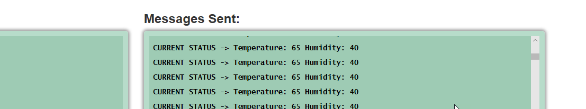

1.	Switch to the browser tab that has **Dynamics 365** loaded.
1.	Select the **Site Map** icon to expand navigation and then select **IoT Alerts**.
1.	Open the **Temperature reading of 90 exceeded a threshold of 70** alert.
1.	Select the **Created** stage. *(Notice the information you extracted earlier is being displayed. Because the reading is between 86 and 100 degrees, Create Case is the next stage.)*

	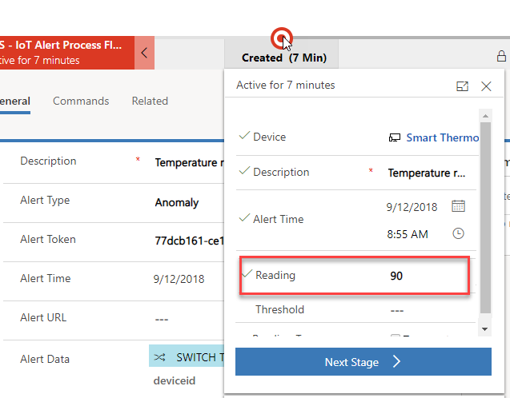

1.	On the **Command Bar**, select **Create Command**.
1.	Complete the command as follows:
	- **Name:** *Reset Device*
	- **Message:** *{"CommandName":"Reset Thermostat","Parameters":{}}*
	
	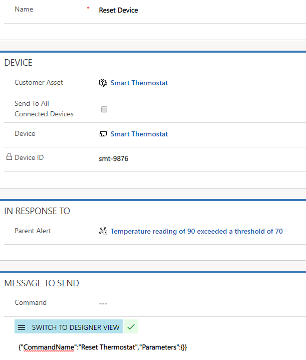

1.	Select **Send & Close**. 
1.	Switch back to your **Simulator** and wait for the device to restart. 
1.	On **Temperature Slider**, set it to **106 Degrees** and wait for the temperature status to register in the **Messages Sent** window.  

	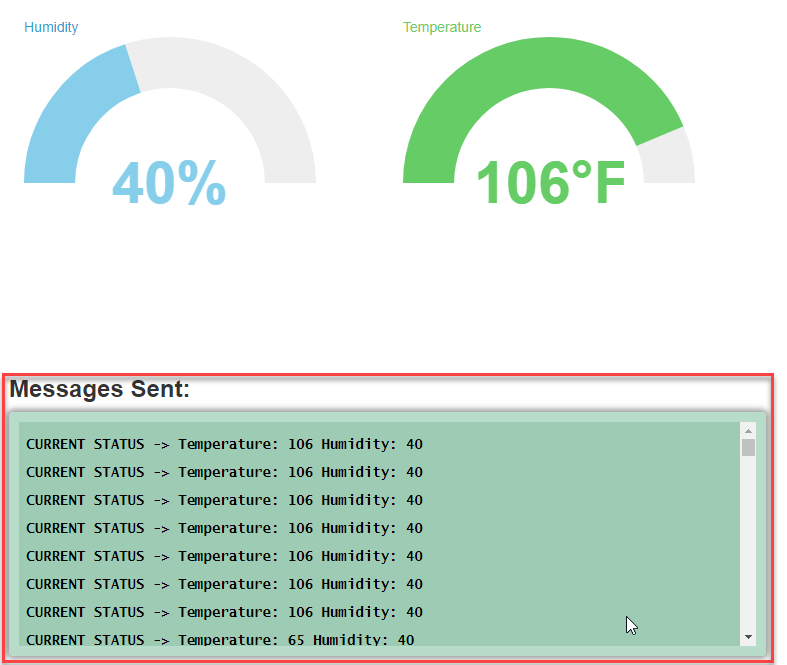

1.	Switch to the browser tab that has **Dynamics 365** loaded.
1.	Select the **Site Map** icon to expand navigation and then select **IoT Alerts**.
1.	Open the **temperature reading of 106 exceeded a threshold of 70** alert.
1.	Notice that because the alert was above 100 degrees, it skipped the Create Case stage completely.  

	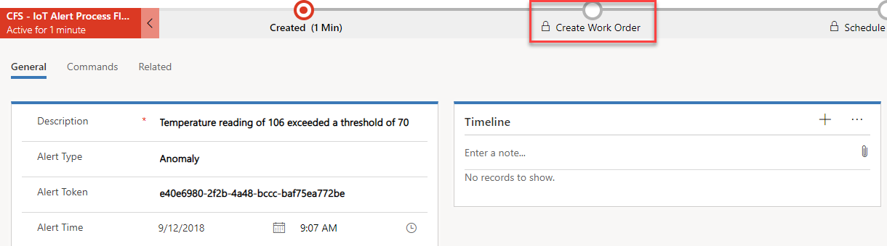
