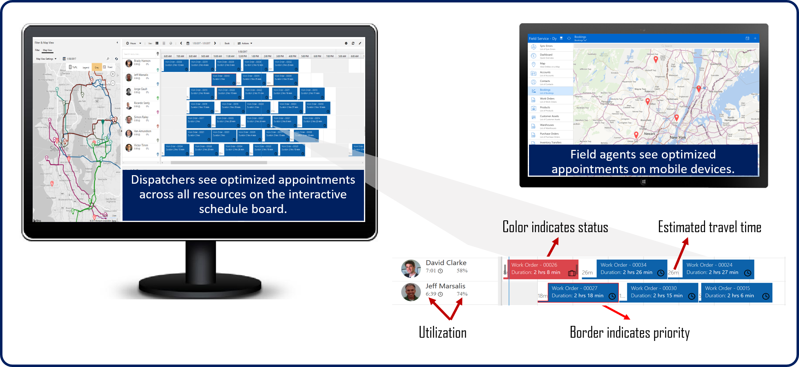

Dispatchers in charge of scheduling resources such as internal employees, contractors, facilities, or equipment encounter several scenarios they need to work with on a given day.  Newly created items like work orders need to be scheduled. Existing items may need to be rescheduled, reassigned, or even canceled from time to time.

Organizations are always looking for ways to increase the number of appointments that resources can handle during a day, while still being able to minimize expenses such as travel time and fuel costs.

Out of the box, Universal Resource Scheduling and Dynamics 365 for Field Service provide two methods that dispatchers can use to schedule items.

-   **Manually:** A dispatcher or scheduler manually identifies qualified resources and either schedules or reschedules items accordingly.
-   **Semi-Automated:** Qualified resources are suggested based on specific criteria defined on the item like skill, dates, roles or territories.

As organizations work with more and more resources, it can become increasingly challenging to manage those resources efficiently. Those organizations could benefit from an automated scheduling approach.

Resource Scheduling Optimization (RSO) is an add-on capability for the Dynamics 365 for Field Service application that enables you to automatically schedule work orders for the most appropriate resources.

RSO allows you to optimize bookings to minimize travel time and maximize working hours and more, based on your configured objectives, such as "minimize travel time" and "maximize working hours."

## Benefits of using Resource Scheduling Optimization

-   **Automated scheduling:** Automatically scheduling the majority of requirements saves time and allows dispatchers to focus on exceptions and billing.
-   **Achieve scale:** Allows dispatchers to manage more resources, enabling the business to scale up the resources they manage.
-   **Customer satisfaction:** Improved efficiency drives more predictable arrival and completion times, and seamlessly schedules alternate technicians for urgent situations.
-   **Technician efficiencies and reduced cost:** Fitting more appointments into working hours drives revenue and reduces overtime costs.
    -   Matching work orders and technician skillsets reduces the cost of lost appointments.
-   **Reduced fuel consumption and less vehicle maintenance:** Ensuring your technicians are taking the shortest possible route with turn-by-turn directions reduces fuel consumption and wear and tear on vehicles.
    -   If each field technician saves one tank of gas a month, the savings generally will surpass the cost of RSO. 
-   **Improved customer retention:** Giving preference to higher-priority work orders helps avoid service level agreement (SLA) penalties and helps you meet customer service commitments.

## How Resource Scheduling Optimization Works

The Resource Scheduling Optimization solution needs to be installed and configured into a Dynamics 365 environment that is running Field Service. The image below provides a high-level overview of the data flows:

1.  Configure Resource Scheduling Optimization: Choosing objectives and constraints and deciding what is most important for your business. As an example, rank importance of minimizing travel time vs. maximizing work hours vs. high priority appointments. This is done with no-code configurations.

2.  Run Resource Scheduling Optimization 3 ways

    1.  Via schedule---example---every morning at 8 am
    2.  Via triggers---example---when a customer cancels
    3.  On command with a "Run Now" option

3.  **View Results:** The schedule board and mobile devices. Dispatchers will see optimized appointments across all resources on the interactive schedule board. Field agents will see their optimized daily and weekly appointments on their mobile device.
