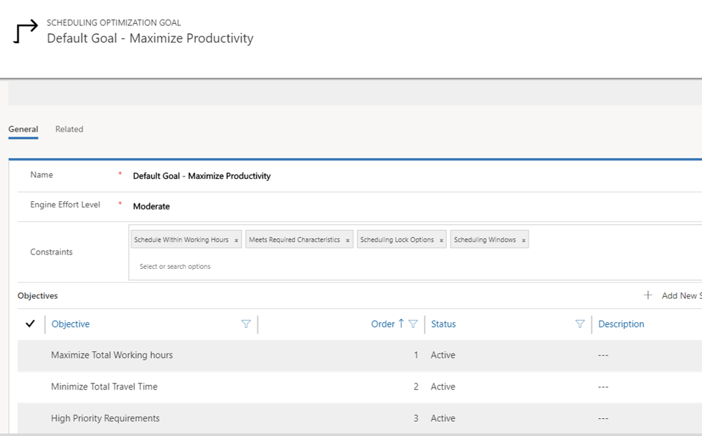
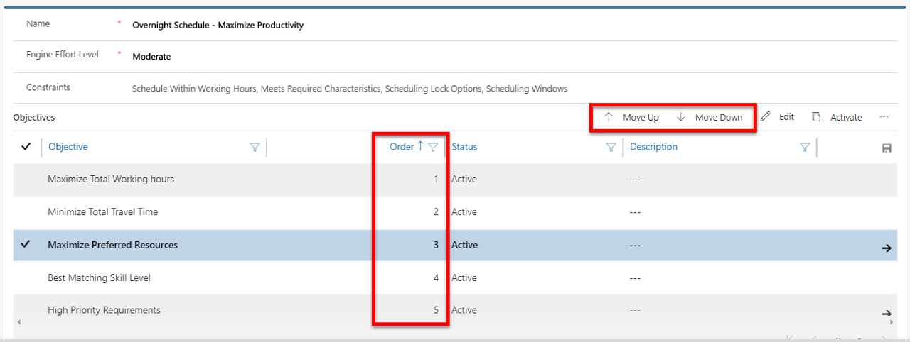

One of the first things an organization should define for RSO are the specific goals to use.  A goal is what the RSO solution wants to optimize. For example, an organization goal might be to maximize technician working hours and minimize travel time.   A goal defines how bookings should be optimized based on objectives and constraints. 

- **Objective**: Defines the objective that you are trying to achieve. For example, an objective may be to maximize working hours.
- **Constraint**: Defines the constraints that should be considered when attempting to meet the objective. For example, a constraint may be that an item must be scheduled during working hours.  

When a RSO job is executed, the RSO engine processes a list of resources and resource requirements.  Additionally, existing bookings are processed based on a predefined scope to create the optimal route or list of bookings for the resources.

Bookings are considered optimally scheduled when they:

- Meet all the constraints defined in the goal.
- Have the highest possible score for all of the company’s objectives.

> [!VIDEO https://www.microsoft.com/videoplayer/embed/RE2Kmlz]

#### Objectives
For each goal that is created, multiple objectives and constraints can be defined.  Objectives are defined by selecting the Add New Scheduling Optimization Objective.  

There are six objectives available:  
- Maximize total working hours: The combination of the engine results (iteration) with the total highest aggregate work time. 
- Minimize total travel time: The version of the engine results (iteration) with the total lowest aggregate travel time. 
- Locked bookings: When selected, RSO will try to include locked bookings into the optimal route. 
- High priority requirements: RSO will evaluate this objective and give priority to the resource/booking combination with the highest score for priority.
- Maximize preferred resources: RSO will evaluate the preferred resources defined for a requirement and attempt to use the preferred resources defined.  
- Best matching skill level: RSO will evaluate the proficiency of resources relevant to the skills defined in the requirement record.  Resources with a higher proficiency in a specific skill will be considered first.   

When you add an objective, you can define the order of importance for it. Objectives with a higher priority are considered before objectives with a lower number.  Objectives can be reordered as needed.

For example, a goal might have the following objectives defined: 
1.	Maximize working hours
2.	Minimize travel time
3.	Best matching skill level
When an optimization schedule that contains the goal runs, it will first attempt to maximize the working time of the resources it is optimizing, then it will look at the location information to determine resources that are closest.  The closet resource that contains the necessary skills will be scheduled.  
IMPORTANT: Minimizing total travel time cannot be the first objective in the list. If minimize total travel time was the first objective, RSO might not schedule anything with the travel time of 0 minutes in order to meet the first objective.

Constraints:
Like objectives, a goal might have multiple constraints defined for it.  Unlike objectives, constraints do not have numeric numbers associated with them.  Each constraint that needs to be considered is added to the goal.  
There are seven constraints that can be added to a goal.  The constraints are as follows:
- **Schedule within working hours**: Creates the booking if it can be completed within the resource’s working hours. Verifies the booking is not scheduled out of the resource’s working hours. This includes travel time from the last booking to the resource’s end location, although it is not shown on the schedule board in a visual way.

- **Meets required characteristics**: Verifies the resource has all the required characteristics and should have minimum required skill level.
- **Scheduling lock option** : If marked, this will respect lock options configured on a booking record.
- **Scheduling windows**: If marked, RSO will schedule work to comply within the time window start and end fields on the resource requirement or booking record.
- **Restricted resources**: If marked, RSO will not schedule a restricted resource to the booking.
- **Matches territories**: RSO will match the territory between the requirements and resources to ensure that a matching resource is in the same territory as the requirement.
- **Matches resource type**: RSO will match the resource type between requirements and resources to decide which type of resource can fulfill a requirement.

    - Bookable resources include the following resource types: generic, users, contacts, accounts, equipment, facility, crew, and pool.
    - Requirement records allow multi-select so you can specify which resource types are needed for a given requirement.

#### Effort Level
When a goal is created, you can define how much effort the engine will put into finding the optimal schedule based of the value defined in the engine effort level field.  The engine effort level can be set to one of the following levels:

- Very light
- Light
- Moderate
- Intense
- Very intense

The higher the effort, the longer RSO takes to complete the execution. For example, a goal that is set to very intense will take longer to run than one set to light, because there will be more iterations of possible combinations the RSO engine considers.

#### Default optimization goal
When Resource Scheduling Optimization is deployed for the first time, the system automatically creates a default goal with some constraints and objectives enabled.  Users can modify the default goal as needed or create a new optimization goal and associate it as a default goal.

For more detailed information, see [Resource scheduling optimization configuration](https://docs.microsoft.com/dynamics365/customer-engagement/field-service/rso-configuration#define-the-optimization-goal).

