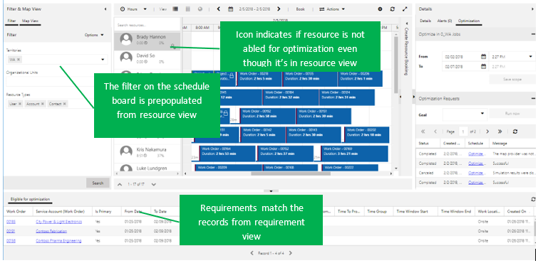
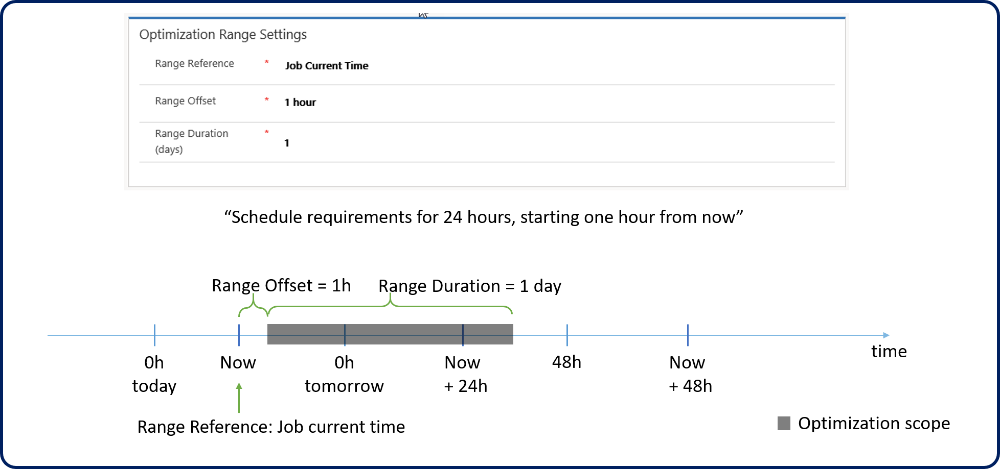
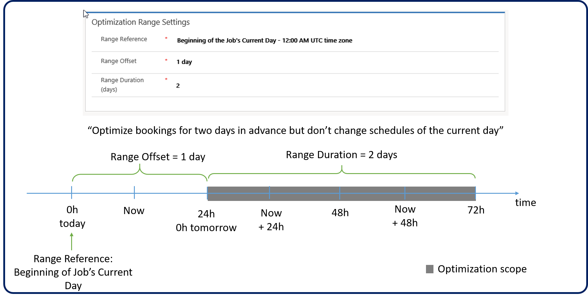
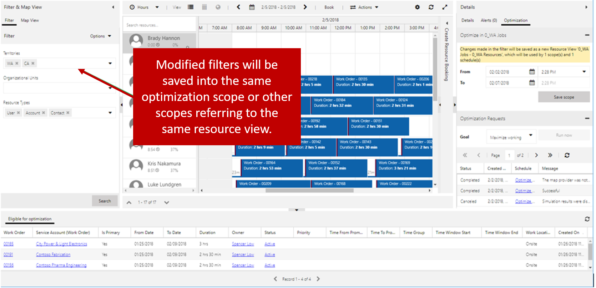

A RSO scope defines what should be optimized when a job is run. They are used to specify the records and time frames that the optimization engine should focus on when it runs.

A scope includes the following:

-   **Resources:** Defines which specific resources should be included in the optimization job.
    -   For example, you may only want to include resources from a specific territory, that possess a skill set, or type such as an internal user of sub-contractor.
-   **Resource requirements:** Defines which resources requirements (unscheduled items) you want to include.
    -   For example, you many only want to schedule resource requirements where the associated work order has a sub-status of ready to dispatch.
-   **Bookings:** Defines the existing bookings that you want to update.
    -   For example, you may want to optimize currently scheduled bookings for today only and leave future bookings where they are.

Scopes should be as small as possible. RSO will be quicker and more effective if optimization requests contain few resources, requirements, bookings, and shorter time range durations. Usually companies already have partitions that could be used for RSO such as:

-   **Temporally defined:** optimize technicians who work in the day separately from those who work at night.
-   **Geographically defined:** neighborhoods, cities.
-   **Logically defined:** support level, incident type.

When a scope is being defined, users can select existing system views or personal views (for which they have read permissions) for the resource, requirement, and booking view drop-down menus. If a personal view is selected, it is shared with the RSO application user and other users who have access to the scope.

An optimization scope must always include the specific resources to optimize. For example, let's say that we wanted to optimize only resources that were associated with the Washington territory. In Dynamics 365, we would create a view that filters bookable resources to show only the resources in Washington. We would then add the view to the resources view drop down list on the scope. Scopes can be used to not only to optimize existing bookings, but also to create new bookings. You can define which one you want it to do by defining either the requirements or bookings to optimize. For example:

-   **Create new bookings (Requirement view):** To use the scope to create new bookings for any preventative maintenance work orders that are generated by field service agreements. You would create a view for the resource requirement entity that shows unscheduled work orders with a work order type of preventative maintenance.
-   **Update existing bookings (Booking view):** To use the scope to optimize any bookings that are currently scheduled for Washington customers. You would define a view for the bookable resource booking entity that shows only bookings associated with work orders in the Washington territory.

In addition to defining the resources, you must also define the bookings or requirements that should be optimized. You can define both a requirement and booking view in a single scope. Ideally, since you want
your scopes to be as small as possible, you may want to limit a scope to only a requirement or booking view. When you select a booking view, you can also define the now or after.

For example, maybe you want to optimize bookings for the next five days, but you want to exclude bookings within the next two hours and any bookings in the past. There is no way to define this with the out-of-the-box Dynamics 365 entity view filters. If we did not have the now or after setting, the optimization engine could optimize past bookings or bookings that are scheduled in the next two hours. By defining a now or after settings, it will add the additional setting on top of whatever filter conditions are defined for that booking view.

> [!VIDEO https://www.microsoft.com/en-us/videoplayer/embed/RE2KrsW]

## Optimization Range Settings

Optimization range settings define the range of time when bookings can
be created, updated, or deleted based on the record types included.

Optimization range settings include the following:

-   **Range reference:** The start moment for all subsequent work orders range calculation. (Job current time or beginning of the job's current day).
-   **Range offset:** Amount of time added to the range reference to define the range start.
-   **Range duration (days):** Number of days added to the range reference.

Let's examine two different range scenarios.

### Scenario 1

You want to have requirements defined in the optimization scope created and scheduled within the next 24-hour period. However, you do not want any items created within the next hour. In other words, requirements
will be scheduled into a range starting Now + 1 hour and ending Now + 1 hour + 1 day (which might partly still be today).

### Scenario 2

You want to have existing bookings defined in the optimization scope moved into the next two days. However, you do not want anything moved to today. In other words, bookings will be moved to a range starting 12:00 AM today + 1 day (Tomorrow at 12:00 AM) and ending Tomorrow at 12:00 AM + 2 Days.

You can preview resources, requirements, and bookings for the optimization scope through the schedule board:

Resource filters on the schedule board are pre-populated from the resource view. The resource list matches the number of resources defined in the resource view. RSO will display a lock icon and tool tip to indicate if a resource is not enabled for optimization (even though it was added into resource view).

Requirements under eligible for optimization match the records from the requirement view.

You can modify filters on the left panel and save it into scope:

If the resource view referred to by optimization scope is a system view, modified filters through the schedule board will be saved as a new personal view. If the resource view referred by optimization scope is a personal view, modified filters through the schedule board will be saved back into the same personal view.

### Optimization Scheduling

> [!VIDEO https://www.microsoft.com/en-us/videoplayer/embed/RE2KoUM]
