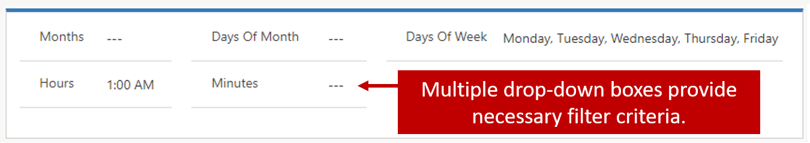
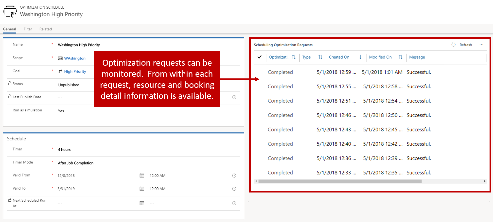
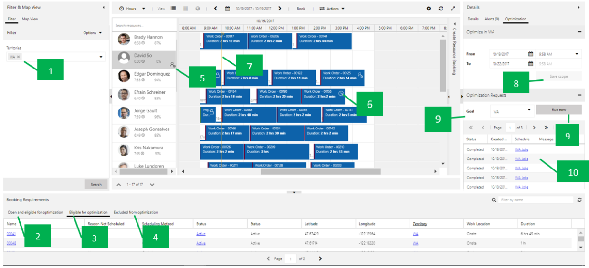

An optimization schedule defines when records should be optimized.   For example, you may define a schedule that runs on weekdays at 1 AM.

When creating an optimization schedule, you will need to define the following:
- Name: Provide a logical name that will express which requirements, bookings, and resources will be optimized.  
- Scope: Defines the scope that will be used.
- Goal: Defines the goal that will be used.  
- Timer: Defines how often this schedule will run.
- Timer Mode: Defines the point when the schedule starts the timer.
    - For example, if a timer is set to thirty minutes, the first run starts thirty minutes from the publish date/time. 
    - Fixed mode: The optimization runs every thirty minutes. 
    - After job completion mode: The optimization runs thirty minutes from the end of the last RSO job execution. 
- Valid from and valid to: The first/last date and time when this schedule is valid for execution.

### Defining Filter Options
Many times, different jobs may need to run at different times.  For example, the schedule will run at 1 AM and 7 PM every Monday through Friday. In these instances, you can use the filter feature to define when the job will run.   The filter section of the schedule is an advanced feature. The filter window allows for a variety of combinations to be selected:

**How timers work with filters**
If you configure your timer and filter as shown here, RSO will run every thirty minutes after the previous job is completed, from 12/3/2016 at 9 AM to 12/4/2018 at 9 AM, except on Saturdays and Sundays.
For additional information on defining optimization schedules: https://docs.microsoft.com/dynamics365/customer-engagement/field-service/rso-configuration#create-an-optimization-schedule 

### Publishing Schedules
A schedule will exist in one of many statuses throughout its lifecycle.  A schedule will not begin to optimize resources, requirements, and bookings until they have been published.   Schedules are published by selecting a schedule(s) to publish and clicking the publish button in the in the upper left.  It is possible to publish all schedules by selecting the Publish All button.

The list below defines the different states that an RSO job can exist in.  
- **Unpublished**: Default status when a schedule is created or after a reset.
- **Publishing**: The system is trying to publish schedules.
- **Published**: The system published a schedule and it is good to run.
- **Out of Sync**: Changes made against the schedule require it to be published again.
- **Under Maintenance**: Indicates someone is upgrading the RSO to a newer version.
- **Failed**: System failed to publish schedules for various reasons.
    - The user is able to see the error details on the form of the schedule.
    - A typical error would be that the SASKey has not been configured, meaning RSO Azure resources are not set up correctly.

Once a schedule has been published, it will begin to optimize items based on the schedule.  RSO schedules can be manually run on demand at any time, by selecting the Run Now button.   If a RSO schedule needs some large-scale changes, or something is not working, you can select the reset resource scheduling optimization button.  This will cancel all pending RSO jobs and unpublish the schedule.

For additional information on publishing schedules: https://docs.microsoft.com/dynamics365/customer-engagement/field-service/rso-schedule-optimization#publishing-schedules

### Monitoring optimization requests
Once a schedule has been published, you can open it and monitor the scheduling optimization requests (RSO jobs).  You can drill into each of these to see the bookings associated with the RSO job run.   

From the optimization schedule you can see:
- Which resources are being optimized, and which are not (and for what reason).
- View booking details as well as analytic charts showing how many hours of travel time versus how many work hours are scheduled for this run.

For additional information on monitoring optimization requests: https://docs.microsoft.com/en-us/dynamics365/customer-engagement/field-service/rso-schedule-optimization#monitoring-optimization-requests 

### Leveraging the schedule board to review optimization results

Each RSO schedule allows you to leverage the schedule board to gain deeper insight into what is going on with the job. The schedule board can be leveraged from any schedule by clicking the schedule board icon on the optimization schedule form.  

With schedule board integration, you can:

- Better understand the optimization scope.
- View optimization results in a visual way.
- Easily analyze failed optimization requests.
- Create a new schedule on the fly.

1. Pre-populated filters match Scope > Resource view.
2. The open and eligible for optimization tab shows all eligible unscheduled requirements that match scope definition, requirement range, and requirement state setting.
3.	The eligible for optimization tab shows all eligible unscheduled requirements, as well as any eligible bookings to be re-optimized that match scope definition, requirement range, and requirement state setting.
4.	The excluded from optimization tab shows any eligible requirements or bookings that fail to be optimized for certain reasons (such as invalid longitude/latitude).
5.	Icon and tooltip indicators for resources not in the optimization scope.
6.	Lock icon and tooltip indicate that the booking has been locked.
7.	Yellow lines indicate the start and end time for the optimization range.
8.	From / To date and time match the time range defined in the optimization scope. You can continue to modify and save the changes back to the original scope. If the same scope is being referenced by multiple optimization schedules, the change will apply to all of these schedules with the same scope.
9.	Select a goal and click Run Now to trigger an on-demand optimization request.
10.	The optimization request will show the status and details. If an exception occurs, select a specific optimization request to open it. You can view booking details as well as analytic charts showing how many hours of travel time versus how many work hours are scheduled for this run.

For additional information on leveraging the schedule board for optimization results: https://docs.microsoft.com/dynamics365/customer-engagement/field-service/rso-schedule-optimization#leveraging-the-schedule-board-to-review-optimization-results 

For additional information on the booking lock option: https://docs.microsoft.com/dynamics365/customer-engagement/field-service/rso-schedule-optimization#understanding-the-booking-lock-option
