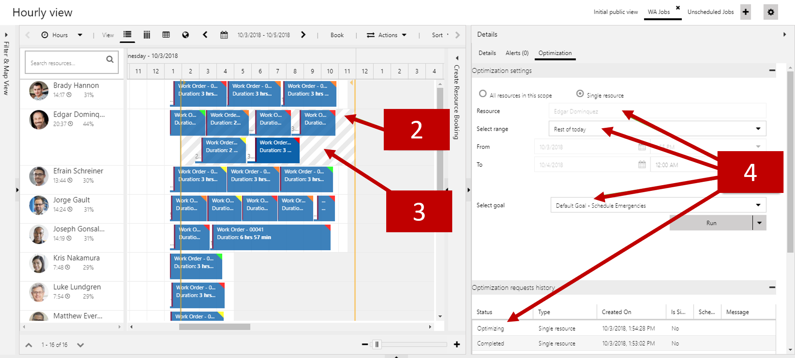

RSO's single resource optimization feature provides a quick and simple way to re-optimize the schedule of a selected resource from the schedule board. This can be done to ensure the resource continues to have an optimal schedule and route after schedule changes or cancellations occur during the day. For example, a resource may have overlapping bookings after getting assigned an emergency work order or arriving late due to traffic during the day.

Single resource scheduling uses the default resource optimization goal for an organization. When RSO is deployed a default goal for the organization is created. The default goal can be found by navigating to **Resource Scheduling Optimization** \> **Optimization Goals**.

## Use single resource optimization from schedule board

There are two ways to use the single resource optimization feature from the schedule board:

-   **One-click with defaults:** Optimize the schedules for a single resource with one click using the default goal with a time range set to the end of the current day. This can be performed from any schedule board view.
-   **Advanced with edits:** Optimize the schedules for a single resource with the option to edit the goal and time range as well as the option to run as a simulation and apply or discard the results. This is only possible from the schedule board view related to your  optimization scope.

## One-click with defaults

To initiate single resource optimization from the schedule board,
right-click the resource\'s name and then select optimize schedule to
start the optimization for a selected resource.

1. Yellow line indicates default optimization range, from NOW to end of today (12 AM).
2. Gray mask indicates default optimization range, from NOW to end of today (12 AM).
3. Optimization Panel showing selected resource name, default range, default goal, and optimization request status.

To initiate single resource optimization from the schedule board, right-click the resource\'s name and then select optimize schedule to start the optimization for a selected resource.

## Advanced with edits

You can run a more advanced scenario, by selecting the resource you want
to optimize and clicking the details pane. When RSO in installed, it
will add an optimization tab to the details pane.

### From here you can

1.  Customize optimization range to any date/time as needed.
2.  Select different optimization goals as needed.
3.  Run Now will run the optimization and schedule bookings.

To initiate single resource optimization from the schedule board, right-click the resource\'s name and then select optimize schedule to start the optimization for a selected resource.

4.  Run Simulation will run the optimization and schedule simulated bookings shown as white. User can apply/discard simulation results. Note: Simulated bookings will not show on map with routes.
5.  Optimization Panel showing optimization request status.

To initiate single resource optimization from the schedule board, right-click the resource\'s name and then select optimize schedule to start the optimization for a selected resource.

The single resource optimization will only re-optimize existing bookings and will not create new bookings. Additionally, it can be applied to, and will re-optimize, bookings that were originally booked manually or via resource availability search as well as bookings from location-agnostic requirements. Single resource optimization will show on the schedule board for all resources given optimization is deployed in the environment; however, it will only work if the selected Bookable Resource has Optimize Schedules set to Yes. This feature cannot be disabled or hidden.
