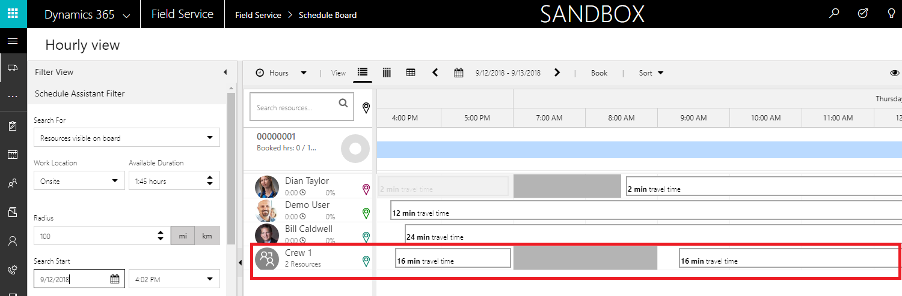
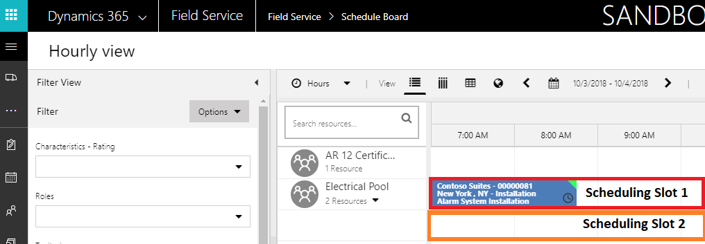
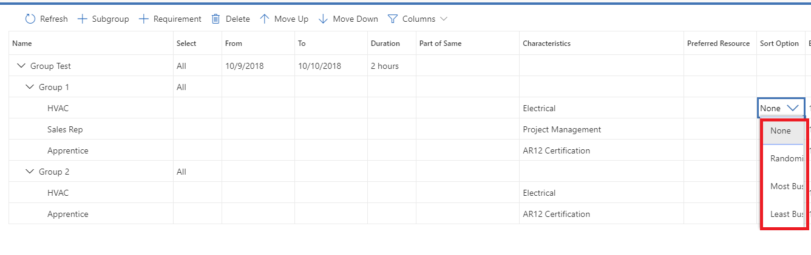

The scheduling needs of organizations that implement Dynamics 365 for Field Service and the Universal Resource Scheduling (URS) solution can have many circumstances and scenarios that influence what and how jobs
are scheduled using the application. Some organizations might only be scheduling individual resources to work on individual jobs, such as sending a home health care professional to a client's home. While other
organizations may need to schedule facilities, such as venues that rent out rooms for events like conferences or weddings.

Below are a few examples of different scheduling scenarios that URS can be useful for:

-   An auto mechanic shop that wants to schedule service bays.
-   A cleaning service that dispatches crews to different cleaning jobs.
-   A central dispatch center, that pre-books appointments in specific regions until the regional dispatcher can come in and provide the actual resources that will be scheduled.
-   A company that provides LASIK surgery needs to book a doctor, nurse, and operation room for procedures.

In addition to providing the ability to schedule a single resource like a technician for an item such as a work order, URS provides additional capabilities that organizations need, such as the ability to schedule
multiple resources, provide schedule placeholders, or schedule buildings. The scenarios are supported with the following features:

- Facility scheduling
- Crew scheduling
- Resource Pools
- Multi-resource scheduling with requirement groups

>[!VIDEO https://www.microsoft.com/videoplayer/embed/RE2Keww]

## Facility Scheduling

Facility resources represent physical locations where work can be performed. In past versions, it was only possible to schedule work at the customers location. A new resource type called Facility has been introduced that can be leveraged to schedule work to be performed at another location.

Facilities could be used in any number of scenarios including:

- For event and room scheduling in the hospitality industry.
- To book rooms at a fitness center for an exercise class.
- To reserve a bay at mechanic shop.
- To reserve a boat.

## Crew Scheduling

Crews are a type of resource that is used to represent a predefined group of people that are scheduled together. For example, a cable company might use crews to represent a group of technicians that are used to providing services to new regions. They might use them to represent each crew that digs the trenches, runs the cables, and buries the cables post install. Crews appear on the schedule board like any other resource, however when a crew is scheduled for a job, each member of the crew is also scheduled for the job as well.

## Resource Pools

Resource pools enable schedulers to book requirements to a generic pool without needing to decide which resource will perform the work. For example, a central dispatcher might use pools to represent installation
resources in the different regions they support. When they need to schedule a resource, they can simply select the resource pool. A local dispatcher can come back later and select a specific resource from the pool to schedule for the job.

## Multi-Resource scheduling with Requirement Groups

Both crews and resource pools represent scenarios where the members are predefined. There are many different scenarios where multiple resources are needed, but we are unsure as to which ones. For example, a company
that does medical services may have rooms where these services are done. When a patient comes in for a consultation, the appointment may require a specific room, doctor, and consultant.

Requirement groups provide the ability to group multiple requirements, such as a facility and user resource requirement together. Resources that fit those specific needs will be returned, and when scheduled, the 
requirement group will update each individual requirement associated with it.

In addition to providing the ability to work with multiple resources, URS also provides additional options for ensuring that the time windows being suggested by the schedule assistant make it as easy as possible for a dispatcher to use. Fulfillment preferences are customizable entities that let you choose how schedule assistant results are displayed, like with hourly appointments or morning and afternoon time windows.

For example, a hair salon may want to offer appointments every hour because 1-hour intervals are a good time estimate for their work, which
is mostly consistent and predictable. It is also easier to communicate 1-hour appointments to customers when scheduling.

Another way that fulfillment preferences could be leveraged would be, a
heating and cooling company wants to group air-conditioning installations. They may want to limit windows into morning (8:00 AM to 12:00 PM) and afternoon (1:00 PM to 5:00 PM), with a 1-hour break for lunch in between. Since installations are dependent on many variables, schedulers are not comfortable committing to an exact time; they would rather communicate to customers a morning or afternoon time range when installation resources will arrive to begin working.
