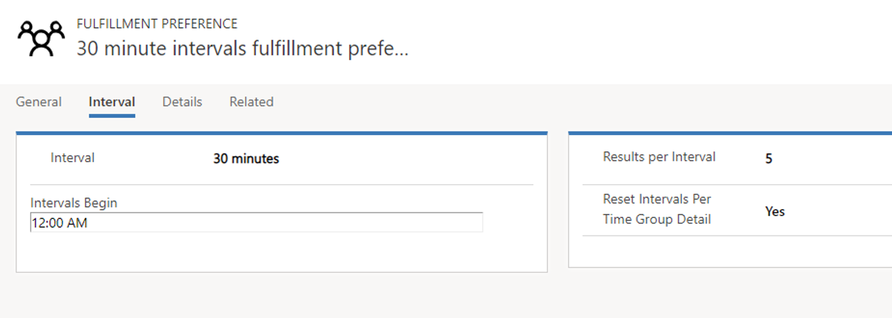
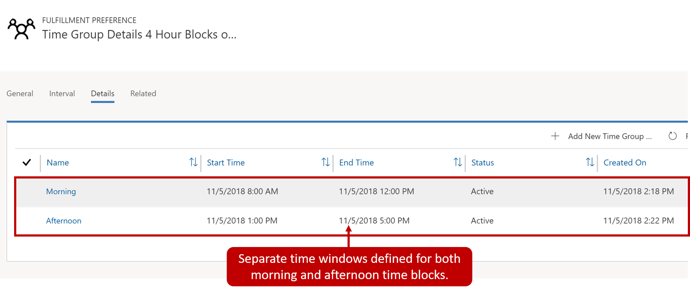
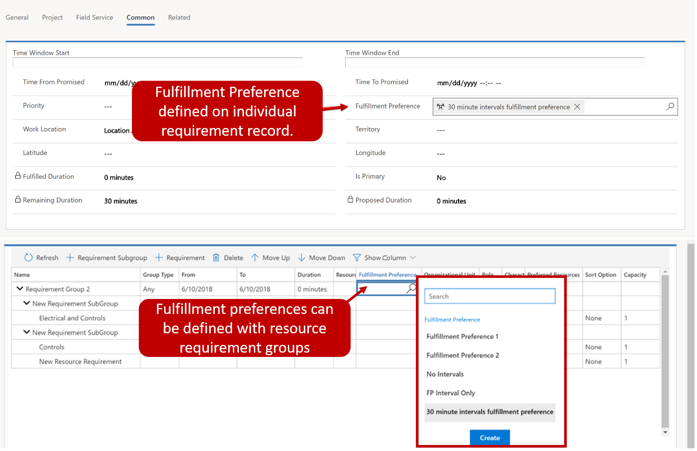
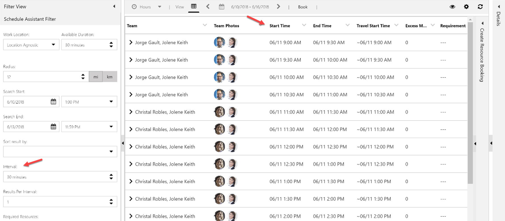
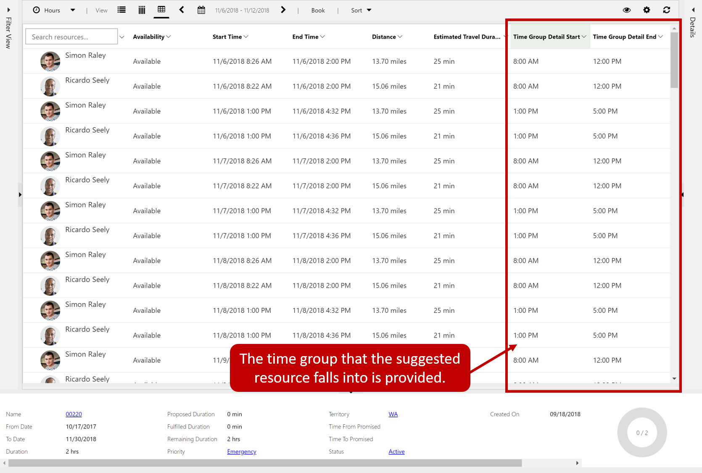

When the schedule assistant displays results, they are entirely based on resource schedules and their earliest available time. For example, the schedule assistant may determine that the earliest time a resource would be available is 10:41 AM. Scheduling someone to work for a call at 10:41 might make it difficult to schedule other appointments around it. An organization might prefer that times are suggested in 1-hour intervals, so instead of 10:41, that resource would be available starting at 11:00 AM.

Another consideration is when organizations do not schedule technicians during specific times of the day. For example, an organization may choose not to schedule technicians from 12:00 PM to 1:00 PM. This not only represents lunch time for resources but could also act as a buffer to allow technicians to make up time if they are running behind. These options make it simpler for the scheduler to view, understand, and communicate to the customer.

To deliver these options, Universal Resource Scheduling provides what are called fulfillment preferences. Fulfillment preferences are customizable entities that let you choose how schedule assistant results are displayed, like with hourly appointments or morning and afternoon time windows.

Fulfillment preferences break down into two features:

-   **Intervals:** Intervals display schedule assistant results in time slots that dictate start time of subsequent bookings.
-   **Time groups:** Enable schedulers to search and view results as blocks of time when using the schedule assistant. Typical examples might include mornings, afternoon, nights, and 2-hour windows.

Fulfillment preferences are associated with requirements records. When the schedule assistant is executed against the requirement, it will suggest items based on the fulfillment preferences defined. Fulfillment
preferences are defined by navigating to **Universal Resource Scheduling** \> **Fulfillment Preferences** and selecting the new button.

## Defining intervals

Intervals for the interval scheduling are defined on the Interval tab of
the Fulfillment Preference record. There are three key settings that are
defined for an interval record.

-   **Interval:** Defines the duration between available time slots, such as 30 minutes, 45 minutes, 1 hour, and 2 hours.
-   **Intervals Begin:** Defines when to begin counting the interval.
-   **Results per Interval:** Dictates how many options a scheduler will receive for each interval. If left blank, the system defaults to 1.

In the image above, the interval is 30 minutes with intervals beginning at 12:00 AM. This indicates that the available options to display results are 12:00 AM, 12:30 AM, 1:00 AM, and so on. The results however depend on resource availability and working hours.

-   If the intervals begin field is left blank, the interval will begin at the time of booking.
	-   For example, if your interval is 30 minutes and Interval Begins is blank, when you attempt to book at 11:13 AM, your time slot options are 11:13 AM, 11:43 AM, 12:13 PM, and so on.

This will work in conjunction with the results per interval setting. If an organization has 50 resources who are all available at 9:30 AM, and results per interval is set to 50, then all resources will show. If the results per interval field is set to 5, then only the 5 best results will show.

## Defining time groups

Unlike intervals, time groups do not dictate the start time of subsequent bookings. Time groups organize results but leave the start time/arrival time as-is, based on the particular resource\'s schedule. Time group details cannot be defined until a fulfillment preference record has been saved for the first time. Once saved, times groups are defined from the details tab by clicking the Add Time Group button in the time groups sub-grid.

When specifying a time group, you will need to provide:

-   **Name:** Descriptive name for the group such as Morning, Afternoon,  or Evening.
-   **Start Time:** Defines the first time that a booking can be scheduled within the time block.
-   **End Time:** Defines the last time that a booking can be scheduled within the time block.

>[!Important]
>The end time defines the last time that an appointment can start within the window. For example, if the time window is 8:00 AM to 12:00 PM. It is possible that an item that has a duration could be booked at 11:30 AM or 12:00 Pm even though in both instances, the end time would be beyond the time window. 

The image below shows a typical example where time windows are being defined as morning and afternoon. An hour gap is being left between 12:00 and 1:00 PM.

## Associating with requirements

For fulfillment preferences to be taken into consideration for a requirement, you need to ensure that they are attached to the requirement record. This can be done in multiple ways depending on what you are scheduling.

For example, if you are scheduling a work order, fulfillment preferences can be defined in the preferences section on the settings tab. When the work order is saved, the preferences will automatically be added to the requirement record associated with the work order.

Fulfillment preferences could also be added to a requirement or requirement group record manually or they can be populated by using a work flow or other automation scenario.

## Booking the requirement with the schedule assistant

When you are working with a requirement record that has time intervals defined, the intervals/time groups defined in the fulfillment preference will be loaded when the book button is selected. This will launch the schedule assistant.

- **Intervals:** Presents options available based on the interval screen selected. For example, the image below is using the 30-minute interval schedule that we defined.

- **Time Groups:** Results displayed will be based on the time group setting defined in the calendar. The image below shows how resources are noted based on the time group and displayed.

## Using Intervals and Time Groups together

At times, you may want to use a combination of intervals and time groups together. It is possible to define a fulfillment preference that uses both intervals and time groups, however, there are some key differences
to consider when using both.

-   You cannot add a value for interval begins. The interval will begin at the time of the earliest time group.
-   If the Reset Interval per Time Group Detail option is set to Yes, the intervals will reset once a new time group detail overlaps with an interval.

### Consider the following scenario

A traditional brick-and-mortar business offers appointments every 90 minutes, so intervals are set to 90 minutes. Additionally, they separate into morning and afternoon time groups of 8:00 AM to 12:00 PM and 1:00PM to 5:00 PM, with a 1-hour lunch in between. Therefore, both intervals and time groups are useful for this business.

-   Reset Interval per Time Group Detail = No, the appointments would be: 8:00 AM, 9:30 AM, 11:00 AM (not 12:30 PM because this is blocked for lunch), 2:00 PM, and 3:30 PM.
-   Reset Interval per Time Group Detail = Yes, the appointments would be: 8:00 AM, 9:30 AM, 11:00 AM, (not 12:30 PM because this is blocked for lunch), 1:00 PM (resetting for the next time group detail), 2:30 PM, and 4:00 PM.

For additional information on fulfillment preferences see [Fulfillment preferences](https://docs.microsoft.com/dynamics365/customer-engagement/common-scheduler/fulfillment-preferences).
