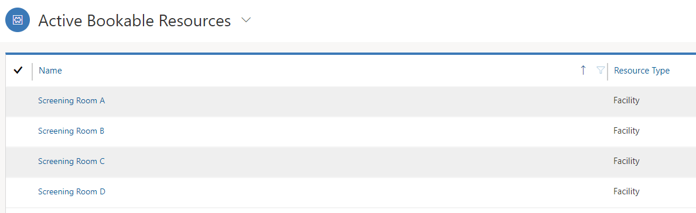
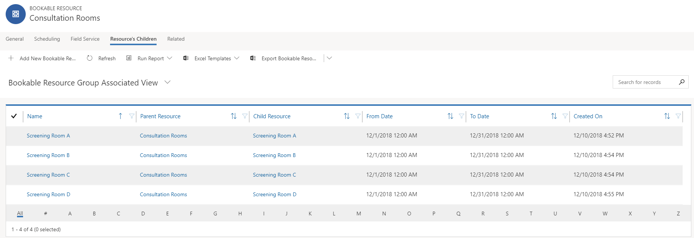

Universal Resource Scheduling enables an organization to schedule anything that might be needed to better service their customers. This might include items like work orders in Dynamics 365 for Field Service.

The purpose of this hands-on-lab is to introduce you to configuring Universal Resource Scheduling.

### Learning Objectives

At the end of these exercises, you will be able to accomplish the following:

-   Enabled Mapping Functionality
-   Defined a Bookable Resource
-   Schedule Items using the schedule Board
-   Enable the Time Off Request Entity for Scheduling

Estimated time to complete this lab: 60 to 75 minutes

The Labs and exercises in this module work best when you have some sample data to work with. Depending on the environment you are working with, you may want to install some sample data to assist with exercises. Dynamics 365 does provide the ability to add sample data as needed. If the environment you are working in does not have any sample data installed, follow the steps below to install the sample data into your environment.

>[!IMPORTANT] 
>The demo data that we will be leveraging for this exercise, is a smaller set of data that will help to illustrate the configuration concepts available in the application. There is more complete demo data available that can be used for both Project Service automation and Field Service.

### Install the Field Service Demo Data -- Detailed Steps

1. In Dynamics 365, select the down arrow next to **Dynamics 365**, and then select **Field Service**.
2. Using the site map, select the ellipsis (...), and select **Field Service Settings**.
3. Under *Schedule Settings*, select **Characteristics**.
4. Select **New**.
5. Enter *MCSE* in the **Name** field, select **Certification** in the **Certification** **Type** field, and then select **Save**.
6. Select **New**.
7. Type *MCSA* in the **Name** field, select **Certification** in the **Types** field, and then select **Save and Close**.

### Enable Bing Maps to use with Resource Scheduling. 

To ensure that you are able to take full advantage of the full scheduling and mapping capabilities available with Universal ResourcevScheduling, you need to ensure that it is configured to use a mapping provider. Bing Maps is the default map provider, but additional providers could be enabled. We will be using Bing Maps.

1.  In **Dynamics 365**, click the arrow next to the **Dynamics 365** text, and select **Universal Resource Scheduling**.
2.  Click the **Site Map** icon to expand the **Navigation**. From the menu that appears select **Administration**.
3.  Select **Scheduling Parameters**.
4.  Locate the **Connect to Maps** field and set it to **Yes**.

5.  **Save and Close** the settings.

### Create a Bookable Resource

Before you can start scheduling items and assigning them to specific resources in your organization, you need to first create bookable resources in the application. A bookable resource could be an internal user, an external contact or account, or a piece of equipment. When you define a bookable resource, you can also provide details such as skills they have, where they start and end their day and so on. In this first task we will be creating a bookable resource record for your user account.

1.  In **Dynamics 365**, click the arrow next to the **Dynamics 365** text, and select **Universal Resource Scheduling**.
2.  Click the **Site Map** Icon to expand the **Navigation**. From the menu that appears select **Resources**.
3.  Click **New** button to create a new **Bookable Resource**.
4.  Configure the Resource as follows:
    -   **Resource Type:** User
    -   **User:** Your User Record
    -   Leave the default value in the Time Zone Field.
5.  Select the Scheduling Tab, and configure as follows:
    -   **Organizational Unit:** Seattle
    -   **Start Location:** Organizational Unit Address
    -   **End Location:** Organizational Unit Address
6.  Select the Field Service tab, and configure as follows:
    -   **Hourly Rate:** 175
7.  **Save** the bookable resource record and leave it open.
8.  Locate the **Characteristics** sub-grid, click **Add New Bookable Resource Characteristic**
9.  Configure as follows:
    -   **Characteristic:** Building 12 Access
    -   **Rating Value**: Proficient
10. Additional characteristics could be added for the resource if they had multiple skills.
11. **Save and Close** the characteristic record.
12. **Save and Close** the bookable resource record.

### Create three resource categories

Before we start making the resource facilities, pools, and requirement groups that will be used to support the scheduling scenario, we what to ensure that we have the necessary supporting components defined that will be used to schedule.

To make it as easy as possible we are going to add three resource categories that can be easily used to identify consultation rooms, patient consultants, and Doctors. 
1.  With the **Field Service** application open, select the **ellipsis**, and select **Field Service Settings**.
2.  Using the **Sitemap**, select **Resource Categories** under the scheduling header.
3.  Click the **New** button to create a new Resource Category.
4.  Enter **Consultation Room** into the Name field and select **Save and Close.**
5.  Click the **New** button to create another new Resource Category.
6.  Enter **Patient Consultant** into the name field and select **Save and Close.**
7.  Click the **New** button to create the last new Resource Category.
8.  Enter **Doctor** into the name field and select **Save and Close**.

### Create a Consultation Characteristic

Some doctors may be able to do consultations, and some may not. To ensure that we can identify the doctors that are able to perform consultations, we are going to add a new resource characteristic called Consultation. This characteristic will be added to any resource that could be used in a consultation.

1.  While you are in **Field Service Settings**, click **Characteristics.**
2.  Click the **New** button do define a **Characteristic**.
3.  Enter **Consultation** into the Name field and **Save and Close**.

### Configure Resource Working Hours

One factor that goes a long way in ensuring that all resources that will be working together on projects or as part of a pool have the same working hours. Work hours can be defined for up to 25 resources at one time by creating a work hours template. A work hours template must be based on another resource's working hours.

We will start by defining the working hours for a single resource. We will use that resource to create the Work Hours Template, and finally we are going to apply the template to all our resources.

1.  While you are in **Field Service Settings**, click **Resources**.
2.  Locate and select the resource record for **Bob Kozak**.
3.  On the blue **command bar** at the top, click the **Show Work Hours** button. (Note: you may need to allow pop-up windows if you are running a popup blocker).
4.  Select the **Set-Up** button.
5.  From the menu that appears, select the **New Weekly Work Hours Schedule** option.
6.  When the weekly schedule is displayed, click the **Set Work Hours** hyperlink to edit the working hours.
7.  Verify the Work Hours are set to **8:00 AM** to **5:00 PM** and click **OK.**
8.  Uncheck the **Saturday** and **Sunday** boxes.
9.  Click **Save and Close** to apply the new work schedule.
10. Verify that the new schedule is being applied moving forward and **Close** the **Work Hours window.**
11. Using the **Site Map**, click the **Ellipsis...** and choose  **Resource Scheduling**.
12. Under **Resource Scheduling**, click on **Work Hour Templates.**
13. Click the **New** button to define a new template.
14. Define the template as follows:
   a.  **Name:** *Standard Hours*
   b.  **Template Resource:** *Bob Kozak*
15. Click **Save and Close.**
16. Using the **Sitemap,** click the **Ellipsis...** to navigate back to **Field Service Settings.**
17. Select **Resources.**
18. Highlight the first 25 resources listed in **Active Bookable Resources** *(**Important:** Make sure that Bob Kozak is not one of the resources selected)*. Click the **Set Calendar** button.
19. In the **Work template** screen, select the **Standard Hours** template that you just created and click **apply**.
20. Repeat this process until you have applied the **Standard Hours  Template** to all the resources in your organization. (Remember you can only apply a work template to 25 resources at one time).
21. Select all the resources listed in **Active Bookable Resources** and click the **Edit** button. In the Time Zone Field, set to the time zone you want to use.

### Create Facility Resources for Screen Rooms

Now that we have configured the supporting option, we can now configure our resources to support the functionality we need. We will begin by defining the consultation rooms that may be used as facility resources.

1.  Using the **SiteMap**, navigate to **Resources**.
2.  Click the **New** button to create a new resource.
3.  Configure the resource as follows:
    -   **Resource Type:** Facility
    -   **Name:** Screening Room A
4.  Select the Scheduling tab, and configure the scheduling settings as follows:
    -   **Organizational Unit:** Seattle
    -   **Start Location:** Organizational Unit Address
    -   **End Location:** Organizational Unit Address
5.  Click the **Save** button to save the new facility and leave it open.
6.  Locate the **Resource Characteristics** sub-grid, select the more commands button, can choose **Add Bookable Resource Characteristic.**
7.  Configure the Bookable Resource Characteristic as follows:
    -   **Characteristic:** Consultation

    -   **Rating Value:** Proficient
8.  Click **Save**
9.  Locate the **Resource Categories** sub-grid, select the more commands button, can choose **Add** **Bookable Resource Category**.
10. Select Consultation room for the **Resource Category.**
11. Click **Save and Close**.
12. Repeat steps 2 -- 12 to define the following facilities:
   a.  Screening Room B
   b.  Screening Room C
   c.  Screening Room D

### Create a Facility Resource Pool

There are times when a scheduler just wants to note that a screening room is needed until they can define the specific room they want to use as more details about the consultation is captured. The easiest way to accomplish this, is by using the Resource Pool. We will create a resource pool that will contain all the facility resource that we just created.

1.  If necessary, navigate to Resources and click the New button to create a new Bookable resource.
2.  Define the new Resource as follows:
    -   **Resource Type:** Pool
    -   **Pool Type:** Facility
    -   **Name:** Consultation Rooms
    -   **Time Zone:** Set to the same as other resources
3.  Select the Scheduling tab, and configure the Scheduling Options as noted below:
    -   **Organizational Unit:** Seattle
    -   **Start Location:** Organizational Unit Address
    -   **End Location:** Organizational Unit Address
4.  Click the **Save** button to save the record and Leave it open.
5.  Locate and select the **Related** tab. From the menu that appears select **Resource's Children**.
6.  Select the **Add New Bookable Resource Group**, and configure as follows:
    -   **Name:** Screening Room A
    -   **Parent Resource:** Consultation Rooms
    -   **Child Resource:** Screening Room A
    -   **From Date:** Beginning of current Month
    -   **To Date:** End of Current month
7.  Click **Save and Close**
8.  Repeat steps 6 & 7 to add the following items:
    -   Screening Room B
    -   Screening Room C
    -   Screening Room D
9.  Your completed facility resource pool should resemble the image below:

### Add Characteristics and Resource Roles to Resources

Next, we want to ensure that when we search for resources that are qualified to participate in consultations that we will get some results. To accomplish this, we are going to define some characteristics, and roles for resources. Each resource will be assigned the consultation characteristic. We will also edit each resource to ensure that they are associated with the Seattle Organizational Unit.

### Doctors

-   Abraham McCormick
-   Allison Dickson
-   Ashley Chinn
-   Bernadette Foley

### Patient Consultants

-   Cheri Castaneda
-   Christal Robles
-   Christie Dawson
-   Clarence Desimone

1.  If necessary, navigate to resources and open the Abraham McCormick resource.

2.  Locate the **Resource Characteristics** sub-grid, select the more commands button, can choose **Add Bookable Resource Characteristic.**

3.  Configure the Bookable Resource Characteristic as follows:

    -   **Characteristic:** Consultation
    -   **Rating Value:** Proficient

4.  Click **Save**
5.  Locate the **Resource Categories** sub-grid, select the more commands button, can choose **Add** **Bookable Resource Category**.
6.  Select **Doctor** for the **Resource Category.**
7.  Click **Save and Close**.
8.  Select the Scheduling tab, and configure the scheduling as follows:
    -   **Organizational Unit:** Seattle
    -   **Start Location:** Organization Unit Address
    -   **End Location:** Organizational Unit Address

9.  Save your changes and close the Resource record.
10. Repeat steps 1 -- 9 to define organizational unit, characteristic, and category information for the following **Doctors**:
    -   Allison Dickson
    -   Ashley Chinn
    -   Bernadette Foley

11. Navigate to resources and open the Cheri Castaneda resource.
12. Locate the **Resource Characteristics** sub-grid, select the more commands button, can choose **Add Bookable Resource Characteristic.**
13. Configure the Bookable Resource Characteristic as follows:
    -   **Characteristic:** Consultation
    -   **Rating Value:** Proficient

14. Click **Save**
15. Locate the **Resource Categories** sub-grid, select the more commands button, can choose **Add** **Bookable Resource Category**.
16. Select **Patient Consultant** for the **Resource Category.**
17. Click **Save and Close**.
18. Select the Scheduling tab, and configure the scheduling as follows:

    -   **Organizational Unit:** Seattle
    -   **Start Location:** Organization Unit Address
    -   **End Location:** Organizational Unit Address

19. Save your changes and close the Resource record.

20. Repeat steps 11 -- 19 to define organizational unit, characteristic, and category information for the following **Patient Consultants**:
    -   Christal Robles
    -   Christie Dawson
    -   Clarence Desimone

Now that we have defined and configured the resources as needed, the final step is to ensure that we can schedule these items together as a group. To accomplish this, we will be doing the following:

-   Creating a consultation work order type.
-   Defining a Resource Requirement Group template called consultation.
-   Defining an incident type called consultation.
-   Associating the consultation incident type with the Consultation resource requirement group.

### Create a Consultation Work Order Type

1.  If necessary, ensure that you are in **Field Service Settings**, and navigate to **Work Order Types**.
2.  Click the **New** button to add a new Work Order Type.
3.  Configure the Work Order Type as follows:
   a.  **Name:** Consultation
   b.  **Incident Required:** No
   c.  **Taxable:** No
   d.  **Price List:** Default Price List
4.  Click **Save and Close**

### Create a Resource Group Template called Consultation

1.  Using the **SiteMap**, select the Ellipsis... and change to **Resource Scheduling**.
2.  Select **Requirement Group Templates** and click the **New** Button.
3.  In the **Name** field, enter **New Patient Consultation**.
4.  Click the **Save** button to leave the requirement record open.
5.  In the Sub-grid, select **New Patient Consultation**, click the **Add Requirement Button**.
6.  Replace the name of the Requirement with **Consultation Room**.
7.  Click the **Duplicate Requirement** button and replace the name with **Patient Consultant**.
8.  Click the **Duplicate Requirement** button and replace the name with **Doctor**.
9.  In the Duration field for the **New Patient Consultation**, set the Duration to **2 Hours**.
10. In the **Part of the Same** field, select **Organizational Unit**.
11. Select the **Consultation Room** requirement. Click the **Open Form** button.
12. Set the **Resource type** to **Facility**.
13. Locate the **Skills** sub-grid, select the more commands button, can choose **Add New Requirement Characteristic.**
14. Configure the Requirement Characteristic as follows:
    -   **Characteristic:** Consultation
    -   **Rating Value:** Familiar
15. Click **Save**
16. Locate the **Resource Categories** sub-grid, select the more commands button, can choose **Add** **Bookable Resource Category**.
17. Select **Consultation Room** for the **Resource Category.**
18. Click **Save and Close**.
19. Select the **Scheduling** tab, set the **work location** to **Location Agnostic.**
20. Save your changes and close the Consultation Room Requirement.
21. Select the **Patient Consultant** requirement.
22. Click the **Resource Categories**, and select **Patient Consultant**
23. Click the **Characteristics** field, and select **Consultation**
24. Select the **Doctor** requirement.
25. Click the **Resource Categories**, and **select Doctor**
26. Click the **Characteristics** field, and select **Consultation**
27. Your completed Requirement Group Template should resemble the image below:

### Create an Incident Type that uses the Requirement Group.

1.  In the **Sitemap**, click the **Ellipsis...** and navigate select
    **Field Service Settings**.
2.  Locate **Incident** Types and click the **New** button to create a new Incident type.
3.  Enter **Patient Consultation** for the Name.
4.  Select the **Details** tab and configure the Incident details as noted.
   a.  **Default Work Order Type:** *Consultation*
   b.  **Estimated Duration:** *2 Hours*

5.  Click the **Save** button to save the Incident Type and Leave it open.
6.  Select the **Related** tab, from the menu that appears, select **Requirement Groups**.
7.  Click the **Add New Incident Type Requirement Group** button.
8.  Enter **Patient Consultation** into the **Name** field.
9.  Select the **New Patient Consultation Requirement Group**.
10. Save you changes and close the Patient Consultation Incident Type.

### Configure the Schedule Board

1.  In the **SiteMap**, click the **Ellipsis...** and navigate to **Field Service**.
2.  Select the **Schedule Board** to open it. After the schedule board loads, click the **Tab Settings** button.

3.  Scroll down and expand the **Requirements Panel**.
4.  Configure as follows:
    -   **View Type:** *Requirement Group Views*
    -   **Title:** *Unscheduled Requirement Groups*
    -   **View:** *Active Requirement Groups*
5.  Select the Add new panel button to place the Requirement Group View. Click the Apply button.

### Schedule Resource Pools and Requirement Groups

1.  Using the **Sitemap**, navigate to **Work Orders**.
2.  Click the New button to create a new work order and configure the new work order as follows:
    -   **Service Account:** Blue Yonder Airlines
    -   **Billing Account:** Blue Yonder Airlines
    -   **Work Order Type:** Inspection
    -   **Taxable:** No
3.  Click the **Save and Close** button
4.  Click the **New** button to create a new work order and configure the work order as follows:
    -   **Service Account:** City Power & Light (sample)
    -   **Primary Incident type:** Patient Consultation
5.  Click the **Save and Close** button
6.  Using the **Sitemap**, navigate to **Schedule Board**.
7.  In the **Search Resources** field, enter **Consultation**. The
    **Consultation Rooms resource pool will be displayed**.
8.  In the **Unscheduled Work Orders** tab locate the resource requirement for Blue Yonder Airlines and drag it and place it into an open slot for the resource pool.
9.  With your mouse hover over the **Consultation Rooms** resource pool, Right-click and select **View pool in split view**.
10. Each of the Screen Rooms will be presented as part of the resource pool.
11. Drag the **Scheduled item** and place it on the **Screen Room A** facility record.
12. In the **Unscheduled Requirement Groups** panel, select requirement group that was just created when you created the work order, and select **Find Availability**

13. You will be presented with multiple combinations of **Patient Consultants**, **Doctors**, and **Consultation Rooms**.
14. Select the suggestion you want to book and click the **Book and Exit** button.
