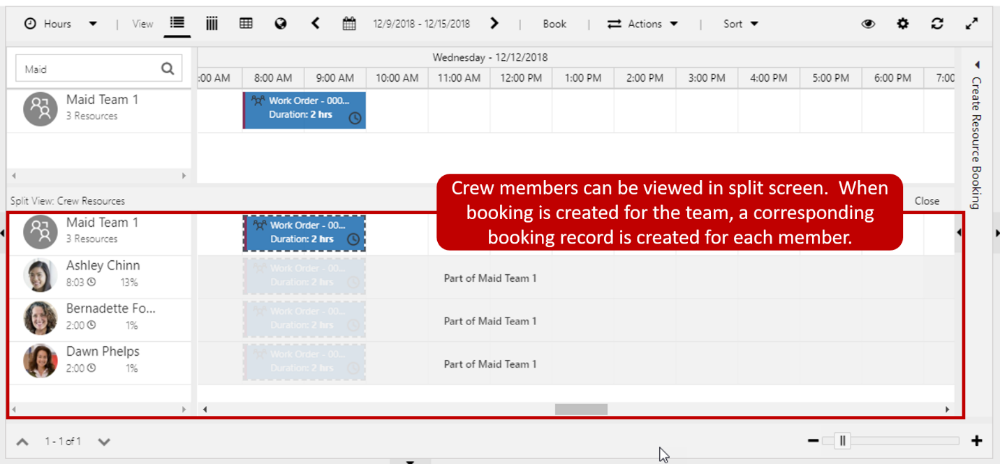

It is important that organizations can schedule resources to support all
the potential scheduling scenarios they provide. To assist in this,
Universal Resource Scheduling provides multiple resource types that can
be used to handle everything from, simply booking a room, to more
advanced scenarios where we need multiple resource types for the same
job. In addition, it defines resources for specific users, accounts,
contacts, or pieces of equipment. Resources can also be defined that
represent facilities, crews, or pools of resources.

### Defining facility resources

When creating resources, we can define them as a Facility resource.
Facility resources are helpful when you need to reserve a physical
space, such as a room for an event or party, or a repair bay at a
mechanic shop. Facilities are also useful when you might need to
schedule an appointment with a person at a facility, such as an
appointment for someone to fix a laptop at a Microsoft retail store, or
a wealth management consultation at a bank.

Because facilities represent a physical location such as a conference
room or meeting space, they are required to be associated with an
Organizational Unit that contains a valid Latitude and Longitude
address. The starting and ending locations for a facility need to be set
to the organizational unit address.

### Crews

Crews are a type of resource that is used when you need to represent a
predefined group of people that can be scheduled for items. For example,
a crew might be used by a company that provides maid services to
represent and define the individual cleaning crews that are sent out on
jobs. Crews appear on the schedule board like any other resource. The
members of a crew can be displayed on the schedule board, so you can see
the overall availability of all the members of the crew. When a crew is
scheduled, all the members of the crew are scheduled as well.

When crew is selected as the resource type, you will need to define the
specific members of the crew. This is done by selecting the related tab
on the crew's resource record and selecting Resource's Children. Unlike
other records in Dynamics 365, when you are defining a crew member,
every field on the form is required.

For each crew member you define, you will need to provide the
following:

-   **Name**: The name of the resource as it will appear as part of the crew. For example, install Team 1 -- Dave.
-   **Parent resource**: Defines the name of the crew that the resource will be associated with. (This will be pre-populated by default.
-   **Child resource**: Defines the bookable resource that you want to associate with the crew.
-   **From date**: The first date that the resource will be available as a member of the crew.
-   **To date**: The last date that the resource will be available as a member of the crew.

>[!IMPORTANT]
>A resource can only be associated with one crew or resource pool for a specific time period. For example, if Ashley is
assigned to the maid service crew one 1/1/2019 - 1/31/2019 she cannot be in another crew or resource pool during that time period.

When attempting to schedule a crew for a specific date, only resources
that belong to that crew on the dates and times specified will display
and be able to be scheduled.

For example:
An organization has defined a new crew called Maid Crew 1. They have
added the following child resources for the crew.

-   **Crew 1 Lead**: Ashley Chinn -- From: June 1^st^ to December 31st
-   **Crew 1 Member 1**: Bernadette Foley -- From June 1st to December 31st
-   **Crew 1 Member 2**: Clarence Desimone -- From June 1st to October 31st
-   **Crew 1 Substitute 1**: -- Dawn Phelps From September 1st to December 31st.

If a dispatcher attempts to schedule the crew for a job on the 4^rd^ of
September, the entire crew will be displayed and scheduled since they
are all defined as crew members for that date. However, if a dispatcher
attempts to schedule the crew for a job on December 12th, only Ashley,
Bernadette, and Dawn will be displayed and schedule because Clarence is
not defined as a crew member after the 31^st^ of October.

### Resource pools

Resource Pools enable schedulers to book requirements to a generic pool
without needing to decide which resource will actually perform the work.
We can then reschedule these bookings to the pool members on a later
date.

There are many reasons why defining resource pools can be useful: 

-   **Prevent overcommitting**: When scheduling jobs, resource pools can act as place holders to block the time off as being committed until the actual resources can be provided.
-   **Assist in regional dispatching**: Enable central dispatchers who oversee multiple regions to use them as place holders, until the specific details can be supplied by a local resource manager.
-   **Capacity planning**: We may not know the specific resource yet, but the capacity of a pool can be established, and resources named later. Schedulers can still schedule since capacity of the pool can be set just as if it was a named resource.
-   **Deliberately enable overbooking to expected cancellations**: With resource pools we can overbook resources with the understanding that customers are going to potentially cancel.

Resource Pools are created the same way you create other resources. When
you select pool as the type of resource, you will need to define the
type of resource pool it is going to be. Resource pools are intended to
be homogenous resources, meaning that they should all be of the same
type. For example, you might have a pool of resources that are
electricians, or a pool of rooms that have the same scheduling capacity.
Resource pools also have the capability to auto calculate the pool's
capacity, meaning how many resources are in the pool.

A resource pool type can be one of the following:
-   **Facility**: Represent buildings or locations.
    -   Facilities must have an organization unit defined from them.
    -   The start and end location must be set to the Organization Unit that is selected.
-   **Accounts / Contacts/ Users**: Represents individual people and items that can be scheduled.
-   **Equipment**: Pieces of equipment

> [!IMPORTANT] 
A resource can only be associated with one crew or resource pool for a specific time period. For example, if Ashley is
assigned to the maid service crew one 1/1/2019 - 1/31/2019 she cannot be in another crew or resource pool during that time period.
