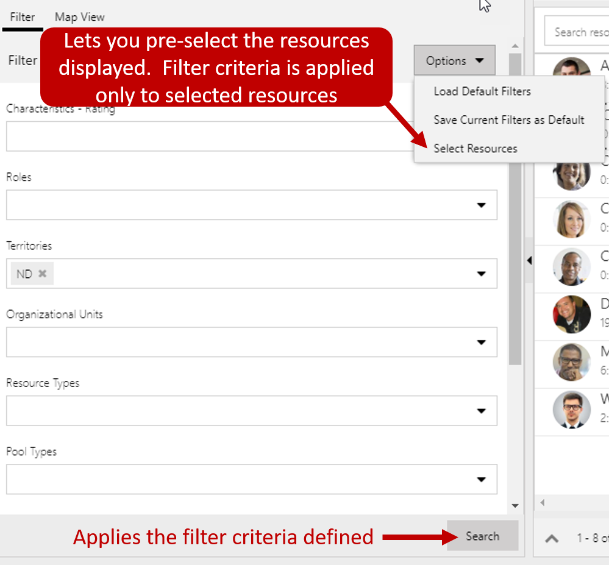

Dispatchers in organizations typically need a lot of information at their disposal. Depending on the size of an organization a dispatcher can be scheduling anywhere from twenty to hundreds of potential resources. To ensure they are getting everyone where they need to be, and all customers are getting the service required, they need to
understand things like:

-   What is currently scheduled?
-   What needs to be scheduled?
-   Who is available?
-   What does traffic look like?

The schedule board assists in providing dispatchers with this information. From the schedule board, they can easily see all the currently unscheduled items, and the availability of all resources (people, facilities, equipment). Items can be scheduled directly from the board. The schedule board provides multiple components that can be leveraged to schedule items. Below is a quick overview of the panels and components that are most often used.

-   **Resource Requirements:** Provides a list of active requirements that need to be scheduled.
-   **Filter and Map Panel:** Provides access to interactive filters and maps that can be leveraged to assist in scheduling.
-   **Details:** Provides additional details of the item that is currently selected.
-   **Schedule Calendar:** Displays a list of resources and currently scheduled items. Can be used to schedule new items, as well as  interact with existing scheduled items.

To make it easier for dispatchers to schedule items the resource requirement, details, and filter & map panels can be collapsed and expanded as necessary.

### Schedule Board

When you first enter the schedule board, you can see the board displayed. The schedule board displays all the resources that are available to be scheduled in the application. As items for resources are scheduled, the total time they are scheduled for and the percentage scheduled will be displayed on the resource. The percent scheduled is based on the resources capacity and the date range being used on the board. As you hover over a resource, you can right-click on it to view its resource card. The resource card shows specific information about the resource such as skills they have and their roles. You are also provided with multiple communication options to interact with the resource.

The schedule boards toolbar make it easier to view information based on specific needs and interact with the board to do things like get directions, book a resource, and sort items on the board. The list below describes the options available from the board toolbar.

-   **View Mode:** Defines the scale that will be used when presenting resource schedules on the board. There are four options to choose from: hours, days, weeks, and months.
-   **View:** Defines how the resources on the board will be presented. There are four options to choose from: horizontal, vertical, list, and map.
-   **Dates:** Lets you specify the specific date(s) that will be displayed on the board.
-   **Book:** Lets you create a booking for a specific resource.
-   **Actions:** Provides a list of actions that can be executed against items on the schedule board. Those actions include:
    -   **Get Driving Directions:** Lets you get directions from one location to another. Directions can be shared with a resource in multiple ways.
    -   **Move Booking to a Different Day:** Lets you move a booking to a different day. For example, if a resource is running behind on a specific day, those bookings could be moved to tomorrow.
    -   **Print Schedule Board:** Lets you print the entire schedule board or just specific elements.
    -   **Create Booking Alert:** Lets you create an alert that will be presented to the dispatcher in the alerts section of the board. Alerts can be used to communicate important or unique information to the dispatcher. For example, you might use a booking alert if a piece of equipment has broken and should not be scheduled.
-   **Sort:** Lets you define how items on the board are sorted. By default, they can be sorted by name or rating value.

>[!VIDEO https://www.microsoft.com/en-us/videoplayer/embed/RE2KoUK]

### Working with the Filter View

The filter view can be accessed by expanding the filter and map view. The filter lets dispatchers filter the specific resources displayed on the board, based on the criteria defined within the filter. The filter
provides the following options:

-   **Define Filter Criteria:** By default, resources displayed can be filtered by characteristics, roles, territories, organizational units, resource type, pool type, teams, and business units.
    *(Additional filtering criteria can be added through filter customizations.)*
-   **Modify how resources are sorted:** By default, the resources returned are displayed in alphabetical order. If desired, they can be sorted by name or rating value.

For example, if you are filtering the resources by characteristics, you may want to sort the board to display resources with the highest proficiency first. *(Additional sorting options can be used through filter customizations.)*

-   **Default Filters:** A default filter can be defined that will be loaded when that schedule board tab is loaded. It can be re-applied at any time.
-   **Select Resources:** Using the select resources, you can specify the resources you want to display on the schedule board tab. Once those resources are defined, the filters can be applied just to those resources.

After the filter criteria has been defined, the search button will filter the resources displayed based on the criteria provided.

### Working with the Interactive Map

When you switch to map view, you will be able to see and interact with relevant scheduling items such as organizational units, resources, scheduled items, and unscheduled items. As you zoom in on specific areas, you will be able to see additional relevant information such as traffic, and route information. That data can be used to make additional
scheduling decisions.

#### Map Features

-   **Multiple maps types available:** Different map presentations provide different perspectives. There are 4 types that can be used, Road, Aerial, Bird's eye, and StreetSide. By default, the map displays in a grayscale.
-   **Show traffic:** Shows current traffic information to assist in scheduling items. Traffic shows items slowdowns and road closures.
-   **View open requirements:** Pins for unscheduled items are placed on the map. Requirements can be scheduled right from the map itself.
-   **Resource routes:** As resources are scheduled for items, their route will be displayed. As additional requirements need to be scheduled, dispatchers can view people who would potentially already be in the area and schedule them as needed.
-   **Current resource location:** When resources use the mobile app, their current location can be displayed on the map to see where the resource is.

#### Requirements Panel

Requirements let the dispatcher see a list of the currently active resource requirements that need to be scheduled. Requirements will be displayed for any record that is enabled for URS and has active requirements that meet the conditions defined in the panel tabs. The requirement record will display any preferences that have been defined
for the item such as priority, date ranges preferred resource etc. The tabs available depending on installed solutions include:

-   **Open Requirements:** Displays a list of all active requirement records related to any entity enabled for URS.
-   **Unscheduled Work Orders:** Displays a list of all active requirement records related to unscheduled work orders. *(added when Field Service is installed)*
-   **Projects:** Displays a list of all active requirement records related to unscheduled project items. *(added when Project Service Automation is installed)*

Additional tabs cab be added as needed. For example, you could define a tab that only shows active resource requirements for unscheduled work orders where necessary parts have arrived.

Items for the requirement panel can be scheduled by dragging them or clicking the find availability button.

#### Details Pane

The details pane will provide additional information about the item that is selected. For example, if a requirement is selected, the details section will display information about the requirement. If a booking is selected, it will display information about the booking. The details pane is also where any booking alerts that have been defined will be
displayed.

