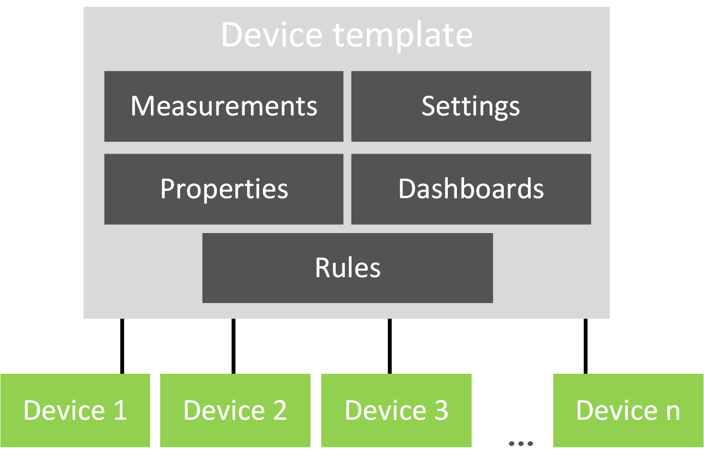

Azure IoT Central is a is a Software-as-a-Service (SaaS) solution that abstracts many of the low-level components of an IoT solution into a customizable model-based approach.  The solution is configured in IoT Central in a similar level of abstraction as it is done in Dynamics 365’s applications.  Today, Azure IoT Central can be used with Connected Field Service by implementing some of your own Microsoft Flows.  In the upcoming release Dynamics 365 will be a directly supported action from the rules you build in IoT Central. 

The following illustration highlights the division of work between IoT Central, Connected Field Service and the core Field Service application features.

A key difference with an Azure IoT Central deployment is that the IoT Hub components while present, are not available for extension directly. All customizations are done via the Azure IoT central abstractions.  Using the Azure IoT Central portal you will define and interact with the solution you build.

To build a solution, you will create an Azure IoT Central application.  To make it easy to try out, there is a sample application, or you can create a custom one where you define all the device characteristics.  In the exercises in this module you will be creating a custom application based around a smart trash container and connecting it to Dynamics 365.

When you create an application, the device template defines the behavior and capabilities of the devices.  For example, our smart trash container device template might include the state of the lid (open/close) as well as other telemetry related to the device. 

The following table contains more details on each of the key device template components.

<table>
    <thread>
		<td>Component</td>
		<td>Description</td>
	</thread>
    <tbody>
        <tr>
            <td>Measurements</td>
            <td>These can be telemetry which is time series data from the device. State e.g. is the lid open, or an Event e.g. Customer pushes button to request trash pickup.  Time series data is stored for use by the analytics service which is Azure Time Series Insights.                
            </td>
        </tr>
        <tr>
            <td>Properties</td>
            <td>These are device metadata, for example the pickup location for the container, the customer account number or any other static metadata.            
            </td>
        </tr>
        <tr>
            <td>Settings</td>
            <td>Settings control the behavior of your device, for example we could have an odor control feature and the setting could control how active the feature is (high, medium, low). 
            </td>
        </tr>
        <tr>
            <td>Commands</td>
            <td>These allow remote commands to be sent to the device. With Connected Field Service this would extend the command into the Dynamics 365 user interface.  For example, a command could be sent to force close the lid if it was left open.
            </td>
        </tr>
        <tr>
            <td>Dashboards</td>
            <td>Dashboards contain tiles that have information on the device.  These can include settings, properties and even maps.  For example, we could include a map showing the location of the device.  This would come in handy after a severe weather event with trash cans blowing all over the place.
            </td>
        </tr>
		<tr>
            <td>Rules</td>
            <td>Rules are how you monitor the measurements from your device and trigger actions.  For us, this will be how we use Microsoft Flow to generate a Connected Field Service IoT Alert   
            </td>
        </tr>
    </tbody>
</table>

Once your template is setup, you can create simulated devices or connect a real device.  In the next unit, you will be building the custom application to manage a smart trash container and then connect it to Dynamics 365 using the Microsoft Flow IoT Central connector.