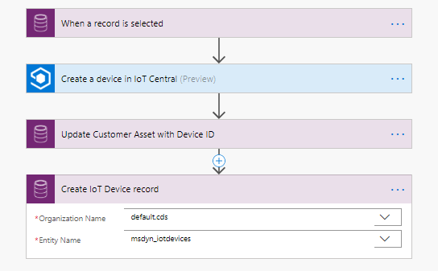
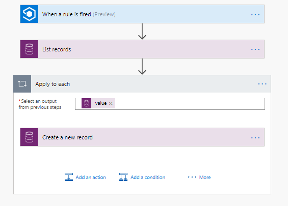

Now that you've built a Microsoft IoT Central application, you can connect it to Connected Field Service by using the Microsoft Flow connectors to register devices and raise alerts with Microsoft Dynamics 365.

Currently, when you install the Connected Field Service add-on, several Microsoft Azure components that aren't required for Microsoft IoT Central are installed, because Microsoft IoT Central includes similar components that are packaged as part of the overall service. In the future, we plan to provide an installation that doesn't include these redundant components. The key components that you'll use to finish the integration are the solutions that are installed on the Dynamics 365 side. These components include entities like IoT Alert and IoT Device. For a real project, you could turn off some of the Azure components, like Azure IoT Hub, so that you aren't billed for them.

Typically, for a Connected Field Service solution, you create the customer asset and then register the device. But you can perform the same task by using Microsoft Flow to create a flow for the selected record. In other words, you can either select the customer asset in the list or run the flow from a specific customer asset record. The flow will use the Microsoft IoT Central connector to register the device with Microsoft IoT Central (and also with the embedded IoT Hub instance). The following image shows the flow that you'll use to do the registration. You'll build this flow in the next unit.

Notice that, in addition to updating the customer asset with the device ID, you'll create the IoT device record that's used if you send any commands or other actions from Dynamics 365.

When you register the device, you created a connection between the device in Microsoft IoT Central and the customer asset in Microsoft Dynamics 365 for Field Service. In the previous unit, for our smart trash container scenario, we set up an event to indicate that the container is ready for pickup. Now let's see how you can raise an alert in Dynamics 365 so that the container will be scheduled for pickup.

To start the process, we'll use the rules feature of Microsoft IoT Central. Rules are built to monitor telemetry of the device and perform an action when a condition is met. In addition to looking at the real-time values, rules can look at device properties. For example, the properties might include threshold information that varies by device, based on the installation. The following image shows an example of the rule that you'll build to react to the ready for pickup event. Notice that there are several options for actions when a rule's conditions are met. In fact, out-of-box Dynamics 365 actions are coming soon. For now, we'll use the Microsoft Flow action to create an IoT Alert record.

To create the flow, you'll once again use the Microsoft IoT Central flow connector that lets you build a flow that's triggered by a specific rule in Microsoft IoT Central. The flow itself is quite simple. It matches the customer asset by using the device ID that triggered the flow. An IoT Alert record is then created for each matching asset.

After the IoT Alert is created, it can flow into the normal business process capabilities of Field Service, including the capabilities for scheduling a visit to the location. In the next unit, you'll add device registration and raising of alerts to the Microsoft IoT Central application that you built in a previous unit.
