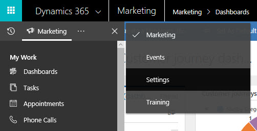
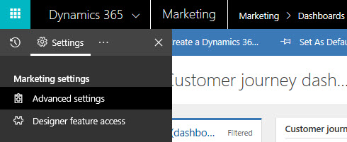
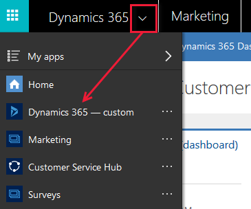

Administrators use advanced settings to fine-tune application behavior, set defaults, manage users, enable webinars, check quotas, and more. The following instructions demonstrate how to access the Advanced Settings menu within Dynamics 365 for Marketing. The units in the following sections describe how to update and manage those settings. 

1.  Sign in as a user with administrator privileges.
2.  Expand the side navigator bar and select the ellipsis (...) to open the work area menu.
3.  Select **Settings** from the work area menu.

 

4.  The side navigator is updated to show pages available in the **Settings** work area. Select **Advanced Settings.**

 

### Navigate between the Marketing app and Dynamics 365 -- custom app

The Dynamics 365 - custom app is included with Dynamics 365 for Marketing. It combines features from many of the various Dynamics 365 apps you have licensed into a single navigation structure (but most Dynamics 365 for Marketing end-user features aren’t included here). The custom app operates on the same database as Dynamics 365 for Marketing, so settings made in the custom app (including for customization, user administration, events, LinkedIn Lead Gen, or Voice of the Customer) can affect the Marketing app.

To go to the custom app, which provides access to these customization settings, choose **Dynamics 365 - custom** from the app-selector menu, and then go to **Settings** \> **Customization**. The following image shows how to use the app-selector menu to switch between the Marketing and custom apps.

 

For complete details about how to customize Dynamics 365, see the [Customization Guide](https://docs.microsoft.com/dynamics365/customer-engagement/customize/overview). The guide describes the interface as you see it in the Dynamics 365 - custom app. The customization features that are also provided in the **Settings** work area of Dynamics 365 for Marketing implement similar concepts, operate on the same database, and work similarly.

To learn more, see [Create and customize marketing calendars](https://docs.microsoft.com/dynamics365/customer-engagement/marketing/customize-marketing-calendars).
