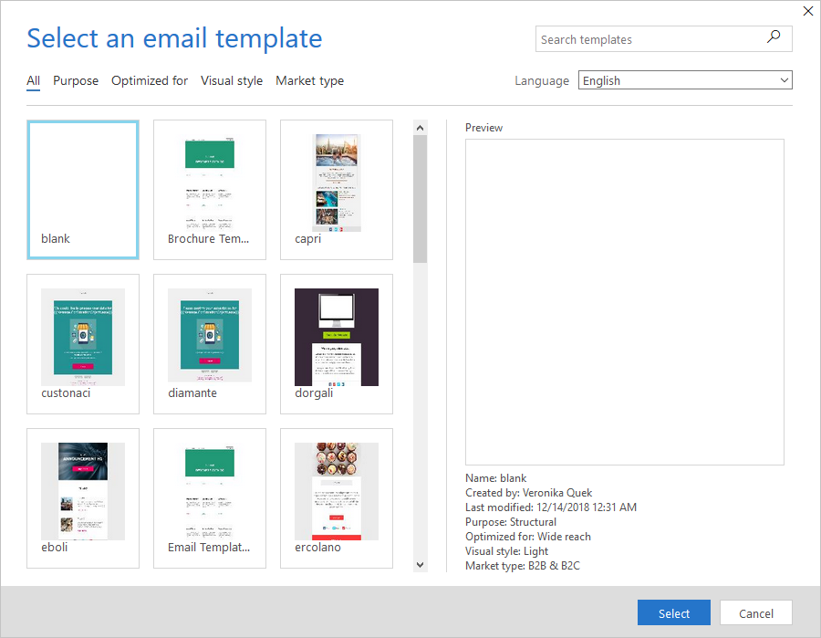
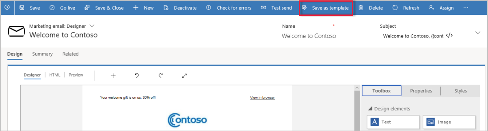

Each time that you create a new marketing form, marketing page, marketing email, or customer journey you start by choosing a template. Dynamics 365 for Marketing comes with a wide variety of professionally designed
templates. Most templates include a column layout, color scheme, sample content, and sample images, whereas others provide just a basic column layout without sample content. There is also a blank template, which
provides no sample content or structure.

 
You can easily create custom templates to match your organization\'s communication needs and visual identity. You can work directly in the relevant template area (**Marketing** \> **Templates**) to create them, but we recommend starting with an existing template. Go to the entity where you want to create the template (**Marketing** \> **Marketing Forms** / **Marketing Pages** / **Marketing Emails** / **Customer Journeys**), select the design that you want to start from, customize as needed, and then save the result as a new template.

When creating a template, you should define the purpose, style, and market type, and then optimized to make it easier to identify and find in the **Select a template** dialog box. To manage these attributes, go to **Marketing** \> **Templates**, select the entity for the template that you want to update (Customer journey, Marketing email, Marketing page, Marketing form), locate and select the template, fill out all the relevant fields on the **General info** tab and then click **Save**.

