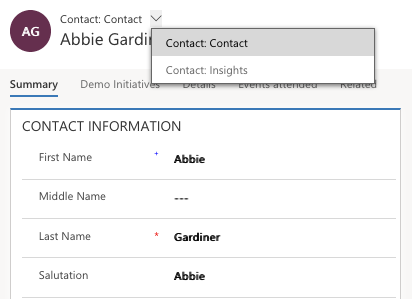
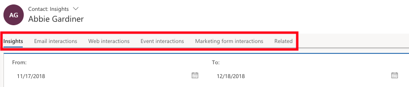
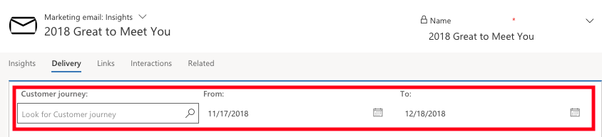

Dynamics 365 for Marketing enables you can track the interactions of your contacts on your various marketing initiatives and view analytics to understand the impact and improve your content. Dynamics 365 enables you to view insights, including statistics, analytics, and key performance indicators based on your marketing results from the following entities:

- Contacts
- Leads
- Segments
- Customer journeys
- Email messages
- Lead scoring models
- Marketing pages
- Marketing forms
- Websites
- Redirect URLs

### Open and use the insights form views

For most entities, you can view related results and analytics by opening a record and switching to the **Insights** form view using the form-view selector above the record name. However, entities such as segments, redirect URLs, which means that websites show analytics on the same form view as the settings.

### Move between insight categories

On the **Insights** view, you can navigate between the available categories of analytics using the tabs below the record name.

### Filter insights by date range and usage

At the top of most **Insights** tabs, you\'ll find settings that let you filter the information shown. For example, you can filter by date (From and To settings) or ny usage (such as which customer journey an email was used in).

