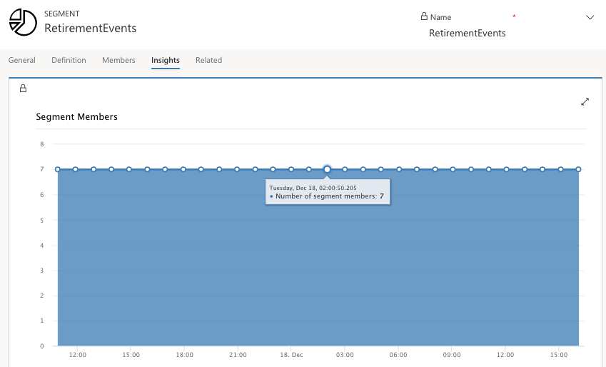

To view contact insights, go to **Marketing** > **Customers** > **Contacts**. Select a contact record, and then open its **Contact: Insights** view.

On the Insights view, you can find a complete history of how your selected contact has interacted with your marketing initiatives. This can help you to understand what this specific contact is interested in and which types of messages they respond to. Marketers might use this information to get deeper knowledge about specific decision makers, so they can better target future initiatives, while a salesperson might use this information to talk to the contact should they choose to reach out to them directly.

For example, you have new product offerings. After you execute marketing initiatives, to learn your contact's interactions and interest levels for each specific product, you can go to the Contact Insights view. Here you can analyze if the specific contact has opened an email, which link(s) they've clicked, and if they've filled out a marketing form. You can use their form responses to segment for future marketing communications. Additionally, a salesperson can navigate to the **Contact Insights** view to determine how best to engage further.

Contacts provide the following insight tabs:

- **Insights** - View a timeline of all interactions that the contact has made, and a chart of interactions organized by type.

- **Email interactions** - View details about email results for the selected contact, including a list of all messages sent to them, plus counts of all sends, opens, clicks, and bounces.

- **Web interactions**- See which pages and links from your websites and marketing pages the contact has opened, and which links they selected.

> [!NOTE]
> - Only pages that include a Dynamics 365 tracking script are counted. 
> - The **Websites visited** list shows all tracked pages that were visited by this known contact.
> - The **Websites clicked** list shows all the links this user clicked when viewing a tracked page Each visited link is show as a full URL, and repeat visits are listed once, with a counter.
> - If you embed a marketing form into an external webpage, then a tracking tag is included and visits to that page are shown here.
> - Results from anonymous visits that occurred prior to becoming a known contact are not shown.

- **Event interactions** See event registration and check-in records  for the current contact.

- **Marketing form interactions** See which marketing forms the contact has submitted and the content of each submission.

### Segment insights

Choosing the correct audience is imperative to being successful when designing and executing your marketing content. You've learned how to create segments in earlier modules, now through segment insights, you can review how customer numbers for segment change over time.

To view segment insights, go to **Marketing** > **Customers** > **Segment**. Select any live segment record, and then select the Insights tab.

Hover over the dots on the graph, to see the details of the number of segment members count for each time period. By selecting a series of dots on the graph, the graph will zoom in to the selected time frame. To reset the graph, click the **Reset Zoom** button.